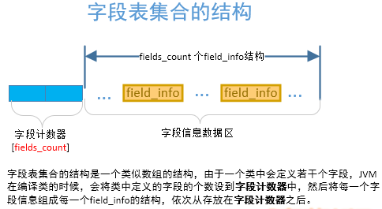
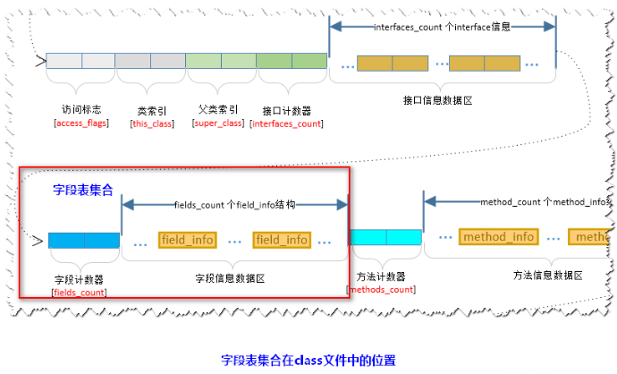
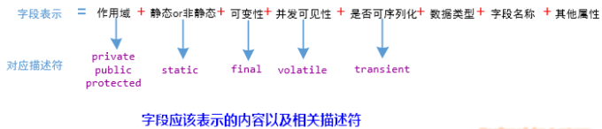
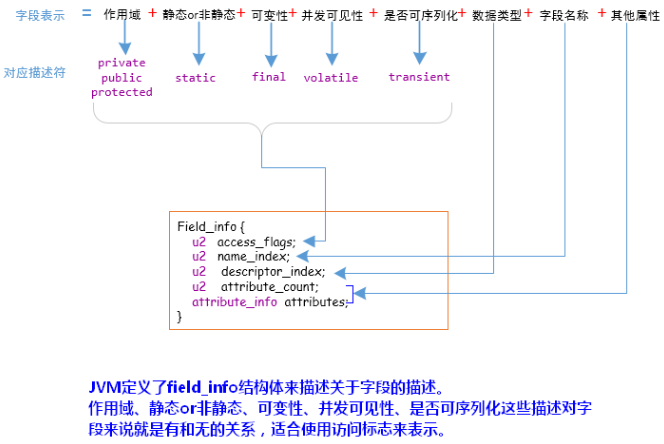
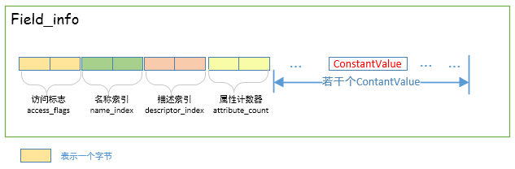

# 《Java虚拟机原理图解》1.4 class文件中的字段表集合--field字段在class文件中是怎样组织的

### 0.前言

读完本文，你将会学到：

1、**类中定义的field字段是如何在class文件中组织的**

2、**不同的数据类型在class文件中是如何表示的**

3、***static fina*l类型的*field*字段的初始化赋值问题**

### 1.概述

 **字段表集合**是指由若干个***\**\*字段表\*\*（field_info）\****组成的集合。对于在类中定义的若干个字段，经过**JVM**编译成***\*class\****文件后，会将相应的字段信息组织到一个叫做字段表集合的结构中，字段表集合是一个类数组结构，如下图所示： 

注意：这里所讲的字段是指在类中定义的静态或者非静态的变量，而不是在类中的方法内定义的变量。请注意区别。

比如，如果某个类中定义了5个字段，那么，**JVM**在编译此类的时候，会生成5个***\**\*字段表\*\*（field_info）\****信息,然后将字段表集合中的字段计数器的值设置成5，将5个字段表信息依次放置到字段计数器的后面。

### 2. 字段表集合在class文件中的位置

 **字段表集合**紧跟在***\*class\****文件的**接口索引集合**结构的后面，如下图所示： 

### 3. Java中的一个Field字段应该包含那些信息？------字段表field_info结构体的定义

 针对上述的字段表示，***\*JVM\****虚拟机规范规定了***\*field_info\****结构体来描述字段，其表示信息如下： 

 下面我将一一讲解***FIeld_info***的组成元素：**访问标志（access_flags）**、**名称索引（name_index）**、**描述索引（descriptor_index）**、**属性表集合** 

