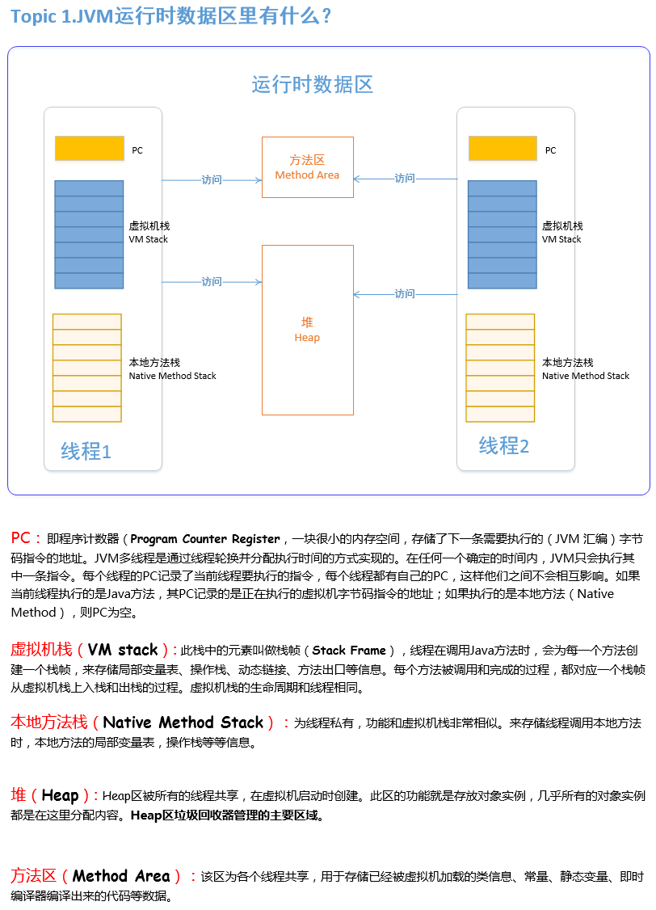
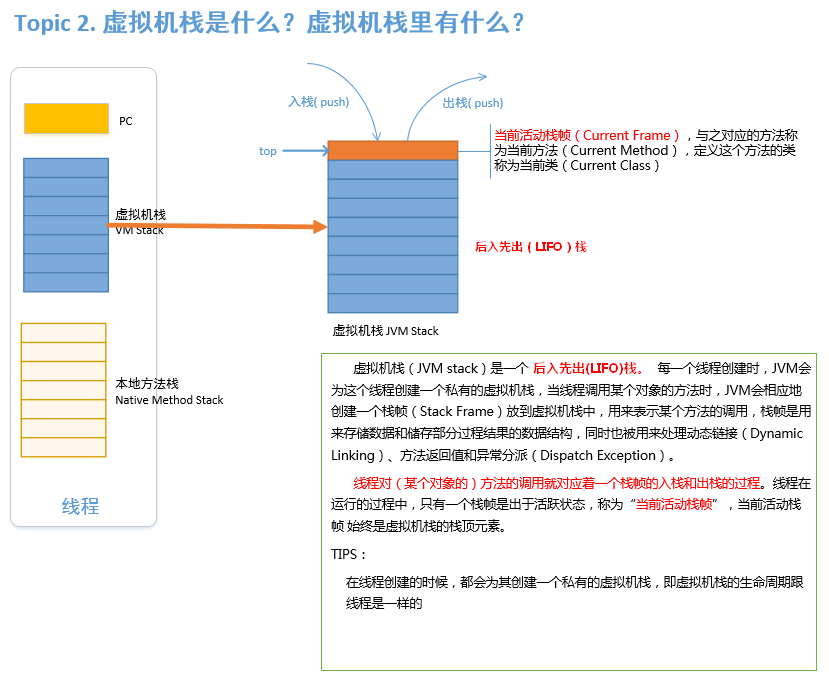
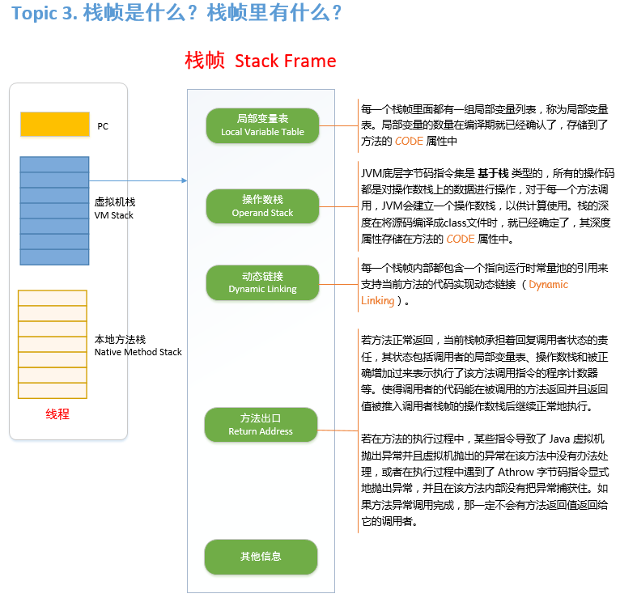
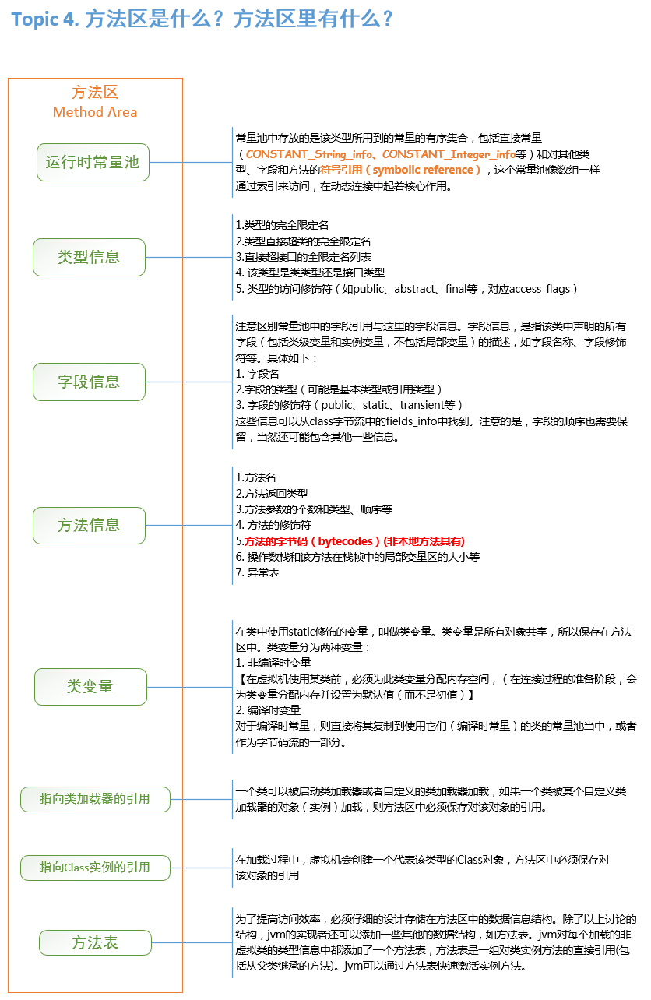

# 《Java虚拟机原理图解》3、JVM运行时数据区

 **JVM运行时数据区(\**JVM Runtime Area\**)**其实就是指JVM在运行期间，其对计算机内存空间的划分和分配。本文将通过以下几个话题来讨论JVM运行时数据区。

- - Topic 1. ***JVM运行时数据区***里有什么？
  - Topic 2. **虚拟机栈** 是什么？**虚拟机栈**里有什么？
  - Topic 3.**栈帧**是什么？***栈帧***里有什么？
  - Topic 4. ***方法区***是什么？***方法区***里有什么？

### Topic 1.JVM运行时数据区里有什么？

### Topic 2. 虚拟机栈是什么？虚拟机栈里有什么？

### Topic 3. 栈帧是什么？栈帧里有什么？

### Topic 4. 方法区是什么？方法区里有什么？

