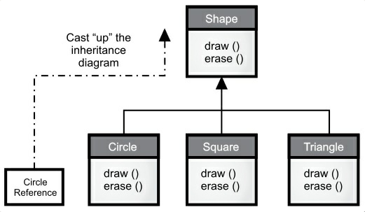

# [第八章 复用](https://lingcoder.gitee.io/onjava8/#/book/08-Reuse?id=第八章-复用)

>  代码复用是面向对象编程（OOP）最具魅力的原因之一。 

如何在不污染源代码的前提下使用现存代码是需要技巧的。在本章里，你将学习到两种方式来达到这个目的：

1. 第一种方式直接了当。在新类中创建现有类的对象。这种方式叫做“组合”（Composition），通过这种方式复用代码的功能，而非其形式。
2. 第二种方式更为微妙。创建现有类类型的新类。照字面理解：采用现有类形式，又无需在编码时改动其代码，这种方式就叫做“继承”（Inheritance），编译器会做大部分的工作。**继承**是面向对象编程（OOP）的重要基础之一。更多功能相关将在[多态](https://lingcoder.gitee.io/onjava8/#/./09-Polymorphism)（Polymorphism）章节中介绍。

### 组合语法

 把对象的引用（object references）放置在一个新的类里，这就使用了组合。 

 **@Override** 注释来告诉编译器，以确保正确地覆盖。**@Override** 是可选的，但它有助于验证你没有拼写错误 (或者更微妙地说，大小写字母输入错误)。类中的基本类型字段自动初始化为零，但是对象引用被初始化为 **null**，如果你尝试调用其任何一个方法，你将得到一个异常（一个运行时错误） 。

编译器不会为每个引用创建一个默认对象，这是有意义的，因为在许多情况下，这会导致不必要的开销。初始化引用有四种方法:

1. 当对象被定义时。这意味着它们总是在调用构造函数之前初始化。
2. 在该类的构造函数中。
3. 在实际使用对象之前。这通常称为*延迟初始化*。在对象创建开销大且不需要每次都创建对象的情况下，它可以减少开销。
4. 使用实例初始化。

### 继承语法

 在创建类时总是要继承，因为除非显式地继承其他类，否则就隐式地继承 Java 的标准根类对象（Object）。 

### 初始化基类

 必须正确初始化基类子对象，而且只有一种方法可以保证这一点 : 通过调用基类构造函数在构造函数中执行初始化，该构造函数具有执行基类初始化所需的所有适当信息和特权。Java 自动在派生类构造函数中插入对基类构造函数的调用。下面的例子展示了三个层次的继承: 

```java
// reuse/Cartoon.java
// (c)2017 MindView LLC: see Copyright.txt
// We make no guarantees that this code is fit for any purpose.
// Visit http://OnJava8.com for more book information.
// Constructor calls during inheritance

class Art {
  Art() {
    System.out.println("Art constructor");
  }
}

class Drawing extends Art {
  Drawing() {
    System.out.println("Drawing constructor");
  }
}

public class Cartoon extends Drawing {
  public Cartoon() {
    System.out.println("Cartoon constructor");
  }
  public static void main(String[] args) {
    Cartoon x = new Cartoon();
  }
}
/* Output:
Art constructor
Drawing constructor
Cartoon constructor
*/
```

 构造从基类“向外”进行，因此基类在派生类构造函数能够访问它之前进行初始化。即使不为 **Cartoon** 创建构造函数，编译器也会为你合成一个无参数构造函数，调用基类构造函数。尝试删除 **Cartoon** 构造函数来查看这个。 

### 带参数的构造函数

```java
// reuse/Chess.java
// (c)2017 MindView LLC: see Copyright.txt
// We make no guarantees that this code is fit for any purpose.
// Visit http://OnJava8.com for more book information.
// Inheritance, constructors and arguments

class Game {
  Game(int i) {
    System.out.println("Game constructor");
  }
}

class BoardGame extends Game {
  BoardGame(int i) {
    super(i);
    System.out.println("BoardGame constructor");
  }
}

public class Chess extends BoardGame {
  Chess() {
    super(11);
    System.out.println("Chess constructor");
  }
  public static void main(String[] args) {
    Chess x = new Chess();
  }
}
/* Output:
Game constructor
BoardGame constructor
Chess constructor
*/
```

 如果没有在 **BoardGame** 构造函数中调用基类构造函数，编译器就会报错找不到 `Game()` 的构造函数。此外，对基类构造函数的调用必须是派生类构造函数中的第一个操作。(如果你写错了，编译器会提醒你。) 

### 委托

 Java不直接支持的第三种重用关系称为委托。这介于继承和组合之间，因为你将一个成员对象放在正在构建的类中(比如组合)，但同时又在新类中公开来自成员对象的所有方法(比如继承)。 

```java
// reuse/SpaceShipControls.java
// (c)2017 MindView LLC: see Copyright.txt
// We make no guarantees that this code is fit for any purpose.
// Visit http://OnJava8.com for more book information.

public class SpaceShipControls {
  void up(int velocity) {}
  void down(int velocity) {}
  void left(int velocity) {}
  void right(int velocity) {}
  void forward(int velocity) {}
  void back(int velocity) {}
  void turboBoost() {}
}
```

```java
// reuse/SpaceShipDelegation.java
// (c)2017 MindView LLC: see Copyright.txt
// We make no guarantees that this code is fit for any purpose.
// Visit http://OnJava8.com for more book information.

public class SpaceShipDelegation {
  private String name;
  private SpaceShipControls controls =
    new SpaceShipControls();
  public SpaceShipDelegation(String name) {
    this.name = name;
  }
  // Delegated methods:
  public void back(int velocity) {
    controls.back(velocity);
  }
  public void down(int velocity) {
    controls.down(velocity);
  }
  public void forward(int velocity) {
    controls.forward(velocity);
  }
  public void left(int velocity) {
    controls.left(velocity);
  }
  public void right(int velocity) {
    controls.right(velocity);
  }
  public void turboBoost() {
    controls.turboBoost();
  }
  public void up(int velocity) {
    controls.up(velocity);
  }
  public static void main(String[] args) {
    SpaceShipDelegation protector =
      new SpaceShipDelegation("NSEA Protector");
    protector.forward(100);
  }
}
```

### 向上转型



 继承图中派生类转型为基类是向上的，所以通常称作*向上转型*。因为是从一个更具体的类转化为一个更一般的类，所以向上转型永远是安全的。也就是说，派生类是基类的一个超集。它可能比基类包含更多的方法，但它必须至少具有与基类一样的方法。在向上转型期间，类接口只可能失去方法，不会增加方法。这就是为什么编译器在没有任何明确转型或其他特殊标记的情况下，仍然允许向上转型的原因。 

### final关键字

 根据上下文环境，Java 的关键字 **final** 的含义有些微的不同，但通常它指的是“这是不能被改变的”。防止改变有两个原因：设计或效率。因为这两个原因相差很远，所以有可能误用关键字 **final**。 

#### final 数据

许多编程语言都有某种方法告诉编译器有一块数据是恒定不变的。恒定是有用的，如：

1. 一个永不改变的编译时常量。
2. 一个在运行时初始化就不会改变的值。

对于编译时常量这种情况，编译器可以把常量带入计算中；也就是说，可以在编译时计算，减少了一些运行时的负担。在 Java 中，这类常量必须是基本类型，而且用关键字 **final** 修饰。你必须在定义常量的时候进行赋值。

一个被 **static** 和 **final** 同时修饰的属性只会占用一段不能改变的存储空间。

 当用 **final** 修饰对象引用而非基本类型时，其含义会有一点令人困惑。对于基本类型，**final** 使数值恒定不变，而对于对象引用，**final** 使引用恒定不变。一旦引用被初始化指向了某个对象，它就不能改为指向其他对象。但是，对象本身是可以修改的，Java 没有提供将任意对象设为常量的方法。 

#### 空白 final

 空白 final 指的是没有初始化值的 **final** 属性。编译器确保空白 final 在使用前必须被初始化。这样既能使一个类的每个对象的 **final** 属性值不同，也能保持它的不变性。 

 你必须在定义时或在每个构造器中执行 final 变量的赋值操作。这保证了 final 属性在使用前已经被初始化过。 

### final 参数

 在参数列表中，将参数声明为 final 意味着在方法中不能改变参数指向的对象或基本变量： 

```java
// reuse/FinalArguments.java
// Using "final" with method arguments
class Gizmo {
    public void spin() {

    }
}

public class FinalArguments {
    void with(final Gizmo g) {
        //-g = new Gizmo(); // Illegal -- g is final
    }

    void without(Gizmo g) {
        g = new Gizmo(); // OK -- g is not final
        g.spin();
    }

    //void f(final int i) { i++; } // Can't change
    // You can only read from a final primitive
    int g(final int i) {
        return i + 1;
    }

    public static void main(String[] args) {
        FinalArguments bf = new FinalArguments();
        bf.without(null);
        bf.with(null);
    }
}
```

 方法 `f()` 和 `g()` 展示了 **final** 基本类型参数的使用情况。你只能读取而不能修改参数。这个特性主要用于传递数据给匿名内部类。 

### final 方法

 使用 **final** 方法的原因有两个。第一个原因是给方法上锁，防止子类通过覆写改变方法的行为。这是出于继承的考虑，确保方法的行为不会因继承而改变。 

过去建议使用 **final** 方法的第二个原因是效率。在早期的 Java 实现中，如果将一个方法指明为 **final**，就是同意编译器把对该方法的调用转化为内嵌调用。当编译器遇到 **final** 方法的调用时，就会很小心地跳过普通的插入代码以执行方法的调用机制（将参数压栈，跳至方法代码处执行，然后跳回并清理栈中的参数，最终处理返回值），而用方法体内实际代码的副本替代方法调用。这消除了方法调用的开销。但是如果一个方法很大代码膨胀，你也许就看不到内嵌带来的性能提升，因为内嵌调用带来的性能提高被花费在方法里的时间抵消了。

在最近的 Java 版本中，虚拟机可以探测到这些情况（尤其是 *hotspot* 技术），并优化去掉这些效率反而降低的内嵌调用方法。有很长一段时间，使用 **final** 来提高效率都被阻止。你应该让编译器和 JVM 处理性能问题，只有在为了明确禁止覆写方法时才使用 **final**。

### final 和 private

 类中所有的 **private** 方法都隐式地指定为 **final**。因为不能访问 **private** 方法，所以不能覆写它。可以给 **private** 方法添加 **final** 修饰，但是并不能给方法带来额外的含义。 

 以下情况会令人困惑，当你试图覆写一个 **private** 方法（隐式是 **final** 的）时，看上去奏效，而且编译器不会给出错误信息 。

 "覆写"只发生在方法是基类的接口时。也就是说，必须能将一个对象向上转型为基类并调用相同的方法（这一点在下一章阐明）。如果一个方法是 **private** 的，它就不是基类接口的一部分。它只是隐藏在类内部的代码，且恰好有相同的命名而已。但是如果你在派生类中以相同的命名创建了 **public**，**protected** 或包访问权限的方法，这些方法与基类中的方法没有联系，你没有覆写方法，只是在创建新的方法而已。由于 **private** 方法无法触及且能有效隐藏，除了把它看作类中的一部分，其他任何事物都不需要考虑到它。 

#### final 类

 当说一个类是 **final** （**final** 关键字在类定义之前），就意味着它不能被继承。之所以这么做，是因为类的设计就是永远不需要改动，或者是出于安全考虑不希望它有子类。 

 **final** 类的属性可以根据个人选择是或不是 **final**。这同样适用于不管类是否是 **final** 的内部 **final** 属性。然而，由于 **final** 类禁止继承，类中所有的方法都被隐式地指定为 **final**，所以没有办法覆写它们。你可以在 final 类中的方法加上 **final** 修饰符，但不会增加任何意义。 

### 类初始化和加载

 因为 Java 中万物皆对象，所以加载活动就容易得多。记住每个类的编译代码都存在于它自己独立的文件中。该文件只有在使用程序代码时才会被加载。一般可以说“类的代码在首次使用时加载“。这通常是指创建类的第一个对象，或者是访问了类的 **static** 属性或方法。构造器也是一个 **static** 方法尽管它的 **static** 关键字是隐式的。因此，准确地说，一个类当它任意一个 **static** 成员被访问时，就会被加载。 

 首次使用时就是 **static** 初始化发生时。所有的 **static** 对象和 **static** 代码块在加载时按照文本的顺序（在类中定义的顺序）依次初始化。**static** 变量只被初始化一次。 

#### 继承和初始化

 了解包括继承在内的整个初始化过程是有帮助的，这样可以对所发生的一切有全局性的把握。考虑下面的例子： 

```java
// reuse/Beetle.java
// The full process of initialization
class Insect {
    private int i = 9;
    protected int j;

    Insect() {
        System.out.println("i = " + i + ", j = " + j);
        j = 39;
    }

    private static int x1 = printInit("static Insect.x1 initialized");

    static int printInit(String s) {
        System.out.println(s);
        return 47;
    }
}

public class Beetle extends Insect {
    private int k = printInit("Beetle.k.initialized");

    public Beetle() {
        System.out.println("k = " + k);
        System.out.println("j = " + j);
    }

    private static int x2 = printInit("static Beetle.x2 initialized");

    public static void main(String[] args) {
        System.out.println("Beetle constructor");
        Beetle b = new Beetle();
    }
}
```

 输出： 

```
static Insect.x1 initialized
static Beetle.x2 initialized
Beetle constructor
i = 9, j = 0
Beetle.k initialized
k = 47
j = 39
```

当执行 **java Beetle**，首先会试图访问 **Beetle** 类的 `main()` 方法（一个静态方法），加载器启动并找出 **Beetle** 类的编译代码（在名为 **Beetle.class** 的文件中）。在加载过程中，编译器注意到有一个基类，于是继续加载基类。不论是否创建了基类的对象，基类都会被加载。（可以尝试把创建基类对象的代码注释掉证明这点。）

如果基类还存在自身的基类，那么第二个基类也将被加载，以此类推。接下来，根基类（例子中根基类是 **Insect**）的 **static** 的初始化开始执行，接着是派生类，以此类推。这点很重要，因为派生类中 **static** 的初始化可能依赖基类成员是否被正确地初始化。

至此，必要的类都加载完毕，可以创建对象了。首先，对象中的所有基本类型变量都被置为默认值，对象引用被设为 **null** —— 这是通过将对象内存设为二进制零值一举生成的。接着会调用基类的构造器。本例中是自动调用的，但是你也可以使用 **super** 调用指定的基类构造器（在 **Beetle** 构造器中的第一步操作）。基类构造器和派生类构造器一样以相同的顺序经历相同的过程。当基类构造器完成后，实例变量按文本顺序初始化。最终，构造器的剩余部分被执行。