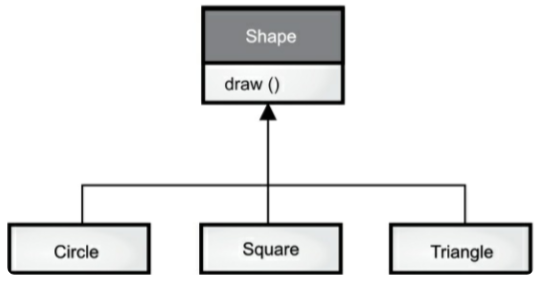

# [第十九章 类型信息](https://lingcoder.gitee.io/onjava8/#/book/19-Type-Information?id=第十九章-类型信息)

>  RTTI（RunTime Type Information，运行时类型信息）能够在程序运行时发现和使用类型信息 

RTTI 把我们从只能在编译期进行面向类型操作的禁锢中解脱了出来，并且让我们可以使用某些非常强大的程序。对 RTTI 的需要，揭示了面向对象设计中许多有趣（并且复杂）的特性，同时也带来了关于如何组织程序的基本问题。

本章将讨论 Java 是如何在运行时识别对象和类信息的。主要有两种方式：

1. “传统的” RTTI：假定我们在编译时已经知道了所有的类型；
2. “反射”机制：允许我们在运行时发现和使用类的信息。

### 为什么需要 RTTI

 下面看一下我们已经很熟悉的一个例子，它使用了多态的类层次结构。基类 `Shape` 是泛化的类型，从它派生出了三个具体类： `Circle` 、`Square` 和 `Triangle`（见下图所示）。 



这是一个典型的类层次结构图，基类位于顶部，派生类向下扩展。面向对象编程的一个基本目的是：让代码只操纵对基类(这里即 `Shape` )的引用。这样，如果你想添加一个新类(比如从 `Shape` 派生出 `Rhomboid`)来扩展程序，就不会影响原来的代码。在这个例子中，`Shape` 接口中动态绑定了 `draw()` 方法，这样做的目的就是让客户端程序员可以使用泛化的 `Shape` 引用来调用 `draw()`。`draw()` 方法在所有派生类里都会被覆盖，而且由于它是动态绑定的，所以即使通过 `Shape` 引用来调用它，也能产生恰当的行为，这就是多态。

因此，我们通常会创建一个具体的对象(`Circle`、`Square` 或者 `Triangle`)，把它向上转型成 `Shape` (忽略对象的具体类型)，并且在后面的程序中使用 `Shape` 引用来调用在具体对象中被重载的方法（如 `draw()`）。

代码如下：

```java
// typeinfo/Shapes.java
import java.util.stream.*;

abstract class Shape {
    void draw() { System.out.println(this + ".draw()"); }
    @Override
    public abstract String toString();
}

class Circle extends Shape {
    @Override
    public String toString() { return "Circle"; }
}

class Square extends Shape {
    @Override
    public String toString() { return "Square"; }
}

class Triangle extends Shape {
    @Override
    public String toString() { return "Triangle"; }
}

public class Shapes {
    public static void main(String[] args) {
        Stream.of(
            new Circle(), new Square(), new Triangle())
            .forEach(Shape::draw);
    }
}
```

 输出结果： 

```
Circle.draw()
Square.draw()
Triangle.draw()
```

基类中包含 `draw()` 方法，它通过传递 `this` 参数传递给 `System.out.println()`，间接地使用 `toString()` 打印类标识符(注意：这里将 `toString()` 声明为 `abstract`，以此强制继承者覆盖该方法，并防止对 `Shape` 的实例化)。如果某个对象出现在字符串表达式中(涉及"+"和字符串对象的表达式)，`toString()` 方法就会被自动调用，以生成表示该对象的 `String`。每个派生类都要覆盖（从 `Object` 继承来的）`toString()` 方法，这样 `draw()` 在不同情况下就打印出不同的消息(多态)。

这个例子中，在把 `Shape` 对象放入 `Stream` 中时就会进行向上转型(隐式)，但在向上转型的时候也丢失了这些对象的具体类型。对 `stream` 而言，它们只是 `Shape` 对象。

严格来说，`Stream` 实际上是把放入其中的所有对象都当做 `Object` 对象来持有，只是取元素时会自动将其类型转为 `Shape`。这也是 RTTI 最基本的使用形式，因为在 Java 中，所有类型转换的正确性检查都是在运行时进行的。这也正是 RTTI 的含义所在：在运行时，识别一个对象的类型。

另外在这个例子中，类型转换并不彻底：`Object` 被转型为 `Shape` ，而不是 `Circle`、`Square` 或者 `Triangle`。这是因为目前我们只能确保这个 `Stream` 保存的都是 `Shape`：

- 编译期，`stream` 和 Java 泛型系统确保放入 `stream` 的都是 `Shape` 对象（`Shape` 子类的对象也可视为 `Shape` 的对象），否则编译器会报错；
- 运行时，自动类型转换确保了从 `stream` 中取出的对象都是 `Shape` 类型。

接下来就是多态机制的事了，`Shape` 对象实际执行什么样的代码，是由引用所指向的具体对象（`Circle`、`Square` 或者 `Triangle`）决定的。这也符合我们编写代码的一般需求，通常，我们希望大部分代码尽可能少了解对象的具体类型，而是只与对象家族中的一个通用表示打交道（本例中即为 `Shape`）。这样，代码会更容易写，更易读和维护；设计也更容易实现，更易于理解和修改。所以多态是面向对象的基本目标。

但是，有时你会碰到一些编程问题，在这些问题中如果你能知道某个泛化引用的具体类型，就可以把问题轻松解决。例如，假设我们允许用户将某些几何形状高亮显示，现在希望找到屏幕上所有高亮显示的三角形；或者，我们现在需要旋转所有图形，但是想跳过圆形(因为圆形旋转没有意义)。这时我们就希望知道 `Stream` 里边的形状具体是什么类型，而 Java 实际上也满足了我们的这种需求。使用 RTTI，我们可以查询某个 `Shape` 引用所指向对象的确切类型，然后选择或者剔除特例。

###   **`Class`** 对象