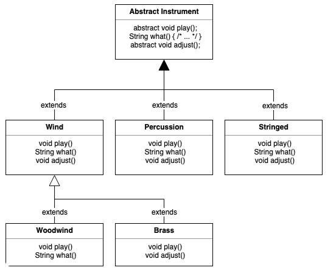

# [第十章 接口](https://lingcoder.gitee.io/onjava8/#/book/10-Interfaces?id=第十章-接口)

 接口和抽象类提供了一种将接口与实现分离的更加结构化的方法。 

### 抽象类和方法

 Java 提供了一个叫做*抽象方法*的机制，这个方法是不完整的：它只有声明没有方法体。下面是抽象方法的声明语法： 

```java
abstract void f();
```

 包含抽象方法的类叫做*抽象类*。如果一个类包含一个或多个抽象方法，那么类本身也必须限定为抽象的，否则，编译器会报错。 

```java
// interface/Basic.java
abstract class Basic {
    abstract void unimplemented();
}
```

  如果创建一个继承抽象类的新类并为之创建对象，那么就必须为基类的所有抽象方法提供方法定义。如果不这么做（可以选择不做），新类仍然是一个抽象类，编译器会强制我们为新类加上 **abstract** 关键字。 

可以将一个不包含任何抽象方法的类指明为 **abstract**，在类中的抽象方法没啥意义但想阻止创建类的对象时，这么做就很有用。 

 可以将一个不包含任何抽象方法的类指明为 **abstract**，在类中的抽象方法没啥意义但想阻止创建类的对象时，这么做就很有用。 

 为了创建可初始化的类，就要继承抽象类，并提供所有抽象方法的定义 ：

```java
// interfaces/Instantiable.java
abstract class Uninstantiable {
    abstract void f();
    abstract int g();
}

public class Instantiable extends Uninstantiable {
    @Override
    void f() {
        System.out.println("f()");
    }

    @Override
    int g() {
        return 22;
    }

    public static void main(String[] args) {
        Uninstantiable ui = new Instantiable();
    }
}
```

 留意 `@Override` 的使用。没有这个注解的话，如果你没有定义相同的方法名或签名，抽象机制会认为你没有实现抽象方法从而产生编译时错误。因此，你可能认为这里的 `@Override` 是多余的。但是，`@Override` 还提示了这个方法被覆写——我认为这是有用的，所以我会使用 `@Override`，即使在没有这个注解，编译器告诉我错误的时候。 

 记住，事实上的访问权限是“friendly”。你很快会看到接口自动将其方法指明为 **public**。事实上，接口只允许 **public** 方法，如果不加访问修饰符的话，接口的方法不是 **friendly** 而是 **public**。然而，抽象类允许每件事： 

```java
// interfaces/AbstractAccess.java
abstract class AbstractAccess {
    private void m1() {}

    // private abstract void m1a(); // illegal

    protected void m2() {}

    protected abstract void m2a();

    void m3() {}

    abstract void m3a();

    public void m4() {}

    public abstract void m4a();
}
```

 **private abstract** 被禁止了是有意义的，因为你不可能在 **AbstractAccess** 的任何子类中合法地定义它。 

 上一章的 **Instrument** 类可以很轻易地转换为一个抽象类。只需要部分方法是 **abstract** 即可。将一个类指明为 **abstract** 并不强制类中的所有方法必须都是抽象方法。如下图所示： 



 下面是修改成使用抽象类和抽象方法的管弦乐器的例子： 

```java
// interfaces/music4/Music4.java
// Abstract classes and methods
// {java interfaces.music4.Music4}
package interfaces.music4;
import polymorphism.music.Note;

abstract class Instrument {
    private int i; // Storage allocated for each

    public abstract void play(Note n);

    public String what() {
        return "Instrument";
    }

    public abstract void adjust();
}

class Wind extends Instrument {
    @Override
    public void play(Note n) {
        System.out.println("Wind.play() " + n);
    }

    @Override
    public String what() {
        return "Wind";
    }

    @Override
    public void adjust() {
        System.out.println("Adjusting Wind");
    }
}

class Percussion extends Instrument {
    @Override
    public void play(Note n) {
        System.out.println("Percussion.play() " + n);
    }

    @Override
    public String what() {
        return "Percussion";
    }

    @Override
    public void adjust() {
        System.out.println("Adjusting Percussion");
    }
}

class Stringed extends Instrument {
    @Override
    public void play(Note n) {
        System.out.println("Stringed.play() " + n);
    }

    @Override
    public String what() {
        return "Stringed";
    }

    @Override
    public void adjust() {
        System.out.println("Adjusting Stringed");
    }
}

class Brass extends Wind {
    @Override
    public void play(Note n) {
        System.out.println("Brass.play() " + n);
    }

    @Override
    public void adjust() {
        System.out.println("Adjusting Brass");
    }
}

class Woodwind extends Wind {
    @Override
    public void play(Note n) {
        System.out.println("Woodwind.play() " + n);
    }

    @Override
    public String what() {
        return "Woodwind";
    }
}

public class Music4 {
    // Doesn't care about type, so new types
    // added to system still work right:
    static void tune(Instrument i) {
        // ...
        i.play(Note.MIDDLE_C);
    }

    static void tuneAll(Instrument[] e) {
        for (Instrument i: e) {
            tune(i);
        }
    }

    public static void main(String[] args) {
        // Upcasting during addition to the array:
        Instrument[] orchestra = {
            new Wind(),
            new Percussion(),
            new Stringed(),
            new Brass(),
            new Woodwind()
        };
        tuneAll(orchestra);
    }
}
```

 输出： 

```
Wind.play() MIDDLE_C
Percussion.play() MIDDLE_C
Stringed.play() MIDDLE_C
Brass.play() MIDDLE_C
Woodwind.play() MIDDLE_C
```

除了 **Instrument**，基本没区别。

创建抽象类和抽象方法是有帮助的，因为它们使得类的抽象性很明确，并能告知用户和编译器使用意图。抽象类同时也是一种有用的重构工具，使用它们使得我们很容易地将沿着继承层级结构上移公共方法。

### 接口创建

使用 **interface** 关键字创建接口。在本书中，interface 和 class 一样随处常见，除非特指关键字 **interface**，其他情况下都采用正常字体书写 interface。

描述 Java 8 之前的接口更加容易，因为它们只允许抽象方法。像下面这样：

```java
// interfaces/PureInterface.java
// Interface only looked like this before Java 8
public interface PureInterface {
    int m1(); 
    void m2();
    double m3();
}
```

 我们甚至不用为方法加上 **abstract** 关键字，因为方法在接口中。Java 知道这些方法不能有方法体（仍然可以为方法加上 **abstract** 关键字，但是看起来像是不明白接口，徒增难堪罢了）。 

因此，在 Java 8之前我们可以这么说：**interface** 关键字产生一个完全抽象的类，没有提供任何实现。我们只能描述类应该像什么，做什么，但不能描述怎么做，即只能决定方法名、参数列表和返回类型，但是无法确定方法体。接口只提供形式，通常来说没有实现，尽管在某些受限制的情况下可以有实现。

一个接口表示：所有实现了该接口的类看起来都像这样。因此，任何使用某特定接口的代码都知道可以调用该接口的哪些方法，而且仅需知道这些。所以，接口被用来建立类之间的协议。

  Java 8 允许接口包含默认方法和静态方法 。介于类型之上、实现之下。接口与抽象类最明显的区别可能就是使用上的惯用方式。接口的典型使用是代表一个类的类型或一个形容词，如 Runnable 或 Serializable，而抽象类通常是类层次结构的一部分或一件事物的类型，如 String 或 ActionHero。 

使用关键字 **interface** 而不是 **class** 来创建接口。和类一样，需要在关键字 **interface** 前加上 **public** 关键字（但只是在接口名与文件名相同的情况下），否则接口只有包访问权限，只能在接口相同的包下才能使用它。

接口同样可以包含属性，这些属性被隐式指明为 **static** 和 **final**。

 使用 **implements** 关键字使一个类遵循某个特定接口（或一组接口），它表示：接口只是外形，现在我要说明它是如何工作的。除此之外，它看起来像继承。 

```java
// interfaces/ImplementingAnInterface.java
interface Concept { // Package access
    void idea1();
    void idea2();
}

class Implementation implements Concept {
    @Override
    public void idea1() {
        System.out.println("idea1");
    }

    @Override
    public void idea2() {
        System.out.println("idea2");
    }
}
```

 你可以选择显式地声明接口中的方法为 **public**，但是即使你不这么做，它们也是 **public** 的。所以当实现一个接口时，来自接口中的方法必须被定义为 **public**。否则，它们只有包访问权限，这样在继承时，它们的可访问权限就被降低了，这是 Java 编译器所不允许的。 

#### 默认方法

 Java 8 为关键字 **default** 增加了一个新的用途（之前只用于 **switch** 语句和注解中）。当在接口中使用它时，任何实现接口却没有定义方法的时候可以使用 **default** 创建的方法体。默认方法比抽象类中的方法受到更多的限制，但是非常有用，我们将在“流式编程”一章中看到。现在让我们看下如何使用： 

```java
// interfaces/InterfaceWithDefault.java
interface InterfaceWithDefault {
    void firstMethod();
    void secondMethod();

    default void newMethod() {
        System.out.println("newMethod");
    }
}
```

 关键字 **default** 允许在接口中提供方法实现——在 Java 8 之前被禁止。 

```java
// interfaces/Implementation2.java
public class Implementation2 implements InterfaceWithDefault {
    @Override
    public void firstMethod() {
        System.out.println("firstMethod");
    }

    @Override
    public void secondMethod() {
        System.out.println("secondMethod")
    }

    public static void main(String[] args) {
        InterfaceWithDefault i = new Implementation2();
        i.firstMethod();
        i.secondMethod();
        i.newMethod();
    }
}
```

 输出： 

```
firstMethod
secondMethod
newMethod
```

尽管 **Implementation2** 中未定义 `newMethod()`，但是可以使用 `newMethod()` 了。

增加默认方法的极具说服力的理由是它允许在不破坏已使用接口的代码的情况下，在接口中增加新的方法。默认方法有时也被称为*守卫方法*或*虚拟扩展方法*。

#### 多继承

 多继承意味着一个类可能从多个父类型中继承特征和特性。 

Java 过去是一种严格要求单继承的语言：只能继承自一个类（或抽象类），但可以实现任意多个接口。在 Java 8 之前，接口没有包袱——它只是方法外貌的描述。多年后的现在，Java 通过默认方法具有了某种多继承的特性。结合带有默认方法的接口意味着结合了多个基类中的行为。因为接口中仍然不允许存在属性（只有静态属性，不适用），所以属性仍然只会来自单个基类或抽象类，也就是说，不会存在状态的多继承。

 返回类型不是方法签名的一部分，因此不能用来区分方法。为了解决这个问题，需要覆写冲突的方法： 

```java
// interfaces/Jim.java
import java.util.*;

interface Jim1 {
    default void jim() {
        System.out.println("Jim1::jim");
    }
}

interface Jim2 {
    default void jim() {
        System.out.println("Jim2::jim");
    }
}

public class Jim implements Jim1, Jim2 {
    @Override
    public void jim() {
        Jim2.super.jim();
    }

    public static void main(String[] args) {
        new Jim().jim();
    }
}
```

 输出： 

```
Jim2::jim
```

#### 接口中的静态方法

 Java 8 允许在接口中添加静态方法。这么做能恰当地把工具功能置于接口中，从而操作接口，或者成为通用的工具： 

```java
// onjava/Operations.java
package onjava;
import java.util.*;

public interface Operations {
    void execute();

    static void runOps(Operations... ops) {
        for (Operations op: ops) {
            op.execute();
        }
    }

    static void show(String msg) {
        System.out.println(msg);
    }
}
```

 这是模版方法设计模式的一个版本（在“设计模式”一章中详细描述），`runOps()` 是一个模版方法。`runOps()` 使用可变参数列表，因而我们可以传入任意多的 **Operation** 参数并按顺序运行它们： 

```java
// interface/Machine.java
import java.util.*;
import onjava.Operations;

class Bing implements Operations {
    @Override
    public void execute() {
        Operations.show("Bing");
    }
}

class Crack implements Operations {
    @Override
    public void execute() {
        Operations.show("Crack");
    }
}

class Twist implements Operations {
    @Override
    public void execute() {
        Operations.show("Twist");
    }
}

public class Machine {
    public static void main(String[] args) {
        Operations.runOps(
            new Bing(), new Crack(), new Twist());
    }
}
```

 输出： 

```
Bing
Crack
Twist
```

 这里展示了创建 **Operations** 的不同方式：一个外部类(Bing)，一个匿名类，一个方法引用和 lambda 表达式——毫无疑问用在这里是最好的解决方法。 

### 抽象类和接口

尤其是在 Java 8 引入 **default** 方法之后，选择用抽象类还是用接口变得更加令人困惑。下表做了明确的区分：

| 特性                 | 接口                                                       | 抽象类                                   |
| -------------------- | ---------------------------------------------------------- | ---------------------------------------- |
| 组合                 | 新类可以组合多个接口                                       | 只能继承单一抽象类                       |
| 状态                 | 不能包含属性（除了静态属性，不支持对象状态）               | 可以包含属性，非抽象方法可能引用这些属性 |
| 默认方法 和 抽象方法 | 不需要在子类中实现默认方法。默认方法可以引用其他接口的方法 | 必须在子类中实现抽象方法                 |
| 构造器               | 没有构造器                                                 | 可以有构造器                             |
| 可见性               | 隐式 **public**                                            | 可以是 **protected** 或友元              |

抽象类仍然是一个类，在创建新类时只能继承它一个。而创建类的过程中可以实现多个接口。

有一条实际经验：尽可能地抽象。因此，更倾向使用接口而不是抽象类。只有当必要时才使用抽象类。除非必须使用，否则不要用接口和抽象类。大多数时候，普通类已经做得很好，如果不行的话，再移动到接口或抽象类中。

### 完全解耦

 当方法操纵的是一个类而非接口时，它就只能作用于那个类或其子类。如果想把方法应用于那个继承层级结构之外的类，就会触霉头。接口在很大程度上放宽了这个限制，因而使用接口可以编写复用性更好的代码。 

### 接口适配

 接口的一种常见用法是前面提到的*策略*设计模式。编写一个方法执行某些操作并接受一个指定的接口作为参数。可以说：“只要对象遵循接口，就可以调用方法” ，这使得方法更加灵活，通用，并更具可复用性。 

### 接口字段

 因为接口中的字段都自动是 **static** 和 **final** 的，所以接口就成为了创建一组常量的方便的工具。 

```java
// interfaces/Months.java
// Using interfaces to create groups of constants
public interface Months {
    int 
    JANUARY = 1, FEBRUARY = 2, MARCH = 3,
    APRIL = 4, MAY = 5, JUNE = 6, JULY = 7,
    AUGUST = 8, SEPTEMBER = 9, OCTOBER = 10,
    NOVEMBER = 11, DECEMBER = 12;
}
```

注意 Java 中使用大写字母的风格定义具有初始化值的 **static** **final** 变量。接口中的字段自动是 **public** 的，所以没有显式指明这点。

自 Java 5 开始，我们有了更加强大和灵活的关键字 **enum**，那么在接口中定义常量组就显得没什么意义了。然而当你阅读遗留的代码时，在很多场合你还会碰到这种旧的习惯用法。在“枚举”一章中你会学习到更多关于枚举的内容。

#### 初始化接口中的字段

 接口中定义的字段不能是“空 **final**"，但是可以用非常量表达式初始化。例如： 

```java
// interfaces/RandVals.java
// Initializing interface fields with
// non-constant initializers
import java.util.*;

public interface RandVals {
    Random RAND = new Random(47);
    int RANDOM_INT = RAND.nextInt(10);
    long RANDOM_LONG = RAND.nextLong() * 10;
    float RANDOM_FLOAT = RAND.nextLong() * 10;
    double RANDOM_DOUBLE = RAND.nextDouble() * 10;
}
```

 因为字段是 **static** 的，所以它们在类第一次被加载时初始化，这发生在任何字段首次被访问时。下面是个简单的测试： 

```java
// interfaces/TestRandVals.java
public class TestRandVals {
    public static void main(String[] args) {
        System.out.println(RandVals.RANDOM_INT);
        System.out.println(RandVals.RANDOM_LONG);
        System.out.println(RandVals.RANDOM_FLOAT);
        System.out.println(RandVals.RANDOM_DOUBLE);
    }
}
```

 输出： 

```
8
-32032247016559954
-8.5939291E18
5.779976127815049
```

 这些字段不是接口的一部分，它们的值被存储在接口的静态存储区域中。 

### 接口和工厂方法模式

 接口是多实现的途径，而生成符合某个接口的对象的典型方式是*工厂方法*设计模式。不同于直接调用构造器，只需调用工厂对象中的创建方法就能生成对象的实现——理论上，通过这种方式可以将接口与实现的代码完全分离，使得可以透明地将某个实现替换为另一个实现。这里是一个展示工厂方法结构的例子： 

```java
// interfaces/Factories.java
interface Service {
    void method1();
    void method2();
}

interface ServiceFactory {
    Service getService();
}

class Service1 implements Service {
    Service1() {} // Package access

    @Override
    public void method1() {
        System.out.println("Service1 method1");
    }

    @Override
    public void method2() {
        System.out.println("Service1 method2");
    }
}

class Service1Factory implements ServiceFactory {
    @Override
    public Service getService() {
        return new Service1();
    }
}

class Service2 implements Service {
    Service2() {} // Package access

    @Override
    public void method1() {
        System.out.println("Service2 method1");
    }

    @Override
    public void method2() {
        System.out.println("Service2 method2");
    }
}

class Service2Factory implements ServiceFactory {
    @Override
    public Service getService() {
        return new Service2();
    }
}

public class Factories {
    public static void serviceConsumer(ServiceFactory fact) {
        Service s = fact.getService();
        s.method1();
        s.method2();
    }

    public static void main(String[] args) {
        serviceConsumer(new Service1Factory());
        // Services are completely interchangeable:
        serviceConsumer(new Service2Factory());
    }
}
```

 输出： 

```
Service1 method1
Service1 method2
Service2 method1
Service2 method2
```

 为什么要添加额外的间接层呢？一个常见的原因是创建框架。假设你正在创建一个游戏系统；例如，在相同的棋盘下国际象棋和西洋跳棋： 

```java
// interfaces/Games.java
// A Game framework using Factory Methods
interface Game {
    boolean move();
}

interface GameFactory {
    Game getGame();
}

class Checkers implements Game {
    private int moves = 0;
    private static final int MOVES = 3;

    @Override
    public boolean move() {
        System.out.println("Checkers move " + moves);
        return ++moves != MOVES;
    }
}

class CheckersFactory implements GameFactory {
    @Override
    public Game getGame() {
        return new Checkers();
    }
}

class Chess implements Game {
    private int moves = 0;
    private static final int MOVES = 4;

    @Override
    public boolean move() {
        System.out.println("Chess move " + moves);
        return ++moves != MOVES;
    }
}

class ChessFactory implements GameFactory {
    @Override
    public Game getGame() {
        return new Chess();
    }
}

public class Games {
    public static void playGame(GameFactory factory) {
        Game s = factory.getGame();
        while (s.move()) {
            ;
        }
    }

    public static void main(String[] args) {
        playGame(new CheckersFactory());
        playGame(new ChessFactory());
    }
}
```

 如果类 **Games** 表示一段很复杂的代码，那么这种方式意味着你可以在不同类型的游戏里复用这段代码。你可以再想象一些能够从这个模式中受益的更加精巧的游戏。 

 恰当的原则是优先使用类而不是接口。从类开始，如果使用接口的必要性变得很明确，那么就重构。接口是一个伟大的工具，但它们容易被滥用。 