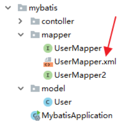
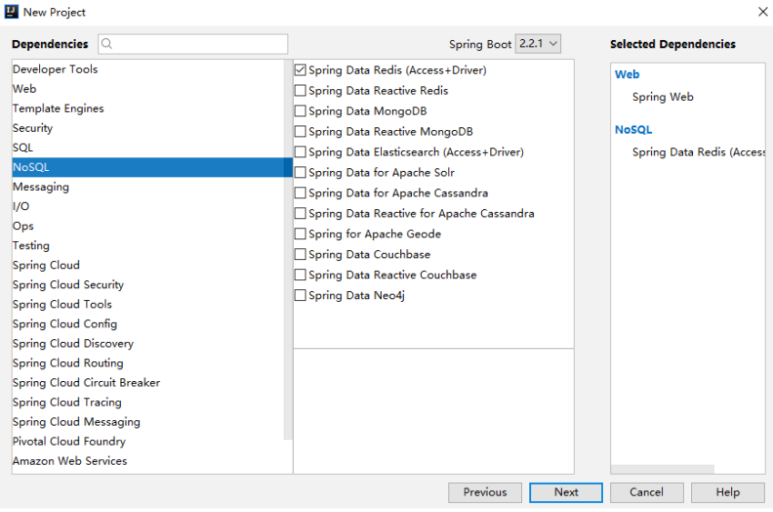

##  **Spring Boot 的配置文件 application.properties** 

### 位置问题

1. 当前项目根目录下的 config 目录下
2. 当前项目的根目录下
3. resources 目录下的 config 目录下
4. resources 目录下


### 普通的属性注入

 Spring Boot 中，默认会自动加载 application.properties 文件 

 例如，现在定义一个 Book 类： 

```java
public class Book {
    private Long id;
    private String name;
    private String author;
    //省略 getter/setter
}
```

 然后，在 application.properties 文件中定义属性 

```properties
book.name=三国演义
book.author=罗贯中
book.id=1
```

 按照传统的方式（Spring中的方式），可以直接通过 @Value 注解将这些属性注入到 Book 对象中： 

```java
@Component
public class Book {
    @Value("${book.id}")
    private Long id;
    @Value("${book.name}")
    private String name;
    @Value("${book.author}")
    private String author;
    //省略getter/setter
}
```

一般来说，我们在 application.properties 文件中主要存放系统配置，这种自定义配置不建议放在该文件中，可以自定义 properties 文件来存在自定义配置。

例如在 resources 目录下，自定义 book.properties 文件，内容如下：

```properties
book.name=三国演义
book.author=罗贯中
book.id=1
```

 如果是在 Java 配置中，可以通过 @PropertySource 来引入配置： 

```java
@Component
@PropertySource("classpath:book.properties")
public class Book {
    @Value("${book.id}")
    private Long id;
    @Value("${book.name}")
    private String name;
    @Value("${book.author}")
    private String author;
    //getter/setter
}
```

### 类型安全的属性注入

```java
@Component
@PropertySource("classpath:book.properties")
@ConfigurationProperties(prefix = "book")
public class Book {
    private Long id;
    private String name;
    private String author;
    //省略getter/setter
}
```

 引入 @ConfigurationProperties(prefix = “book”) 注解，并且配置了属性的前缀，此时会自动将 Spring 容器中对应的数据注入到对象对应的属性中，就不用通过 @Value 注解挨个注入了 

##  **Spring Boot中的yaml配置** 

### 狡兔三窟

application.yaml在Spring Boot中可以写在四个不同的位置，分别是如下位置：

1. 项目根目录下的config目录中
2. 项目根目录下
3. classpath下的config目录中
4. classpath目录下

### 数组注入

 yaml也支持数组注入，例如 

```yaml
my:
  servers:
	- dev.example.com
	- another.example.com
```

 这段数据可以绑定到一个带Bean的数组中： 

```java
@ConfigurationProperties(prefix="my")
@Component
public class Config {

	private List<String> servers = new ArrayList<String>();

	public List<String> getServers() {
		return this.servers;
	}
}
```

 在集合中存储对象,例如下面这种： 

```yaml
redis:
  redisConfigs:
    - host: 192.168.66.128
      port: 6379
    - host: 192.168.66.129
      port: 6380
```

 这个可以被注入到如下类中： 

```java
@Component
@ConfigurationProperties(prefix = "redis")
public class RedisCluster {
    private List<SingleRedisConfig> redisConfigs;
	//省略getter/setter
}
```

### 优缺点

 不同于properties文件的无序，yaml配置是有序的，这一点在有些配置中是非常有用的，例如在Spring Cloud Zuul的配置中，当我们配置代理规则时，顺序就显得尤为重要了。当然yaml配置也不是万能的，例如，yaml配置目前不支持@PropertySource注解。 

##  **Spring Boot 中的静态资源** 

### 整体规划

在 Spring Boot 中，默认情况下，一共有5个位置可以放静态资源，五个路径分别是如下5个：

1. classpath:/META-INF/resources/
2. classpath:/resources/
3. classpath:/static/
4. classpath:/public/
5. /

### 自定义配置

#### application.properties

```
spring.resources.static-locations=classpath:/
spring.mvc.static-path-pattern=/**
```

 第一行配置表示定义资源位置，第二行配置表示定义请求 URL 规则。以上文的配置为例，如果我们这样定义了，表示可以将静态资源放在 resources目录下的任意地方，我们访问的时候当然也需要写完整的路径，例如在resources/static目录下有一张名为1.png 的图片，那么访问路径就是 `http://localhost:8080/static/1.png` ,注意此时的static不能省略。 

#### Java 代码定义

```java
@Configuration
public class WebMVCConfig implements WebMvcConfigurer {
    @Override
    public void addResourceHandlers(ResourceHandlerRegistry registry) {
        registry.addResourceHandler("/**").addResourceLocations("classpath:/aaa/");
    }
}
```

##  **SpringMVC 中 @ControllerAdvice 注解的三种使用场景** 

@ControllerAdvice ，这是一个增强的 Controller。使用这个 Controller ，可以实现三个方面的功能：

1. 全局异常处理
2. 全局数据绑定
3. 全局数据预处理

### 全局异常处理

 使用 @ControllerAdvice 实现全局异常处理，只需要定义类，添加该注解即可定义方式如下： 

```java
@ControllerAdvice
public class MyGlobalExceptionHandler {
    @ExceptionHandler(Exception.class)
    public ModelAndView customException(Exception e) {
        ModelAndView mv = new ModelAndView();
        mv.addObject("message", e.getMessage());
        mv.setViewName("myerror");
        return mv;
    }
}
```

 @ExceptionHandler 注解用来指明异常的处理类型，即如果这里指定为 NullpointerException，则数组越界异常就不会进到这个方法中来。 

### 全局数据绑定

 全局数据绑定功能可以用来做一些初始化的数据操作，我们可以将一些公共的数据定义在添加了 @ControllerAdvice 注解的类中，这样，在每一个 Controller 的接口中，就都能够访问导致这些数据。 

 使用步骤，首先定义全局数据，如下： 

```java
@ControllerAdvice
public class MyGlobalExceptionHandler {
    @ModelAttribute(name = "md")
    public Map<String,Object> mydata() {
        HashMap<String, Object> map = new HashMap<>();
        map.put("age", 99);
        map.put("gender", "男");
        return map;
    }
}
```

 使用 @ModelAttribute 注解标记该方法的返回数据是一个全局数据，默认情况下，这个全局数据的 key 就是返回的变量名，value 就是方法返回值，当然开发者可以通过 @ModelAttribute 注解的 name 属性去重新指定 key。 

 定义完成后，在任何一个Controller 的接口中，都可以获取到这里定义的数据： 

```java
@RestController
public class HelloController {
    @GetMapping("/hello")
    public String hello(Model model) {
        Map<String, Object> map = model.asMap();
        System.out.println(map);
        int i = 1 / 0;
        return "hello controller advice";
    }
}
```

 @ModelAttribute的各个属性值主要是用于其在接口参数上进行标注时使用的，如果是作为方法注解，其name或value属性则指定的是返回值的名称。如下是使用@ModelAttribute进行方法标注的一个例子： 

```java
@ControllerAdvice(basePackages = "mvc")
public class SpringControllerAdvice {
  @ModelAttribute(value = "message")
  public String globalModelAttribute() {
    System.out.println("global model attribute.");
    return "this is from model attribute";
  }
}
```

 这里需要注意的是，该方法提供了一个String类型的返回值，而@ModelAttribute中指定了该属性名称为message，这样在Controller层就可以接收该参数了，如下是Controller层的代码： 

```java
@Controller
@RequestMapping("/user")
public class UserController {

  @Autowired
  private UserService userService;

  @RequestMapping(value = "/detail", method = RequestMethod.GET)
  public ModelAndView detail(@RequestParam("id") long id, 
       @ModelAttribute("message") String message) {
    System.out.println(message);
    ModelAndView view = new ModelAndView("user");
    User user = userService.detail(id);
    view.addObject("user", user);
    return view;
  }
}
```

### 全局数据预处理

 考虑我有两个实体类，Book 和 Author，分别定义如下： 

```java
public class Book {
    private String name;
    private Long price;
    //getter/setter
}
public class Author {
    private String name;
    private Integer age;
    //getter/setter
}
```

 此时，如果我定义一个数据添加接口，如下： 

```java
@PostMapping("/book")
public void addBook(Book book, Author author) {
    System.out.println(book);
    System.out.println(author);
}
```

这个时候，添加操作就会有问题，因为两个实体类都有一个 name 属性，从前端传递时 ，无法区分。此时，通过 @ControllerAdvice 的全局数据预处理可以解决这个问题

解决步骤如下:

 1.给接口中的变量取别名 

```java
@PostMapping("/book")
public void addBook(@ModelAttribute("b") Book book, @ModelAttribute("a") Author author) {
    System.out.println(book);
    System.out.println(author);
}
```

 2.进行请求数据预处理
在 @ControllerAdvice 标记的类中添加如下代码: 

```java
@InitBinder("b")
public void b(WebDataBinder binder) {
    binder.setFieldDefaultPrefix("b.");
}
@InitBinder("a")
public void a(WebDataBinder binder) {
    binder.setFieldDefaultPrefix("a.");
}
```

@InitBinder(“b”) 注解表示该方法用来处理和Book和相关的参数,在方法中,给参数添加一个 b 前缀,即请求参数要有b前缀.

3.发送请求

请求发送时,通过给不同对象的参数添加不同的前缀,可以实现参数的区分.


##  **Spring Boot中通过CORS解决跨域问题** 

### 同源策略

 同源策略是由Netscape提出的一个著名的安全策略，它是浏览器最核心也最基本的安全功能，现在所有支持JavaScript的浏览器都会使用这个策略。所谓同源是指协议、域名以及端口要相同。 

### 实践

 使用CORS可以在前端代码不做任何修改的情况下，实现跨域，那么接下来看看在provider中如何配置。首先可以通过@CrossOrigin注解配置某一个方法接受某一个域的请求，如下： 

```java
@RestController
public class HelloController {
    @CrossOrigin(value = "http://localhost:8081")
    @GetMapping("/hello")
    public String hello() {
        return "hello";
    }

    @CrossOrigin(value = "http://localhost:8081")
    @PostMapping("/hello")
    public String hello2() {
        return "post hello";
    }
}
```

 还可以通过全局配置一次性解决这个问题，全局配置只需要在配置类中重写addCorsMappings方法即可，如下： 

```java
@Configuration
public class WebMvcConfig implements WebMvcConfigurer {
    @Override
    public void addCorsMappings(CorsRegistry registry) {
        registry.addMapping("/**")
        .allowedOrigins("http://localhost:8081")
        .allowedMethods("*")
        .allowedHeaders("*");
    }
}
```

 `/**`表示本应用的所有方法都会去处理跨域请求，allowedMethods表示允许通过的请求数，allowedHeaders则表示允许的请求头。经过这样的配置之后，就不必在每个方法上单独配置跨域了。 

##  **Spring Boot 定义系统启动任务** 

###   基础 web 项目的解决方案 

在 Servlet/Jsp 项目中，如果涉及到系统任务，例如在项目启动阶段要做一些数据初始化操作，这些操作有一个共同的特点，只在项目启动时进行，以后都不再执行，这里，容易想到web基础中的三大组件（ Servlet、Filter、Listener ）之一 Listener ，这种情况下，一般定义一个 ServletContextListener，然后就可以监听到项目启动和销毁，进而做出相应的数据初始化和销毁操作，例如下面这样： 

```java
public class MyListener implements ServletContextListener {
    @Override
    public void contextInitialized(ServletContextEvent sce) {
        //在这里做数据初始化操作
    }
    @Override
    public void contextDestroyed(ServletContextEvent sce) {
        //在这里做数据备份操作
    }
}
```

### CommandLineRunner

 使用 CommandLineRunner 时，首先自定义 MyCommandLineRunner1 并且实现 CommandLineRunner 接口： 

```java
@Component
@Order(100)
public class MyCommandLineRunner1 implements CommandLineRunner {
    @Override
    public void run(String... args) throws Exception {
    }
}
```

关于这段代码，我做如下解释：

1. 首先通过 @Compoent 注解将 MyCommandLineRunner1 注册为Spring容器中的一个 Bean。
2. 添加 @Order注解，表示这个启动任务的执行优先级，因为在一个项目中，启动任务可能有多个，所以需要有一个排序。@Order 注解中，数字越小，优先级越大，默认情况下，优先级的值为 Integer.MAX_VALUE，表示优先级最低。
3. 在 run 方法中，写启动任务的核心逻辑，当项目启动时，run方法会被自动执行。
4. run 方法的参数，来自于项目的启动参数，即项目入口类中，main方法的参数会被传到这里。

### ApplicationRunner

ApplicationRunner 和 CommandLineRunner 功能一致，用法也基本一致，唯一的区别主要体现在对参数的处理上，ApplicationRunner 可以接收更多类型的参数（ApplicationRunner 除了可以接收 CommandLineRunner 的参数之外，还可以接收 key/value形式的参数）。

使用 ApplicationRunner ，自定义类实现 ApplicationRunner 接口即可，组件注册以及组件优先级的配置都和 CommandLineRunner 一致，如下：

```java
@Component
@Order(98)
public class MyApplicationRunner1 implements ApplicationRunner {
    @Override
    public void run(ApplicationArguments args) throws Exception {
        List<String> nonOptionArgs = args.getNonOptionArgs();
        System.out.println("MyApplicationRunner1>>>"+nonOptionArgs);
        Set<String> optionNames = args.getOptionNames();
        for (String key : optionNames) {
            System.out.println("MyApplicationRunner1>>>"+key + ":" + args.getOptionValues(key));
        }
        String[] sourceArgs = args.getSourceArgs();
        System.out.println("MyApplicationRunner1>>>"+Arrays.toString(sourceArgs));
    }
}
```

当项目启动时，这里的 run 方法就会被自动执行，关于 run 方法的参数 ApplicationArguments ，我说如下几点：

1. args.getNonOptionArgs();可以用来获取命令行中的无key参数（和CommandLineRunner一样）。
2. args.getOptionNames();可以用来获取所有key/value形式的参数的key。
3. args.getOptionValues(key));可以根据key获取key/value 形式的参数的value。
4. args.getSourceArgs(); 则表示获取命令行中的所有参数。

##  **Spring Boot 中实现定时任务的两种方式** 

有两中方案，一种是使用 Spring 自带的定时任务处理器 @Scheduled 注解，另一种就是使用第三方框架 Quartz。

### @Scheduled

 直接创建一个 Spring Boot 项目，并且添加 web 依赖 `spring-boot-starter-web`，项目创建成功后，添加 `@EnableScheduling` 注解，开启定时任务： 

```java
@SpringBootApplication
@EnableScheduling
public class ScheduledApplication {

    public static void main(String[] args) {
        SpringApplication.run(ScheduledApplication.class, args);
    }

}
```

 接下来配置定时任务： 

```java
  @Scheduled(fixedRate = 2000)
    public void fixedRate() {
        System.out.println("fixedRate>>>"+new Date());    
    }
    @Scheduled(fixedDelay = 2000)
    public void fixedDelay() {
        System.out.println("fixedDelay>>>"+new Date());
    }
    @Scheduled(initialDelay = 2000,fixedDelay = 2000)
    public void initialDelay() {
        System.out.println("initialDelay>>>"+new Date());
    }
```

1. 首先使用 @Scheduled 注解开启一个定时任务。
2. fixedRate 表示任务执行之间的时间间隔，具体是指两次任务的开始时间间隔，即第二次任务开始时，第一次任务可能还没结束。
3. fixedDelay 表示任务执行之间的时间间隔，具体是指本次任务结束到下次任务开始之间的时间间隔。
4. initialDelay 表示首次任务启动的延迟时间。
5. 所有时间的单位都是毫秒。

上面这是一个基本用法，除了这几个基本属性之外，@Scheduled 注解也支持 cron 表达式，使用 cron 表达式，可以非常丰富的描述定时任务的时间。cron 表达式格式如下：

> [秒] [分] [小时] [日] [月] [周] [年]

具体取值如下：

| 序号 | 说明 | 是否必填 | 允许填写的值    | 允许的通配符 |
| :--- | :--- | :------- | :-------------- | :----------- |
| 1    | 秒   | 是       | 0-59            | - * /        |
| 2    | 分   | 是       | 0-59            | - * /        |
| 3    | 时   | 是       | 0-23            | - * /        |
| 4    | 日   | 是       | 1-31            | - * ? / L W  |
| 5    | 月   | 是       | 1-12 or JAN-DEC | - * /        |
| 6    | 周   | 是       | 1-7 or SUN-SAT  | - * ? / L #  |
| 7    | 年   | 否       | 1970-2099       | - * /        |

**这一块需要大家注意的是，月份中的日期和星期可能会起冲突，因此在配置时这两个得有一个是 `?`**

**通配符含义：**

- `?` 表示不指定值，即不关心某个字段的取值时使用。需要注意的是，月份中的日期和星期可能会起冲突，因此在配置时这两个得有一个是 `?`
- `*` 表示所有值，例如:在秒的字段上设置 `*`,表示每一秒都会触发
- `,` 用来分开多个值，例如在周字段上设置 “MON,WED,FRI” 表示周一，周三和周五触发
- `-` 表示区间，例如在秒上设置 “10-12”,表示 10,11,12秒都会触发
- `/` 用于递增触发，如在秒上面设置”5/15” 表示从5秒开始，每增15秒触发(5,20,35,50)
- `#` 序号(表示每月的第几个周几)，例如在周字段上设置”6#3”表示在每月的第三个周六，(用 在母亲节和父亲节再合适不过了)
- 周字段的设置，若使用英文字母是不区分大小写的 ，即 MON 与mon相同
- `L` 表示最后的意思。在日字段设置上，表示当月的最后一天(依据当前月份，如果是二月还会自动判断是否是润年), 在周字段上表示星期六，相当于”7”或”SAT”（注意周日算是第一天）。如果在”L”前加上数字，则表示该数据的最后一个。例如在周字段上设置”6L”这样的格式,则表示”本月最后一个星期五”
- `W` 表示离指定日期的最近工作日(周一至周五)，例如在日字段上设置”15W”，表示离每月15号最近的那个工作日触发。如果15号正好是周六，则找最近的周五(14号)触发, 如果15号是周未，则找最近的下周一(16号)触发，如果15号正好在工作日(周一至周五)，则就在该天触发。如果指定格式为 “1W”,它则表示每月1号往后最近的工作日触发。如果1号正是周六，则将在3号下周一触发。(注，”W”前只能设置具体的数字,不允许区间”-“)
- `L` 和 `W` 可以一组合使用。如果在日字段上设置”LW”,则表示在本月的最后一个工作日触发(一般指发工资 )

 例如，在 @Scheduled 注解中来一个简单的 cron 表达式，每隔5秒触发一次，如下： 

```java
@Scheduled(cron = "0/5 * * * * *")
public void cron() {
    System.out.println(new Date());
}
```

### Quartz

一般在项目中，除非定时任务涉及到的业务实在是太简单，使用 @Scheduled 注解来解决定时任务，否则大部分情况可能都是使用 Quartz 来做定时任务。在 Spring Boot 中使用 Quartz ，只需要在创建项目时，添加 Quartz 依赖即可：


 项目创建完成后，也需要添加开启定时任务的注解： 

```java
@SpringBootApplication
@EnableScheduling
public class QuartzApplication {
    public static void main(String[] args) {
        SpringApplication.run(QuartzApplication.class, args);
    }
}
```

Quartz 在使用过程中，有两个关键概念，一个是JobDetail（要做的事情），另一个是触发器（什么时候做），要定义 JobDetail，需要先定义 Job，Job 的定义有两种方式：

第一种方式，直接定义一个Bean：

```java
@Component
public class MyJob1 {
    public void sayHello() {
        System.out.println("MyJob1>>>"+new Date());
    }
}
```

关于这种定义方式说两点：

1. 首先将这个 Job 注册到 Spring 容器中。
2. 这种定义方式有一个缺陷，就是无法传参。

第二种定义方式，则是继承 QuartzJobBean 并实现默认的方法：

```java
public class MyJob2 extends QuartzJobBean {
    HelloService helloService;
    public HelloService getHelloService() {
        return helloService;
    }
    public void setHelloService(HelloService helloService) {
        this.helloService = helloService;
    }
    @Override
    protected void executeInternal(JobExecutionContext jobExecutionContext) throws JobExecutionException {
        helloService.sayHello();
    }
}
public class HelloService {
    public void sayHello() {
        System.out.println("hello service >>>"+new Date());
    }
}
```

和第1种方式相比，这种方式支持传参，任务启动时，executeInternal 方法将会被执行。

Job 有了之后，接下来创建类，配置 JobDetail 和 Trigger 触发器，如下：

```java
@Configuration
public class QuartzConfig {
    @Bean
    MethodInvokingJobDetailFactoryBean methodInvokingJobDetailFactoryBean() {
        MethodInvokingJobDetailFactoryBean bean = new MethodInvokingJobDetailFactoryBean();
        bean.setTargetBeanName("myJob1");
        bean.setTargetMethod("sayHello");
        return bean;
    }
    @Bean
    JobDetailFactoryBean jobDetailFactoryBean() {
        JobDetailFactoryBean bean = new JobDetailFactoryBean();
        bean.setJobClass(MyJob2.class);
        JobDataMap map = new JobDataMap();
        map.put("helloService", helloService());
        bean.setJobDataMap(map);
        return bean;
    }
    @Bean
    SimpleTriggerFactoryBean simpleTriggerFactoryBean() {
        SimpleTriggerFactoryBean bean = new SimpleTriggerFactoryBean();
        bean.setStartTime(new Date());
        bean.setRepeatCount(5);
        bean.setJobDetail(methodInvokingJobDetailFactoryBean().getObject());
        bean.setRepeatInterval(3000);
        return bean;
    }
    @Bean
    CronTriggerFactoryBean cronTrigger() {
        CronTriggerFactoryBean bean = new CronTriggerFactoryBean();
        bean.setCronExpression("0/10 * * * * ?");
        bean.setJobDetail(jobDetailFactoryBean().getObject());
        return bean;
    }
    @Bean
    SchedulerFactoryBean schedulerFactoryBean() {
        SchedulerFactoryBean bean = new SchedulerFactoryBean();
        bean.setTriggers(cronTrigger().getObject(), simpleTriggerFactoryBean().getObject());
        return bean;
    }
    @Bean
    HelloService helloService() {
        return new HelloService();
    }
}
```

关于这个配置说如下几点：

1. JobDetail 的配置有两种方式：MethodInvokingJobDetailFactoryBean 和 JobDetailFactoryBean 。
2. 使用 MethodInvokingJobDetailFactoryBean 可以配置目标 Bean 的名字和目标方法的名字，这种方式不支持传参。
3. 使用 JobDetailFactoryBean 可以配置 JobDetail ，任务类继承自 QuartzJobBean ，这种方式支持传参，将参数封装在 JobDataMap 中进行传递。
4. Trigger 是指触发器，Quartz 中定义了多个触发器，这里向大家展示其中两种的用法，SimpleTrigger 和 CronTrigger 。
5. SimpleTrigger 有点类似于前面说的 @Scheduled 的基本用法。
6. CronTrigger 则有点类似于 @Scheduled 中 cron 表达式的用法。


 全部定义完成后，启动 Spring Boot 项目就可以看到定时任务的执行了。 

## Spring Boot 中自定义 SpringMVC 配置

### 概览

首先我们需要明确，跟自定义 SpringMVC 相关的类和注解主要有如下四个：

- WebMvcConfigurerAdapter
- WebMvcConfigurer
- WebMvcConfigurationSupport
- @EnableWebMvc

### WebMvcConfigurerAdapter

我们先来看 WebMvcConfigurerAdapter，这个是在 Spring Boot 1.x 中我们自定义 SpringMVC 时继承的一个抽象类，这个抽象类本身是实现了 WebMvcConfigurer 接口，然后抽象类里边都是空方法，我们来看一下这个类的声明：

```java
public abstract class WebMvcConfigurerAdapter implements WebMvcConfigurer {
    //各种 SpringMVC 配置的方法
}
```

再来看看这个类的注释：

```
/**
 * An implementation of {@link WebMvcConfigurer} with empty methods allowing
 * subclasses to override only the methods they're interested in.
 * @deprecated as of 5.0 {@link WebMvcConfigurer} has default methods (made
 * possible by a Java 8 baseline) and can be implemented directly without the
 * need for this adapter
 */
```

 这段注释关于这个类说的很明白了。同时我们也看到，从 Spring5 开始，由于我们要使用 Java8，而 Java8 中的接口允许存在 default 方法，因此官方建议我们直接实现 WebMvcConfigurer 接口，而不是继承 WebMvcConfigurerAdapter 。

**也就是说，在 Spring Boot 1.x 的时代，如果我们需要自定义 SpringMVC 配置，直接继承 WebMvcConfigurerAdapter 类即可。**

### WebMvcConfigurer

根据上一小节的解释，小伙伴们已经明白了，WebMvcConfigurer 是我们在 Spring Boot 2.x 中实现自定义配置的方案。

WebMvcConfigurer 是一个接口，接口中的方法和 WebMvcConfigurerAdapter 中定义的空方法其实一样，所以用法上来说，基本上没有差别，从 Spring Boot 1.x 切换到 Spring Boot 2.x ，只需要把继承类改成实现接口即可。

### WebMvcConfigurationSupport

WebMvcConfigurationSupport 类本身是没有问题的，我们自定义 SpringMVC 的配置是可以通过继承 WebMvcConfigurationSupport 来实现的。但是继承 WebMvcConfigurationSupport 这种操作我们一般只在 Java 配置的 SSM 项目中使用，Spring Boot 中基本上不会这么写，为什么呢？

Spring Boot 中，SpringMVC 相关的自动化配置是在 WebMvcAutoConfiguration 配置类中实现的，那么我们来看看这个配置类的生效条件：

```java
@Configuration
@ConditionalOnWebApplication(type = Type.SERVLET)
@ConditionalOnClass({ Servlet.class, DispatcherServlet.class, WebMvcConfigurer.class })
@ConditionalOnMissingBean(WebMvcConfigurationSupport.class)
@AutoConfigureOrder(Ordered.HIGHEST_PRECEDENCE + 10)
@AutoConfigureAfter({ DispatcherServletAutoConfiguration.class, TaskExecutionAutoConfiguration.class,
		ValidationAutoConfiguration.class })
public class WebMvcAutoConfiguration {
}
```

我们从这个类的注解中可以看到，它的生效条件有一条，就是当不存在 WebMvcConfigurationSupport 的实例时，这个自动化配置才会生生效。因此，如果我们在 Spring Boot 中自定义 SpringMVC 配置时选择了继承 WebMvcConfigurationSupport，就会导致 Spring Boot 中 SpringMVC 的自动化配置失效。

**Spring Boot 给我们提供了很多自动化配置，很多时候当我们修改这些配置的时候，并不是要全盘否定 Spring Boot 提供的自动化配置，我们可能只是针对某一个配置做出修改，其他的配置还是按照 Spring Boot 默认的自动化配置来，而继承 WebMvcConfigurationSupport 来实现对 SpringMVC 的配置会导致所有的 SpringMVC 自动化配置失效，因此，一般情况下我们不选择这种方案。**

在 Java 搭建的 SSM 项目中，因为本身就没什么自动化配置，所以我们使用了继承 WebMvcConfigurationSupport。

## @EnableWebMvc

最后还有一个 @EnableWebMvc 注解，这个注解很好理解，它的作用就是启用 WebMvcConfigurationSupport。

加了这个注解，就会自动导入 WebMvcConfigurationSupport，所以在 Spring Boot 中，我们也不建议使用 @EnableWebMvc 注解，因为它一样会导致 Spring Boot 中的 SpringMVC 自动化配置失效。

### 总结

不知道上面的解释小伙伴有没有看懂？我再简单总结一下：

1. Spring Boot 1.x 中，自定义 SpringMVC 配置可以通过继承 WebMvcConfigurerAdapter 来实现。
2. Spring Boot 2.x 中，自定义 SpringMVC 配置可以通过实现 WebMvcConfigurer 接口来完成。
3. 如果在 Spring Boot 中使用继承 WebMvcConfigurationSupport 来实现自定义 SpringMVC 配置，或者在 Spring Boot 中使用了 @EnableWebMvc 注解，都会导致 Spring Boot 中默认的 SpringMVC 自动化配置失效。
4. 在纯 Java 配置的 SSM 环境中，如果我们要自定义 SpringMVC 配置，有两种办法，第一种就是直接继承自 WebMvcConfigurationSupport 来完成 SpringMVC 配置，还有一种方案就是实现 WebMvcConfigurer 接口来完成自定义 SpringMVC 配置，如果使用第二种方式，则需要给 SpringMVC 的配置类上额外添加 @EnableWebMvc 注解，表示启用 WebMvcConfigurationSupport，这样配置才会生效。换句话说，在纯 Java 配置的 SSM 中，如果你需要自定义 SpringMVC 配置，你离不开 WebMvcConfigurationSupport ，所以在这种情况下建议通过继承 WebMvcConfigurationSupport 来实现自动化配置。

## 整合 MyBatis

### 工程创建

首先创建一个基本的 Spring Boot 工程，添加 Web 依赖，MyBatis 依赖以及 MySQL 驱动依赖。

添加Druid依赖，并且锁定MySQL驱动版本：

```XML
</dependency>
<dependency>
    <groupId>com.alibaba</groupId>
    <artifactId>druid-spring-boot-starter</artifactId>
    <version>1.1.10</version>
</dependency>
<dependency>
    <groupId>mysql</groupId>
    <artifactId>mysql-connector-java</artifactId>
    <version>5.1.28</version>
    <scope>runtime</scope>
</dependency>
```

### 基本用法

首先是在 application.properties 中配置数据库的基本信息：

```properties
spring.datasource.url=jdbc:mysql:///test01?useUnicode=true&characterEncoding=utf-8
spring.datasource.username=root
spring.datasource.password=root
spring.datasource.type=com.alibaba.druid.pool.DruidDataSource
```

```java
public interface UserMapper2 {
    @Select("select * from user")
    List<User> getAllUsers();

    @Results({
            @Result(property = "id", column = "id"),
            @Result(property = "username", column = "u"),
            @Result(property = "address", column = "a")
    })
    @Select("select username as u,address as a,id as id from user where id=#{id}")
    User getUserById(Long id);

    @Select("select * from user where username like concat('%',#{name},'%')")
    List<User> getUsersByName(String name);

    @Insert({"insert into user(username,address) values(#{username},#{address})"})
    @SelectKey(statement = "select last_insert_id()", keyProperty = "id", before = false, resultType = Integer.class)
    Integer addUser(User user);

    @Update("update user set username=#{username},address=#{address} where id=#{id}")
    Integer updateUserById(User user);

    @Delete("delete from user where id=#{id}")
    Integer deleteUserById(Integer id);
}
```

这里是通过全注解的方式来写 SQL，不写 XML 文件。

@Select、@Insert、@Update 以及 @Delete 四个注解分别对应 XML 中的 select、insert、update 以及 delete 标签，@Results 注解类似于 XML 中的 ResultMap 映射文件（getUserById 方法给查询结果的字段取别名主要是向小伙伴们演示下 `@Results` 注解的用法）。

另外使用 @SelectKey 注解可以实现主键回填的功能，即当数据插入成功后，插入成功的数据 id 会赋值到 user 对象的id 属性上。

UserMapper2 创建好之后，还要配置 mapper 扫描，有两种方式，一种是直接在 UserMapper2 上面添加 `@Mapper` 注解，这种方式有一个弊端就是所有的 Mapper 都要手动添加，要是落下一个就会报错，还有一个一劳永逸的办法就是直接在启动类上添加 Mapper 扫描，如下：

```java
@SpringBootApplication
@MapperScan(basePackages = "org.javaboy.mybatis.mapper")
public class MybatisApplication {
    public static void main(String[] args) {
        SpringApplication.run(MybatisApplication.class, args);
    }
}
```

### mapper 映射

在 XML 中写 SQL，例如创建一个 UserMapper，如下：

```java
public interface UserMapper {
    List<User> getAllUser();

    Integer addUser(User user);

    Integer updateUserById(User user);

    Integer deleteUserById(Integer id);
}
```

然后创建 UserMapper.xml 文件，如下：

```java
<?xml version="1.0" encoding="UTF-8" ?>
<!DOCTYPE mapper
        PUBLIC "-//mybatis.org//DTD Mapper 3.0//EN"
        "http://mybatis.org/dtd/mybatis-21-mapper.dtd">
<mapper namespace="org.javaboy.mybatis.mapper.UserMapper">
    <select id="getAllUser" resultType="org.javaboy.mybatis.model.User">
        select * from t_user;
    </select>
    <insert id="addUser" parameterType="org.javaboy.mybatis.model.User">
        insert into user (username,address) values (#{username},#{address});
    </insert>
    <update id="updateUserById" parameterType="org.javaboy.mybatis.model.User">
        update user set username=#{username},address=#{address} where id=#{id}
    </update>
    <delete id="deleteUserById">
        delete from user where id=#{id}
    </delete>
</mapper>
```

将接口中方法对应的 SQL 直接写在 XML 文件中。

那么这个 UserMapper.xml 到底放在哪里呢？有两个位置可以放，第一个是直接放在 UserMapper 所在的包下面：



放在这里的 UserMapper.xml 会被自动扫描到，但是有另外一个 Maven 带来的问题，就是 java 目录下的 xml 资源在项目打包时会被忽略掉，所以，如果 UserMapper.xml 放在包下，需要在 pom.xml 文件中再添加如下配置，避免打包时 java 目录下的 XML 文件被自动忽略掉：

```xml
<build>
    <resources>
        <resource>
            <directory>src/main/java</directory>
            <includes>
                <include>**/*.xml</include>
            </includes>
        </resource>
        <resource>
            <directory>src/main/resources</directory>
        </resource>
    </resources>
</build>
```

当然，UserMapper.xml 也可以直接放在 resources 目录下，这样就不用担心打包时被忽略了，但是放在 resources 目录下，必须创建和 Mapper 接口包目录相同的目录层级，这样才能确保打包后 XML 和 Mapper 接口又处于在一起，否则 XML 文件将不能被自动扫描，这个时候就需要添加额外配置。例如我在 resources 目录下创建 mapper 目录用来放 mapper 文件，如下：


此时在 application.properties 中告诉 mybatis 去哪里扫描 mapper：

```xml
mybatis.mapper-locations=classpath:mapper/*.xml
```

如此配置之后，mapper 就可以正常使用了。**注意这种方式不需要在 pom.xml 文件中配置文件过滤。**

### 原理分析

在 SSM 整合中，开发者需要自己提供两个 Bean，一个SqlSessionFactoryBean ，还有一个是 MapperScannerConfigurer，在 Spring Boot 中，这两个东西虽然不用开发者自己提供了，但是并不意味着这两个 Bean 不需要了，在 `org.mybatis.spring.boot.autoconfigure.MybatisAutoConfiguration` 类中，我们可以看到 Spring Boot 提供了这两个 Bean，部分源码如下：

```java
@org.springframework.context.annotation.Configuration
@ConditionalOnClass({ SqlSessionFactory.class, SqlSessionFactoryBean.class })
@ConditionalOnSingleCandidate(DataSource.class)
@EnableConfigurationProperties(MybatisProperties.class)
@AutoConfigureAfter(DataSourceAutoConfiguration.class)
public class MybatisAutoConfiguration implements InitializingBean {

  @Bean
  @ConditionalOnMissingBean
  public SqlSessionFactory sqlSessionFactory(DataSource dataSource) throws Exception {
    SqlSessionFactoryBean factory = new SqlSessionFactoryBean();
    factory.setDataSource(dataSource);
    return factory.getObject();
  }
  @Bean
  @ConditionalOnMissingBean
  public SqlSessionTemplate sqlSessionTemplate(SqlSessionFactory sqlSessionFactory) {
    ExecutorType executorType = this.properties.getExecutorType();
    if (executorType != null) {
      return new SqlSessionTemplate(sqlSessionFactory, executorType);
    } else {
      return new SqlSessionTemplate(sqlSessionFactory);
    }
  }
  @org.springframework.context.annotation.Configuration
  @Import({ AutoConfiguredMapperScannerRegistrar.class })
  @ConditionalOnMissingBean(MapperFactoryBean.class)
  public static class MapperScannerRegistrarNotFoundConfiguration implements InitializingBean {

    @Override
    public void afterPropertiesSet() {
      logger.debug("No {} found.", MapperFactoryBean.class.getName());
    }
  }
}
```

从类上的注解可以看出，当当前类路径下存在 SqlSessionFactory、 SqlSessionFactoryBean 以及 DataSource 时，这里的配置才会生效，SqlSessionFactory 和 SqlTemplate 都被提供了。

## 整合 MyBatis 多数据源

### 多数据源配置

首先在 application.properties 中配置数据库基本信息，然后提供两个 DataSource 即可，这里我再把代码贴出来，里边的道理条条框框的，大伙可以参考前面的文章，这里不再赘述。

application.properties 中的配置：

```pro
spring.datasource.one.url=jdbc:mysql:///test01?useUnicode=true&characterEncoding=utf-8
spring.datasource.one.username=root
spring.datasource.one.password=root
spring.datasource.one.type=com.alibaba.druid.pool.DruidDataSource

spring.datasource.two.url=jdbc:mysql:///test02?useUnicode=true&characterEncoding=utf-8
spring.datasource.two.username=root
spring.datasource.two.password=root
spring.datasource.two.type=com.alibaba.druid.pool.DruidDataSource
```

然后再提供两个 DataSource，如下：

```java
@Configuration
public class DataSourceConfig {
    @Bean
    @ConfigurationProperties(prefix = "spring.datasource.one")
    DataSource dsOne() {
        return DruidDataSourceBuilder.create().build();
    }
    @Bean
    @ConfigurationProperties(prefix = "spring.datasource.two")
    DataSource dsTwo() {
        return DruidDataSourceBuilder.create().build();
    }
}
```

## MyBatis 配置

接下来则是 MyBatis 的配置，不同于 JdbcTemplate，MyBatis 的配置要稍微麻烦一些，因为要提供两个 Bean，因此这里两个数据源我将在两个类中分开来配置，首先来看第一个数据源的配置：

```java
@Configuration
@MapperScan(basePackages = "org.javaboy.mybatis.mapper1",sqlSessionFactoryRef = "sqlSessionFactory1",sqlSessionTemplateRef = "sqlSessionTemplate1")
public class MyBatisConfigOne {
    @Resource(name = "dsOne")
    DataSource dsOne;

    @Bean
    SqlSessionFactory sqlSessionFactory1() {
        SqlSessionFactory sessionFactory = null;
        try {
            SqlSessionFactoryBean bean = new SqlSessionFactoryBean();
            bean.setDataSource(dsOne);
            sessionFactory = bean.getObject();
        } catch (Exception e) {
            e.printStackTrace();
        }
        return sessionFactory;
    }
    @Bean
    SqlSessionTemplate sqlSessionTemplate1() {
        return new SqlSessionTemplate(sqlSessionFactory1());
    }
}
```

创建 MyBatisConfigOne 类，首先指明该类是一个配置类，配置类中要扫描的包是 org.javaboy.mybatis.mapper1 ，即该包下的 Mapper 接口将操作 dsOne 中的数据，对应的 SqlSessionFactory 和 SqlSessionTemplate 分别是 sqlSessionFactory1 和 sqlSessionTemplate1，在 MyBatisConfigOne 内部，分别提供 SqlSessionFactory 和 SqlSessionTemplate 即可， SqlSessionFactory 根据 dsOne 创建，然后再根据创建好的SqlSessionFactory 创建一个 SqlSessionTemplate。

这里配置完成后，依据这个配置，再来配置第二个数据源即可：

```java
@Configuration
@MapperScan(basePackages = "org.javaboy.mybatis.mapper2",sqlSessionFactoryRef = "sqlSessionFactory2",sqlSessionTemplateRef = "sqlSessionTemplate2")
public class MyBatisConfigTwo {
    @Resource(name = "dsTwo")
    DataSource dsTwo;

    @Bean
    SqlSessionFactory sqlSessionFactory2() {
        SqlSessionFactory sessionFactory = null;
        try {
            SqlSessionFactoryBean bean = new SqlSessionFactoryBean();
            bean.setDataSource(dsTwo);
            sessionFactory = bean.getObject();
        } catch (Exception e) {
            e.printStackTrace();
        }
        return sessionFactory;
    }
    @Bean
    SqlSessionTemplate sqlSessionTemplate2() {
        return new SqlSessionTemplate(sqlSessionFactory2());
    }
}
```

这样 MyBatis 多数据源基本上就配置好了，接下来只需要在 org.javaboy.mybatis.mapper1 和 org.javaboy.mybatis.mapper2 包中提供不同的 Mapper，Service 中注入不同的 Mapper 就可以操作不同的数据源。

### mapper 创建

org.javaboy.mybatis.mapper1 中的 mapper：

```java
public interface UserMapperOne {
    List<User> getAllUser();
}
```

对应的 XML 文件：

```xml
<?xml version="1.0" encoding="UTF-8" ?>
<!DOCTYPE mapper
        PUBLIC "-//mybatis.org//DTD Mapper 3.0//EN"
        "http://mybatis.org/dtd/mybatis-3-mapper.dtd">
<mapper namespace="org.javaboy.mybatis.mapper1.UserMapperOne">
    <select id="getAllUser" resultType="org.javaboy.mybatis.model.User">
        select * from t_user;
    </select>
</mapper>
```

org.javaboy.mybatis.mapper2 中的 mapper：

```java
public interface UserMapper {
    List<User> getAllUser();
}
```

对应的 XML 文件：

```java
<?xml version="1.0" encoding="UTF-8" ?>
<!DOCTYPE mapper
        PUBLIC "-//mybatis.org//DTD Mapper 3.0//EN"
        "http://mybatis.org/dtd/mybatis-3-mapper.dtd">
<mapper namespace="org.javaboy.mybatis.mapper2.UserMapper">
    <select id="getAllUser" resultType="org.javaboy.mybatis.model.User">
        select * from t_user;
    </select>
</mapper>
```

接下来，在 Service 中注入两个不同的 Mapper，不同的 Mapper 将操作不同的数据源。

## Spring Boot 整合 Redis

### 方案一：Spring Data Redis

#### 创建工程：



创建成功后，还需要手动引入 commos-pool2 的依赖，因此最终完整的 pom.xml 依赖如下：

```java
<dependency>
        <groupId>org.apache.commons</groupId>
        <artifactId>commons-pool2</artifactId>
    </dependency>
```

#### 配置 Redis 信息

接下来配置 Redis 的信息，信息包含两方面，一方面是 Redis 的基本信息，另一方面则是连接池信息:

```pro
spring.redis.database=0
spring.redis.password=123
spring.redis.port=6379
spring.redis.host=192.168.66.128
spring.redis.lettuce.pool.min-idle=5
spring.redis.lettuce.pool.max-idle=10
spring.redis.lettuce.pool.max-active=8
spring.redis.lettuce.pool.max-wait=1ms
spring.redis.lettuce.shutdown-timeout=100ms
```

### 自动配置

当开发者在项目中引入了 Spring Data Redis ，并且配置了 Redis 的基本信息，此时，自动化配置就会生效。

我们从 Spring Boot 中 Redis 的自动化配置类中就可以看出端倪：

```java
@Configuration
@ConditionalOnClass(RedisOperations.class)
@EnableConfigurationProperties(RedisProperties.class)
@Import({ LettuceConnectionConfiguration.class, JedisConnectionConfiguration.class })
public class RedisAutoConfiguration {
    @Bean
    @ConditionalOnMissingBean(name = "redisTemplate")
    public RedisTemplate<Object, Object> redisTemplate(
                    RedisConnectionFactory redisConnectionFactory) throws UnknownHostException {
            RedisTemplate<Object, Object> template = new RedisTemplate<>();
            template.setConnectionFactory(redisConnectionFactory);
            return template;
    }
    @Bean
    @ConditionalOnMissingBean
    public StringRedisTemplate stringRedisTemplate(
                    RedisConnectionFactory redisConnectionFactory) throws UnknownHostException {
            StringRedisTemplate template = new StringRedisTemplate();
            template.setConnectionFactory(redisConnectionFactory);
            return template;
    }
}
```

这个自动化配置类很好理解：

1. 首先标记这个是一个配置类，同时该配置在 RedisOperations 存在的情况下才会生效(即项目中引入了 Spring Data Redis)
2. 然后导入在 application.properties 中配置的属性
3. 然后再导入连接池信息（如果存在的话）
4. 最后，提供了两个 Bean ，RedisTemplate 和 StringRedisTemplate ，其中 StringRedisTemplate 是 RedisTemplate 的子类，两个的方法基本一致，不同之处主要体现在操作的数据类型不同，RedisTemplate 中的两个泛型都是 Object ，意味者存储的 key 和 value 都可以是一个对象，而 StringRedisTemplate 的 两个泛型都是 String ，意味者 StringRedisTemplate 的 key 和 value 都只能是字符串。如果开发者没有提供相关的 Bean ，这两个配置就会生效，否则不会生效。

### 使用

接下来，可以直接在 Service 中注入 StringRedisTemplate 或者 RedisTemplate 来使用：

```java
@Service
public class HelloService {
    @Autowired
    RedisTemplate redisTemplate;
    public void hello() {
        ValueOperations ops = redisTemplate.opsForValue();
        ops.set("k1", "v1");
        Object k1 = ops.get("k1");
        System.out.println(k1);
    }
}
```

Redis 中的数据操作，大体上来说，可以分为两种：

1. 针对 key 的操作，相关的方法就在 RedisTemplate 中
2. 针对具体数据类型的操作，相关的方法需要首先获取对应的数据类型，获取相应数据类型的操作方法是 opsForXXX

调用该方法就可以将数据存储到 Redis 中去了，如下：


k1 前面的字符是由于使用了 RedisTemplate 导致的，RedisTemplate 对 key 进行序列化之后的结果。

RedisTemplate 中，key 默认的序列化方案是 JdkSerializationRedisSerializer 。

而在 StringRedisTemplate 中，key 默认的序列化方案是 StringRedisSerializer ，因此，如果使用 StringRedisTemplate ，默认情况下 key 前面不会有前缀。

不过开发者也可以自行修改 RedisTemplate 中的序列化方案，如下:

```java
@Service
public class HelloService {
    @Autowired
    RedisTemplate redisTemplate;
    public void hello() {
        redisTemplate.setKeySerializer(new StringRedisSerializer());
        ValueOperations ops = redisTemplate.opsForValue();
        ops.set("k1", "v1");
        Object k1 = ops.get("k1");
        System.out.println(k1);
    }
}
```

当然也可以直接使用 StringRedisTemplate：

```java
@Service
public class HelloService {
    @Autowired
    StringRedisTemplate stringRedisTemplate;
    public void hello2() {
        ValueOperations ops = stringRedisTemplate.opsForValue();
        ops.set("k2", "v2");
        Object k1 = ops.get("k2");
        System.out.println(k1);
    }
}
```

另外需要注意 ，Spring Boot 的自动化配置，只能配置单机的 Redis ，如果是 Redis 集群，则所有的东西都需要自己手动配置。

### 方案二：Spring Cache

 Spring3.1 中开始引入了令人激动的 Cache，在 Spring Boot 中，可以非常方便的使用 Redis 来作为 Cache 的实现，进而实现数据的缓存。 

#### 工程创建

首先创建一个 Spring Boot 工程，注意创建的时候需要引入三个依赖， web、cache 以及 redis 。

#### 基本配置

 工程创建好之后，首先需要简单配置一下 Redis，Redis 的基本信息，另外，这里要用到 Cache，因此还需要稍微配置一下 Cache，如下： 

```properties
spring.redis.port=6380
spring.redis.host=192.168.66.128

spring.cache.cache-names=c1
```

简单起见，这里我只是配置了 Redis 的端口和地址，然后给缓存取了一个名字，这个名字在后文会用到。

另外，还需要在配置类上添加如下代码，表示开启缓存：

```java
@SpringBootApplication
@EnableCaching
public class RediscacheApplication {
    public static void main(String[] args) {
        SpringApplication.run(RediscacheApplication.class, args);
    }
}
```

 完成了这些配置之后，Spring Boot 就会自动帮我们在后台配置一个 RedisCacheManager，相关的配置是在org.springframework.boot.autoconfigure.cache.RedisCacheConfiguration 类中完成的。部分源码如下： 

```java
@Configuration
@ConditionalOnClass(RedisConnectionFactory.class)
@AutoConfigureAfter(RedisAutoConfiguration.class)
@ConditionalOnBean(RedisConnectionFactory.class)
@ConditionalOnMissingBean(CacheManager.class)
@Conditional(CacheCondition.class)
class RedisCacheConfiguration {
	@Bean
	public RedisCacheManager cacheManager(RedisConnectionFactory redisConnectionFactory,
			ResourceLoader resourceLoader) {
		RedisCacheManagerBuilder builder = RedisCacheManager
				.builder(redisConnectionFactory)
				.cacheDefaults(determineConfiguration(resourceLoader.getClassLoader()));
		List<String> cacheNames = this.cacheProperties.getCacheNames();
		if (!cacheNames.isEmpty()) {
			builder.initialCacheNames(new LinkedHashSet<>(cacheNames));
		}
		return this.customizerInvoker.customize(builder.build());
	}
}
```

 看类上的注解，发现在万事俱备的情况下，系统会自动提供一个 RedisCacheManager 的 Bean，这个 RedisCacheManager 间接实现了 Spring 中的 Cache 接口，有了这个 Bean，我们就可以直接使用 Spring 中的缓存注解和接口了，而缓存数据则会被自动存储到 Redis 上。在单机的 Redis 中，这个 Bean 系统会自动提供，如果是 Redis 集群，这个 Bean 需要开发者来提供（后面的文章会讲到） 

#### 缓存使用

这里主要向小伙伴们介绍缓存中几个核心的注解使用。

##### @CacheConfig

 这个注解在类上使用，用来描述该类中所有方法使用的缓存名称，当然也可以不使用该注解，直接在具体的缓存注解上配置名称，示例代码如下： 

```java
@Service
@CacheConfig(cacheNames = "c1")
public class UserService {
}
```

##### @Cacheable

 这个注解一般加在查询方法上，表示将一个方法的返回值缓存起来，默认情况下，缓存的 key 就是方法的参数，缓存的 value 就是方法的返回值。示例代码如下： 

```java
@Cacheable(key = "#id")
public User getUserById(Integer id,String username) {
    System.out.println("getUserById");
    return getUserFromDBById(id);
}
```

 当有多个参数时，默认就使用多个参数来做 key，如果只需要其中某一个参数做 key，则可以在 @Cacheable 注解中，通过 key 属性来指定 key，如上代码就表示只使用 id 作为缓存的 key，如果对 key 有复杂的要求，可以自定义 keyGenerator。当然，Spring Cache 中提供了 root 对象，可以在不定义 keyGenerator 的情况下实现一些复杂的效果： 


##### @CachePut

 这个注解一般加在更新方法上，当数据库中的数据更新后，缓存中的数据也要跟着更新，使用该注解，可以将方法的返回值自动更新到已经存在的 key 上，示例代码如下： 

```java
@CachePut(key = "#user.id")
public User updateUserById(User user) {
    return user;
}
```

##### @CacheEvict

 这个注解一般加在删除方法上，当数据库中的数据删除后，相关的缓存数据也要自动清除，该注解在使用的时候也可以配置按照某种条件删除（condition 属性）或者或者配置清除所有缓存（allEntries 属性），示例代码如下： 

```java
@CacheEvict()
public void deleteUserById(Integer id) {
    //在这里执行删除操作， 删除是去数据库中删除
}
```

#### 总结

在 Spring Boot 中，使用 Redis 缓存，既可以使用 RedisTemplate 自己来实现，也可以使用使用这种方式，这种方式是 Spring Cache 提供的统一接口，实现既可以是 Redis，也可以是 Ehcache 或者其他支持这种规范的缓存框架。从这个角度来说，Spring Cache 和 Redis、Ehcache 的关系就像 JDBC 与各种数据库驱动的关系。

### 方案三：回归原始时代

## Spring Boot 整合 Session 共享

### 基本介绍

 在传统的单服务架构中，一般来说，只有一个服务器，那么不存在 Session 共享问题，但是在分布式/集群项目中，Session 共享则是一个必须面对的问题，先看一个简单的架构图： 


 在这样的架构中，会出现一些单服务中不存在的问题，例如客户端发起一个请求，这个请求到达 Nginx 上之后，被 Nginx 转发到 Tomcat A 上，然后在 Tomcat A 上往 session 中保存了一份数据，下次又来一个请求，这个请求被转发到 Tomcat B 上，此时再去 Session 中获取数据，发现没有之前的数据。对于这一类问题的解决，思路很简单，就是将各个服务之间需要共享的数据，保存到一个公共的地方（主流方案就是 Redis）： 


当所有 Tomcat 需要往 Session 中写数据时，都往 Redis 中写，当所有 Tomcat 需要读数据时，都从 Redis 中读。这样，不同的服务就可以使用相同的 Session 数据了。

这样的方案，可以由开发者手动实现，即手动往 Redis 中存储数据，手动从 Redis 中读取数据，相当于使用一些 Redis 客户端工具来实现这样的功能，毫无疑问，手动实现工作量还是蛮大的。

一个简化的方案就是使用 Spring Session 来实现这一功能，Spring Session 就是使用 Spring 中的代理过滤器，将所有的 Session 操作拦截下来，自动的将数据 同步到 Redis 中，或者自动的从 Redis 中读取数据。

对于开发者来说，所有关于 Session 同步的操作都是透明的，开发者使用 Spring Session，一旦配置完成后，具体的用法就像使用一个普通的 Session 一样。

### 1 实战

#### 1.1 创建工程

首先 创建一个 Spring Boot 工程，引入 Web、Spring Session 以及 Redis。

 创建成功之后，pom.xml 文件如下： 

```xml
<dependencies>
    <dependency>
        <groupId>org.springframework.boot</groupId>
        <artifactId>spring-boot-starter-data-redis</artifactId>
    </dependency>
    <dependency>
        <groupId>org.springframework.boot</groupId>
        <artifactId>spring-boot-starter-web</artifactId>
    </dependency>
    <dependency>
        <groupId>org.springframework.session</groupId>
        <artifactId>spring-session-data-redis</artifactId>
    </dependency>
</dependencies>
```

**注意：**

这里我使用的 Spring Boot 版本是 2.1.4 ，如果使用当前最新版 Spring Boot2.1.5 的话，除了上面这些依赖之外，需要额外添加 Spring Security 依赖（其他操作不受影响，仅仅只是多了一个依赖，当然也多了 Spring Security 的一些默认认证流程）。

#### 1.2 配置 Redis

```properties
spring.redis.host=192.168.66.128
spring.redis.port=6379
spring.redis.password=123
spring.redis.database=0
```

 这里的 Redis ，我虽然配置了四行，但是考虑到端口默认就是 6379 ，database 默认就是 0，所以真正要配置的，其实就是两行。 

#### 1.3 使用

 配置完成后 ，就可以使用 Spring Session 了，其实就是使用普通的 HttpSession ，其他的 Session 同步到 Redis 等操作，框架已经自动帮你完成了： 

```java
@RestController
public class HelloController {
    @Value("${server.port}")
    Integer port;
    @GetMapping("/set")
    public String set(HttpSession session) {
        session.setAttribute("user", "javaboy");
        return String.valueOf(port);
    }
    @GetMapping("/get")
    public String get(HttpSession session) {
        return session.getAttribute("user") + ":" + port;
    }
}
```

考虑到一会 Spring Boot 将以集群的方式启动 ，为了获取每一个请求到底是哪一个 Spring Boot 提供的服务，需要在每次请求时返回当前服务的端口号，因此这里我注入了 server.port 。

接下来 ，项目打包：


 打包之后，启动项目的两个实例： 

```
java -jar sessionshare-0.0.1-SNAPSHOT.jar --server.port=8080
java -jar sessionshare-0.0.1-SNAPSHOT.jar --server.port=8081
```

 然后先访问 `localhost:8080/set` 向 `8080` 这个服务的 `Session` 中保存一个变量，访问完成后，数据就已经自动同步到 `Redis` 中 了 ： 


 然后，再调用 `localhost:8081/get` 接口，就可以获取到 `8080` 服务的 `session` 中的数据： 


 此时关于 session 共享的配置就已经全部完成了，session 共享的效果我们已经看到了，但是每次访问都是我自己手动切换服务实例，因此，接下来我们来引入 Nginx ，实现服务实例自动切换。 

#### 1.4 引入 Nginx

 进入 Nginx 的安装目录的 conf 目录下（默认是在 `/usr/local/nginx/conf`），编辑 nginx.conf 文件: 


在这段配置中：

1. upstream 表示配置上游服务器
2. javaboy.org 表示服务器集群的名字，这个可以随意取名字
3. upstream 里边配置的是一个个的单独服务
4. weight 表示服务的权重，意味者将有多少比例的请求从 Nginx 上转发到该服务上
5. location 中的 proxy_pass 表示请求转发的地址，`/` 表示拦截到所有的请求，转发转发到刚刚配置好的服务集群中
6. proxy_redirect 表示设置当发生重定向请求时，nginx 自动修正响应头数据（默认是 Tomcat 返回重定向，此时重定向的地址是 Tomcat 的地址，我们需要将之修改使之成为 Nginx 的地址）。

 配置完成后，将本地的 Spring Boot 打包好的 jar 上传到 Linux ，然后在 Linux 上分别启动两个 Spring Boot 实例： 

```
nohup java -jar sessionshare-0.0.1-SNAPSHOT.jar --server.port=8080 &
nohup java -jar sessionshare-0.0.1-SNAPSHOT.jar --server.port=8081 &
```

其中

- nohup 表示当终端关闭时，Spring Boot 不要停止运行
- & 表示让 Spring Boot 在后台启动

 配置完成后，重启 Nginx： 

```
/usr/local/nginx/sbin/nginx -s reload
```

 Nginx 启动成功后，我们首先手动清除 Redis 上的数据，然后访问 `192.168.66.128/set` 表示向 `session` 中保存数据，这个请求首先会到达 `Nginx` 上，再由 `Nginx` 转发给某一个 `Spring Boot` 实例： 


 如上，表示端口为 `8081` 的 `Spring Boot` 处理了这个 `/set` 请求，再访问 `/get` 请求： 


 可以看到，`/get` 请求是被端口为 8080 的服务所处理的。 

## 整合 Spring Security

常见的安全管理技术栈的组合是这样的：

- SSM + Shiro
- Spring Boot/Spring Cloud + Spring Security

### 项目创建

 在 Spring Boot 中使用 Spring Security 非常容易，引入依赖即可 。

### 初次体验

 我们创建一个 HelloController: 

```java
@RestController
public class HelloController {
    @GetMapping("/hello")
    public String hello() {
        return "hello";
    }
}
```

 访问 `/hello` ，需要登录之后才能访问。 


Spring Security 支持两种不同的认证方式：

- 可以通过 form 表单来认证
- 可以通过 HttpBasic 来认证

### 用户名配置

 默认情况下，登录的用户名是 `user` ，密码则是项目启动时随机生成的字符串，可以从启动的控制台日志中看到默认密码： 


这个随机生成的密码，每次启动时都会变。对登录的用户名/密码进行配置，有三种不同的方式：

- 在 application.properties 中进行配置
- 通过 Java 代码配置在内存中
- 通过 Java 从数据库中加载

#### 配置文件配置用户名/密码

 可以直接在 application.properties 文件中配置用户的基本信息： 

```properties
spring.security.user.name=javaboy
spring.security.user.password=123
```

#### Java 配置用户名/密码

 也可以在 Java 代码中配置用户名密码，首先需要我们创建一个 Spring Security 的配置类，集成自 WebSecurityConfigurerAdapter 类，如下： 

```java
@Configuration
public class SecurityConfig extends WebSecurityConfigurerAdapter {
    @Override
    protected void configure(AuthenticationManagerBuilder auth) throws Exception {
        //下面这两行配置表示在内存中配置了两个用户
        auth.inMemoryAuthentication()
                .withUser("javaboy").roles("admin").password("$2a$10$OR3VSksVAmCzc.7WeaRPR.t0wyCsIj24k0Bne8iKWV1o.V9wsP8Xe")
                .and()
                .withUser("lisi").roles("user").password("$2a$10$p1H8iWa8I4.CA.7Z8bwLjes91ZpY.rYREGHQEInNtAp4NzL6PLKxi");
    }
    @Bean
    PasswordEncoder passwordEncoder() {
        return new BCryptPasswordEncoder();
    }
}
```

这里我们在 configure 方法中配置了两个用户，用户的密码都是加密之后的字符串(明文是 123)，从 Spring5 开始，强制要求密码要加密，如果非不想加密，可以使用一个过期的 PasswordEncoder 的实例 NoOpPasswordEncoder，但是不建议这么做，毕竟不安全。

Spring Security 中提供了 BCryptPasswordEncoder 密码编码工具，可以非常方便的实现密码的加密加盐，相同明文加密出来的结果总是不同，这样就不需要用户去额外保存`盐`的字段了，这一点比 Shiro 要方便很多。

### 登录配置

```java
@Configuration
public class SecurityConfig extends WebSecurityConfigurerAdapter {
    @Autowired
    VerifyCodeFilter verifyCodeFilter;
    @Override
    protected void configure(HttpSecurity http) throws Exception {
        http.addFilterBefore(verifyCodeFilter, UsernamePasswordAuthenticationFilter.class);
        http
        .authorizeRequests()//开启登录配置
        .antMatchers("/hello").hasRole("admin")//表示访问 /hello 这个接口，需要具备 admin 这个角色
        .anyRequest().authenticated()//表示剩余的其他接口，登录之后就能访问
        .and()
        .formLogin()
        //定义登录页面，未登录时，访问一个需要登录之后才能访问的接口，会自动跳转到该页面
        .loginPage("/login_p")
        //登录处理接口
        .loginProcessingUrl("/doLogin")
        //定义登录时，用户名的 key，默认为 username
        .usernameParameter("uname")
        //定义登录时，用户密码的 key，默认为 password
        .passwordParameter("passwd")
        //登录成功的处理器
        .successHandler(new AuthenticationSuccessHandler() {
            @Override
            public void onAuthenticationSuccess(HttpServletRequest req, HttpServletResponse resp, Authentication authentication) throws IOException, ServletException {
                    resp.setContentType("application/json;charset=utf-8");
                    PrintWriter out = resp.getWriter();
                    out.write("success");
                    out.flush();
                }
            })
            .failureHandler(new AuthenticationFailureHandler() {
                @Override
                public void onAuthenticationFailure(HttpServletRequest req, HttpServletResponse resp, AuthenticationException exception) throws IOException, ServletException {
                    resp.setContentType("application/json;charset=utf-8");
                    PrintWriter out = resp.getWriter();
                    out.write("fail");
                    out.flush();
                }
            })
            .permitAll()//和表单登录相关的接口统统都直接通过
            .and()
            .logout()
            .logoutUrl("/logout")
            .logoutSuccessHandler(new LogoutSuccessHandler() {
                @Override
                public void onLogoutSuccess(HttpServletRequest req, HttpServletResponse resp, Authentication authentication) throws IOException, ServletException {
                    resp.setContentType("application/json;charset=utf-8");
                    PrintWriter out = resp.getWriter();
                    out.write("logout success");
                    out.flush();
                }
            })
            .permitAll()
            .and()
            .httpBasic()
            .and()
            .csrf().disable();
    }
}
```

 我们可以在 successHandler 方法中，配置登录成功的回调，如果是前后端分离开发的话，登录成功后返回 JSON 即可，同理，failureHandler 方法中配置登录失败的回调，logoutSuccessHandler 中则配置注销成功的回调。 

### 忽略拦截

如果某一个请求地址不需要拦截的话，有两种方式实现：

- 设置该地址匿名访问
- 直接过滤掉该地址，即该地址不走 Spring Security 过滤器链

推荐使用第二种方案，配置如下：

```java
@Configuration
public class SecurityConfig extends WebSecurityConfigurerAdapter {
    @Override
    public void configure(WebSecurity web) throws Exception {
        web.ignoring().antMatchers("/vercode");
    }
}
```

## SpringSecurity 使用 JSON 格式登录

### 基本登录方案

-  创建 Spring Boot 工程 

 首先创建 SpringBoot 工程，添加 SpringSecurity 依赖 。

-  添加 Security 配置 

 创建 SecurityConfig，完成 SpringSecurity 的配置，如下： 

```java
@Configuration
public class SecurityConfig extends WebSecurityConfigurerAdapter {
    @Bean
    PasswordEncoder passwordEncoder() {
        return new BCryptPasswordEncoder();
    }
    @Override
    protected void configure(AuthenticationManagerBuilder auth) throws Exception {
        auth.inMemoryAuthentication().withUser("zhangsan").password("$2a$10$2O4EwLrrFPEboTfDOtC0F.RpUMk.3q3KvBHRx7XXKUMLBGjOOBs8q").roles("user");
    }

    @Override
    public void configure(WebSecurity web) throws Exception {
    }

    @Override
    protected void configure(HttpSecurity http) throws Exception {
        http.authorizeRequests()
                .anyRequest().authenticated()
                .and()
                .formLogin()
                .loginProcessingUrl("/doLogin")
                .successHandler(new AuthenticationSuccessHandler() {
                    @Override
                    public void onAuthenticationSuccess(HttpServletRequest req, HttpServletResponse resp, Authentication authentication) throws IOException, ServletException {
                        RespBean ok = RespBean.ok("登录成功！",authentication.getPrincipal());
                        resp.setContentType("application/json;charset=utf-8");
                        PrintWriter out = resp.getWriter();
                        out.write(new ObjectMapper().writeValueAsString(ok));
                        out.flush();
                        out.close();
                    }
                })
                .failureHandler(new AuthenticationFailureHandler() {
                    @Override
                    public void onAuthenticationFailure(HttpServletRequest req, HttpServletResponse resp, AuthenticationException e) throws IOException, ServletException {
                        RespBean error = RespBean.error("登录失败");
                        resp.setContentType("application/json;charset=utf-8");
                        PrintWriter out = resp.getWriter();
                        out.write(new ObjectMapper().writeValueAsString(error));
                        out.flush();
                        out.close();
                    }
                })
                .loginPage("/login")
                .permitAll()
                .and()
                .logout()
                .logoutUrl("/logout")
                .logoutSuccessHandler(new LogoutSuccessHandler() {
                    @Override
                    public void onLogoutSuccess(HttpServletRequest req, HttpServletResponse resp, Authentication authentication) throws IOException, ServletException {
                        RespBean ok = RespBean.ok("注销成功！");
                        resp.setContentType("application/json;charset=utf-8");
                        PrintWriter out = resp.getWriter();
                        out.write(new ObjectMapper().writeValueAsString(ok));
                        out.flush();
                        out.close();
                    }
                })
                .permitAll()
                .and()
                .csrf()
                .disable()
                .exceptionHandling()
                .accessDeniedHandler(new AccessDeniedHandler() {
                    @Override
                    public void handle(HttpServletRequest req, HttpServletResponse resp, AccessDeniedException e) throws IOException, ServletException {
                        RespBean error = RespBean.error("权限不足，访问失败");
                        resp.setStatus(403);
                        resp.setContentType("application/json;charset=utf-8");
                        PrintWriter out = resp.getWriter();
                        out.write(new ObjectMapper().writeValueAsString(error));
                        out.flush();
                        out.close();
                    }
                });

    }
}
```

 这里的配置虽然有点长，但是很基础，配置含义也比较清晰，首先提供 BCryptPasswordEncoder 作为 PasswordEncoder，可以实现对密码的自动加密加盐，非常方便，然后提供了一个名为 `zhangsan` 的用户，密码是 `123` ，角色是 `user` ，最后配置登录逻辑，所有的请求都需要登录后才能访问，登录接口是 `/doLogin` ，用户名的 key 是 username，密码的 key 是 password，同时配置登录成功、登录失败以及注销成功、权限不足时都给用户返回 JSON 提示，另外，这里虽然配置了登录页面为 `/login` ，实际上这不是一个页面，而是一段 JSON，在 LoginController 中提供该接口，如下： 

```java
@RestController
@ResponseBody
public class LoginController {
    @GetMapping("/login")
    public RespBean login() {
        return RespBean.error("尚未登录，请登录");
    }
    @GetMapping("/hello")
    public String hello() {
        return "hello";
    }
}
```

这里 `/login` 只是一个 JSON 提示，而不是页面， `/hello` 则是一个测试接口。

OK，做完上述步骤就可以开始测试了，运行 SpringBoot 项目，访问 `/hello` 接口，结果如下：


此时先调用登录接口进行登录，如下：


 登录成功后，再去访问 `/hello` 接口就可以成功访问了。 

### 使用 JSON 登录

 上面演示的是一种原始的登录方案，如果想将用户名密码通过 JSON 的方式进行传递，则需要自定义相关过滤器，通过分析源码我们发现，默认的用户名密码提取在 UsernamePasswordAuthenticationFilter 过滤器中，部分源码如下： 

```java
public class UsernamePasswordAuthenticationFilter extends
        AbstractAuthenticationProcessingFilter {
    public static final String SPRING_SECURITY_FORM_USERNAME_KEY = "username";
    public static final String SPRING_SECURITY_FORM_PASSWORD_KEY = "password";

    private String usernameParameter = SPRING_SECURITY_FORM_USERNAME_KEY;
    private String passwordParameter = SPRING_SECURITY_FORM_PASSWORD_KEY;
    private boolean postOnly = true;
    public UsernamePasswordAuthenticationFilter() {
        super(new AntPathRequestMatcher("/login", "POST"));
    }

    public Authentication attemptAuthentication(HttpServletRequest request,
            HttpServletResponse response) throws AuthenticationException {
        if (postOnly && !request.getMethod().equals("POST")) {
            throw new AuthenticationServiceException(
                    "Authentication method not supported: " + request.getMethod());
        }

        String username = obtainUsername(request);
        String password = obtainPassword(request);

        if (username == null) {
            username = "";
        }

        if (password == null) {
            password = "";
        }

        username = username.trim();

        UsernamePasswordAuthenticationToken authRequest = new UsernamePasswordAuthenticationToken(
                username, password);

        // Allow subclasses to set the "details" property
        setDetails(request, authRequest);

        return this.getAuthenticationManager().authenticate(authRequest);
    }

    protected String obtainPassword(HttpServletRequest request) {
        return request.getParameter(passwordParameter);
    }

    protected String obtainUsername(HttpServletRequest request) {
        return request.getParameter(usernameParameter);
    }
    //...
    //...
}
```

 从这里可以看到，默认的 `用户名/密码` 提取就是通过 request 中的 getParameter 来提取的，如果想使用 JSON 传递用户名密码，只需要将这个过滤器替换掉即可，自定义过滤器如下： 

```java
public class CustomAuthenticationFilter extends UsernamePasswordAuthenticationFilter {
    @Override
    public Authentication attemptAuthentication(HttpServletRequest request, HttpServletResponse response) throws AuthenticationException {
        if (request.getContentType().equals(MediaType.APPLICATION_JSON_UTF8_VALUE)
                || request.getContentType().equals(MediaType.APPLICATION_JSON_VALUE)) {
            ObjectMapper mapper = new ObjectMapper();
            UsernamePasswordAuthenticationToken authRequest = null;
            try (InputStream is = request.getInputStream()) {
                Map<String,String> authenticationBean = mapper.readValue(is, Map.class);
                authRequest = new UsernamePasswordAuthenticationToken(
                        authenticationBean.get("username"), authenticationBean.get("password"));
            } catch (IOException e) {
                e.printStackTrace();
                authRequest = new UsernamePasswordAuthenticationToken(
                        "", "");
            } finally {
                setDetails(request, authRequest);
                return this.getAuthenticationManager().authenticate(authRequest);
            }
        }
        else {
            return super.attemptAuthentication(request, response);
        }
    }
}
```

 这里只是将用户名/密码的获取方案重新修正下，改为了从 JSON 中获取用户名密码，然后在 SecurityConfig 中作出如下修改： 

```java
@Override
protected void configure(HttpSecurity http) throws Exception {
    http.authorizeRequests().anyRequest().authenticated()
            .and()
            .formLogin()
            .and().csrf().disable();
    http.addFilterAt(customAuthenticationFilter(), UsernamePasswordAuthenticationFilter.class);
}
@Bean
CustomAuthenticationFilter customAuthenticationFilter() throws Exception {
    CustomAuthenticationFilter filter = new CustomAuthenticationFilter();
    filter.setAuthenticationSuccessHandler(new AuthenticationSuccessHandler() {
        @Override
        public void onAuthenticationSuccess(HttpServletRequest req, HttpServletResponse resp, Authentication authentication) throws IOException, ServletException {
            resp.setContentType("application/json;charset=utf-8");
            PrintWriter out = resp.getWriter();
            RespBean respBean = RespBean.ok("登录成功!");
            out.write(new ObjectMapper().writeValueAsString(respBean));
            out.flush();
            out.close();
        }
    });
    filter.setAuthenticationFailureHandler(new AuthenticationFailureHandler() {
        @Override
        public void onAuthenticationFailure(HttpServletRequest req, HttpServletResponse resp, AuthenticationException e) throws IOException, ServletException {
            resp.setContentType("application/json;charset=utf-8");
            PrintWriter out = resp.getWriter();
            RespBean respBean = RespBean.error("登录失败!");
            out.write(new ObjectMapper().writeValueAsString(respBean));
            out.flush();
            out.close();
        }
    });
    filter.setAuthenticationManager(authenticationManagerBean());
    return filter;
}
```

 将自定义的 CustomAuthenticationFilter 类加入进来即可，接下来就可以使用 JSON 进行登录了，如下： 


## Spring Boot 邮件发送

### 邮件基础

SMTP 是一个基于 TCP/IP 的应用层协议，江湖地位有点类似于 HTTP，SMTP 服务器默认监听的端口号为 25 。看到这里，小伙伴们可能会想到既然 SMTP 协议是基于 TCP/IP 的应用层协议，那么我是不是也可以通过 Socket 发送一封邮件呢？回答是肯定的。

生活中我们投递一封邮件要经过如下几个步骤：

1. 深圳的小王先将邮件投递到深圳的邮局
2. 深圳的邮局将邮件运送到上海的邮局
3. 上海的小张来邮局取邮件

这是一个缩减版的生活中邮件发送过程。这三个步骤可以分别对应我们的邮件发送过程，假设从 [aaa@qq.com](mailto:aaa@qq.com) 发送邮件到 [111@163.com](mailto:111@163.com) ：

1. [aaa@qq.com](mailto:aaa@qq.com) 先将邮件投递到腾讯的邮件服务器
2. 腾讯的邮件服务器将我们的邮件投递到网易的邮件服务器
3. [111@163.com](mailto:111@163.com) 登录网易的邮件服务器查看邮件

邮件投递大致就是这个过程，这个过程就涉及到了多个协议，我们来分别看一下。

SMTP 协议全称为 Simple Mail Transfer Protocol，译作简单邮件传输协议，它定义了邮件客户端软件与 SMTP 服务器之间，以及 SMTP 服务器与 SMTP 服务器之间的通信规则。

也就是说 [aaa@qq.com](mailto:aaa@qq.com) 用户先将邮件投递到腾讯的 SMTP 服务器这个过程就使用了 SMTP 协议，然后腾讯的 SMTP 服务器将邮件投递到网易的 SMTP 服务器这个过程也依然使用了 SMTP 协议，SMTP 服务器就是用来收邮件。

而 POP3 协议全称为 Post Office Protocol ，译作邮局协议，它定义了邮件客户端与 POP3 服务器之间的通信规则，那么该协议在什么场景下会用到呢？当邮件到达网易的 SMTP 服务器之后， [111@163.com](mailto:111@163.com) 用户需要登录服务器查看邮件，这个时候就该协议就用上了：邮件服务商都会为每一个用户提供专门的邮件存储空间，SMTP 服务器收到邮件之后，就将邮件保存到相应用户的邮件存储空间中，如果用户要读取邮件，就需要通过邮件服务商的 POP3 邮件服务器来完成。

最后，可能也有小伙伴们听说过 IMAP 协议，这个协议是对 POP3 协议的扩展，功能更强，作用类似，这里不再赘述。

### 准备工作

 目前国内大部分的邮件服务商都不允许直接使用用户名/密码的方式来在代码中发送邮件，都是要先申请授权码，这里以 QQ 邮箱为例，向大家演示授权码的申请流程：首先我们需要先登录 QQ 邮箱网页版，点击上方的设置按钮： 


然后点击账户选项卡：


 在账户选项卡中找到开启POP3/SMTP选项，如下： 


 点击开启，开启相关功能，开启过程需要手机号码验证，按照步骤操作即可，不赘述。开启成功之后，即可获取一个授权码，将该号码保存好，一会使用。 

### 项目创建

接下来，我们就可以创建项目了，Spring Boot 中，对于邮件发送提供了自动配置类，开发者只需要加入相关依赖，然后配置一下邮箱的基本信息，就可以发送邮件了。

- 首先创建一个 Spring Boot 项目，引入邮件发送依赖：


- 配置邮箱基本信息

项目创建成功后，接下来在 application.properties 中配置邮箱的基本信息：

```properties
spring.mail.host=smtp.qq.com
spring.mail.port=587
spring.mail.username=1510161612@qq.com
spring.mail.password=ubknfzhjkhrbbabe
spring.mail.default-encoding=UTF-8
spring.mail.properties.mail.smtp.socketFactoryClass=javax.net.ssl.SSLSocketFactory
spring.mail.properties.mail.debug=true
```

配置含义分别如下：

- 配置 SMTP 服务器地址
- SMTP 服务器的端口
- 配置邮箱用户名
- 配置密码，注意，不是真正的密码，而是刚刚申请到的授权码
- 默认的邮件编码
- 配饰 SSL 加密工厂
- 表示开启 DEBUG 模式，这样，邮件发送过程的日志会在控制台打印出来，方便排查错误

如果不知道 smtp 服务器的端口或者地址的的话，可以参考 腾讯的邮箱文档

- https://service.mail.qq.com/cgi-bin/help?subtype=1&&id=28&&no=371

做完这些之后，Spring Boot 就会自动帮我们配置好邮件发送类，相关的配置在 `org.springframework.boot.autoconfigure.mail.MailSenderAutoConfiguration` 类中，部分源码如下：

```java
@Configuration
@ConditionalOnClass({ MimeMessage.class, MimeType.class, MailSender.class })
@ConditionalOnMissingBean(MailSender.class)
@Conditional(MailSenderCondition.class)
@EnableConfigurationProperties(MailProperties.class)
@Import({ MailSenderJndiConfiguration.class, MailSenderPropertiesConfiguration.class })
public class MailSenderAutoConfiguration {
}
```

 从这段代码中，可以看到，导入了另外一个配置 `MailSenderPropertiesConfiguration` 类，这个类中，提供了邮件发送相关的工具类： 

```java
@Configuration
@ConditionalOnProperty(prefix = "spring.mail", name = "host")
class MailSenderPropertiesConfiguration {
        private final MailProperties properties;
        MailSenderPropertiesConfiguration(MailProperties properties) {
                this.properties = properties;
        }
        @Bean
        @ConditionalOnMissingBean
        public JavaMailSenderImpl mailSender() {
                JavaMailSenderImpl sender = new JavaMailSenderImpl();
                applyProperties(sender);
                return sender;
        }
}
```

可以看到，这里创建了一个 `JavaMailSenderImpl` 的实例， `JavaMailSenderImpl` 是 `JavaMailSender` 的一个实现，我们将使用 `JavaMailSenderImpl` 来完成邮件的发送工作。

做完如上两步，邮件发送的准备工作就算是完成了，接下来就可以直接发送邮件了。

### 发送简单邮件

简单邮件就是指邮件内容是一个普通的文本文档：

```java
@Autowired
JavaMailSender javaMailSender;
@Test
public void sendSimpleMail() {
    SimpleMailMessage message = new SimpleMailMessage();
    message.setSubject("这是一封测试邮件");
    message.setFrom("1510161612@qq.com");
    message.setTo("25xxxxx755@qq.com");
    message.setCc("37xxxxx37@qq.com");
    message.setBcc("14xxxxx098@qq.com");
    message.setSentDate(new Date());
    message.setText("这是测试邮件的正文");
    javaMailSender.send(message);
}
```

从上往下，代码含义分别如下：

1. 构建一个邮件对象
2. 设置邮件主题
3. 设置邮件发送者
4. 设置邮件接收者，可以有多个接收者
5. 设置邮件抄送人，可以有多个抄送人
6. 设置隐秘抄送人，可以有多个
7. 设置邮件发送日期
8. 设置邮件的正文
9. 发送邮件

最后执行该方法，就可以实现邮件的发送，发送效果图如下：


### 发送带附件的邮件

 邮件的附件可以是图片，也可以是普通文件，都是支持的。 

```java
@Test
public void sendAttachFileMail() throws MessagingException {
    MimeMessage mimeMessage = javaMailSender.createMimeMessage();
    MimeMessageHelper helper = new MimeMessageHelper(mimeMessage,true);
    helper.setSubject("这是一封测试邮件");
    helper.setFrom("1510161612@qq.com");
    helper.setTo("25xxxxx755@qq.com");
    helper.setCc("37xxxxx37@qq.com");
    helper.setBcc("14xxxxx098@qq.com");
    helper.setSentDate(new Date());
    helper.setText("这是测试邮件的正文");
    helper.addAttachment("javaboy.jpg",new File("C:\\Users\\sang\\Downloads\\javaboy.png"));
    javaMailSender.send(mimeMessage);
}
```

注意这里在构建邮件对象上和前文有所差异，这里是通过 javaMailSender 来获取一个复杂邮件对象，然后再利用 MimeMessageHelper 对邮件进行配置，MimeMessageHelper 是一个邮件配置的辅助工具类，创建时候的 true 表示构建一个 multipart message 类型的邮件，有了 MimeMessageHelper 之后，我们针对邮件的配置都是由 MimeMessageHelper 来代劳。

最后通过 addAttachment 方法来添加一个附件。

执行该方法，邮件发送效果图如下：


### 发送带图片资源的邮件

 图片资源和附件有什么区别呢？图片资源是放在邮件正文中的，即一打开邮件，就能看到图片。但是一般来说，不建议使用这种方式，一些公司会对邮件内容的大小有限制（因为这种方式是将图片一起发送的）。 

```java
@Test
public void sendImgResMail() throws MessagingException {
    MimeMessage mimeMessage = javaMailSender.createMimeMessage();
    MimeMessageHelper helper = new MimeMessageHelper(mimeMessage, true);
    helper.setSubject("这是一封测试邮件");
    helper.setFrom("1510161612@qq.com");
    helper.setTo("25xxxxx755@qq.com");
    helper.setCc("37xxxxx37@qq.com");
    helper.setBcc("14xxxxx098@qq.com");
    helper.setSentDate(new Date());
    helper.setText("<p>hello 大家好，这是一封测试邮件，这封邮件包含两种图片，分别如下</p><p>第一张图片：</p><p>第二张图片：</p>",true);
    helper.addInline("p01",new FileSystemResource(new File("C:\\Users\\sang\\Downloads\\javaboy.png")));
    helper.addInline("p02",new FileSystemResource(new File("C:\\Users\\sang\\Downloads\\javaboy2.png")));
    javaMailSender.send(mimeMessage);
}
```

这里的邮件 text 是一个 HTML 文本，里边涉及到的图片资源先用一个占位符占着，setText 方法的第二个参数 true 表示第一个参数是一个 HTML 文本。

setText 之后，再通过 addInline 方法来添加图片资源。

### 使用 Freemarker 作邮件模板

 首先需要引入 Freemarker 依赖： 

```xml
<dependency>
    <groupId>org.springframework.boot</groupId>
    <artifactId>spring-boot-starter-freemarker</artifactId>
</dependency>
```

 然后在 `resources/templates` 目录下创建一个 `mail.ftl` 作为邮件发送模板： 

```html
<!DOCTYPE html>
<html lang="en">
<head>
    <meta charset="UTF-8">
    <title>Title</title>
</head>
<body>
<p>hello 欢迎加入 xxx 大家庭，您的入职信息如下：</p>
<table border="1">
    <tr>
        <td>姓名</td>
        <td>${username}</td>
    </tr>
    <tr>
        <td>工号</td>
        <td>${num}</td>
    </tr>
    <tr>
        <td>薪水</td>
        <td>${salary}</td>
    </tr>
</table>
<div style="color: #ff1a0e">一起努力创造辉煌</div>
</body>
</html>
```

接下来，将邮件模板渲染成 HTML ，然后发送即可。

```java
@Test
public void sendFreemarkerMail() throws MessagingException, IOException, TemplateException {
    MimeMessage mimeMessage = javaMailSender.createMimeMessage();
    MimeMessageHelper helper = new MimeMessageHelper(mimeMessage, true);
    helper.setSubject("这是一封测试邮件");
    helper.setFrom("1510161612@qq.com");
    helper.setTo("25xxxxx755@qq.com");
    helper.setCc("37xxxxx37@qq.com");
    helper.setBcc("14xxxxx098@qq.com");
    helper.setSentDate(new Date());
    //构建 Freemarker 的基本配置
    Configuration configuration = new Configuration(Configuration.VERSION_2_3_0);
    // 配置模板位置
    ClassLoader loader = MailApplication.class.getClassLoader();
    configuration.setClassLoaderForTemplateLoading(loader, "templates");
    //加载模板
    Template template = configuration.getTemplate("mail.ftl");
    User user = new User();
    user.setUsername("javaboy");
    user.setNum(1);
    user.setSalary((double) 99999);
    StringWriter out = new StringWriter();
    //模板渲染，渲染的结果将被保存到 out 中 ，将out 中的 html 字符串发送即可
    template.process(user, out);
    helper.setText(out.toString(),true);
    javaMailSender.send(mimeMessage);
}
```

需要注意的是，虽然引入了 `Freemarker` 的自动化配置，但是我们在这里是直接 `new Configuration` 来重新配置 `Freemarker` 的，所以 Freemarker 默认的配置这里不生效，因此，在填写模板位置时，值为 `templates` 。

调用该方法，发送邮件，效果图如下：


### 使用 Thymeleaf 作邮件模板

推荐在 Spring Boot 中使用 Thymeleaf 来构建邮件模板。因为 Thymeleaf 的自动化配置提供了一个 TemplateEngine，通过 TemplateEngine 可以方便的将 Thymeleaf 模板渲染为 HTML ，同时，Thymeleaf 的自动化配置在这里是继续有效的 。

首先，引入 Thymeleaf 依赖：

```xml
<dependency>
    <groupId>org.springframework.boot</groupId>
    <artifactId>spring-boot-starter-thymeleaf</artifactId>
</dependency>
```

 然后，创建 `Thymeleaf` 邮件模板： 

```html
<!DOCTYPE html>
<html lang="en" xmlns:th="http://www.thymeleaf.org">
<head>
    <meta charset="UTF-8">
    <title>Title</title>
</head>
<body>
<p>hello 欢迎加入 xxx 大家庭，您的入职信息如下：</p>
<table border="1">
    <tr>
        <td>姓名</td>
        <td th:text="${username}"></td>
    </tr>
    <tr>
        <td>工号</td>
        <td th:text="${num}"></td>
    </tr>
    <tr>
        <td>薪水</td>
        <td th:text="${salary}"></td>
    </tr>
</table>
<div style="color: #ff1a0e">一起努力创造辉煌</div>
</body>
</html>
```

 接下来发送邮件： 

```java
@Autowired
TemplateEngine templateEngine;

@Test
public void sendThymeleafMail() throws MessagingException {
    MimeMessage mimeMessage = javaMailSender.createMimeMessage();
    MimeMessageHelper helper = new MimeMessageHelper(mimeMessage, true);
    helper.setSubject("这是一封测试邮件");
    helper.setFrom("1510161612@qq.com");
    helper.setTo("25xxxxx755@qq.com");
    helper.setCc("37xxxxx37@qq.com");
    helper.setBcc("14xxxxx098@qq.com");
    helper.setSentDate(new Date());
    Context context = new Context();
    context.setVariable("username", "javaboy");
    context.setVariable("num","000001");
    context.setVariable("salary", "99999");
    String process = templateEngine.process("mail.html", context);
    helper.setText(process,true);
    javaMailSender.send(mimeMessage);
}
```

 调用该方法，发送邮件，效果图如下： 

