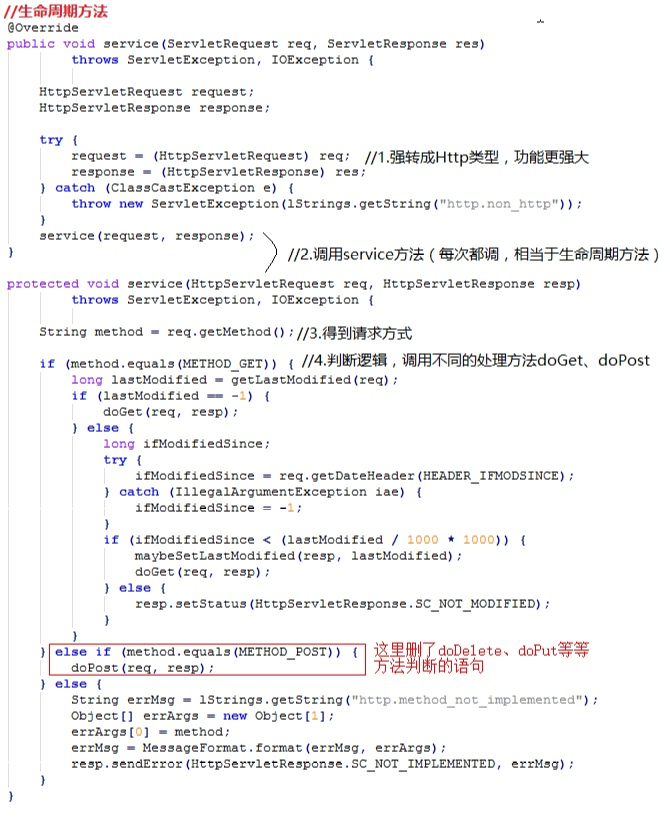
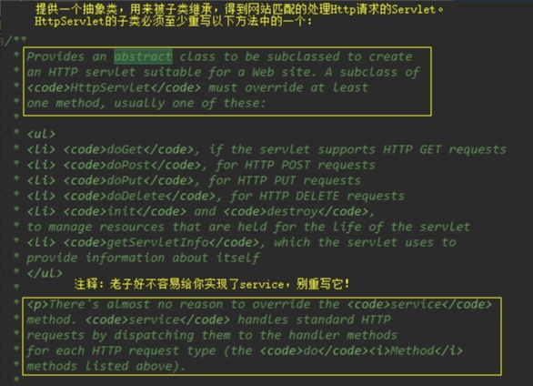
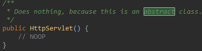
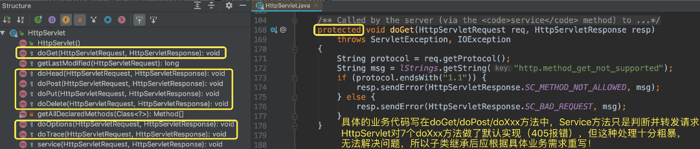
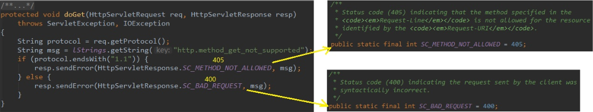
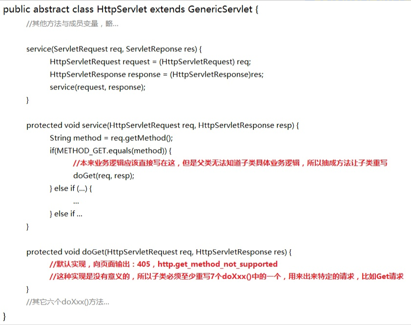
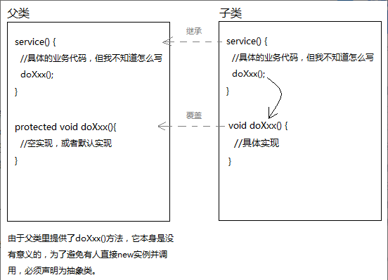

# Servlet

###  什么是Web服务器？ 

 将某个主机上的资源映射为一个URL供外界访问 

###  什么是Servlet容器？ 

 Servlet容器，顾名思义里面存放着Servlet对象。 

###  我们为什么能通过Web服务器映射的URL访问资源？ 

肯定需要写程序处理请求，主要3个过程：

- 接收请求
- 处理请求
- 响应请求


 把接收和响应两个步骤抽取成Web服务器 ,但处理请求的逻辑是不同的。没关系，抽取出来做成Servlet，交给程序员自己编写。

 但处理请求的逻辑是不同的。没关系，抽取出来做成Servlet，交给程序员自己编写。 


### 我所理解的JavaWeb三大组件

 不知道从什么时候开始，我们已经不再关心、甚至根本不知道到底谁调用了我写的这个程序，反正我写了一个类，甚至从来没new过，它就跑起来了... 

 我们把模糊的记忆往前推一推，没错，就是在学了Tomcat后！从Tomcat开始，我们再也没写过main方法。以前，一个main方法启动，程序间的调用井然有序，我们知道程序所有流转过程。 

 但是到了Javaweb后，Servlet/Filter/Listener一路下来我们越学越沮丧。没有main，也没有new，写一个类然后在web.xml中配个标签，它们就这么兀自运行了。 

 其实，这一切的一切，简单来说就是“注入”和“回调”。想象一下吧朋友们，Tomcat里有个main方法，假设是这样的： 


 其实，编程学习越往后越是如此，我们能做的其实很有限。大部分工作，框架都已经帮我们做了。只要我们实现xxx接口，它会帮我们创建实例，然后搬运（接口注入）到它合适的位置，然后一套既定的流程下来，肯定会执行到。  很多时候，框架就像一个傀儡师，我们写的程序是傀儡，顶多就是给傀儡化化妆、打扮打扮，实际的运作全是傀儡师搞的。 

###  如何编写一个Servlet 

 首先，我们心里必须有一个信念：我们都是菜鸡，框架肯定不会让我们写很难的代码。 

 所以Servlet既然交给我们实现，肯定是很简单的！ 

 （没有网络请求和响应需要我们处理，都封装好了！） 

####  javax.servlet接口 


 五个方法，最难的地方在于形参，然而Tomcat会事先把形参对象封装好传给我...除此以外，既不需要我写TCP连接数据库，也不需要我解析HTTP请求，更不需要我把结果转成HTTP响应，request对象和response对象帮我搞定了。 

 看吧，Tomcat是不是把我们当成智障啊。 

 Tomcat之所以放心地交给我们实现，是因为Servlet里主要写的代码都是业务逻辑代码。和原始的、底层的解析、连接等没有丝毫关系。最难的几个操作，人家已经给你封装成形参传进来了。  也就是说，  Servlet虽然是个接口，但实现类只是个空壳，我们写点业务逻辑就好了。 


 总的来说，Tomcat已经替我们完成了所有“菜鸡程序员搞不定的骚操作”，并且传入三个对象：ServletConfig、ServletRequest、ServletResponse。接下来，我们看看这三个传进来都是啥。 

###  ServletConfig 

 翻译过来就是“Servlet配置”。我们在哪配置Servlet来着？web.xml嘛。请问你会用dom4j解析xml得到对象吗？  所以，Tomcat已经帮“菜鸡们”搞掂啦。servletConfig对象封装了servlet的一些参数信息，如果需要，我们可以从它获取。 


###  Request/Response 

 HTTP请求到了Tomcat后，Tomcat通过字符串解析，把各个请求头（Header），请求地址（URL），请求参数（QueryString）都封装进了Request对象中。通过调用 

```java
request.getHeader();
request.getUrl()；
request.getQueryString();
...
```

 等等方法，都可以得到浏览器当初发送的请求信息。 

 至于Response，Tomcat传给Servlet时，它还是空的对象。Servlet逻辑处理后得到结果，最终通过response.write()方法，将结果写入response内部的缓冲区。Tomcat会在servlet处理结束后，拿到response，遍历里面的信息，组装成HTTP响应发给客户端。 


 Servlet接口5个方法，其中init、service、destroy是生命周期方法。init和destroy各自只执行一次，即servlet创建和销毁时。而service会在每次有新请求到来时被调用。也就是说，我们主要的业务代码需要写在service中。 

 但是，浏览器发送请求最基本的有两种：Get/Post，于是我们必须这样写： 


 很烦啊。有没有办法简化这个操作啊？我不想直接实现javax.servlet接口啊。  于是，菜鸡程序员找了下，发现了GenericServlet，是个抽象类 。


 我们发现GenericServlet做了以下改良： 

-  提升了init方法中原本是形参的servletConfig对象的作用域（成员变量），方便其他方法使用 
-  init方法中还调用了一个init空参方法，如果我们希望在servlet创建时做一些什么初始化操作，可以继承GenericServlet后，覆盖init空参方法 
-  由于其他方法内也可以使用servletConfig，于是写了一个getServletContext方法 

 service竟然没实现...要它何用 

 放弃GenericServlet。 

 于是我们继续寻找，又发现了HttpServlet： 


 它继承了GenericServlet。  GenericServlet本身是一个抽象类，有一个抽象方法service。查看源码发现，HttpServlet已经实现了service方法： 



HttpServlet的service方法已经替我们完成了复杂的请求方法判断。  但是，我翻遍整个HttpServlet源码，都没有找出一个抽象方法。所以为什么HttpServlet还要声明成抽象类呢？ 



 一个类声明成抽象方法，一般有两个原因：  

- 有抽象方法 
- HttpServlet做成抽象类，仅仅是为了不让new。 

 HttpServlet做成抽象类，仅仅是为了不让new。 



​																  所以构造方法不做任何事 

它为什么不希望被实例化，且要求子类重写doGet、doPost等方法呢？ 



 															protected修饰，希望子类能重写 

 如果我们没重写会怎样？ 



 浏览器页面会显示：405（http.method_get_not_supported） 。 也就是说，HttpServlet虽然在service中帮我们写了请求方式的判断。但是针对每一种请求，业务逻辑代码是不同的，HttpServlet无法知晓子类想干嘛，所以就抽出七个方法，并且提供了默认实现：报405、400错误，提示请求不支持。  但这种实现本身非常鸡肋，简单来说就是等于没有。所以，不能让它被实例化，不然调用doXxx方法是无用功。 

 Filter用到了责任链模式，Listener用到了观察者模式，Servlet也不会放过使用设计模式的机会：模板方法模式。上面的就是。 



 父类把能写的逻辑都写完，把不确定的业务代码抽成一个方法，调用它。当子类重写该方法，整个业务代码就活了。这就是模板方法模式 。

