# Servlet（下）

 ServletContext直接关系到SpringIOC容器的初始化 

 Servlet映射规则与SpringMVC关系密切 

 Tomcat和Spring什么关系？SpringMVC和Servlet什么关系？ 

 我会先把SpringMVC讲得很简单，等大家觉得它就是个Servlet的时候，我又会把SpringMVC慢慢展开，露出它的全貌。此时你又会发现：SpringMVC is not only a Servlet. 

- ServletContext是什么
- 如何获取ServletContext
- Filter拦截方式之：REQUEST/FORWARD/INCLUDE/ERROR
- Servlet映射器
- 自定义DispatcherServlet
- DispatcherServlet与SpringMVC
- conf/web.xml与应用的web.xml

### ServletContext是什么

ServletContext，直译的话叫做“Servlet上下文”，听着挺别扭。它其实就是个大容器，是个map。服务器会为每个应用创建一个ServletContext对象：

- ServletContext对象的创建是在服务器启动时完成的
- ServletContext对象的销毁是在服务器关闭时完成的


 ServletContext对象的作用是在整个Web应用的动态资源（Servlet/JSP）之间共享数据。例如在AServlet中向ServletContext对象保存一个值，然后在BServlet中就可以获取这个值。 


这种用来装载共享数据的对象，在JavaWeb中共有4个，而且更习惯被成为“域对象”：

- ServletContext域（Servlet间共享数据）
- Session域（一次会话间共享数据，也可以理解为多次请求间共享数据）
- Request域（同一次请求共享数据）
- Page域（JSP页面内共享数据）

它们都可以看做是map，都有getAttribute()/setAttribute()方法。


 每一个动态web工程，都应该在WEB-INF下创建一个web.xml，它代表当前整个应用。Tomcat会根据这个配置文	                                                              件创建ServletContext对象

------

### 如何获取ServletContext

 还记得GenericServlet吗？它在init方法中，将Tomcat传入的ServletConfig对象的作用域由局部变量（方法内使用）提升到成员变量。并且新建了一个getServletContext()： 


 									getServletContext()内部其实就是config.getServletContext() 

 也就是说ServletConfig对象可以得到ServletContext对象。但是这并不意味这ServletConfig对象包含着ServletContext对象，而是ServletConfig维系着ServletContext的引用。 

 其实这也很好理解：servletConfig是servletContext的一部分，就像他儿子。你问它父亲是谁，它当然能告诉你。 

 另外，Session域和Request域也可以得到ServletContext 

```text
session.getServletContext();
request.getServletContext();
```


所以，获取ServletContext的方法共5种（page域这里不考虑，JSP太少用了）：

- ServletConfig#getServletContext();
- GenericServlet#getServletContext();
- HttpSession#getServletContext();
- HttpServletRequest#getServletContext();
- ServletContextEvent#getServletContext();

### Filter拦截方式之：REQUEST/FORWARD/INCLUDE/ERROR

 在很多人眼里，Filter只能拦截Request，  这样的理解还是太片面了。 

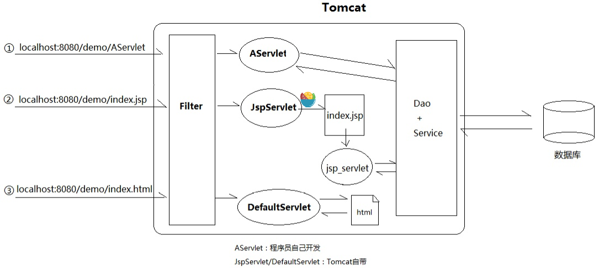

 其实配置Filter时可以设置4种拦截方式： 

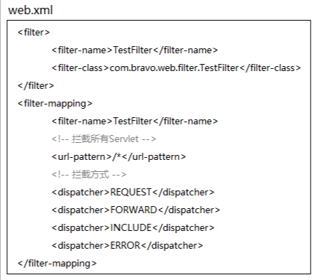

 这里，我先帮大家把这4种方式和重定向（Redirect）剥离开，免得有人搞混，它们是完全两类（前者和Request有关，后者通过Response发起），以FORWARD为例： 

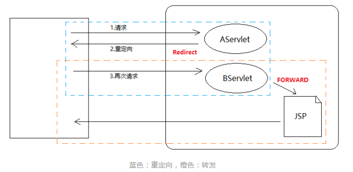

我们日常开发中，FORWARD用的最多的场景就是转发给JSP，然后模板输出HTML。

Redirect和REQUEST/FORWARD/INCLUDE/ERROR最大区别在于：

- 重定向会导致浏览器发送**2**次请求，FORWARD们是服务器内部的**1**次请求


 了解这个区别之后，我提一个很奇怪的问题：为什么这4种只引发1次请求？

是不是听傻了？我接下来给的答案，属于意料之外情理之中的那种：

> 因为FORWARD/INCLUDE等请求的分发是服务器内部的流程，不涉及浏览器

还记得如何转发吗：

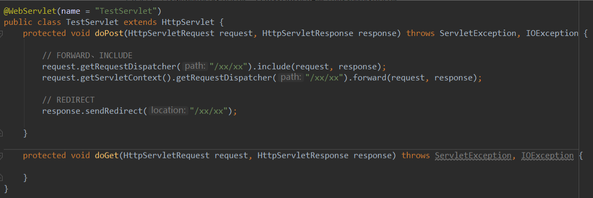

我们发现通过Request或者ServletContext都可以得到分发器Dispatcher，但由于ServletContext代表整个应用，我更倾向于认为：ServletContext拥有分发器，Request是找它借的。

分发器是干嘛的？分发请求：REQUEST/FORWARD/INCLUDE/ERROR。REQUEST是浏览器发起的，而ERROR是发生页面错误时发生的，稍微特殊些。

所以，所谓Filter更详细的拦截其实是这样：

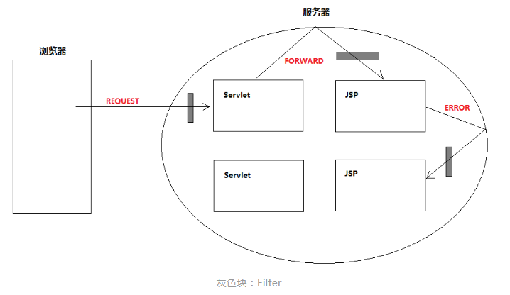

最外层那个圈，可以理解成ServletContext，FORWARD/INCLUDE这些都是内部请求。如果在web.xml中配置Filter时4种拦截方式全配上，那么服务器内部的分发跳转都会被过滤。

当然，这些都是可配置的，默认只拦截REQUEST，也就是浏览器来的那一次。

### **Servlet映射器**

 Servlet的作用就是处理请求。  每一个URL要交给哪个Servlet处理，具体的映射规则都由一个映射器决定： 

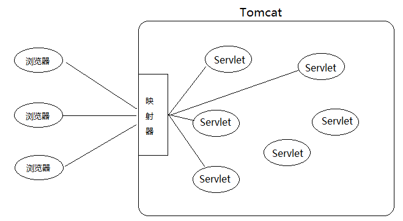

 这所谓的映射器，其实就是Tomcat中一个叫Mapper的类。 

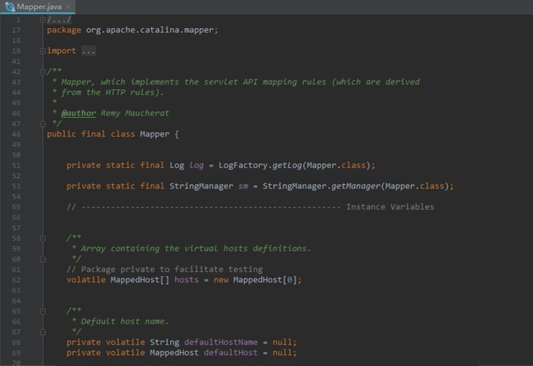

 它里面有个internalMapWrapper方法： 

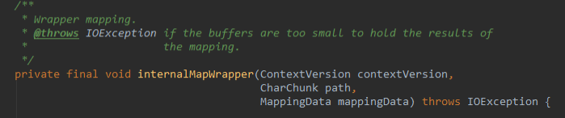

 定义了7种映射规则： 

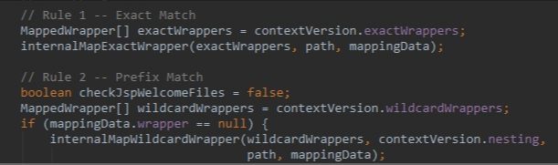

​																	 1.精确匹配 2.前缀匹配 

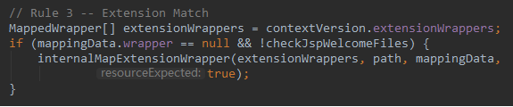

​																			 3.扩展名匹配 

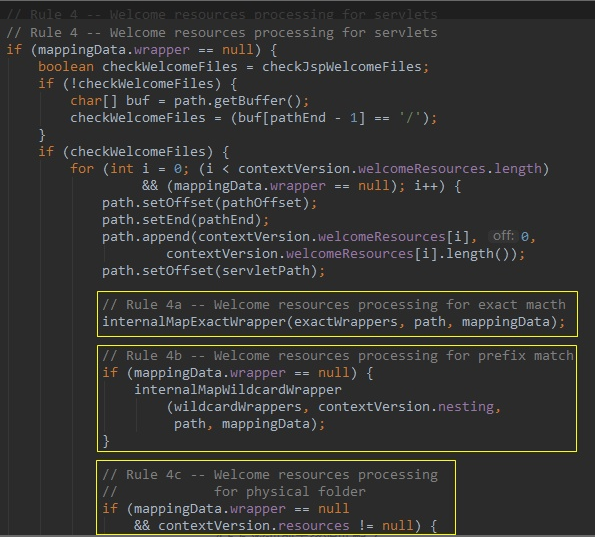

​																		 4.5.6 欢迎列表资源匹配？ 

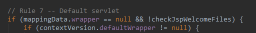

 7.如果上面都不匹配，则交给DefaultServlet，就是简单地用IO流读取静态资源并响应给浏览器。如果资源找不到，报404错误 

 简单来说就是： 

> 对于静态资源，Tomcat最后会交由一个叫做DefaultServlet的类来处理
> 对于Servlet ，Tomcat最后会交由一个叫做 InvokerServlet的类来处理
> 对于JSP，Tomcat最后会交由一个叫做JspServlet的类来处理

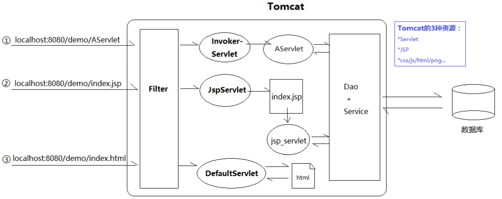

## 自定义DispatcherServlet

web.xml

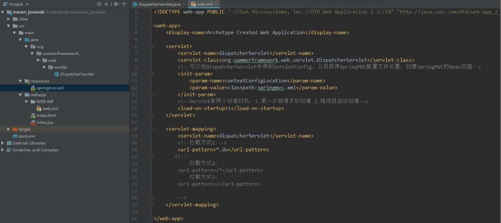

 DispatcherServlet 

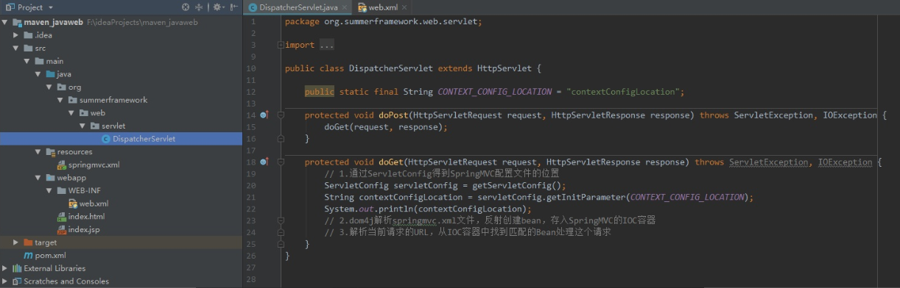

知道了映射器的映射规则后，我们来分析下上图中三种拦截方式会发生什么。

但在此之前，我必须再次强调，我从没说我现在写的是SpringMVC的DispatcherServlet，**这是我自己自定义的一个普通Servlet，**恰好名字叫DispatcherServlet而已。所以，下面的内容，请当做一个普通Servlet的映射分析。

- ***.do：拦截.do结尾**

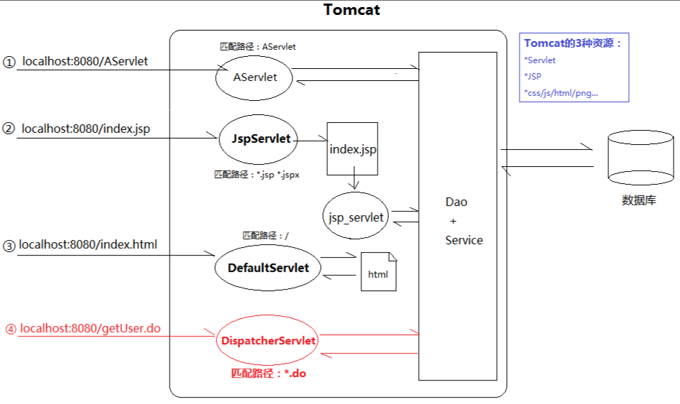

- **/\*：拦截所有**

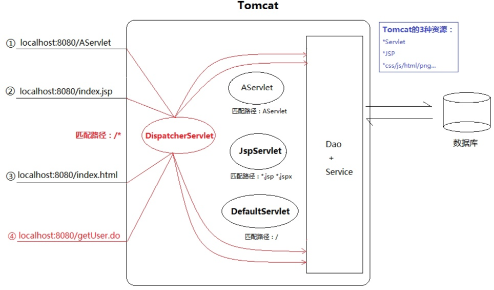

也就是说，/*这种配置，相当于把DefaultServlet、JspServlet以及我们自己写的其他Servlet都“短路”了，它们都失效了。

这会导致**两个问题**：

- JSP无法被编译成Servlet输出HTML片段（JspServlet短路）
- HTML/CSS/JS/PNG等资源无法获取（DefaultServlet短路）


- **/：拦截所有，但不包括JSP**

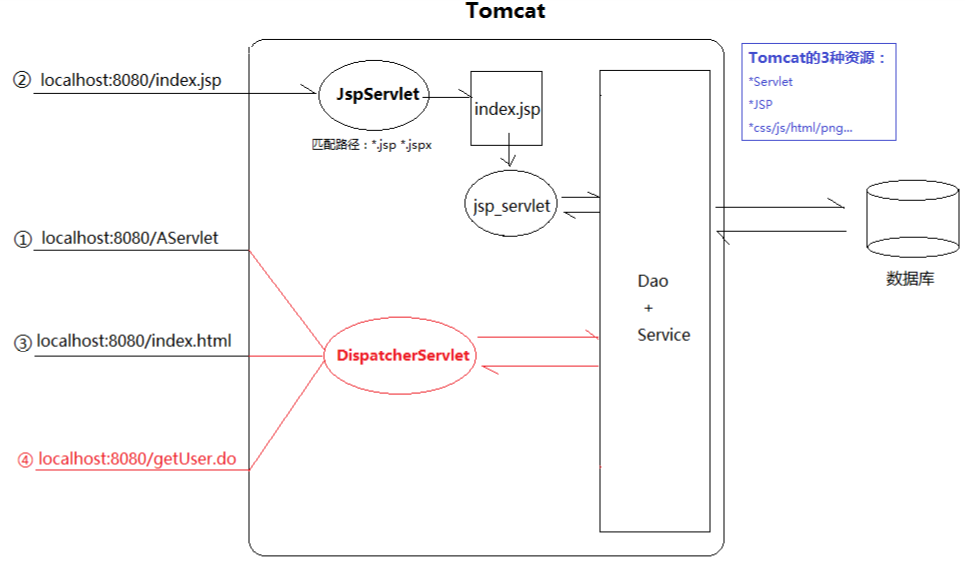

 虽然JSP不拦截了，但是DefaultServlet还是“短路”了。而DispatcherServlet把本属于DefaultServlet的工作也抢过来，却又不会处理（IO读取静态资源返回）。 

### DispatcherServlet与SpringMVC

 SpringMVC的核心控制器叫DispatcherServlet，映射原理和我们上面山寨版的一样，因为本质还是个Servlet。但SpringMVC提供了一个标签，解决上面/无法读取静态资源的问题： 

```text
  <!-- 静态资源处理  css js imgs -->
    <mvc:resources location="/resources/**" mapping="/resources"/>
```

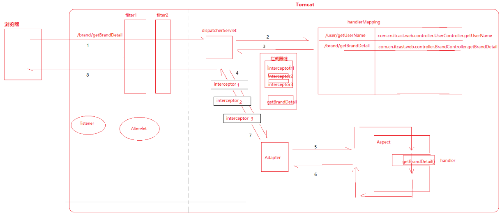

 DispatcherServlet确实是一个Servlet，但它只是入口，SpringMVC要比想象的庞大。 

#### conf/web.xml与应用的web.xml

 conf/web.xml指的是Tomcat全局配置web.xml。 

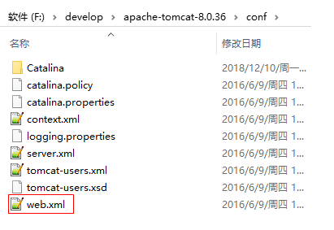

 它里面配置了两个Servlet： 

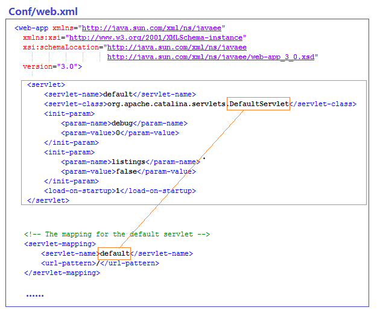

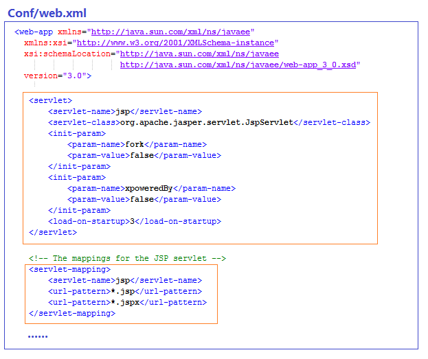

也就是JspServlet和DefaultServlet的映射路径。

我们可以按Java中“继承”的思维理解conf/web.xml：

> conf/web.xml中的配置相当于写在了每一个应用的web.xml中。

相当于每个应用默认都配置了JSPServlet和DefaultServlet处理JSP和静态资源。

如果我们在应用的web.xml中为DispatcherServlet配置/，会和DefaultServlet产生路径冲突，从而覆盖DefaultServlet。此时，所有对静态资源的请求，映射器都会分发给我们自己写的DispatcherServlet处理。遗憾的是，它只写了业务代码，并不能IO读取并返回静态资源。JspServlet的映射路径没有被覆盖，所以动态资源照常响应。

如果我们在应用的web.xml中为DispatcherServlet配置/*，虽然JspServlet和DefaultServlet拦截路径还是.jsp和/，没有被覆盖，但无奈的是在到达它们之前，请求已经被DispatcherServlet抢去，所以最终不仅无法处理JSP，也无法处理静态资源。