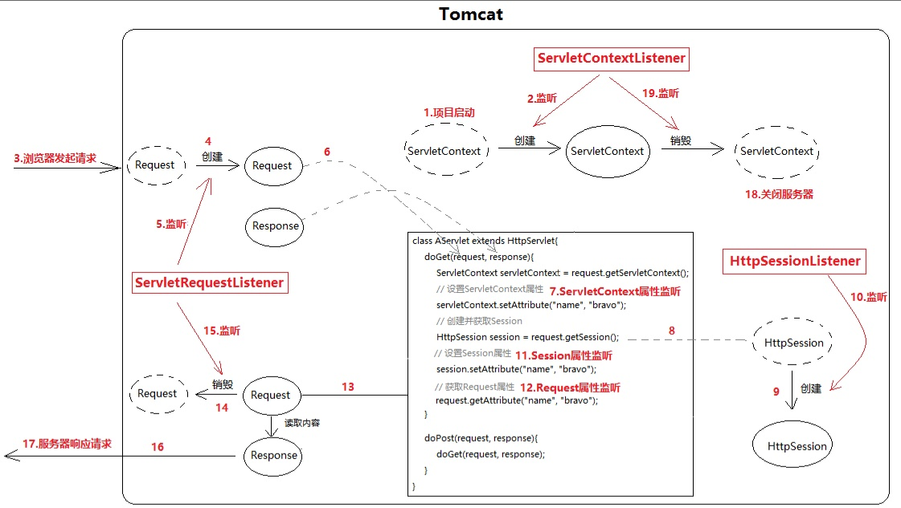
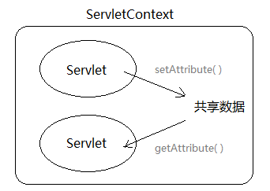
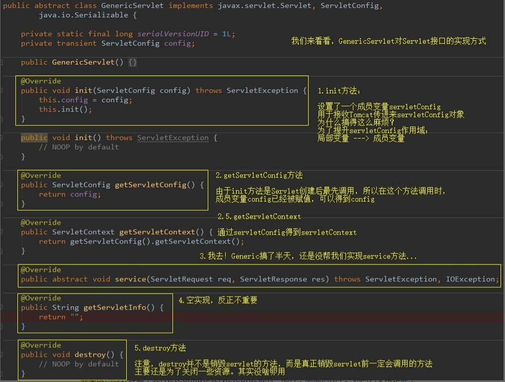
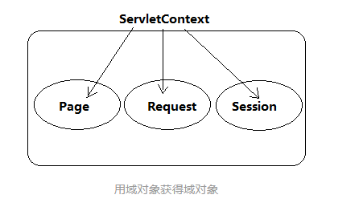

# Servlet（下）

 ServletContext直接关系到SpringIOC容器的初始化 

 Servlet映射规则与SpringMVC关系密切 

 Tomcat和Spring什么关系？SpringMVC和Servlet什么关系？ 

 我会先把SpringMVC讲得很简单，等大家觉得它就是个Servlet的时候，我又会把SpringMVC慢慢展开，露出它的全貌。此时你又会发现：SpringMVC is not only a Servlet. 

- ServletContext是什么
- 如何获取ServletContext
- Filter拦截方式之：REQUEST/FORWARD/INCLUDE/ERROR
- Servlet映射器
- 自定义DispatcherServlet
- DispatcherServlet与SpringMVC
- conf/web.xml与应用的web.xml

### ServletContext是什么

ServletContext，直译的话叫做“Servlet上下文”，听着挺别扭。它其实就是个大容器，是个map。服务器会为每个应用创建一个ServletContext对象：

- ServletContext对象的创建是在服务器启动时完成的
- ServletContext对象的销毁是在服务器关闭时完成的



 ServletContext对象的作用是在整个Web应用的动态资源（Servlet/JSP）之间共享数据。例如在AServlet中向ServletContext对象保存一个值，然后在BServlet中就可以获取这个值。 



这种用来装载共享数据的对象，在JavaWeb中共有4个，而且更习惯被成为“域对象”：

- ServletContext域（Servlet间共享数据）
- Session域（一次会话间共享数据，也可以理解为多次请求间共享数据）
- Request域（同一次请求共享数据）
- Page域（JSP页面内共享数据）

它们都可以看做是map，都有getAttribute()/setAttribute()方法。


 每一个动态web工程，都应该在WEB-INF下创建一个web.xml，它代表当前整个应用。Tomcat会根据这个配置文	                                                              件创建ServletContext对象

------

### 如何获取ServletContext

 还记得GenericServlet吗？它在init方法中，将Tomcat传入的ServletConfig对象的作用域由局部变量（方法内使用）提升到成员变量。并且新建了一个getServletContext()： 



 									getServletContext()内部其实就是config.getServletContext() 

 也就是说ServletConfig对象可以得到ServletContext对象。但是这并不意味这ServletConfig对象包含着ServletContext对象，而是ServletConfig维系着ServletContext的引用。 

 其实这也很好理解：servletConfig是servletContext的一部分，就像他儿子。你问它父亲是谁，它当然能告诉你。 

 另外，Session域和Request域也可以得到ServletContext 

```text
session.getServletContext();
request.getServletContext();
```



所以，获取ServletContext的方法共5种（page域这里不考虑，JSP太少用了）：

- ServletConfig#getServletContext();
- GenericServlet#getServletContext();
- HttpSession#getServletContext();
- HttpServletRequest#getServletContext();
- ServletContextEvent#getServletContext();