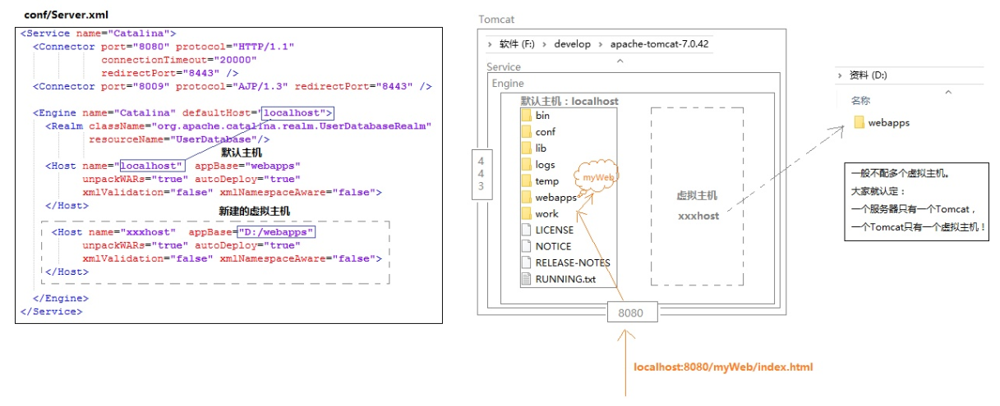
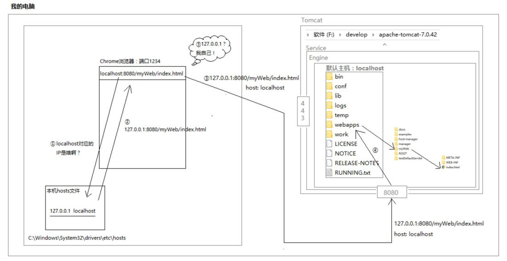
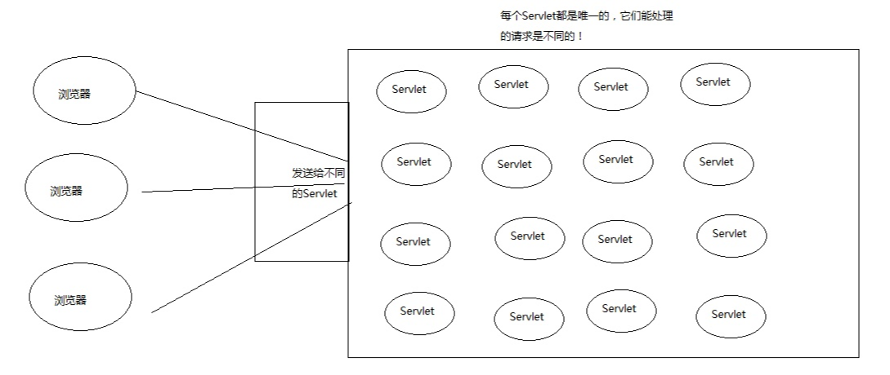
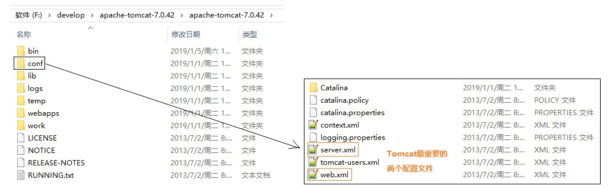
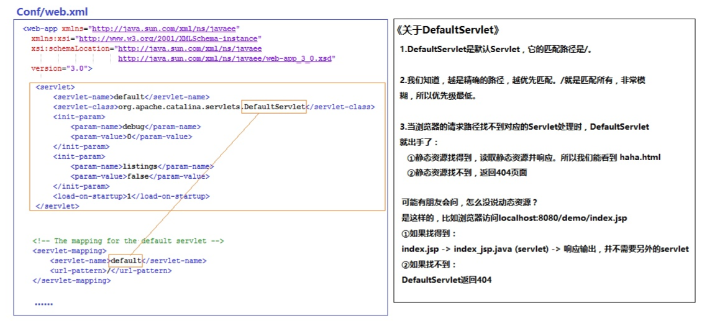
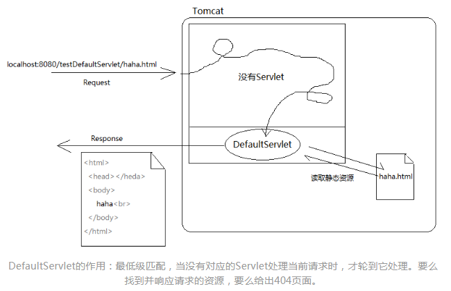
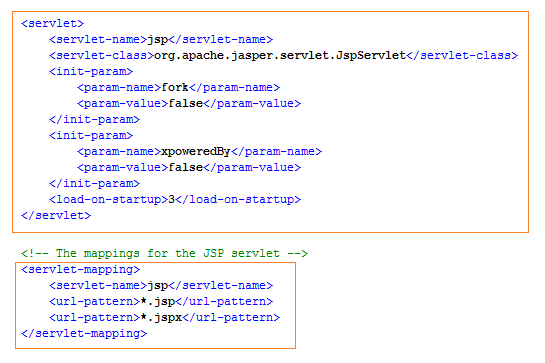
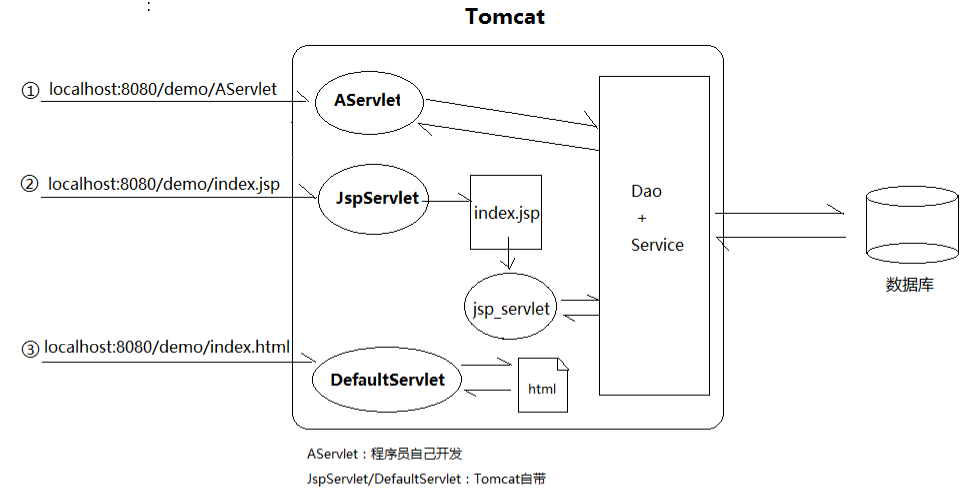
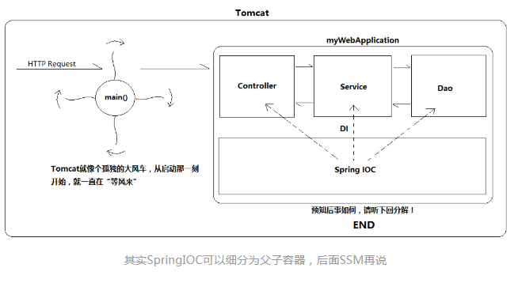

# Tomcat

##### 访问192.168.112.1:8080/demo1/index.html


#####  **我们用Java开发的Web应用只是一个半成品，类似于一个插件**，而服务器则像一个收发器 


#### **Tomcat架构**

#####  Tomcat目录 


#####  Tomcat的架构 


#####  Tomcat的一个配置文件(Server.xml) 


#####  xml里的配置 解释 

- Server.xml文件中的配置结构和Tomcat的架构是一一对应的。根目录是<Server>，代表服务器，<Server>下面有且仅有1个<Service>，代表服务。

- <Service>下有两个<Connector>，代表连接（需要的话可以再加）。
  其实这个Connector就是我们在上面讨论百度服务器时画过的端口。大家可以看到Tomcat默认配置了两个端口，一个是HTTP/1.1协议的，一个是AJP/1.3协议（我也不知道是啥）。前者专门处理HTTP请求。

- 当我们在浏览器输入"http://localhost:8080/demo/index.html"时，浏览器是以HTTP协议发送的，当这个请求到了服务器后，会被识别为HTTP类型，于是服务器就找来专门处理HTTP的Connector，它的默认端口正是上门Server.xml配置的8080。

- 与Connector平级的还有个<Engine>（Tomcat引擎），也就是说<Service>有两个孩子，小儿子是<Connector>，大儿子是<Engine>。Connector的作用说穿了就是监听端口，如果用户访问地址是“localhost:8080/xx/xx”，那就由监听8080端口的Connector负责，如果是"[https://www.baidu.com](https://link.zhihu.com/?target=https%3A//www.baidu.com/)"，那么就是443端口处理。其实Connector也不处理实际业务，它只是个孩子。但**它会负责把客人（请求）带到哥哥Engine那，然后Engine会处理。

- <Engine>下面有个Host，代表主机。





 我们知道，对于像Tomcat这样的Servlet容器来说，任何一个请求的背后肯定有个Servlet在默默处理： 



所以这次也不例外，肯定也有对应的Servlet处理了本次请求。既然不是我们写的，那只能是Tomcat提供的。查看Tomcat下的conf目录，除了我们熟悉的Server.xml，还有个web.xml。



 不错，我们每个动态web工程都有个web.xml，而conf里的这个，是它们的“老爹”。它里面的配置，如果动态web工程没有覆盖，就会被“继承”下来。我们会发现，conf/web.xml里配置了一个DefaultServlet： 





- JspServlet：JSP的卸妆师傅

 我们都知道JSP是“化了浓妆”的Servlet，但是好不容易伪装成了一个JSP，是谁帮它卸妆的呢？另外，大家仔细想想，一般来说JavaWeb阶段我们访问资源有三种“形式”： 

```
localhost:8080/demo/AServlet：很明显，我们手动写了一个AServlet处理它
localhost:8080/demo/haha.html：虽然我们没写，但是Tomcat自己准备了DefaultServlet
localhost:8080/demo/index.jsp：我擦，谁来处理？
```

对呀，细思恐极，这*.jsp的资源，谁来处理？其实就是JspServlet。它的作用简而言之就是：

- 首先，根据请求路径找到JSP
- 然后，将它“翻译成”Servlet


刚才带大家看conf/web.xml时，我把它隐藏了，因为同时讲解DefaultServlet和JspServlet会比较乱。强烈建议大家现在暂停一下，打开本机的Tomcat找到conf/web.xml看一下。下面是JspServlet的配置：



 所以最后总结一下Tomcat处理请求的几种方式： 



### **动手实现"Tomcat"**

最后，还有个很无聊的问题留给大家思考：JavaSE阶段，我们无论做什么，都是上来先敲main()。学了JavaWeb后，我想问问，你有多久没敲main()了？她去哪了呢？

