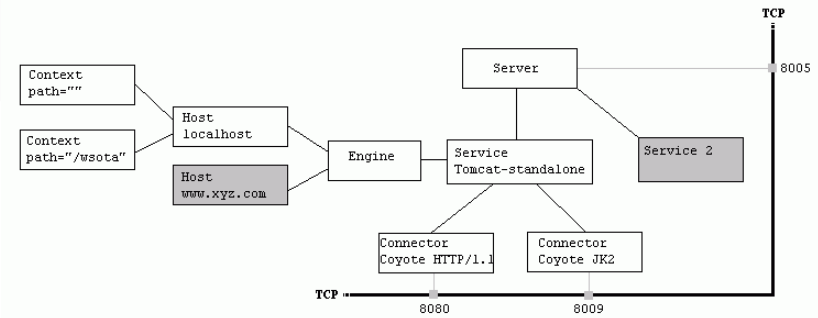

## tomcat中server.xml配置详解

 **Tomcat Server的结构图如下：** 



 该文件描述了如何启动Tomcat Server 

```xml
<Server>
    <Listener />
    <GlobaNamingResources>
    </GlobaNamingResources>
    <Service>
        <Connector />
        <Engine>
            <Logger />
            <Realm />
                <host>
                    <Logger />
                    <Context />
                </host>
        </Engine>
    </Service>
</Server>
```

**<\Server>元素**

它代表整个容器,是Tomcat实例的顶层元素.由org.apache.catalina.Server接口来定义.它包含一个元素.并且它不能做为任何元素的子元素.

```xml
<!--一个“Server”是一个提供完整的JVM的独立组件，它可以包含一个或多个“Service”实例。服务器在指定的端口上监听shutdown命令。-->

 注意：一个“Server”自身不是一个“Container”（容器），因此在这里你
 不可以定义诸如“Valves”或者“Loggers”子组件-->

<!-- 启动Server
 在端口8005处等待关闭命令
 如果接受到"SHUTDOWN"字符串则关闭服务器-->
```

 测试：
telnet localhost 8005
输入：SHUTDOWN
结果：关闭tomcat 

```xml
<Server port="8005" shutdown="SHUTDOWN" debug="0">
1>className指定实现org.apache.catalina.Server接口的类.默认值为org.apache.catalina.core.StandardServer
2>port指定Tomcat监听shutdown命令端口.终止服务器运行时,必须在Tomcat服务器所在的机器上发出shutdown命令.该属性是必须的.
3>shutdown指定终止Tomcat服务器运行时,发给Tomcat服务器的shutdown监听端口的字符串.该属性必须设置 
```

 **<\Service>元素** 

 该元素由org.apache.catalina.Service接口定义,它包含一个元素,以及一个或多个,这些Connector元素共享用同一个Engine元素 

```xml
<!-- 一个“Service”是一个或多个共用一个单独“Container”(容器)的“Connectors”
组合（因此，应用程序在容器中可见）。通常，这个容器是一个“Engine”
（引擎），但这不是必须的。-->

注意：一个“Service”自身不是一个容器，因此，在这个级别上你不可定义
诸如“Valves”或“Loggers”子组件。


Tomcat的Standalone Service
Service是一组Connector的集合
它们共用一个Engine来处理所有Connector收到的请求


**<Service name="Catalina"\>**
**<Service name="Apache"\>**
第一个<Service>处理所有直接由Tomcat服务器接收的web客户请求.
第二个<Service>处理所有由Apahce服务器转发过来的Web客户请求 .
1>className 指定实现org.apahce.catalina.Service接口的类.默认为org.apahce.catalina.core.StandardService
2>name定义Service的名字
```

 **<\Connector>元素** 

 由Connector接口定义.元素代表与客户程序实际交互的给件,它负责接收客户请求,以及向客户返回响应结果. 

```xml
<!-- 一个“Connector”（连接器）代表一个请求被接收和应答所需要的端点。每个连
接器通过相关的“Container”（容器）处理请求。-->

<!-- 默认情况下，一个非SSL的HTTP/1.1的连接器被绑定在端口8080。你也可以通过
根据后面的使用说明并取消第二个连接器入口的注释，在端口8443上建立一个
SSL HTTP/1.1的连接器。开放SSL支持需要下面几步（参见Tomcat 5文档中怎样
配置SSL的说明以取得更多的详细信息）：
    * 如果你的JDK是1.3或1.3以前的版本，下载安装JSSE 1.0.2或以后版本，并放
置JAR文件到“$JAVA_HOME/jre/lib/ext”目录下。
    * 带一个“changeit”的口令值执行：
%JAVA_HOME%\bin\keytool -genkey -alias tomcat -keyalg RSA (Windows)
$JAVA_HOME/bin/keytool -genkey -alias tomcat -keyalg RSA (UNIX)
来生成它自己的证书私钥。

默认情况下，当一个web应用程序调用请求时，DNS查询是可行的。这将对性能造
成一些不利的影响，因此，你可以将“enableLookups”设置为“false”来关闭DNS
查询。当DNS查询被关闭时，request.getRemoteHost()将返回包含远程客户IP地
址的字符串。-->
```

**Coyote HTTP/1.1 Connector**

className : 该Connector的实现类是org.apache.coyote.tomcat4.CoyoteConnector

```xml
port : 在端口号8080处侦听来自客户browser的HTTP1.1请求.如果把8080改成80,则只要输入http://localhost/即可
protocol:设定Http协议,默认值为HTTP/1.1
minSpareThreads: 该Connector先创建5个线程等待客户请求，每个请求由一个线程负责
maxSpareThread:设定在监听端口的线程的最大数目,这个值也决定了服务器可以同时响应客户请求的最大数目.默认值为200
    acceptCount : 当现有线程已经达到最大数75时，为客户请求排队.当队列中请求数超过100时，后来的请求返回Connection refused错误
redirectport : 当客户请求是https时，把该请求转发到端口8443去
   enableLookups:如果设为true,表示支持域名解析,可以把IP地址解析为主机名.WEB应用中调用request.getRemoteHost方法返回客户机主机名.默认值为true
   connectionTimeout:定义建立客户连接超时的时间.如果为-1,表示不限制建立客户连接的时间
allowTrace：是否允许HTTP的TRACE方法，默认为false
emptySessionPath：如果设置为true，用户的所有路径都将设置为/，默认为false。
enableLookups：调用request、getRemoteHost()执行DNS查询，以返回远程主机的主机名，如果设置为false，则直接返回IP地址。
maxPostSize：指定POST方式请求的最大量，没有指定默认为2097152。
protocol：值必须为HTTP1.1，如果使用AJP处理器，该值必须为AJP/1.3
proxyName：如这个连接器正在一个代理配置中被使用，指定这个属性，在request.getServerName()时返回
redirectPort：如连接器不支持SSL请求，如收到SSL请求，Catalina容器将会自动重定向指定的端口号，让其进行处理。
scheme：设置协议的名字，在request.getScheme()时返回，SSL连接器设为”https”，默认为”http”
secure：在SSL连接器可将其设置为true，默认为false
URIEncoding：用于解码URL的字符编码，没有指定默认值为ISO-8859-1
useBodyEncodingForURI：主要用于Tomcat4.1.x中，指示是否使用在contentType中指定的编码来取代URIEncoding，用于解码URI查询参数，默认为false
xpoweredBy：为true时，Tomcat使用规范建议的报头表明支持Servlet的规范版本，默认为false
acceptCount：当所有的可能处理的线程都正在使用时，在队列中排队请求的最大数目。当队列已满，任何接收到的请求都会被拒绝，默认值为10
bufferSize：设由连接器创建输入流缓冲区的大小，以字节为单位。默认情况下，缓存区大的大小为2048字节
compressableMimeType：MIME的列表，默认以逗号分隔。默认值是text/html，text/xml，text/plain
compression：指定是否对响应的数据进行压缩。off：表示禁止压缩、on：表示允许压缩（文本将被压缩）、force：表示所有情况下都进行压缩，默认值为off
connectionTimeout：设置连接的超时值，以毫秒为单位。默认值为60000=60秒
disableUploadTimeOut：允许Servlet容器，正在执行使用一个较长的连接超时值，以使Servlet有较长的时间来完成它的执行，默认值为false
maxHttpHeaderSize：HTTP请求和响应头的最大量，以字节为单位，默认值为4096字节
maxKeepAliveRequest：服务器关闭之前，客户端发送的流水线最大数目。默认值为100
maxSpareThreads：允许存在空闲线程的最大数目，默认值为50
minSpareThreads：设当连接器第一次启协创建线程的数目，确保至少有这么多的空闲线程可用。默认值为4
port：服务端套接字监听的TCP端口号，默认值为8080（必须）
socketBuffer：设Socket输出缓冲区的大小（以字节为单位），-1表示禁止缓冲，默认值为9000字节
toNoDelay：为true时，可以提高性能。默认值为true
threadPriority：设JVM中请求处理线程优先级。默认值为NORMAL-PRIORITY
```

 例： 

```xml
<Connector 
port="8080" maxHttpHeaderSize="8192" maxThreads="150" minSpareThreads="25" maxSpareThreads="75" enableLookups="false"
redirectPort="8443" acceptCount="100" connectionTimeout="20000" disableUploadTimeout="true" />
```

**AJP连接器：**

用于将Apache与Tomcat集成在一起，当Apache接收到动态内容请求时，通过在配置中指定的端口号将请求发送给在此端口号上监听的AJP连接器组件。

#### 属性：

```xml
backlog：当所有可能的请求处理线程都在使用时，队列中排队的请求最大数目。默认为10，当队列已满，任何请求都将被拒绝
maxSpareThread：允许存在空闲线程的最大数目，默认值为50
maxThread：最大线程数，默认值为200
minSpareThreads：设当连接器第一次启动时创建线程的数目，确保至少有这么多的空闲线程可用，默认值为4
port：服务端套接字的TCP端口号，默认值为8089（必须）
topNoDelay：为true时，可以提高性能，默认值为true
soTimeout：超时值
```

 例： 

```xml
<!—Define an AJP1.3 Connector on port 8089-->
<Connector port=”8089” enableLookups=”false” redirectPort=”8443” protocol=”AJP/1.3” />


<Connector port="8080" maxThread="50" minSpareThreads="25" maxSpareThread="75" enableLookups="false" redirectPort="8443" acceptCount="100" debug="0" connectionTimeout="20000" disableUploadTimeout="true" />
<Connection port="8009" enableLookups="false" redirectPort="8443" debug="0" protocol="AJP/1.3" />
```

 **第一个Connector元素定义了一个HTTP Connector,它通过8080端口接收HTTP请求;第二个Connector元素定义了一个JD Connector,它通过8009端口接收由其它服务器转发过来的请求.** 

**<\Engine>元素**

每个Service元素只能有一个Engine元素.处理在同一个中所有元素接收到的客户请求.由org.apahce.catalina.Engine接口定义.

```xml
<!-- 一个“Engine”（引擎）代表处理每个请求的入口点（在Catalina内）。这个Tomcat
         的标准独立引擎实现分析包含在请求中的HTTP头信息，并将请求传送到适当的主机
         或虚拟主机上。-->
<!-- Engine用来处理Connector收到的Http请求
         它将匹配请求和自己的虚拟主机，并把请求转交给对应的Host来处理
         默认虚拟主机是localhost
         -->

<Engine name="Catalina" defaultHost="localhost" debug="0">
1>className指定实现Engine接口的类,默认值为StandardEngine
2>defaultHost指定处理客户的默认主机名,在<Engine>中的<Host>子元素中必须定义这一主机
3>name定义Engine的名字
在<Engine>可以包含如下元素<Logger>, <Realm>, <Value>, <Host>
```

 **<\Host>元素** 

 它由Host接口定义.一个Engine元素可以包含多个元素.每个的元素定义了一个虚拟主机.它包含了一个或多个Web应用. 

```xml
<!-- 定义默认的虚拟主机
           注意：XML模式确认将不能与Xerces 2.2同工作。
      -->


<!-- 虚拟主机localhost
           appBase : 指 定虚拟主机的目录,可以指定绝对目录,也可以指定相对于<CATALINA_HOME>的相对目录.如果没有此项,默认 为<CATALINA_HOME>/webapps. 它将匹配请求和自己的Context的路径，并把请求转交给对应的Context来处 理
              autoDeploy:如果此项设为true,表示Tomcat服务处于运行状态时,能够监测appBase下的文件,如果有新有web应用加入进来,会自运发布这个WEB应用
              unpackWARs:如果此项设置为true,表示把WEB应用的WAR文件先展开为开放目录结构后再运行.如果设为false将直接运行为WAR文件
              alias:指定主机别名,可以指定多个别名
              deployOnStartup:如果此项设为true,表示Tomcat服务器启动时会自动发布appBase目录下所有的Web应用.如果Web应用 中的server.xml没有相应的<Context>元素,将采用Tomcat默认的Context
           -->

<Host name="localhost" debug="0" appBase="webapps" unpackWARs="true" autoDeploy="true">
在<Host>元素中可以包含如下子元素
<Logger>, <Realm>, <Value>, <Context>
```

**<\Context>元素**

它由Context接口定义.是使用最频繁的元素.每个可以包含多个元素.每个web应用有唯一
的一个相对应的Context代表web应用自身.servlet容器为第一个web应用创建一个

```xml
<!-- Context，对应于一个Web App
             path : 该Context的路径名是""，故该Context是该Host的默认Context
             docBase : 该Context的根目录是webapps/mycontext/
                reloadable:如果这个属性设为true, Tomcat服务器在运行状态下会监视在WEB-INF/classes和Web-INF/lib目录CLASS文件的改运.如果监视到有class文件 被更新,服务器自重新加载Web应用
                useNaming:指定是否支持JNDI,默认值为了true 
                cookies指定是否通过Cookies来支持Session,默认值为true
             -->

<Context path="" docBase="mycontext" debug="0"/>
```

**Tomcat Server处理一个http请求的过程**

假设来自客户的请求为：http://localhost:8080/wsota/wsota_index.jsp

- 1) 请求被发送到本机端口8080，被在那里侦听的Coyote HTTP/1.1 Connector获得
- 2) Connector把该请求交给它所在的Service的Engine来处理，并等待来自Engine的回应
- 3) Engine获得请求localhost/wsota/wsota_index.jsp，匹配它所拥有的所有虚拟主机Host
- 4) Engine匹配到名为localhost的Host（即使匹配不到也把请求交给该Host处理，因为该Host被定义为该Engine的默认主机）
- 5) localhost Host获得请求/wsota/wsota_index.jsp，匹配它所拥有的所有Context
- 6) Host匹配到路径为/wsota的Context（如果匹配不到就把该请求交给路径名为""的Context去处理）
- 7) path="/wsota"的Context获得请求/wsota_index.jsp，在它的mapping table中寻找对应的servlet
- 8) Context匹配到URL PATTERN为*.jsp的servlet，对应于JspServlet类
- 9) 构造HttpServletRequest对象和HttpServletResponse对象，作为参数调用JspServlet的doGet或doPost方法
- 10)Context把执行完了之后的HttpServletResponse对象返回给Host
- 11)Host把HttpServletResponse对象返回给Engine
- 12)Engine把HttpServletResponse对象返回给Connector
- 13)Connector把HttpServletResponse对象返回给客户browser