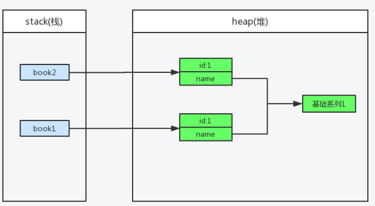
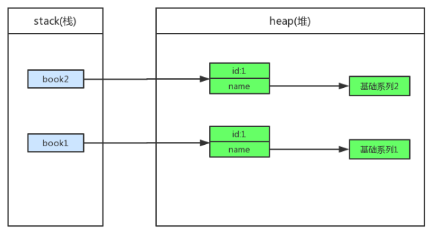
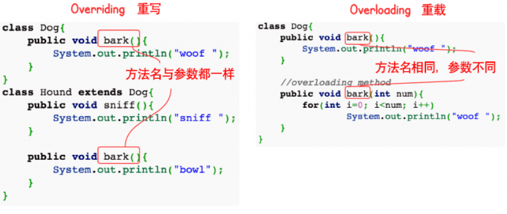

# 一、基本概念


## 1. Java程序初始化的顺序是怎么样的

　　在 Java 语言中，当实例化对象时，对象所在类的所有成员变量首先要进行初始化，只有当所有类成员完成初始化后，才会调用对象所在类的构造函数创建象。

**初始化一般遵循3个原则：**

- 静态对象（变量）优先于非静态对象（变量）初始化，静态对象（变量）只初始化一次，而非静态对象（变量）可能会初始化多次；
- 父类优先于子类进行初始化；
- 按照成员变量的定义顺序进行初始化。 即使变量定义散布于方法定义之中，它们依然在任何方法（包括构造函数）被调用之前先初始化；

**加载顺序**

- 父类（静态变量、静态语句块）
- 子类（静态变量、静态语句块）
- 父类（实例变量、普通语句块）
- 父类（构造函数）
- 子类（实例变量、普通语句块）
- 子类（构造函数）

**实例**

```java
class Base {
    // 1.父类静态代码块
    static {
        System.out.println("Base static block!");
    }
    // 3.父类非静态代码块
    {
        System.out.println("Base block");
    }
    // 4.父类构造器
    public Base() {
        System.out.println("Base constructor!");
    }
}

public class Derived extends Base {
    // 2.子类静态代码块
    static{
        System.out.println("Derived static block!");
    }
    // 5.子类非静态代码块
    {
        System.out.println("Derived block!");
    }
    // 6.子类构造器
    public Derived() {
        System.out.println("Derived constructor!");
    }
    public static void main(String[] args) {
        new Derived();
    }
}
```

结果是：

```
Base static block!
Derived static block!
Base block
Base constructor!
Derived block!
Derived constructor!
```

## 3. 反射

### 先看一个知乎回答

　　首先看一个在知乎上的优秀回答吧：

　　反射是什么呢？当我们的程序在运行时，需要动态的加载一些类这些类可能之前用不到所以不用加载到 JVM，而是在运行时根据需要才加载，这样的好处对于服务器来说不言而喻。

　　举个例子我们的项目底层有时是用 mysql，有时用 oracle，需要动态地根据实际情况加载驱动类，这个时候反射就有用了，假设 com.java.dbtest.myqlConnection，com.java.dbtest.oracleConnection 这两个类我们要用，这时候我们的程序就写得比较动态化，通过 Class tc = Class.forName("com.java.dbtest.TestConnection"); 通过类的全类名让 JVM 在服务器中找到并加载这个类，而如果是 Oracle 则传入的参数就变成另一个了。这时候就可以看到反射的好处了，这个动态性就体现出 Java 的特性了！

　　举多个例子，大家如果接触过 spring，会发现当你配置各种各样的 bean 时，是以配置文件的形式配置的，你需要用到哪些 bean 就配哪些，spring 容器就会根据你的需求去动态加载，你的程序就能健壮地运行。

### 什么是反射

　　反射 (Reflection) 是 Java 程序开发语言的特征之一，它允许运行中的 Java 程序获取自身的信息，并且可以操作类或对象的内部属性。通过 Class 获取 class 信息称之为反射（Reflection）

　　简而言之，通过反射，我们可以在运行时获得程序或程序集中每一个类型的成员和成员的信息。

　　程序中一般的对象的类型都是在编译期就确定下来的，而 Java 反射机制可以动态地创建对象并调用其属性，这样的对象的类型在编译期是未知的。所以我们可以通过反射机制直接创建对象，即使这个对象的类型在编译期是未知的。

　　反射的核心是 JVM 在运行时才动态加载类或调用方法/访问属性，它不需要事先（写代码的时候或编译期）知道运行对象是谁。

　　Java 反射框架主要提供以下功能：

　　1. 在运行时判断任意一个对象所属的类

　　2. 在运行时构造任意一个类的对象

　　3. 在运行时判断任意一个类所具有的成员变量和方法（通过反射甚至可以调用 private 方法）

　　4. 在运行时调用任意一个对象的方法

　　**重点**：是运行时而不是编译时

### 主要用途

　　很多人都认为反射在实际的 Java 开发应用中并不广泛，其实不然。

当我们在使用 IDE （如Eclipse，IDEA）时，当我们输入一个对象或类并想调用它的属性或方法时，一按点号，编译器就会自动列出它的属性或方法，这里就会用到反射。

　　**反射最重要的用途就是开发各种通用框架**

　　很多框架（比如 Spring ）都是配置化的（比如通过 XML 文件配置 JavaBean,Action 之类的），为了保证框架的通用性，它们可能需要根据配置文件加载不同的对象或类，调用不同的方法，这个时候就必须用到反射——运行时动态加载需要加载的对象。

　　对与框架开发人员来说，反射虽小但作用非常大，它是各种容器实现的核心。而对于一般的开发者来说，不深入框架开发则用反射用的就会少一点，不过了解一下框架的底层机制有助于丰富自己的编程思想，也是很有益的。

### 获得Class对象

1. 调用运行时类本身的 `.class` 属性

   ```java
   Class clazz1 = Person.class;
   System.out.println(clazz1.getName());
   ```

2. 通过运行时类的对象获取 `getClass();`

   ```java
   Person p = new Person();
   Class clazz3 = p.getClass();
   System.out.println(clazz3.getName());
   ```

3. 使用 Class 类的 `forName` 静态方法

   ```java
   public static Class<?> forName(String className)
   // 在JDBC开发中常用此方法加载数据库驱动:
   Class.forName(driver);
   ```

4. （了解）通过类的加载器 ClassLoader

   ```java
   ClassLoader classLoader = this.getClass().getClassLoader();
   Class clazz5 = classLoader.loadClass(className);
   System.out.println(clazz5.getName());
   ```

参考资料：

- [深入解析Java反射（1） - 基础 | 「浮生若梦」 - sczyh30's blog](https://www.sczyh30.com/posts/Java/java-reflection-1/#一、回顾：什么是反射？)
- [学习java应该如何理解反射？ - 知乎](https://www.zhihu.com/question/24304289/answer/147529485)

## 4. 注解

### 什么是注解

　　Annontation 是 Java5 开始引入的新特征，中文名称叫注解。它提供了一种安全的类似注释的机制，用来**将任何的信息或元数据（metadata）与程序元素（类、方法、成员变量等）进行关联**。为程序的元素（类、方法、成员变量）加上更直观更明了的说明，这些说明信息是与程序的业务逻辑无关，并且供指定的工具或框架使用。Annontation 像一种修饰符一样，应用于包、类型、构造方法、方法、成员变量、参数及本地变量的声明语句中。

　　Java 注解是附加在代码中的一些元信息，用于一些工具在编译、运行时进行解析和使用，起到说明、配置的功能。注解不会也不能影响代码的实际逻辑，仅仅起到辅助性的作用。包含在 `java.lang.annotation` 包中。

　　简单来说：注解其实就是**代码中的特殊标记**，这些标记可以**在编译、类加载、运行时被读取，并执行相对应的处理**。

### 为什么要用注解

传统的方式，我们是通过配置文件 `.xml` 来告诉类是如何运行的。

有了注解技术以后，我们就可以通过注解告诉类如何运行

例如：我们以前编写 Servlet 的时候，需要在 web.xml 文件配置具体的信息。我们使用了注解以后，可以直接在 Servlet 源代码上，增加注解...Servlet 就被配置到 Tomcat 上了。也就是说，注解可以给类、方法上注入信息。

明显地可以看出，这样是非常直观的，并且 Servlet 规范是推崇这种配置方式的。

### 基本Annotation

在 java.lang 包下存在着5个基本的 Annotation，重点掌握前三个。

1. @Override 重写注解
   - 如果我们使用IDE重写父类的方法，我们就可以看见它了。
   - @Override是告诉编译器要检查该方法是实现父类的，可以帮我们避免一些低级的错误。
   - 比如，我们在实现 equals() 方法的时候，把 euqals() 打错了，那么编译器就会发现该方法并不是实现父类的，与注解 @Override 冲突，于是就会给予错误。
2. @Deprecated 过时注解
   - 该注解也非常常见，Java 在设计的时候，可能觉得某些方法设计得不好，为了兼容以前的程序，是不能直接把它抛弃的，于是就设置它为过时。
   - Date对象中的 toLocalString() 就被设置成过时了
   - 当我们在程序中调用它的时候，在 IDE 上会出现一条横杠，说明该方法是过时的。

```java
@Deprecated
public String toLocaleString() {
    DateFormat formatter = DateFormat.getDateTimeInstance();
    return formatter.format(this);
}
```

1. @SuppressWarnings 抑制编译器警告注解
   - 该注解在我们写程序的时候并不是很常见，我们可以用它来让编译器不给予我们警告
   - 当我们在使用集合的时候，如果没有指定泛型，那么会提示安全检查的警告
   - 如果我们在类上添加了@SuppressWarnings这个注解，那么编译器就不会给予我们警告了
2. @SafeVarargs Java 7“堆污染”警告
   - 什么是堆污染呢？？当把一个不是泛型的集合赋值给一个带泛型的集合的时候，这种情况就很容易发生堆污染。
   - 这个注解也是用来抑制编译器警告的注解，用的地方并不多。
3. @FunctionalInterface 用来指定该接口是函数式接口
   - 用该注解显式指定该接口是一个函数式接口。

### 自定义注解类编写规则

1. Annotation 型定义为 @interface, 所有的 Annotation 会自动继承 java.lang.Annotation 这一接口，并且不能再去继承别的类或是接口.
2. 参数成员只能用 public 或默认(default)这两个访问权修饰
3. 参数成员只能用基本类型 byte,short,char,int,long,float,double,boolean 八种基本数据类型和 String、Enum、Class、annotations 等数据类型，以及这一些类型的数组
4. 要获取类方法和字段的注解信息，必须通过 Java 的反射技术来获取 Annotation 对象，因为你除此之外没有别的获取注解对象的方法
5. 注解也可以没有定义成员, 不过这样注解就没啥用了 PS：自定义注解需要使用到元注解

### 自定义注解实例

```java
import java.lang.annotation.Documented;
import java.lang.annotation.Retention;
import java.lang.annotation.Target;
import static java.lang.annotation.ElementType.FIELD;
import static java.lang.annotation.RetentionPolicy.RUNTIME;

/**
 * 水果名称注解
 */
@Target(FIELD)
@Retention(RUNTIME)
@Documented
public @interface FruitName {
    String value() default "";
}
```

参考资料：[注解Annotation实现原理与自定义注解例子](https://www.cnblogs.com/acm-bingzi/p/javaAnnotation.html)

## 5. 泛型

### 通俗解释

　　通俗的讲，泛型就是操作类型的 占位符，即：假设占位符为 T，那么此次声明的数据结构操作的数据类型为T类型。

　　假定我们有这样一个需求：写一个排序方法，能够对整型数组、字符串数组甚至其他任何类型的数组进行排序，该如何实现？答案是可以使用 **Java 泛型**。

　　使用 Java 泛型的概念，我们可以写一个泛型方法来对一个对象数组排序。然后，调用该泛型方法来对整型数组、浮点数数组、字符串数组等进行排序。

### 泛型方法

　　你可以写一个泛型方法，该方法在调用时可以接收不同类型的参数。根据传递给泛型方法的参数类型，编译器适当地处理每一个方法调用。

下面是定义泛型方法的规则：

- 所有泛型方法声明都有一个类型参数声明部分（由尖括号分隔），该类型参数声明部分在方法返回类型之前（在下面例子中的 <E>）。
- 每一个类型参数声明部分包含一个或多个类型参数，参数间用逗号隔开。一个泛型参数，也被称为一个类型变量，是用于指定一个泛型类型名称的标识符。
- 类型参数能被用来声明返回值类型，并且能作为泛型方法得到的实际参数类型的占位符。
- 泛型方法体的声明和其他方法一样。注意类型参数 **只能代表引用型类型，不能是原始类型** （像 int,double,char 的等）。

```java
public class GenericMethodTest
{
   // 泛型方法 printArray                         
   public static < E > void printArray( E[] inputArray )
   {
      // 输出数组元素            
         for ( E element : inputArray ){        
            System.out.printf( "%s ", element );
         }
         System.out.println();
    }
 
    public static void main( String args[] )
    {
        // 创建不同类型数组： Integer, Double 和 Character
        Integer[] intArray = { 1, 2, 3, 4, 5 };
        Double[] doubleArray = { 1.1, 2.2, 3.3, 4.4 };
        Character[] charArray = { 'H', 'E', 'L', 'L', 'O' };
 
        System.out.println( "整型数组元素为:" );
        printArray( intArray  ); // 传递一个整型数组
 
        System.out.println( "\n双精度型数组元素为:" );
        printArray( doubleArray ); // 传递一个双精度型数组
 
        System.out.println( "\n字符型数组元素为:" );
        printArray( charArray ); // 传递一个字符型数组
    } 
}
```

### 泛型类

　　泛型类的声明和非泛型类的声明类似，除了在类名后面添加了类型参数声明部分。

　　和泛型方法一样，泛型类的类型参数声明部分也包含一个或多个类型参数，参数间用逗号隔开。一个泛型参数，也被称为一个类型变量，是用于指定一个泛型类型名称的标识符。因为他们接受一个或多个参数，这些类被称为参数化的类或参数化的类型。

```java
public class Box<T> {
	private T t;
	public void add(T t) {
	    this.t = t;
	}

	public T get() {
	    return t;
	}

	public static void main(String[] args) {
	    Box<Integer> integerBox = new Box<Integer>();
	    Box<String> stringBox = new Box<String>();

	    integerBox.add(new Integer(10));
	    stringBox.add(new String("菜鸟教程"));

	    System.out.printf("整型值为 :%d\n\n", integerBox.get());
	    System.out.printf("字符串为 :%s\n", stringBox.get());
	}
}
```

### 类型通配符

1. 类型通配符一般是使用 `?` 代替具体的类型参数。例如 `List<?>` 在逻辑上是 `List<String>`，`List<Integer>` 等所有 **List<具体类型实参>** 的父类。
2. 类型通配符上限通过形如 List 来定义，如此定义就是通配符泛型值接受 Number 及其下层子类类型。
3. 类型通配符下限通过形如 List<? super Number> 来定义，表示类型只能接受 Number 及其三层父类类型，如 Objec 类型的实例。

参考资料：

- [Java 泛型，了解这些就够用了。 - 逃离沙漠 - 博客园](https://www.cnblogs.com/demingblog/p/5495610.html)
- [Java 泛型 | 菜鸟教程](http://www.runoob.com/java/java-generics.html)
- [【Java心得总结四】Java泛型下——万恶的擦除 - xlturing - 博客园](https://www.cnblogs.com/xltcjylove/p/3671943.html)

## 6. 字节与字符的区别

理解编码的关键，是要把字符的概念和字节的概念理解准确。这两个概念容易混淆，我们在此做一下区分：

| 类型           | **概念描述**                                                 | **举例**                      |
| -------------- | ------------------------------------------------------------ | ----------------------------- |
| 字符           | 人们使用的记号，抽象意义上的一个符号。                       | '1', '中', 'a', '$', '￥', …… |
| 字节           | 计算机中存储数据的单元，一个 8 位的二进制数，是一个很具体的存储空间。 | 0x01, 0x45, 0xFA, ……          |
| ANSI 字符串    | 在内存中，如果“字符”是以 **ANSI 编码**形式存在的，一个字符可能使用一个字节或多个字节来表示，那么我们称这种字符串为 **ANSI 字符串**或者**多字节字符串**。 | "中文123" （占7字节）         |
| UNICODE 字符串 | 在内存中，如果“字符”是以在 UNICODE 中的序号存在的，那么我们称这种字符串为 **UNICODE 字符串**或者**宽字节字符串**。 | L"中文123" （占10字节）       |

**字节与字符区别**

它们完全不是一个位面的概念，所以两者之间没有“区别”这个说法。不同编码里，字符和字节的对应关系不同：

| 类型    | **概念描述**                                                 |
| ------- | ------------------------------------------------------------ |
| ASCII   | 一个英文字母（不分大小写）占一个字节的空间，一个中文汉字占两个字节的空间。一个二进制数字序列，在计算机中作为一个数字单元，一般为 8 位二进制数，换算为十进制。最小值 0，最大值 255。 |
| UTF-8   | 一个英文字符等于一个字节，一个中文（含繁体）等于三个字节     |
| Unicode | 一个英文等于两个字节，一个中文（含繁体）等于两个字节。符号：英文标点占一个字节，中文标点占两个字节。举例：英文句号“.”占 1 个字节的大小，中文句号“。”占 2 个字节的大小。 |
| UTF-16  | 一个英文字母字符或一个汉字字符存储都需要 2 个字节（Unicode扩展区的一些汉字存储需要4个字节） |
| UTF-32  | 世界上任何字符的存储都需要 4 个字节                          |

参考资料：

- [字符，字节和编码 - Characters, Bytes And Encoding](http://www.regexlab.com/zh/encoding.htm)

## 7. 有哪些访问修饰符

Java 面向对象的基本思想之一是封装细节并且公开接口。Java 语言采用访问控制修饰符来控制类及类的方法和变量的访问权限，从而向使用者暴露接口，但隐藏实现细节。访问控制分为四种级别：

| 修饰符    | 当前类 | 同 包 | 子 类 | 其他包 |
| --------- | ------ | ----- | ----- | ------ |
| public    | √      | √     | √     | √      |
| protected | √      | √     | √     | ×      |
| default   | √      | √     | ×     | ×      |
| private   | √      | ×     | ×     | ×      |

- 类的成员不写访问修饰时默认为 default。默认对于同一个包中的其他类相当于公开（public），对于不是同一个包中的其他类相当于私有（private）。
- 受保护（protected）对子类相当于公开，对不是同一包中的没有父子关系的类相当于私有。
- Java 中，外部类的修饰符只能是 public 或默认，类的成员（包括内部类）的修饰符可以是以上四种。

## 8. 深拷贝与浅拷贝

- **浅拷贝**：被复制对象的所有变量都含有与原来的对象相同的值，而所有的对其他对象的引用仍然指向原来的对象。换言之，浅拷贝仅仅复制所拷贝的对象，而不复制它所引用的对象。



**深拷贝**：对基本数据类型进行值传递，对引用数据类型，创建一个新的对象，并复制其内容，此为深拷贝。



参考资料：

- [细说 Java 的深拷贝和浅拷贝 - 承香墨影 - SegmentFault 思否](https://segmentfault.com/a/1190000010648514)
- [（基础系列）object clone 的用法、原理和用途 - 掘金](

## 9.Lamda表达式

Lambda 表达式，也可称为闭包，它是推动 Java 8 发布的最重要新特性。

Lambda 允许把函数作为一个方法的参数（函数作为参数传递进方法中）。

使用 Lambda 表达式可以使代码变的更加简洁紧凑。

### 语法

lambda 表达式的语法格式如下：

```java
(parameters) -> expression
或
(parameters) -> { statements; }
```

以下是 lambda 表达式的重要特征:

- **可选类型声明：**不需要声明参数类型，编译器可以统一识别参数值。
- **可选的参数圆括号：**一个参数无需定义圆括号，但多个参数需要定义圆括号。
- **可选的大括号：**如果主体包含了一个语句，就不需要使用大括号。
- **可选的返回关键字：**如果主体只有一个表达式返回值则编译器会自动返回值，大括号需要指定明表达式返回了一个数值。

### Lambda 表达式实例

Lambda 表达式的简单例子:

```java
// 1. 不需要参数,返回值为 5  
() -> 5  
  
// 2. 接收一个参数(数字类型),返回其2倍的值  
x -> 2 * x  
  
// 3. 接受2个参数(数字),并返回他们的差值  
(x, y) -> x – y  
  
// 4. 接收2个int型整数,返回他们的和  
(int x, int y) -> x + y  
  
// 5. 接受一个 string 对象,并在控制台打印,不返回任何值(看起来像是返回void)  
(String s) -> System.out.print(s)
```

在 Java8Tester.java 文件输入以下代码：

```java
public class Java8Tester {
   public static void main(String args[]){
      Java8Tester tester = new Java8Tester();
        
      // 类型声明
      MathOperation addition = (int a, int b) -> a + b;
        
      // 不用类型声明
      MathOperation subtraction = (a, b) -> a - b;
        
      // 大括号中的返回语句
      MathOperation multiplication = (int a, int b) -> { return a * b; };
        
      // 没有大括号及返回语句
      MathOperation division = (int a, int b) -> a / b;
        
      System.out.println("10 + 5 = " + tester.operate(10, 5, addition));
      System.out.println("10 - 5 = " + tester.operate(10, 5, subtraction));
      System.out.println("10 x 5 = " + tester.operate(10, 5, multiplication));
      System.out.println("10 / 5 = " + tester.operate(10, 5, division));
        
      // 不用括号
      GreetingService greetService1 = message ->
      System.out.println("Hello " + message);
        
      // 用括号
      GreetingService greetService2 = (message) ->
      System.out.println("Hello " + message);
        
      greetService1.sayMessage("Runoob");
      greetService2.sayMessage("Google");
   }
    
   interface MathOperation {
      int operation(int a, int b);
   }
    
   interface GreetingService {
      void sayMessage(String message);
   }
    
   private int operate(int a, int b, MathOperation mathOperation){
      return mathOperation.operation(a, b);
   }
}
```

执行以上脚本，输出结果为：

```shell
$ javac Java8Tester.java 
$ java Java8Tester
10 + 5 = 15
10 - 5 = 5
10 x 5 = 50
10 / 5 = 2
Hello Runoob
Hello Google
```

使用 Lambda 表达式需要注意以下两点：

- Lambda 表达式主要用来定义行内执行的方法类型接口，例如，一个简单方法接口。在上面例子中，我们使用各种类型的 Lambda 表达式来定义 MathOperation 接口的方法。然后我们定义了 sayMessage 的执行。
- Lambda 表达式免去了使用匿名方法的麻烦，并且给予 Java 简单但是强大的函数化的编程能力。

### 变量作用域

lambda 表达式只能引用标记了 final 的外层局部变量，这就是说不能在 lambda 内部修改定义在域外的局部变量，否则会编译错误。

在 Java8Tester.java 文件输入以下代码：

```java
public class Java8Tester {
 
   final static String salutation = "Hello! ";
   
   public static void main(String args[]){
      GreetingService greetService1 = message -> 
      System.out.println(salutation + message);
      greetService1.sayMessage("Runoob");
   }
    
   interface GreetingService {
      void sayMessage(String message);
   }
}
```

执行以上脚本，输出结果为：

```shell
$ javac Java8Tester.java 
$ java Java8Tester
Hello! Runoob
```

我们也可以直接在 lambda 表达式中访问外层的局部变量：

```java
public class Java8Tester {
    public static void main(String args[]) {
        final int num = 1;
        Converter<Integer, String> s = (param) -> System.out.println(String.valueOf(param + num));
        s.convert(2);  // 输出结果为 3
    }
 
    public interface Converter<T1, T2> {
        void convert(int i);
    }
}
```

lambda 表达式的局部变量可以不用声明为 final，但是必须不可被后面的代码修改（即隐性的具有 final 的语义）

```java
int num = 1;  
Converter<Integer, String> s = (param) -> System.out.println(String.valueOf(param + num));
s.convert(2);
num = 5;  
//报错信息：Local variable num defined in an enclosing scope must be final or effectively 
 final
```

在 Lambda 表达式当中不允许声明一个与局部变量同名的参数或者局部变量。

```java
String first = ""; 

//编译会出错
Comparator<String> comparator = (first, second) -> Integer.compare(first.length(), second.length());
```

## 10. 字符串常量池

　　Java 中字符串对象创建有两种形式，一种为字面量形式，如 `String str = "abc";`，另一种就是使用 new 这种标准的构造对象的方法，如 `String str = new String("abc");`，这两种方式我们在代码编写时都经常使用，尤其是字面量的方式。然而**这两种实现其实存在着一些性能和内存占用的差别**。这一切都是源于 JVM 为了减少字符串对象的重复创建，其维护了一个特殊的内存，这段内存被成为**字符串常量池**或者**字符串字面量池**。

**工作原理**

　　当代码中出现字面量形式创建字符串对象时，JVM首先会对这个字面量进行检查，如果字符串常量池中存在相同内容的字符串对象的引用，则将这个引用返回，否则新的字符串对象被创建，然后将这个引用放入字符串常量池，并返回该引用。

```java
public class Test {
    public static void main(String[] args) {

        String s1 = "abc";
        String s2 = "abc";

        // 以上两个局部变量都存在了常量池中
        System.out.println(s1 == s2); // true


        // new出来的对象不会放到常量池中,内存地址是不同的
        String s3 = new String();
        String s4 = new String();

        /**
     	* 字符串的比较不可以使用双等号,这样会比较内存地址
     	* 字符串比较应当用equals,可见String重写了equals
     	*/
        System.out.println(s3 == s4); // false
        System.out.println(s3.equals(s4)); // true
    }
}
```

## 11. 解释型语言与编译型语言的区别

　　我们使用工具编写的字母加符号的代码，是我们能看懂的高级语言，计算机无法直接理解，计算机需要先对我们编写的代码翻译成计算机语言，才能执行我们编写的程序。

　　将高级语言翻译成计算机语言有编译，解释两种方式。两种方式只是翻译的时间不同。

**1.  编译型语言**

　　编译型语言写得程序在执行之前，需要借助一个程序，将高级语言编写的程序翻译成计算机能懂的机器语言，然后，这个机器语言就能直接执行了，也就是我们常见的（exe文件）。

**2.  解释型语言**

　　解释型语言的程序不需要编译，节省了一道工序，不过解释型的语言在运行的时候需要翻译，每个语句都是执行的时候才翻译，对比编译型语言，效率比较低。通俗来讲，就是借助一个程序，且这个程序能试图理解编写的代码，然后按照编写的代码中的要求执行。

**3.  脚本语言**

　　脚本语言也是一种解释型语言，又被称为扩建的语言，或者动态语言不需要编译，可以直接使用，由解释器来负责解释。

脚本语言一般都是以文本形式存在，类似于一种命令。

**4.  通俗理解编译型语言和解释型语言**

　　同行讨论编译型语言和解释型语言的时候，这么说过，编译型语言相当于做一桌子菜再吃，解释型语言就是吃火锅。解释型的语言执行效率低，类似火锅需要一边煮一边吃。

# 二、面向对象

## 1. Java的四个基本特性，对多态的理解，在项目中哪些地方用到多态

- **Java的四个基本特性**
  - **抽象**：抽象是将一类对象的共同特征总结出来构造类的过程，包括<u>数据抽象</u>和<u>行为抽象</u>两方面。抽象只关注对象有哪些属性和行为，并不关注这些行为的细节是什么。  
  - **封装**：通常认为封装是把数据和操作数据的方法绑定起来，对数据的访问只能通过已定义的接口。面向对象的本质就是将现实世界描绘成一系列完全自治、封闭的对象。我们在类中编写的方法就是对实现细节的一种封装；我们编写一个类就是对数据和数据操作的封装。可以说，封装就是隐藏一切可隐藏的东西，只向外界提供最简单的编程接口。 
  - **继承**：继承是从已有类得到继承信息创建新类的过程。提供继承信息的类被称为父类（超类、基类）；得到继承信息的类被称为子类（派生类）。继承让变化中的软件系统有了一定的延续性，同时继承也是封装程序中可变因素的重要手段。
  - **多态**：多态性是指允许不同子类型的对象对同一消息作出不同的响应。 
- **多态的理解(多态的实现方式)** 
  - **方法重载**（overload）：实现的是**编译时的多态性**（也称为前绑定）。 
  - **方法重写**（override）：实现的是**运行时的多态性**（也称为后绑定）。运行时的多态是面向对象最精髓的东西。 
  - 要实现多态需要做两件事：
    - 1)  **方法重写**（子类继承父类并重写父类中已有的或抽象的方法）；
    - 2)  **对象造型**（用父类型引用引用子类型对象，这样同样的引用调用同样的方法就会根据子类对象的不同而表现出不同的行为）。 
- **项目中对多态的应用** 
  - 举一个简单的例子，在物流信息管理系统中，有两种用户：订购客户和卖房客户，两个客户都可以登录系统，他们有相同的方法 Login，但登陆之后他们会进入到不同的页面，也就是在登录的时候会有不同的操作，两种客户都继承父类的 Login 方法，但对于不同的对象，拥有不同的操作。 
- **面相对象开发方式优点（B65）**
  - 较高的**开发效率**：可以把事物进行抽象，映射为开发的对象。
  - 保证软件的**鲁棒性**：高重用性，可以重用已有的而且在相关领域经过长期测试的代码。
  - 保证软件的**高可维护性**：代码的可读性非常好，设计模式也使得代码结构清晰，拓展性好。

## 2. 什么是重载和重写

- **重载**：重载发生在同一个类中，同名的方法如果有不同的参数列表（参数类型不同、参数个数不同或者二者都不同）则视为重载。 
- **重写**：重写发生在子类与父类之间，重写要求子类被重写方法与父类被重写方法有相同的返回类型，比父类被重写方法更好访问，不能比父类被重写方法声明更多的异常（里氏代换原则）。根据不同的子类对象确定调用的那个方法。 



## 3. 面向对象和面向过程的区别？用面向过程可以实现面向对象吗？

- 面向对象和面向过程的区别 
  - **面向过程**就像是一个细心的管家，事无具细的都要考虑到。而**面向对象**就像是个家用电器，你只需要知道他的功能，不需要知道它的工作原理。 
  - **面向过程**是一种是“事件”为中心的编程思想。就是分析出解决问题所需的步骤，然后用函数把这些步骤实现，并按顺序调用。**面向对象**是以“对象”为中心的编程思想。 
  - 简单的举个例子：汽车发动、汽车到站 
    - 这对于 **面向过程** 来说，是两个事件，汽车启动是一个事件，汽车到站是另一个事件，**面向过程**编程的过程中我们关心的是事件，而不是汽车本身。针对上述两个事件，形成两个函数，之 后依次调用。（事件驱动，动词为主）
    - 然而这对于**面向对象**来说，我们关心的是汽车这类对象，两个事件只是这类对象所具有的行为。而且对于这两个行为的顺序没有强制要求。（对象驱动，名词为主，将问题抽象出具体的对象，而这个对象有自己的属性和方法，在解决问题的时候是将不同的对象组合在一起使用）
- 用面向过程可以实现面向对象吗 ？
  - 如果是 C 语言来展现出面向对象的思想，C 语言中是不是有个叫结构体的东西，这个里面有自己定义的变量 可以通过函数指针就可以实现对象