# **03-Java并发编程**

- 第一部分：并发编程
  - \1. 线程状态转换
    - [新建（New）](https://github.com/frank-lam/fullstack-tutorial/blob/master/notes/JavaArchitecture/03-Java并发编程.md#新建new)
    - [可运行（Runnable）](https://github.com/frank-lam/fullstack-tutorial/blob/master/notes/JavaArchitecture/03-Java并发编程.md#可运行runnable)
    - [阻塞（Blocking）](https://github.com/frank-lam/fullstack-tutorial/blob/master/notes/JavaArchitecture/03-Java并发编程.md#阻塞blocking)
    - [无限期等待（Waiting）](https://github.com/frank-lam/fullstack-tutorial/blob/master/notes/JavaArchitecture/03-Java并发编程.md#无限期等待waiting)
    - [限期等待（Timed Waiting）](https://github.com/frank-lam/fullstack-tutorial/blob/master/notes/JavaArchitecture/03-Java并发编程.md#限期等待timed-waiting)
    - [死亡（Terminated）](https://github.com/frank-lam/fullstack-tutorial/blob/master/notes/JavaArchitecture/03-Java并发编程.md#死亡terminated)
  - \2. Java实现多线程的方式及三种方式的区别
    - [实现 Runnable 接口](https://github.com/frank-lam/fullstack-tutorial/blob/master/notes/JavaArchitecture/03-Java并发编程.md#实现-runnable-接口)
    - [实现 Callable 接口](https://github.com/frank-lam/fullstack-tutorial/blob/master/notes/JavaArchitecture/03-Java并发编程.md#实现-callable-接口)
    - [继承 Thread 类](https://github.com/frank-lam/fullstack-tutorial/blob/master/notes/JavaArchitecture/03-Java并发编程.md#继承-thread-类)
    - [实现接口 VS 继承 Thread](https://github.com/frank-lam/fullstack-tutorial/blob/master/notes/JavaArchitecture/03-Java并发编程.md#实现接口-vs-继承-thread)
    - [三种方式的区别](https://github.com/frank-lam/fullstack-tutorial/blob/master/notes/JavaArchitecture/03-Java并发编程.md#三种方式的区别)
  - \3. 基础线程机制
    - [Executor](https://github.com/frank-lam/fullstack-tutorial/blob/master/notes/JavaArchitecture/03-Java并发编程.md#executor)
    - [Daemon（守护线程）](https://github.com/frank-lam/fullstack-tutorial/blob/master/notes/JavaArchitecture/03-Java并发编程.md#daemon守护线程)
    - [sleep()](https://github.com/frank-lam/fullstack-tutorial/blob/master/notes/JavaArchitecture/03-Java并发编程.md#sleep)
    - [yield()](https://github.com/frank-lam/fullstack-tutorial/blob/master/notes/JavaArchitecture/03-Java并发编程.md#yield)
    - [线程阻塞](https://github.com/frank-lam/fullstack-tutorial/blob/master/notes/JavaArchitecture/03-Java并发编程.md#线程阻塞)
  - \4. 中断
    - [InterruptedException](https://github.com/frank-lam/fullstack-tutorial/blob/master/notes/JavaArchitecture/03-Java并发编程.md#interruptedexception)
    - [interrupted()](https://github.com/frank-lam/fullstack-tutorial/blob/master/notes/JavaArchitecture/03-Java并发编程.md#interrupted)
    - [Executor 的中断操作](https://github.com/frank-lam/fullstack-tutorial/blob/master/notes/JavaArchitecture/03-Java并发编程.md#executor-的中断操作)
  - \5. 互斥同步
    - [synchronized](https://github.com/frank-lam/fullstack-tutorial/blob/master/notes/JavaArchitecture/03-Java并发编程.md#synchronized)
    - [ReentrantLock](https://github.com/frank-lam/fullstack-tutorial/blob/master/notes/JavaArchitecture/03-Java并发编程.md#reentrantlock)
    - [synchronized 和 ReentrantLock 比较](https://github.com/frank-lam/fullstack-tutorial/blob/master/notes/JavaArchitecture/03-Java并发编程.md#synchronized-和-reentrantlock-比较)
    - [synchronized与lock的区别，使用场景。看过synchronized的源码没？](https://github.com/frank-lam/fullstack-tutorial/blob/master/notes/JavaArchitecture/03-Java并发编程.md#synchronized与lock的区别使用场景看过synchronized的源码没)
    - 什么是CAS
      - [入门例子](https://github.com/frank-lam/fullstack-tutorial/blob/master/notes/JavaArchitecture/03-Java并发编程.md#入门例子)
      - [Compare And Swap](https://github.com/frank-lam/fullstack-tutorial/blob/master/notes/JavaArchitecture/03-Java并发编程.md#compare-and-swap)
    - [什么是乐观锁和悲观锁](https://github.com/frank-lam/fullstack-tutorial/blob/master/notes/JavaArchitecture/03-Java并发编程.md#什么是乐观锁和悲观锁)
    - [Synchronized（对象锁）和Static Synchronized（类锁）区别](https://github.com/frank-lam/fullstack-tutorial/blob/master/notes/JavaArchitecture/03-Java并发编程.md#synchronized对象锁和static-synchronized类锁区别)
  - \6. 线程之间的协作
    - [join()](https://github.com/frank-lam/fullstack-tutorial/blob/master/notes/JavaArchitecture/03-Java并发编程.md#join)
    - [wait() notify() notifyAll()](https://github.com/frank-lam/fullstack-tutorial/blob/master/notes/JavaArchitecture/03-Java并发编程.md#wait-notify-notifyall)
    - [await() signal() signalAll()](https://github.com/frank-lam/fullstack-tutorial/blob/master/notes/JavaArchitecture/03-Java并发编程.md#await-signal-signalall)
    - [sleep和wait有什么区别](https://github.com/frank-lam/fullstack-tutorial/blob/master/notes/JavaArchitecture/03-Java并发编程.md#sleep和wait有什么区别)
  - \7. J.U.C - AQS
    - [CountdownLatch](https://github.com/frank-lam/fullstack-tutorial/blob/master/notes/JavaArchitecture/03-Java并发编程.md#countdownlatch)
    - [CyclicBarrier](https://github.com/frank-lam/fullstack-tutorial/blob/master/notes/JavaArchitecture/03-Java并发编程.md#cyclicbarrier)
    - [Semaphore](https://github.com/frank-lam/fullstack-tutorial/blob/master/notes/JavaArchitecture/03-Java并发编程.md#semaphore)
    - [总结](https://github.com/frank-lam/fullstack-tutorial/blob/master/notes/JavaArchitecture/03-Java并发编程.md#总结)
  - \8. J.U.C - 其它组件
    - [FutureTask](https://github.com/frank-lam/fullstack-tutorial/blob/master/notes/JavaArchitecture/03-Java并发编程.md#futuretask)
    - [BlockingQueue](https://github.com/frank-lam/fullstack-tutorial/blob/master/notes/JavaArchitecture/03-Java并发编程.md#blockingqueue)
    - [ForkJoin](https://github.com/frank-lam/fullstack-tutorial/blob/master/notes/JavaArchitecture/03-Java并发编程.md#forkjoin)
  - [9. 线程不安全示例](https://github.com/frank-lam/fullstack-tutorial/blob/master/notes/JavaArchitecture/03-Java并发编程.md#9-线程不安全示例)
  - \10. Java 内存模型（JMM）
    - [主内存与工作内存](https://github.com/frank-lam/fullstack-tutorial/blob/master/notes/JavaArchitecture/03-Java并发编程.md#主内存与工作内存)
    - [内存间交互操作](https://github.com/frank-lam/fullstack-tutorial/blob/master/notes/JavaArchitecture/03-Java并发编程.md#内存间交互操作)
    - 内存模型三大特性
      - [1. 原子性](https://github.com/frank-lam/fullstack-tutorial/blob/master/notes/JavaArchitecture/03-Java并发编程.md#1-原子性)
      - [2. 可见性](https://github.com/frank-lam/fullstack-tutorial/blob/master/notes/JavaArchitecture/03-Java并发编程.md#2-可见性)
      - [3. 有序性](https://github.com/frank-lam/fullstack-tutorial/blob/master/notes/JavaArchitecture/03-Java并发编程.md#3-有序性)
    - 指令重排序
      - [数据依赖性](https://github.com/frank-lam/fullstack-tutorial/blob/master/notes/JavaArchitecture/03-Java并发编程.md#数据依赖性)
      - [as-if-serial语义](https://github.com/frank-lam/fullstack-tutorial/blob/master/notes/JavaArchitecture/03-Java并发编程.md#as-if-serial语义)
      - [程序顺序规则](https://github.com/frank-lam/fullstack-tutorial/blob/master/notes/JavaArchitecture/03-Java并发编程.md#程序顺序规则)
      - [重排序对多线程的影响](https://github.com/frank-lam/fullstack-tutorial/blob/master/notes/JavaArchitecture/03-Java并发编程.md#重排序对多线程的影响)
    - 先行发生原则（happens-before）
      - [1. 单一线程原则](https://github.com/frank-lam/fullstack-tutorial/blob/master/notes/JavaArchitecture/03-Java并发编程.md#1-单一线程原则)
      - [2. 管程锁定规则](https://github.com/frank-lam/fullstack-tutorial/blob/master/notes/JavaArchitecture/03-Java并发编程.md#2-管程锁定规则)
      - [3. volatile 变量规则](https://github.com/frank-lam/fullstack-tutorial/blob/master/notes/JavaArchitecture/03-Java并发编程.md#3-volatile-变量规则)
      - [4. 线程启动规则](https://github.com/frank-lam/fullstack-tutorial/blob/master/notes/JavaArchitecture/03-Java并发编程.md#4-线程启动规则)
      - [5. 线程加入规则](https://github.com/frank-lam/fullstack-tutorial/blob/master/notes/JavaArchitecture/03-Java并发编程.md#5-线程加入规则)
      - [6. 线程中断规则](https://github.com/frank-lam/fullstack-tutorial/blob/master/notes/JavaArchitecture/03-Java并发编程.md#6-线程中断规则)
      - [7. 对象终结规则](https://github.com/frank-lam/fullstack-tutorial/blob/master/notes/JavaArchitecture/03-Java并发编程.md#7-对象终结规则)
      - [8. 传递性](https://github.com/frank-lam/fullstack-tutorial/blob/master/notes/JavaArchitecture/03-Java并发编程.md#8-传递性)
  - \11. 线程安全
    - [线程安全定义](https://github.com/frank-lam/fullstack-tutorial/blob/master/notes/JavaArchitecture/03-Java并发编程.md#线程安全定义)
    - 线程安全分类
      - [1. 不可变](https://github.com/frank-lam/fullstack-tutorial/blob/master/notes/JavaArchitecture/03-Java并发编程.md#1-不可变)
      - [2. 绝对线程安全](https://github.com/frank-lam/fullstack-tutorial/blob/master/notes/JavaArchitecture/03-Java并发编程.md#2-绝对线程安全)
      - [3. 相对线程安全](https://github.com/frank-lam/fullstack-tutorial/blob/master/notes/JavaArchitecture/03-Java并发编程.md#3-相对线程安全)
      - [4. 线程兼容](https://github.com/frank-lam/fullstack-tutorial/blob/master/notes/JavaArchitecture/03-Java并发编程.md#4-线程兼容)
      - [5. 线程对立](https://github.com/frank-lam/fullstack-tutorial/blob/master/notes/JavaArchitecture/03-Java并发编程.md#5-线程对立)
    - 线程安全的实现方法
      - [1. 阻塞同步（互斥同步）](https://github.com/frank-lam/fullstack-tutorial/blob/master/notes/JavaArchitecture/03-Java并发编程.md#1-阻塞同步互斥同步)
      - [2. 非阻塞同步](https://github.com/frank-lam/fullstack-tutorial/blob/master/notes/JavaArchitecture/03-Java并发编程.md#2-非阻塞同步)
      - \3. 无同步方案
        - [（一）可重入代码（Reentrant Code）](https://github.com/frank-lam/fullstack-tutorial/blob/master/notes/JavaArchitecture/03-Java并发编程.md#一可重入代码reentrant-code)
        - [（二）栈封闭](https://github.com/frank-lam/fullstack-tutorial/blob/master/notes/JavaArchitecture/03-Java并发编程.md#二栈封闭)
        - [（三）线程本地存储（Thread Local Storage）](https://github.com/frank-lam/fullstack-tutorial/blob/master/notes/JavaArchitecture/03-Java并发编程.md#三线程本地存储thread-local-storage)
  - \12. 锁优化
    - [自旋锁](https://github.com/frank-lam/fullstack-tutorial/blob/master/notes/JavaArchitecture/03-Java并发编程.md#自旋锁)
    - [锁消除](https://github.com/frank-lam/fullstack-tutorial/blob/master/notes/JavaArchitecture/03-Java并发编程.md#锁消除)
    - [锁粗化](https://github.com/frank-lam/fullstack-tutorial/blob/master/notes/JavaArchitecture/03-Java并发编程.md#锁粗化)
    - [轻量级锁](https://github.com/frank-lam/fullstack-tutorial/blob/master/notes/JavaArchitecture/03-Java并发编程.md#轻量级锁)
    - [偏向锁](https://github.com/frank-lam/fullstack-tutorial/blob/master/notes/JavaArchitecture/03-Java并发编程.md#偏向锁)
  - [13. 多线程开发良好的实践](https://github.com/frank-lam/fullstack-tutorial/blob/master/notes/JavaArchitecture/03-Java并发编程.md#13-多线程开发良好的实践)
  - \14. 线程池实现原理
    - [并发队列](https://github.com/frank-lam/fullstack-tutorial/blob/master/notes/JavaArchitecture/03-Java并发编程.md#并发队列)
    - [线程池概念](https://github.com/frank-lam/fullstack-tutorial/blob/master/notes/JavaArchitecture/03-Java并发编程.md#线程池概念)
    - [Executor类图](https://github.com/frank-lam/fullstack-tutorial/blob/master/notes/JavaArchitecture/03-Java并发编程.md#executor类图)
    - [线程池工作原理](https://github.com/frank-lam/fullstack-tutorial/blob/master/notes/JavaArchitecture/03-Java并发编程.md#线程池工作原理)
    - 初始化线程池
      - [初始化方法](https://github.com/frank-lam/fullstack-tutorial/blob/master/notes/JavaArchitecture/03-Java并发编程.md#初始化方法)
    - 常用方法
      - [execute与submit的区别](https://github.com/frank-lam/fullstack-tutorial/blob/master/notes/JavaArchitecture/03-Java并发编程.md#execute与submit的区别)
      - [shutDown与shutDownNow的区别](https://github.com/frank-lam/fullstack-tutorial/blob/master/notes/JavaArchitecture/03-Java并发编程.md#shutdown与shutdownnow的区别)
    - [内部实现](https://github.com/frank-lam/fullstack-tutorial/blob/master/notes/JavaArchitecture/03-Java并发编程.md#内部实现)
    - [线程池的状态](https://github.com/frank-lam/fullstack-tutorial/blob/master/notes/JavaArchitecture/03-Java并发编程.md#线程池的状态)
    - [线程池其他常用方法](https://github.com/frank-lam/fullstack-tutorial/blob/master/notes/JavaArchitecture/03-Java并发编程.md#线程池其他常用方法)
    - [如何合理设置线程池的大小](https://github.com/frank-lam/fullstack-tutorial/blob/master/notes/JavaArchitecture/03-Java并发编程.md#如何合理设置线程池的大小)
- 第二部分：面试指南
  - [1. volatile 与 synchronized 的区别](https://github.com/frank-lam/fullstack-tutorial/blob/master/notes/JavaArchitecture/03-Java并发编程.md#1-volatile-与-synchronized-的区别)
  - [2. 什么是线程池？如果让你设计一个动态大小的线程池，如何设计，应该有哪些方法？线程池创建的方式？](https://github.com/frank-lam/fullstack-tutorial/blob/master/notes/JavaArchitecture/03-Java并发编程.md#2-什么是线程池如果让你设计一个动态大小的线程池如何设计应该有哪些方法线程池创建的方式)
  - \3. 什么是并发和并行
    - [并发](https://github.com/frank-lam/fullstack-tutorial/blob/master/notes/JavaArchitecture/03-Java并发编程.md#并发)
    - [并行](https://github.com/frank-lam/fullstack-tutorial/blob/master/notes/JavaArchitecture/03-Java并发编程.md#并行)
  - \4. 什么是线程安全
    - [非线程安全!=不安全？](https://github.com/frank-lam/fullstack-tutorial/blob/master/notes/JavaArchitecture/03-Java并发编程.md#非线程安全不安全)
    - [线程安全十万个为什么？](https://github.com/frank-lam/fullstack-tutorial/blob/master/notes/JavaArchitecture/03-Java并发编程.md#线程安全十万个为什么)
  - [5. volatile 关键字的如何保证内存可见性](https://github.com/frank-lam/fullstack-tutorial/blob/master/notes/JavaArchitecture/03-Java并发编程.md#5-volatile-关键字的如何保证内存可见性)
  - [5. 什么是线程？线程和进程有什么区别？为什么要使用多线程](https://github.com/frank-lam/fullstack-tutorial/blob/master/notes/JavaArchitecture/03-Java并发编程.md#5-什么是线程线程和进程有什么区别为什么要使用多线程)
  - [6. 多线程共用一个数据变量需要注意什么？](https://github.com/frank-lam/fullstack-tutorial/blob/master/notes/JavaArchitecture/03-Java并发编程.md#6-多线程共用一个数据变量需要注意什么)
  - \7. 内存泄漏与内存溢出
    - [Java内存回收机制](https://github.com/frank-lam/fullstack-tutorial/blob/master/notes/JavaArchitecture/03-Java并发编程.md#java内存回收机制)
    - Java内存泄露引起原因
      - [静态集合类](https://github.com/frank-lam/fullstack-tutorial/blob/master/notes/JavaArchitecture/03-Java并发编程.md#静态集合类)
      - [监听器](https://github.com/frank-lam/fullstack-tutorial/blob/master/notes/JavaArchitecture/03-Java并发编程.md#监听器)
      - [各种连接](https://github.com/frank-lam/fullstack-tutorial/blob/master/notes/JavaArchitecture/03-Java并发编程.md#各种连接)
      - [内部类和外部模块等的引用](https://github.com/frank-lam/fullstack-tutorial/blob/master/notes/JavaArchitecture/03-Java并发编程.md#内部类和外部模块等的引用)
      - [单例模式](https://github.com/frank-lam/fullstack-tutorial/blob/master/notes/JavaArchitecture/03-Java并发编程.md#单例模式)
  - [8. 如何减少线程上下文切换](https://github.com/frank-lam/fullstack-tutorial/blob/master/notes/JavaArchitecture/03-Java并发编程.md#8-如何减少线程上下文切换)
  - \9. 线程间通信和进程间通信
    - [线程间通信](https://github.com/frank-lam/fullstack-tutorial/blob/master/notes/JavaArchitecture/03-Java并发编程.md#线程间通信)
    - [进程间通信](https://github.com/frank-lam/fullstack-tutorial/blob/master/notes/JavaArchitecture/03-Java并发编程.md#进程间通信)
  - \10. 什么是同步和异步，阻塞和非阻塞？
    - [同步](https://github.com/frank-lam/fullstack-tutorial/blob/master/notes/JavaArchitecture/03-Java并发编程.md#同步)
    - [异步](https://github.com/frank-lam/fullstack-tutorial/blob/master/notes/JavaArchitecture/03-Java并发编程.md#异步)
    - [阻塞](https://github.com/frank-lam/fullstack-tutorial/blob/master/notes/JavaArchitecture/03-Java并发编程.md#阻塞)
    - [非阻塞](https://github.com/frank-lam/fullstack-tutorial/blob/master/notes/JavaArchitecture/03-Java并发编程.md#非阻塞)
  - \11. Java中的锁
    - [一个简单的锁](https://github.com/frank-lam/fullstack-tutorial/blob/master/notes/JavaArchitecture/03-Java并发编程.md#一个简单的锁)
    - [锁的可重入性](https://github.com/frank-lam/fullstack-tutorial/blob/master/notes/JavaArchitecture/03-Java并发编程.md#锁的可重入性)
    - [锁的公平性](https://github.com/frank-lam/fullstack-tutorial/blob/master/notes/JavaArchitecture/03-Java并发编程.md#锁的公平性)
    - [在 finally 语句中调用 unlock()](https://github.com/frank-lam/fullstack-tutorial/blob/master/notes/JavaArchitecture/03-Java并发编程.md#在-finally-语句中调用-unlock)
  - [12. 并发包(J.U.C)下面，都用过什么](https://github.com/frank-lam/fullstack-tutorial/blob/master/notes/JavaArchitecture/03-Java并发编程.md#12-并发包juc下面都用过什么)
  - [13. 从volatile说到,i++原子操作,线程安全问题](https://github.com/frank-lam/fullstack-tutorial/blob/master/notes/JavaArchitecture/03-Java并发编程.md#13-从volatile说到i原子操作线程安全问题)

## 第一部分：并发编程

### 1. 线程状态转换

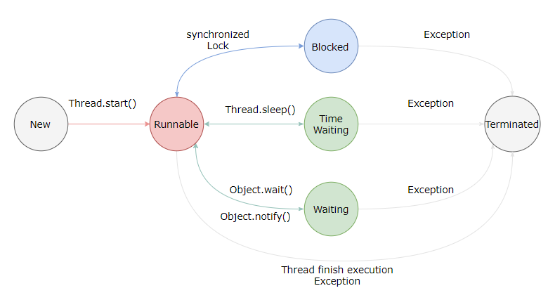

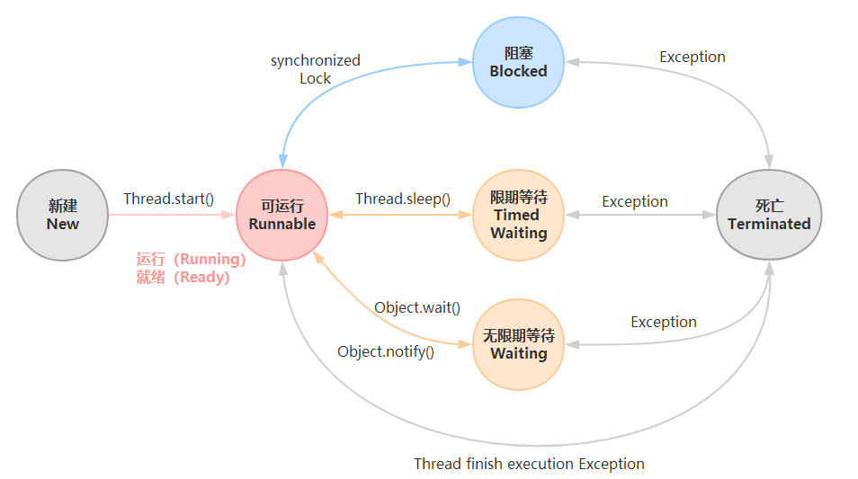

### 新建（New）

创建后尚未启动。

### 可运行（Runnable）

可能正在运行，也可能正在等待 CPU 时间片。

包含了操作系统线程状态中的 运行（Running ） 和 就绪（Ready）。

### 阻塞（Blocking）

这个状态下，是在多个线程有同步操作的场景，比如正在等待另一个线程的 synchronized 块的执行释放，或者可重入的 synchronized 块里别人调用 wait() 方法，也就是线程在等待进入临界区。

阻塞可以分为：等待阻塞，同步阻塞，其他阻塞

### 无限期等待（Waiting）

等待其它线程显式地唤醒，否则不会被分配 CPU 时间片。

| 进入方法                                   | 退出方法                             |
| ------------------------------------------ | ------------------------------------ |
| 没有设置 Timeout 参数的 Object.wait() 方法 | Object.notify() / Object.notifyAll() |
| 没有设置 Timeout 参数的 Thread.join() 方法 | 被调用的线程执行完毕                 |
| LockSupport.park() 方法                    | -                                    |

### 限期等待（Timed Waiting）

无需等待其它线程显式地唤醒，在一定时间之后会被系统自动唤醒。

调用 Thread.sleep() 方法使线程进入限期等待状态时，常常用 “**使一个线程睡眠**” 进行描述。

调用 Object.wait() 方法使线程进入限期等待或者无限期等待时，常常用 “**挂起一个线程**” 进行描述。

**睡眠和挂起**是用来描述**行为**，而**阻塞**和等待用来描述**状态**。

阻塞和等待的区别在于，阻塞是被动的，它是在等待获取一个排它锁。而等待是主动的，通过调用 Thread.sleep() 和 Object.wait() 等方法进入。

| 进入方法                                 | 退出方法                                        |
| ---------------------------------------- | ----------------------------------------------- |
| Thread.sleep() 方法                      | 时间结束                                        |
| 设置了 Timeout 参数的 Object.wait() 方法 | 时间结束 / Object.notify() / Object.notifyAll() |
| 设置了 Timeout 参数的 Thread.join() 方法 | 时间结束 / 被调用的线程执行完毕                 |
| LockSupport.parkNanos() 方法             | -                                               |
| LockSupport.parkUntil() 方法             | -                                               |

### 死亡（Terminated）

- 线程因为 run 方法正常退出而自然死亡
- 因为一个没有捕获的异常终止了 run 方法而意外死亡

### 2. Java实现多线程的方式及三种方式的区别

有三种使用线程的方法：

- 实现 Runnable 接口；
- 实现 Callable 接口；
- 继承 Thread 类。

 实现 Runnable 和 Callable 接口的类只能当做一个可以在线程中运行的任务，不是真正意义上的线程，因此最后还需要通过 Thread 来调用。可以说任务是通过线程驱动从而执行的。 

#### 实现 Runnable 接口

需要实现 run() 方法。

通过 Thread 调用 start() 方法来启动线程。

```java
public class MyRunnable implements Runnable {
    public void run() {
        // ...
    }
}

```

```java
public static void main(String[] args) {
    MyRunnable instance = new MyRunnable();
    Thread thread = new Thread(instance);
    thread.start();
}
```


#### 实现 Callable 接口

与 Runnable 相比，Callable 可以有返回值，返回值通过 FutureTask 进行封装。

```java
public class MyCallable implements Callable<Integer> {
    public Integer call() {
        return 123;
    }
}
```

```java
public static void main(String[] args) throws ExecutionException, InterruptedException {
    MyCallable mc = new MyCallable();
    FutureTask<Integer> ft = new FutureTask<>(mc);
    Thread thread = new Thread(ft);
    thread.start();
    System.out.println(ft.get());
}
```

#### 继承 Thread 类

 同样也是需要实现 run() 方法，因为 Thread 类也实现了 Runable 接口。 

```java
public class MyThread extends Thread {
    public void run() {
        // ...
    }
}
```

```java
public static void main(String[] args) {
    MyThread mt = new MyThread();
    mt.start();
}
```

#### 实现接口 VS 继承 Thread

实现接口会更好一些，因为：

- Java 不支持多重继承，因此继承了 Thread 类就无法继承其它类，但是可以实现多个接口；
- 类可能只要求可执行就行，继承整个 Thread 类开销过大。

#### 三种方式的区别

- 实现 Runnable 接口可以避免 Java 单继承特性而带来的局限；增强程序的健壮性，代码能够被多个线程共享，代码与数据是独立的；适合多个相同程序代码的线程区处理同一资源的情况。
- 继承 Thread 类和实现 Runnable 方法启动线程都是使用 start() 方法，然后 JVM 虚拟机将此线程放到就绪队列中，如果有处理机可用，则执行 run() 方法。
- 实现 Callable 接口要实现 call() 方法，并且线程执行完毕后会有返回值。其他的两种都是重写 run() 方法，没有返回值。

### 3. 基础线程机制

#### Executor

Executor 管理多个异步任务的执行，而无需程序员显式地管理线程的生命周期。这里的异步是指多个任务的执行互不干扰，不需要进行同步操作。

主要有三种 Executor：

- CachedThreadPool：一个任务创建一个线程；
- FixedThreadPool：所有任务只能使用固定大小的线程；
- SingleThreadExecutor：相当于大小为 1 的 FixedThreadPool。

```java
public static void main(String[] args) {
    ExecutorService executorService = Executors.newCachedThreadPool();
    for (int i = 0; i < 5; i++) {
        executorService.execute(new MyRunnable());
    }
    executorService.shutdown();
}
```

####  **为什么引入Executor线程池框架？** 

new Thread() 的缺点

- 每次 new Thread() 耗费性能
- 调用 new Thread() 创建的线程缺乏管理，被称为野线程，而且可以无限制创建，之间相互竞争，会导致过多占用系统资源导致系统瘫痪。
- 不利于扩展，比如如定时执行、定期执行、线程中断

采用线程池的优点

- 重用存在的线程，减少对象创建、消亡的开销，性能佳
- 可有效控制最大并发线程数，提高系统资源的使用率，同时避免过多资源竞争，避免堵塞
- 提供定时执行、定期执行、单线程、并发数控制等功能

#### Daemon（守护线程）

Java 中有两类线程：User Thread (用户线程)、Daemon Thread (守护线程)

用户线程即运行在前台的线程，而守护线程是运行在后台的线程。 守护线程作用是为其他前台线程的运行提供便利服务，而且仅在普通、非守护线程仍然运行时才需要，比如垃圾回收线程就是一个守护线程。当 JVM 检测仅剩一个守护线程，而用户线程都已经退出运行时，JVM 就会退出，因为没有如果没有了被守护这，也就没有继续运行程序的必要了。如果有非守护线程仍然存活，JVM 就不会退出。

守护线程并非只有虚拟机内部提供，用户在编写程序时也可以自己设置守护线程。用户可以用 Thread 的 setDaemon(true) 方法设置当前线程为守护线程。

虽然守护线程可能非常有用，但必须小心确保其他所有非守护线程消亡时，不会由于它的终止而产生任何危害。因为你不可能知道在所有的用户线程退出运行前，守护线程是否已经完成了预期的服务任务。一旦所有的用户线程退出了，虚拟机也就退出运行了。 因此，不要在守护线程中执行业务逻辑操作（比如对数据的读写等）。

#####  **另外有几点需要注意：** 

- setDaemon(true) 必须在调用线程的 start() 方法之前设置，否则会跑出 IllegalThreadStateException 异常。
- 在守护线程中产生的新线程也是守护线程。
- 不要认为所有的应用都可以分配给守护线程来进行服务，比如读写操作或者计算逻辑。

守护线程是程序运行时在后台提供服务的线程，不属于程序中不可或缺的部分。

当所有非守护线程结束时，程序也就终止，同时会杀死所有守护线程。

main() 属于非守护线程。

使用 setDaemon() 方法将一个线程设置为守护线程。

```java
public static void main(String[] args) {
    Thread thread = new Thread(new MyRunnable());
    thread.setDaemon(true);
}
```

#### sleep()

Thread.sleep(millisec) 方法会休眠当前正在执行的线程，millisec 单位为毫秒。

sleep() 可能会抛出 InterruptedException，因为异常不能跨线程传播回 main() 中，因此必须在本地进行处理。线程中抛出的其它异常也同样需要在本地进行处理。

```java
public void run() {
    try {
        Thread.sleep(3000);
    } catch (InterruptedException e) {
        e.printStackTrace();
    }
}
```

#### yield()

 对静态方法 Thread.yield() 的调用声明了**当前线程已经完成了生命周期中最重要的部分**，可以切换给其它线程来执行。该方法只是对线程调度器的一个建议，而且也只是建议具有相同优先级的其它线程可以运行。 

```java
public void run() {
    Thread.yield();
}
```

#### 线程阻塞

线程可以阻塞于四种状态：

- 当线程执行 Thread.sleep() 时，它一直阻塞到指定的毫秒时间之后，或者阻塞被另一个线程打断；
- 当线程碰到一条 wait() 语句时，它会一直阻塞到接到通知 notify()、被中断或经过了指定毫秒时间为止（若制定了超时值的话）
- 线程阻塞与不同 I/O 的方式有多种。常见的一种方式是 InputStream 的 read() 方法，该方法一直阻塞到从流中读取一个字节的数据为止，它可以无限阻塞，因此不能指定超时时间；
- 线程也可以阻塞等待获取某个对象锁的排他性访问权限（即等待获得 synchronized 语句必须的锁时阻塞）。

>  注意，并非所有的阻塞状态都是可中断的，以上阻塞状态的前两种可以被中断，后两种不会对中断做出反应 

### 4. 中断

 一个线程执行完毕之后会自动结束，如果在运行过程中发生异常也会提前结束。 

#### InterruptedException

通过调用一个线程的 interrupt() 来中断该线程，如果该线程处于**阻塞、限期等待或者无限期等待**状态，那么就会抛出 InterruptedException，从而提前结束该线程。但是不能中断 I/O 阻塞和 synchronized 锁阻塞。

对于以下代码，在 main() 中启动一个线程之后再中断它，由于线程中调用了 Thread.sleep() 方法，因此会抛出一个 InterruptedException，从而提前结束线程，不执行之后的语句。

```java
public class InterruptExample {

    private static class MyThread1 extends Thread {
        @Override
        public void run() {
            try {
                Thread.sleep(2000);
                System.out.println("Thread run");
            } catch (InterruptedException e) {
                e.printStackTrace();
            }
        }
    }
}
```

```java
public static void main(String[] args) throws InterruptedException {
    Thread thread1 = new MyThread1();
    thread1.start();
    thread1.interrupt();
    System.out.println("Main run");
}
```

```java
Main run
java.lang.InterruptedException: sleep interrupted
    at java.lang.Thread.sleep(Native Method)
    at InterruptExample.lambda$main$0(InterruptExample.java:5)
    at InterruptExample$$Lambda$1/713338599.run(Unknown Source)
    at java.lang.Thread.run(Thread.java:745)
```

#### interrupted()

如果一个线程的 run() 方法执行一个无限循环，并且没有执行 sleep() 等会抛出 InterruptedException 的操作，那么调用线程的 interrupt() 方法就无法使线程提前结束。

但是调用 interrupt() 方法会设置线程的中断标记，此时调用 interrupted() 方法会返回 true。因此可以在循环体中使用 interrupted() 方法来判断线程是否处于中断状态，从而提前结束线程。

```java
public class InterruptExample {

    private static class MyThread2 extends Thread {
        @Override
        public void run() {
            while (!interrupted()) {
                // ..
            }
            System.out.println("Thread end");
        }
    }
}
```

```java
public static void main(String[] args) throws InterruptedException {
    Thread thread2 = new MyThread2();
    thread2.start();
    thread2.interrupt();
}
```

```java
Thread end
```

#### Executor 的中断操作

调用 Executor 的 shutdown() 方法会等待线程都执行完毕之后再关闭，但是如果调用的是 shutdownNow() 方法，则相当于调用每个线程的 interrupt() 方法。

以下使用 Lambda 创建线程，相当于创建了一个匿名内部线程。

```java
public static void main(String[] args) {
    ExecutorService executorService = Executors.newCachedThreadPool();
    executorService.execute(() -> {
        try {
            Thread.sleep(2000);
            System.out.println("Thread run");
        } catch (InterruptedException e) {
            e.printStackTrace();
        }
    });
    executorService.shutdownNow();
    System.out.println("Main run");
}
```

```java
Main run
java.lang.InterruptedException: sleep interrupted
    at java.lang.Thread.sleep(Native Method)
    at ExecutorInterruptExample.lambda$main$0(ExecutorInterruptExample.java:9)
    at ExecutorInterruptExample$$Lambda$1/1160460865.run(Unknown Source)
    at java.util.concurrent.ThreadPoolExecutor.runWorker(ThreadPoolExecutor.java:1142)
    at java.util.concurrent.ThreadPoolExecutor$Worker.run(ThreadPoolExecutor.java:617)
    at java.lang.Thread.run(Thread.java:745)
```

 如果只想中断 Executor 中的一个线程，可以通过使用 submit() 方法来提交一个线程，它会返回一个 Future<?> 对象，通过调用该对象的 cancel(true) 方法就可以中断线程。 

```java
Future<?> future = executorService.submit(() -> {
    // ..
});
future.cancel(true);
```

### 5. 互斥同步

 Java 提供了两种锁机制来控制多个线程对共享资源的互斥访问，第一个是 JVM 实现的 synchronized，而另一个是 JDK 实现的 ReentrantLock。 

#### synchronized

#####  **1. 同步一个代码块** 

```java
public void func() {
    synchronized (this) {
        // ...
    }
}
```

它只作用于同一个对象，如果调用两个对象上的同步代码块，就不会进行同步。

对于以下代码，使用 ExecutorService 执行了两个线程，由于调用的是同一个对象的同步代码块，因此这两个线程会进行同步，当一个线程进入同步语句块时，另一个线程就必须等待。

```java
public class SynchronizedExample {
    public void func1() {
        synchronized (this) {
            for (int i = 0; i < 10; i++) {
                System.out.print(i + " ");
            }
        }
    }
}
```

```java
public static void main(String[] args) {
    SynchronizedExample e1 = new SynchronizedExample();
    ExecutorService executorService = Executors.newCachedThreadPool();
    executorService.execute(() -> e1.func1());
    executorService.execute(() -> e1.func1());
}
```

```java
0 1 2 3 4 5 6 7 8 9 0 1 2 3 4 5 6 7 8 9
```

 对于以下代码，两个线程调用了不同对象的同步代码块，因此这两个线程就不需要同步。从输出结果可以看出，两个线程交叉执行。 

```java
public static void main(String[] args) {
    SynchronizedExample e1 = new SynchronizedExample();
    SynchronizedExample e2 = new SynchronizedExample();
    ExecutorService executorService = Executors.newCachedThreadPool();
    executorService.execute(() -> e1.func1());
    executorService.execute(() -> e2.func1());
}
```

```java
0 0 1 1 2 2 3 3 4 4 5 5 6 6 7 7 8 8 9 9
```

 对于以下代码，两个线程调用了不同对象的同步代码块，因此这两个线程就不需要同步。从输出结果可以看出，两个线程交叉执行。 

```java
public static void main(String[] args) {
    SynchronizedExample e1 = new SynchronizedExample();
    SynchronizedExample e2 = new SynchronizedExample();
    ExecutorService executorService = Executors.newCachedThreadPool();
    executorService.execute(() -> e1.func1());
    executorService.execute(() -> e2.func1());
}
```

```
0 0 1 1 2 2 3 3 4 4 5 5 6 6 7 7 8 8 9 9
```

#####  **2. 同步一个方法** 

```java
public synchronized void func () {
    // ...
}
```

 它和同步代码块一样，作用于同一个对象。 

 **3. 同步一个类** 

```java
public void func() {
    synchronized (SynchronizedExample.class) {
        // ...
    }
}
```

 作用于整个类，也就是说两个线程调用同一个类的不同对象上的这种同步语句，也会进行同步。 

```java
public class SynchronizedExample {
    public void func2() {
        synchronized (SynchronizedExample.class) {
            for (int i = 0; i < 10; i++) {
                System.out.print(i + " ");
            }
        }
    }
}
```

```java
public static void main(String[] args) {
    SynchronizedExample e1 = new SynchronizedExample();
    SynchronizedExample e2 = new SynchronizedExample();
    ExecutorService executorService = Executors.newCachedThreadPool();
    executorService.execute(() -> e1.func2());
    executorService.execute(() -> e2.func2());
}
```

```
0 1 2 3 4 5 6 7 8 9 0 1 2 3 4 5 6 7 8 9
```

 **4. 同步一个静态方法** 

- 非静态同步函数的锁是：this
- 静态的同步函数的锁是：字节码对象

```java
public synchronized static void fun() {
    // ...
}
```

 作用于整个类。 

#### ReentrantLock

 重入锁（ReentrantLock）是一种递归无阻塞的同步机制。 

```java
public class LockExample {
    private Lock lock = new ReentrantLock();

    public void func() {
        lock.lock();
        try {
            for (int i = 0; i < 10; i++) {
                System.out.print(i + " ");
            }
        } finally {
            lock.unlock(); // 确保释放锁，从而避免发生死锁。
        }
    }
}
```

```java
public static void main(String[] args) {
    LockExample lockExample = new LockExample();
    ExecutorService executorService = Executors.newCachedThreadPool();
    executorService.execute(() -> lockExample.func());
    executorService.execute(() -> lockExample.func());
}
```

```
0 1 2 3 4 5 6 7 8 9 0 1 2 3 4 5 6 7 8 9
```

 ReentrantLock 是 java.util.concurrent（J.U.C）包中的锁，相比于 synchronized，它多了以下高级功能： 

**1. 等待可中断**

当持有锁的线程长期不释放锁的时候，正在等待的线程可以选择放弃等待，改为处理其他事情。

**2. 可实现公平锁**

公平锁是指多个线程在等待同一个锁时，必须按照申请锁的时间顺序来依次获得锁。

synchronized 中的锁是非公平的，ReentrantLock 默认情况下也是非公平的，但可以通过带布尔值的构造函数要求使用公平锁。

**3. 锁绑定多个条件**

一个 ReentrantLock 对象可以同时绑定多个 Condition 对象。

#### synchronized 和 ReentrantLock 比较

**1. 锁的实现**

synchronized 是 JVM 实现的，而 ReentrantLock 是 JDK 实现的。

**2. 性能**

新版本 Java 对 synchronized 进行了很多优化，例如自旋锁等。目前来看它和 ReentrantLock 的性能基本持平了，因此性能因素不再是选择 ReentrantLock 的理由。synchronized 有更大的性能优化空间，应该优先考虑 synchronized。

**3. 功能**

ReentrantLock 多了一些高级功能。

**4. 使用选择**

除非需要使用 ReentrantLock 的高级功能，否则优先使用 synchronized。这是因为 synchronized 是 JVM 实现的一种锁机制，JVM 原生地支持它，而 ReentrantLock 不是所有的 JDK 版本都支持。并且使用 synchronized 不用担心没有释放锁而导致死锁问题，因为 JVM 会确保锁的释放。

#### synchronized与lock的区别，使用场景。看过synchronized的源码没？

- （用法）synchronized（隐式锁）：在需要同步的对象中加入此控制，synchronized 可以加在方法上，也可以加在特定代码块中，括号中表示需要锁的对象。
- （用法）lock（显示锁）：需要显示指定起始位置和终止位置。一般使用 ReentrantLock 类做为锁，多个线程中必须要使用一个 ReentrantLock 类做为对象才能保证锁的生效。且在加锁和解锁处需要通过 lock() 和 unlock() 显示指出。所以一般会在 finally 块中写 unlock() 以防死锁。
- （性能）synchronized 是托管给 JVM 执行的，而 lock 是 Java 写的控制锁的代码。在 Java1.5 中，synchronize 是性能低效的。因为这是一个重量级操作，需要调用操作接口，导致有可能加锁消耗的系统时间比加锁以外的操作还多。相比之下使用 Java 提供的 Lock 对象，性能更高一些。但是到了 Java1.6 ，发生了变化。synchronize 在语义上很清晰，可以进行很多优化，有适应自旋，锁消除，锁粗化，轻量级锁，偏向锁等等。导致 在 Java1.6 上 synchronize 的性能并不比 Lock 差。
- （机制）**synchronized 原始采用的是 CPU 悲观锁机制，即线程获得的是独占锁。Lock 也属于悲观锁**。独占锁意味着其他线程只能依靠阻塞来等待线程释放锁。相对而言乐观锁每次不加锁，而是假设没有冲突而去完成某项操作，如果因为冲突失败就重试，直到成功为止。乐观锁实现的机制就是 CAS 操作（Compare and Swap）。

#### 什么是CAS

>  蘑菇街面试，这里简单论述一下 

##### 入门例子

 在 Java 并发包中有这样一个包，java.util.concurrent.atomic，该包是对 Java 部分数据类型的原子封装，在原有数据类型的基础上，提供了原子性的操作方法，保证了线程安全。下面以 AtomicInteger 为例，来看一下是如何实现的。 

```java
public final int incrementAndGet() {
    for (;;) {
        int current = get();
        int next = current + 1;
        if (compareAndSet(current, next))
            return next;
    }
}

public final int decrementAndGet() {
    for (;;) {
        int current = get();
        int next = current - 1;
        if (compareAndSet(current, next))
            return next;
    }
}
```

 以这两个方法为例，incrementAndGet 方法相当于原子性的 ++i，decrementAndGet 方法相当于原子性的 --i，这两个方法中都没有使用阻塞式的方式来保证原子性（如 Synchronized ），那它们是如何保证原子性的呢，下面引出 CAS。 

##### Compare And Swap

CAS 指的是现代 CPU 广泛支持的一种对内存中的共享数据进行操作的一种特殊指令。这个指令会对内存中的共享数据做原子的读写操作。

简单介绍一下这个指令的操作过程：

- 首先，CPU 会将内存中将要被更改的数据与期望的值做比较。
- 然后，当这两个值相等时，CPU 才会将内存中的数值替换为新的值。否则便不做操作。
- 最后，CPU 会将旧的数值返回。

这一系列的操作是原子的。它们虽然看似复杂，但却是 Java 5 并发机制优于原有锁机制的根本。简单来说，CAS 的含义是：我认为原有的值应该是什么，如果是，则将原有的值更新为新值，否则不做修改，并告诉我原来的值是多少。 简单的来说，CAS 有 3 个操作数，内存值 V，旧的预期值 A，要修改的新值 B。当且仅当预期值 A 和内存值 V 相同时，将内存值 V 修改为 B，否则返回 V。这是一种乐观锁的思路，它相信在它修改之前，没有其它线程去修改它；而 Synchronized 是一种悲观锁，它认为在它修改之前，一定会有其它线程去修改它，悲观锁效率很低。

#### 什么是乐观锁和悲观锁

- 为什么需要锁（并发控制）
  - 在多用户环境中，在同一时间可能会有多个用户更新相同的记录，这会产生冲突。这就是著名的并发性问题。
  - 典型的冲突有：
    - 丢失更新：一个事务的更新覆盖了其它事务的更新结果，就是所谓的更新丢失。例如：用户 A 把值从 6 改为 2，用户 B 把值从 2 改为 6，则用户 A 丢失了他的更新。
    - 脏读：当一个事务读取其它完成一半事务的记录时，就会发生脏读取。例如：用户 A,B 看到的值都是6，用户 B 把值改为 2，用户 A 读到的值仍为 6。
  - 为了解决这些并发带来的问题。 我们需要引入并发控制机制。
- 并发控制机制
  - **悲观锁：假定会发生并发冲突**，独占锁，屏蔽一切可能违反数据完整性的操作。
  - **乐观锁：假设不会发生并发冲突**，只在提交操作时检查是否违反数据完整性。乐观锁不能解决脏读的问题。

#### Synchronized（对象锁）和Static Synchronized（类锁）区别

一个是实例锁（锁在某一个实例对象上，如果该类是单例，那么该锁也具有全局锁的概念），一个是全局锁（该锁针对的是类，无论实例多少个对象，那么线程都共享该锁）。

实例锁对应的就是 synchronized关 键字，而类锁（全局锁）对应的就是 static synchronized（或者是锁在该类的 class 或者 classloader 对象上）。

```java
/**
 * static synchronized 和synchronized的区别！
 * 关键是区别第四种情况！
 */
public class StaticSynchronized {

    /**
     * synchronized方法
     */
    public synchronized void isSynA(){
        System.out.println("isSynA");
    }
    public synchronized void isSynB(){
        System.out.println("isSynB");
    }

    /**
     * static synchronized方法
     */
    public static synchronized void cSynA(){
        System.out.println("cSynA");
    }
    public static synchronized void cSynB(){
        System.out.println("cSynB");
    }

    public static void main(String[] args) {
        StaticSynchronized x = new StaticSynchronized();
        StaticSynchronized y = new StaticSynchronized();
        /**
         *  x.isSynA()与x.isSynB(); 不能同时访问(同一个对象访问synchronized方法)
         *  x.isSynA()与y.isSynB(); 能同时访问(不同对象访问synchronized方法)
         *  x.cSynA()与y.cSynB(); 不能同时访问(不同对象也不能访问static synchronized方法)
         *  x.isSynA()与y.cSynA(); 能同时访问(static synchronized方法占用的是类锁，
         *                        而访问synchronized方法占用的是对象锁，不存在互斥现象)
         */
    }
}
```

### 6. 线程之间的协作

 当多个线程可以一起工作去解决某个问题时，如果某些部分必须在其它部分之前完成，那么就需要对线程进行协调。 

#### join()

在线程中调用另一个线程的 join() 方法，会将当前线程挂起，而不是忙等待，直到目标线程结束。

对于以下代码，虽然 b 线程先启动，但是因为在 b 线程中调用了 a 线程的 join() 方法，b 线程会等待 a 线程结束才继续执行，因此最后能够保证 a 线程的输出先于 b 线程的输出。

```java
public class JoinExample {
    private class A extends Thread {
        @Override
        public void run() {
            System.out.println("A");
        }
    }

    private class B extends Thread {
        private A a;
        B(A a) {
            this.a = a;
        }

        @Override
        public void run() {
            try {
                a.join();
            } catch (InterruptedException e) {
                e.printStackTrace();
            }
            System.out.println("B");
        }
    }

    public void test() {
        A a = new A();
        B b = new B(a);
        b.start();
        a.start();
    }
}
```

```java
public static void main(String[] args) {
    JoinExample example = new JoinExample();
    example.test();
}
```

```
A
B
```

#### wait() notify() notifyAll()

调用 wait() 使得线程等待某个条件满足，线程在等待时会被挂起，当其他线程的运行使得这个条件满足时，其它线程会调用 notify()（随机叫醒一个） 或者 notifyAll() （叫醒所有 wait 线程，争夺时间片的线程只有一个）来唤醒挂起的线程。

它们都属于 Object 的一部分，而不属于 Thread。

只能用在**同步方法**或者**同步控制块**中使用！否则会在运行时抛出 IllegalMonitorStateExeception。

使用 wait() 挂起期间，线程会释放锁。这是因为，如果没有释放锁，那么其它线程就无法进入对象的同步方法或者同步控制块中，那么就无法执行 notify() 或者 notifyAll() 来唤醒挂起的线程，造成死锁。

```java
public class WaitNotifyExample {
    public synchronized void before() {
        System.out.println("before");
        notifyAll();
    }

    public synchronized void after() {
        try {
            wait();
        } catch (InterruptedException e) {
            e.printStackTrace();
        }
        System.out.println("after");
    }
}
```

```java
public static void main(String[] args) {
    ExecutorService executorService = Executors.newCachedThreadPool();
    WaitNotifyExample example = new WaitNotifyExample();
    executorService.execute(() -> example.after());
    executorService.execute(() -> example.before());
}
```

```java
before
after
```

#### await() signal() signalAll()

java.util.concurrent 类库中提供了 Condition 类来实现线程之间的协调，可以在 Condition 上调用 await() 方法使线程等待，其它线程调用 signal() 或 signalAll() 方法唤醒等待的线程。相比于 wait() 这种等待方式，await() 可以指定等待的条件，因此更加灵活。

使用 Lock 来获取一个 Condition 对象。

```java
public class AwaitSignalExample {
    private Lock lock = new ReentrantLock();
    private Condition condition = lock.newCondition();

    public void before() {
        lock.lock();
        try {
            System.out.println("before");
            condition.signalAll();
        } finally {
            lock.unlock();
        }
    }

    public void after() {
        lock.lock();
        try {
            condition.await();
            System.out.println("after");
        } catch (InterruptedException e) {
            e.printStackTrace();
        } finally {
            lock.unlock();
        }
    }
}
```

```java
public static void main(String[] args) {
    ExecutorService executorService = Executors.newCachedThreadPool();
    AwaitSignalExample example = new AwaitSignalExample();
    executorService.execute(() -> example.after());
    executorService.execute(() -> example.before());
}
```

```
before
after
```

#### sleep和wait有什么区别

- sleep 和 wait
  - wait() 是 Object 的方法，而 sleep() 是 Thread 的静态方法；
  - wait() 会释放锁，sleep() 不会。
- 有什么区别
  - sleep() 方法（休眠）是线程类（Thread）的静态方法，调用此方法会让当前线程暂停执行指定的时间，将执行机会（CPU）让给其他线程，但是对象的锁依然保持，因此休眠时间结束后会自动恢复（线程回到就绪状态）。
  - wait() 是 Object 类的方法，调用对象的 wait() 方法导致当前线程放弃对象的锁（线程暂停执行），进入对象的等待池（wait pool），只有调用对象的 notify() 方法（或 notifyAll() 方法）时才能唤醒等待池中的线程进入等锁池（lock pool），如果线程重新获得对象的锁就可以进入就绪状态。

### 7. J.U.C - AQS

 AQS 是 AbstractQueuedSynchronizer 的简称，java.util.concurrent（J.U.C）大大提高了并发性能，AQS (AbstractQueuedSynchronizer) 被认为是 J.U.C 的核心。它提供了一个基于 FIFO 队列，这个队列可以用来构建锁或者其他相关的同步装置的基础框架。下图是 AQS 底层的数据结构： 

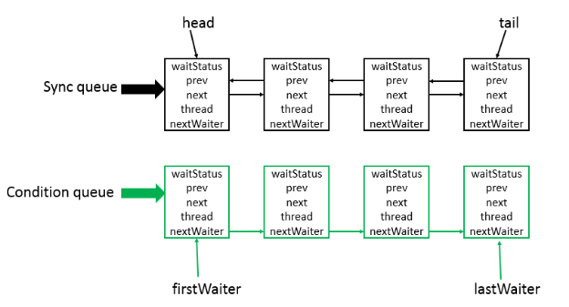

它底层使用的是双向列表，是队列的一种实现 , 因此也可以将它当成一种队列。

- Sync queue 是同步列表，它是双向列表 , 包括 head，tail 节点。其中 head 节点主要用来后续的调度 ;
- Condition queue 是单向链表 , 不是必须的 , 只有当程序中需要 Condition 的时候，才会存在这个单向链表 , 并且可能会有多个 Condition queue。

简单的来说：

- AQS其实就是一个可以给我们实现锁的**框架**
- 内部实现的关键是：**先进先出的队列、state 状态**
- 定义了内部类 ConditionObject
- 拥有两种线程模式
- - 独占模式
  - 共享模式
- 在 LOCK 包中的相关锁（常用的有 ReentrantLock、 ReadWriteLock ）都是基于 AQS 来构建
- 一般我们叫 AQS 为同步器。

#### CountdownLatch

CountDownLatch 类位于 java.util.concurrent 包下，利用它可以实现类似计数器的功能。比如有一个任务 A，它要等待其他 4 个任务执行完毕之后才能执行，此时就可以利用 CountDownLatch 来实现这种功能了。

维护了一个计数器 cnt，每次调用 countDown() 方法会让计数器的值减 1，减到 0 的时候，那些因为调用 await() 方法而在等待的线程就会被唤醒。

 CountDownLatch 类只提供了一个构造器： 

```java
public CountDownLatch(int count) {  };  // 参数count为计数值
```

 然后下面这 3 个方法是 CountDownLatch 类中最重要的方法： 

```java
//调用await()方法的线程会被挂起，它会等待直到count值为0才继续执行
public void await() throws InterruptedException { };
//和await()类似，只不过等待一定的时间后count值还没变为0的话就会继续执行
public boolean await(long timeout, TimeUnit unit) throws InterruptedException { };
//将count值减1
public void countDown() { };
```

 下面看一个例子大家就清楚 CountDownLatch 的用法了： 

```java
public class Test {
    public static void main(String[] args) {
        final CountDownLatch latch = new CountDownLatch(2);
        new Thread() {
            public void run() {
                try {
                    System.out.println("子线程" + Thread.currentThread().getName() + "正在执行");
                    Thread.sleep(3000);
                    System.out.println("子线程" + Thread.currentThread().getName() + "执行完毕");
                    latch.countDown();
                } catch (InterruptedException e) {
                    e.printStackTrace();
                }
            }

            ;
        }.start();
        new Thread() {
            public void run() {
                try {
                    System.out.println("子线程" + Thread.currentThread().getName() + "正在执行");
                    Thread.sleep(3000);
                    System.out.println("子线程" + Thread.currentThread().getName() + "执行完毕");
                    latch.countDown();
                } catch (InterruptedException e) {
                    e.printStackTrace();
                }
            }

            ;
        }.start();
        try {
            System.out.println("等待2个子线程执行完毕...");
            latch.await();
            System.out.println("2个子线程已经执行完毕");
            System.out.println("继续执行主线程");
        } catch (InterruptedException e) {
            e.printStackTrace();
        }
    }
}
```

 执行结果： 

```
线程Thread-0正在执行
线程Thread-1正在执行
等待2个子线程执行完毕...
线程Thread-0执行完毕
线程Thread-1执行完毕
2个子线程已经执行完毕
继续执行主线程
```

#### CyclicBarrier

用来控制多个线程互相等待，只有当多个线程都到达时，这些线程才会继续执行。

和 CountdownLatch 相似，都是通过维护计数器来实现的。但是它的计数器是递增的，每次执行 await() 方法之后，计数器会加 1，直到计数器的值和设置的值相等，等待的所有线程才会继续执行。和 CountdownLatch 的另一个区别是，CyclicBarrier 的计数器可以循环使用，所以它才叫做循环屏障。

下图应该从下往上看才正确。

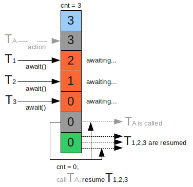

```java
public class CyclicBarrierExample {
    public static void main(String[] args) throws InterruptedException {
        final int totalThread = 10;
        CyclicBarrier cyclicBarrier = new CyclicBarrier(totalThread);
        ExecutorService executorService = Executors.newCachedThreadPool();
        for (int i = 0; i < totalThread; i++) {
            executorService.execute(() -> {
                System.out.print("before..");
                try {
                    cyclicBarrier.await();
                } catch (InterruptedException e) {
                    e.printStackTrace();
                } catch (BrokenBarrierException e) {
                    e.printStackTrace();
                }
                System.out.print("after..");
            });
        }
        executorService.shutdown();
    }
}
```

```
before..before..before..before..before..before..before..before..before..before..after..after..after..after..after..after..after..after..after..after..
```

#### Semaphore

 Semaphore 就是操作系统中的信号量，可以控制对互斥资源的访问线程数。Semaphore 可以控同时访问的线程个数，通过 acquire() 获取一个许可，如果没有就等待，而 release() 释放一个许可。 

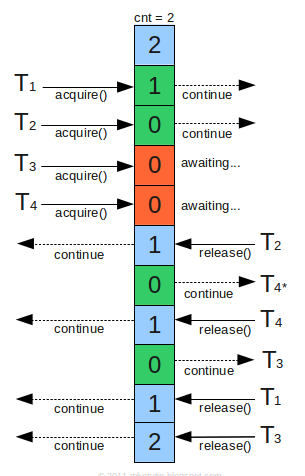

 Semaphore 类位于 java.util.concurrent 包下，它提供了2个构造器： 

```java
public Semaphore(int permits) {          
    //参数permits表示许可数目，即同时可以允许多少线程进行访问
    sync = new NonfairSync(permits);
}

public Semaphore(int permits, boolean fair) {    
    //这个多了一个参数fair表示是否是公平的，即等待时间越久的越先获取许可    
    sync = (fair) ? new FairSync(permits) : new NonfairSync(permits);
}
```

 下面说一下 Semaphore 类中比较重要的几个方法，首先是 acquire()、release() 方法： 

```java
//获取一个许可
public void acquire() throws InterruptedException {  }
//获取permits个许可
public void acquire(int permits) throws InterruptedException { }
//释放一个许可
public void release() { }
//释放permits个许可
public void release(int permits) { }
```

​    	acquire() 用来获取一个许可，若无许可能够获得，则会一直等待，直到获得许可。

　　release() 用来释放许可。注意，在释放许可之前，必须先获获得许可。

这 4 个方法都会被阻塞，如果想立即得到执行结果，可以使用下面几个方法：

```java
//尝试获取一个许可，若获取成功，则立即返回true，若获取失败，则立即返回false
public boolean tryAcquire() { };    
//尝试获取一个许可，若在指定的时间内获取成功，则立即返回true，否则则立即返回false
public boolean tryAcquire(long timeout, TimeUnit unit) throws InterruptedException { }; 
//尝试获取permits个许可，若获取成功，则立即返回true，若获取失败，则立即返回false
public boolean tryAcquire(int permits) { }; 
//尝试获取permits个许可，若在指定的时间内获取成功，则立即返回true，否则则立即返回false
public boolean tryAcquire(int permits, long timeout, TimeUnit unit) throws InterruptedException { }; 
```

另外还可以通过 availablePermits() 方法得到可用的许可数目。

　　下面通过一个例子来看一下 Semaphore 的具体使用：

　　假若一个工厂有 5 台机器，但是有 8 个工人，一台机器同时只能被一个工人使用，只有使用完了，其他工人才能继续使用。那么我们就可以通过 Semaphore 来实现：

```java
public class Test {
    public static void main(String[] args) {
        int N = 8;            //工人数        
        Semaphore semaphore = new Semaphore(5); //机器数目       
        for (int i = 0; i < N; i++) new Worker(i, semaphore).start();
    }

    static class Worker extends Thread {
        private int num;
        private Semaphore semaphore;

        public Worker(int num, Semaphore semaphore) {
            this.num = num;
            this.semaphore = semaphore;
        }
        
        @Override
        public void run() {
            try {
                semaphore.acquire();
                System.out.println("工人" + this.num + "占用一个机器在生产...");
                Thread.sleep(2000);
                System.out.println("工人" + this.num + "释放出机器");
                semaphore.release();
            } catch (InterruptedException e) {
                e.printStackTrace();
            }
        }
    }
}
```

 执行结果： 

```
工人0占用一个机器在生产...
工人1占用一个机器在生产...
工人2占用一个机器在生产...
工人4占用一个机器在生产...
工人5占用一个机器在生产...
工人0释放出机器
工人2释放出机器
工人3占用一个机器在生产...
工人7占用一个机器在生产...
工人4释放出机器
工人5释放出机器
工人1释放出机器
工人6占用一个机器在生产...
工人3释放出机器
工人7释放出机器
工人6释放出机器
```

#### 总结

下面对上面说的三个辅助类进行一个总结：

- CountDownLatch 和 CyclicBarrier 都能够实现线程之间的等待，只不过它们侧重点不同：
  - CountDownLatch 一般用于某个线程A等待若干个其他线程执行完任务之后，它才执行；
  - CyclicBarrier 一般用于一组线程互相等待至某个状态，然后这一组线程再同时执行；
  - 另外，CountDownLatch 是不能够重用的，而 CyclicBarrier 是可以重用的。
- Semaphore 其实和锁有点类似，它一般用于控制对某组资源的访问权限。

### 8. J.U.C - 其它组件

#### FutureTask

 在介绍 Callable 时我们知道它可以有返回值，返回值通过 Future 进行封装。FutureTask 实现了 RunnableFuture 接口，该接口继承自 Runnable 和 Future 接口，这使得 FutureTask 既可以当做一个任务执行，也可以有返回值。 

```java
public class FutureTask<V> implements RunnableFuture<V>
```

```java
public interface RunnableFuture<V> extends Runnable, Future<V>
```

 FutureTask 可用于异步获取执行结果或取消执行任务的场景。当一个计算任务需要执行很长时间，那么就可以用 FutureTask 来封装这个任务，主线程在完成自己的任务之后再去获取结果。 

```java
public class FutureTaskExample {
    public static void main(String[] args) throws ExecutionException, InterruptedException {
        FutureTask<Integer> futureTask = new FutureTask<Integer>(new Callable<Integer>() {
            @Override
            public Integer call() throws Exception {
                int result = 0;
                for (int i = 0; i < 100; i++) {
                    Thread.sleep(10);
                    result += i;
                }
                return result;
            }
        });

        Thread computeThread = new Thread(futureTask);
        computeThread.start();

        Thread otherThread = new Thread(() -> {
            System.out.println("other task is running...");
            try {
                Thread.sleep(1000);
            } catch (InterruptedException e) {
                e.printStackTrace();
            }
        });
        otherThread.start();
        System.out.println(futureTask.get());
    }
}
```

```java
other task is running...
4950
```

#### BlockingQueue

java.util.concurrent.BlockingQueue 接口有以下阻塞队列的实现：

- **FIFO 队列** ：LinkedBlockingQueue、ArrayBlockingQueue（固定长度）
- **优先级队列** ：PriorityBlockingQueue

提供了阻塞的 take() 和 put() 方法：如果队列为空 take() 将阻塞，直到队列中有内容；如果队列为满 put() 将阻塞，直到队列有空闲位置。

**使用 BlockingQueue 实现生产者消费者问题**

```java
public class ProducerConsumer {

    private static BlockingQueue<String> queue = new ArrayBlockingQueue<>(5);

    private static class Producer extends Thread {
        @Override
        public void run() {
            try {
                queue.put("product");
            } catch (InterruptedException e) {
                e.printStackTrace();
            }
            System.out.print("produce..");
        }
    }

    private static class Consumer extends Thread {

        @Override
        public void run() {
            try {
                String product = queue.take();
            } catch (InterruptedException e) {
                e.printStackTrace();
            }
            System.out.print("consume..");
        }
    }
```

```java
public static void main(String[] args) {
    for (int i = 0; i < 2; i++) {
        Producer producer = new Producer();
        producer.start();
    }
    for (int i = 0; i < 5; i++) {
        Consumer consumer = new Consumer();
        consumer.start();
    }
    for (int i = 0; i < 3; i++) {
        Producer producer = new Producer();
        producer.start();
    }
}
```

```
produce..produce..consume..consume..produce..consume..produce..consume..produce..consume..
```

#### ForkJoin

 主要用于并行计算中，和 MapReduce 原理类似，都是把大的计算任务拆分成多个小任务并行计算。 

```java
public class ForkJoinExample extends RecursiveTask<Integer> {
    private final int threshold = 5;
    private int first;
    private int last;

    public ForkJoinExample(int first, int last) {
        this.first = first;
        this.last = last;
    }

    @Override
    protected Integer compute() {
        int result = 0;
        if (last - first <= threshold) {
            // 任务足够小则直接计算
            for (int i = first; i <= last; i++) {
                result += i;
            }
        } else {
            // 拆分成小任务
            int middle = first + (last - first) / 2;
            ForkJoinExample leftTask = new ForkJoinExample(first, middle);
            ForkJoinExample rightTask = new ForkJoinExample(middle + 1, last);
            leftTask.fork();
            rightTask.fork();
            result = leftTask.join() + rightTask.join();
        }
        return result;
    }
}
```

```java
public static void main(String[] args) throws ExecutionException, InterruptedException {
    ForkJoinExample example = new ForkJoinExample(1, 10000);
    ForkJoinPool forkJoinPool = new ForkJoinPool();
    Future result = forkJoinPool.submit(example);
    System.out.println(result.get());
}
```

 ForkJoin 使用 ForkJoinPool 来启动，它是一个特殊的线程池，线程数量取决于 CPU 核数。 

```java
public class ForkJoinPool extends AbstractExecutorService
```

ForkJoinPool 实现了工作窃取算法来提高 CPU 的利用率。每个线程都维护了一个双端队列，用来存储需要执行的任务。工作窃取算法允许空闲的线程从其它线程的双端队列中窃取一个任务来执行。窃取的任务必须是最晚的任务，避免和队列所属线程发生竞争。例如下图中，Thread2 从 Thread1 的队列中拿出最晚的 Task1 任务，Thread1 会拿出 Task2 来执行，这样就避免发生竞争。但是如果队列中只有一个任务时还是会发生竞争。

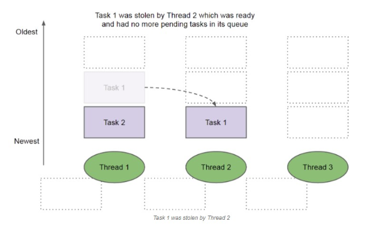

### 9. 线程不安全示例

如果多个线程对同一个共享数据进行访问而不采取同步操作的话，那么操作的结果是不一致的。

以下代码演示了 1000 个线程同时对 cnt 执行自增操作，操作结束之后它的值为 997 而不是 1000。

```java
public class ThreadUnsafeExample {
    private int cnt = 0;
    public void add() {
        cnt++;
    }
    public int get() {
        return cnt;
    }
}

public static void main(String[] args) throws InterruptedException {
    final int threadSize = 1000;
    ThreadUnsafeExample example = new ThreadUnsafeExample();
    final CountDownLatch countDownLatch = new CountDownLatch(threadSize);
    ExecutorService executorService = Executors.newCachedThreadPool();
    for (int i = 0; i < threadSize; i++) {
        executorService.execute(() -> {
            example.add();
            countDownLatch.countDown();
        });
    }
    countDownLatch.await();
    executorService.shutdown();
    System.out.println(example.get());
}
```

```
997
```

### 10. Java 内存模型（JMM）

 Java 内存模型试图屏蔽各种硬件和操作系统的内存访问差异，以实现让 Java 程序在各种平台下都能达到一致的内存访问效果。 

#### 主内存与工作内存

处理器上的寄存器的读写的速度比内存快几个数量级，为了解决这种速度矛盾，在它们之间加入了高速缓存。

加入高速缓存带来了一个新的问题：缓存一致性。如果多个缓存共享同一块主内存区域，那么多个缓存的数据可能会不一致，需要一些协议来解决这个问题。

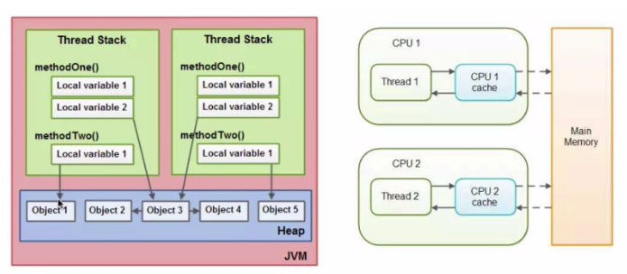

所有的变量都存储在**主内存**中，每个线程还有自己的**工作内存**，工作内存存储在高速缓存或者寄存器中，保存了该线程使用的变量的主内存副本拷贝。

线程只能直接操作工作内存中的变量，不同线程之间的变量值传递需要通过主内存来完成。

**Java内存模型和硬件关系图**

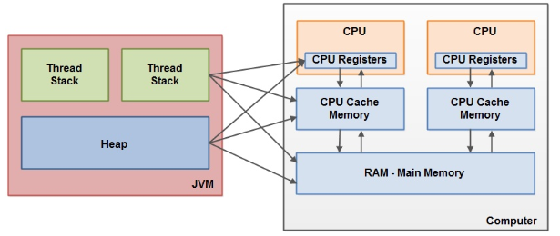

 **Java内存模型抽象结构图** 

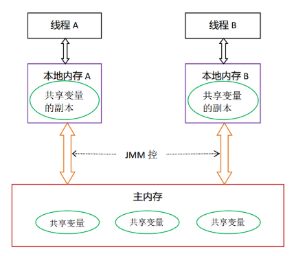

#### 内存间交互操作

 Java 内存模型定义了 8 个操作来完成主内存和工作内存的交互操作。 

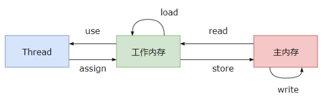

- read：把一个变量的值从主内存传输到工作内存中
- load：在 read 之后执行，把 read 得到的值放入工作内存的变量副本中
- use：把工作内存中一个变量的值传递给执行引擎
- assign：把一个从执行引擎接收到的值赋给工作内存的变量
- store：把工作内存的一个变量的值传送到主内存中
- write：在 store 之后执行，把 store 得到的值放入主内存的变量中
- lock：作用于主内存的变量，把一个变量标识为一条线程独占状态
- unlock：作用于主内存变量，把一个处于锁定状态的变量释放出来，释放后的变量才可以被其他线程锁定

如果要把一个变量从主内存中复制到工作内存，就需要按顺寻地执行 read 和 load 操作，如果把变量从工作内存中同步回主内存中，就要按顺序地执行 store 和 write 操作。Java内存模型只要求上述操作必须按顺序执行，而没有保证必须是连续执行。也就是 read 和 load 之间，store 和 write 之间是可以插入其他指令的，如对主内存中的变量a、b进行访问时，可能的顺序是read a，read b，load b， load a。

 **Java内存模型还规定了在执行上述8种基本操作时，必须满足如下规则：** 

- 不允许 read 和 load、store 和 write 操作之一单独出现
- 不允许一个线程丢弃它的最近 assign 的操作，即变量在工作内存中改变了之后必须同步到主内存中
- 不允许一个线程无原因地（没有发生过任何assign操作）把数据从工作内存同步回主内存中
- 一个新的变量只能在主内存中诞生，不允许在工作内存中直接使用一个未被初始化（load 或 assign）的变量。即就是对一个变量实施 use 和 store 操作之前，必须先执行过了 assign 和 load 操作。
- 一个变量在同一时刻只允许一条线程对其进行lock操作，lock 和 unlock必须成对出现
- 如果对一个变量执行 lock 操作，将会清空工作内存中此变量的值，在执行引擎使用这个变量前需要重新执行 load 或 assign 操作初始化变量的值
- 如果一个变量事先没有被 lock 操作锁定，则不允许对它执行 unlock 操作；也不允许去 unlock 一个被其他线程锁定的变量。
- 对一个变量执行 unlock 操作之前，必须先把此变量同步到主内存中（执行 store 和 write 操作）。

#### 内存模型三大特性

#### 1. 原子性

- 概念
  - 事物有原子性，这个概念大概都清楚，即一个操作或多个操作要么执行的过程中不被任何因素打断，要么不执行。
- 如何实现原子性？
  - 通过同步代码块 synchronized 或者 local 锁来确保原子性

Java 内存模型保证了 read、load、use、assign、store、write、lock 和 unlock 操作具有原子性，例如对一个 int 类型的变量执行 assign 赋值操作，这个操作就是原子性的。但是 Java 内存模型允许虚拟机将没有被 volatile 修饰的 64 位数据（long，double）的读写操作划分为两次 32 位的操作来进行，即 load、store、read 和 write 操作可以不具备原子性。

有一个错误认识就是，int 等原子性的变量在多线程环境中不会出现线程安全问题。前面的线程不安全示例代码中，cnt 变量属于 int 类型变量，1000 个线程对它进行自增操作之后，得到的值为 997 而不是 1000。

为了方便讨论，将内存间的交互操作简化为 3 个：load、assign、store。

下图演示了两个线程同时对 cnt 变量进行操作，load、assign、store 这一系列操作整体上看不具备原子性，那么在 T1 修改 cnt 并且还没有将修改后的值写入主内存，T2 依然可以读入该变量的值。可以看出，这两个线程虽然执行了两次自增运算，但是主内存中 cnt 的值最后为 1 而不是 2。因此对 int 类型读写操作满足原子性只是说明 load、assign、store 这些单个操作具备原子性。

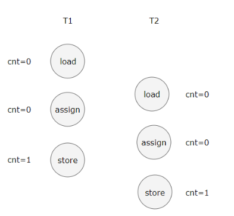

 AtomicInteger 能保证多个线程修改的原子性。 

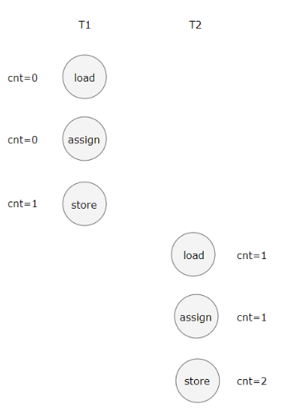

 使用 AtomicInteger 重写之前线程不安全的代码之后得到以下线程安全实现： 

```java
public class AtomicExample {
    private AtomicInteger cnt = new AtomicInteger();

    public void add() {
        cnt.incrementAndGet();
    }

    public int get() {
        return cnt.get();
    }
}
```

```java
public static void main(String[] args) throws InterruptedException {
    final int threadSize = 1000;
    AtomicExample example = new AtomicExample(); // 只修改这条语句
    final CountDownLatch countDownLatch = new CountDownLatch(threadSize);
    ExecutorService executorService = Executors.newCachedThreadPool();
    for (int i = 0; i < threadSize; i++) {
        executorService.execute(() -> {
            example.add();
            countDownLatch.countDown();
        });
    }
    countDownLatch.await();
    executorService.shutdown();
    System.out.println(example.get());
}
```

```
1000
```

 除了使用原子类之外，也可以使用 synchronized 互斥锁来保证操作的原子性。它对应的内存间交互操作为：lock 和 unlock，在虚拟机实现上对应的字节码指令为 monitorenter 和 monitorexit。 

```java
public class AtomicSynchronizedExample {
    private int cnt = 0;

    public synchronized void add() {
        cnt++;
    }

    public synchronized int get() {
        return cnt;
    }
}
public static void main(String[] args) throws InterruptedException {
    final int threadSize = 1000;
    AtomicSynchronizedExample example = new AtomicSynchronizedExample();
    final CountDownLatch countDownLatch = new CountDownLatch(threadSize);
    ExecutorService executorService = Executors.newCachedThreadPool();
    for (int i = 0; i < threadSize; i++) {
        executorService.execute(() -> {
            example.add();
            countDownLatch.countDown();
        });
    }
    countDownLatch.await();
    executorService.shutdown();
    System.out.println(example.get());
}
```

```
1000
```

#### 2. 可见性

可见性指当一个线程修改了共享变量的值，其它线程能够立即得知这个修改。Java 内存模型是通过在变量修改后将新值同步回主内存，在变量读取前从主内存刷新变量值来实现可见性的。

主要有有三种实现可见性的方式：

- volatile
- synchronized，对一个变量执行 unlock 操作之前，必须把变量值同步回主内存。
- final，被 final 关键字修饰的字段在构造器中一旦初始化完成，并且没有发生 this 逃逸（其它线程通过 this 引用访问到初始化了一半的对象），那么其它线程就能看见 final 字段的值。

对前面的线程不安全示例中的 cnt 变量使用 volatile 修饰，不能解决线程不安全问题，因为 volatile 并不能保证操作的原子性。

#### 3. 有序性

有序性是指：在本线程内观察，所有操作都是有序的。在一个线程观察另一个线程，所有操作都是无序的，无序是因为发生了指令重排序。

在 Java 内存模型中，允许编译器和处理器对指令进行重排序，重排序过程不会影响到单线程程序的执行，却会影响到多线程并发执行的正确性。

volatile 关键字通过添加内存屏障的方式来禁止指令重排，即重排序时不能把后面的指令放到内存屏障之前。

也可以通过 synchronized 来保证有序性，它保证每个时刻只有一个线程执行同步代码，相当于是让线程顺序执行同步代码。