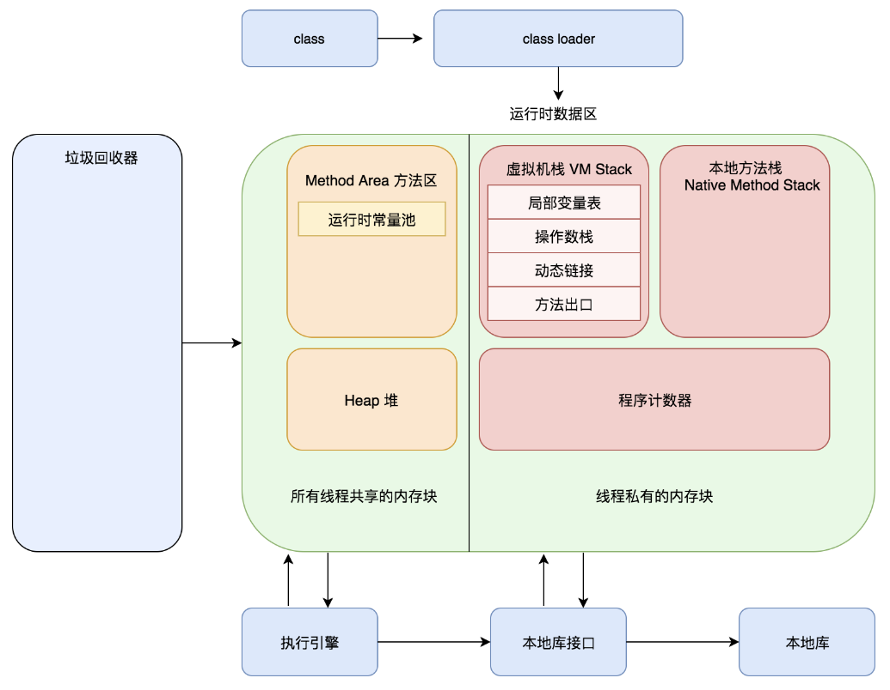
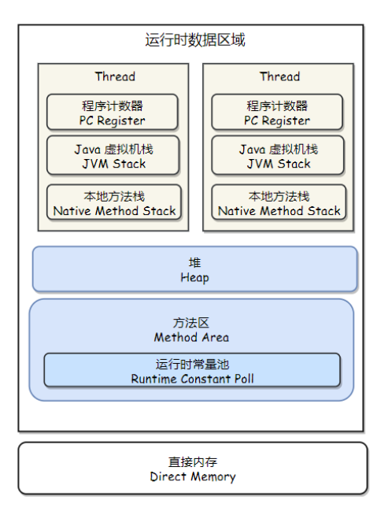
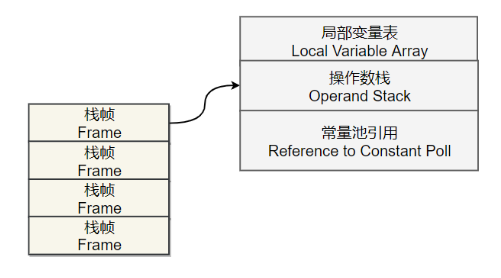
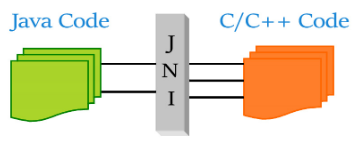
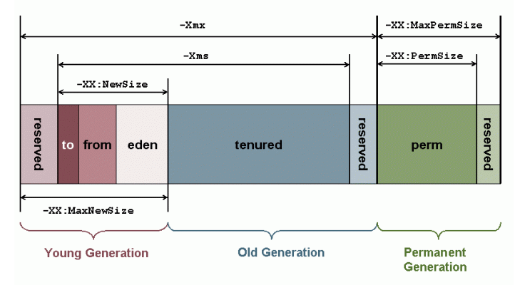
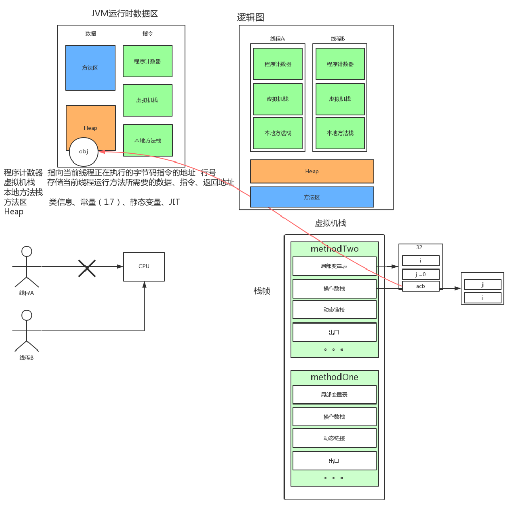
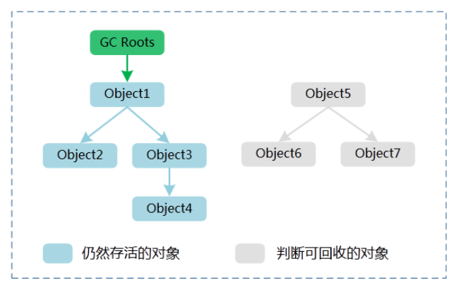
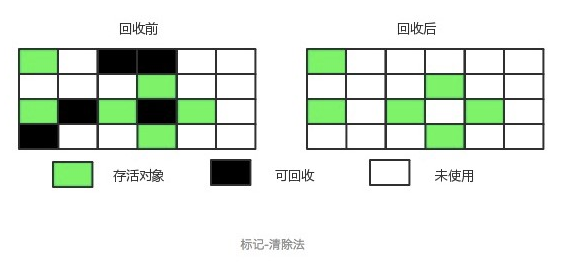
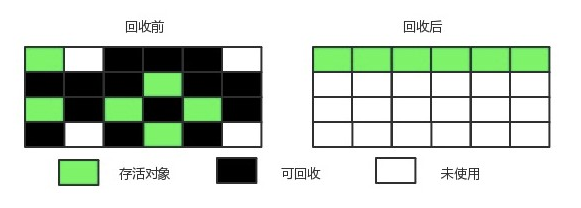
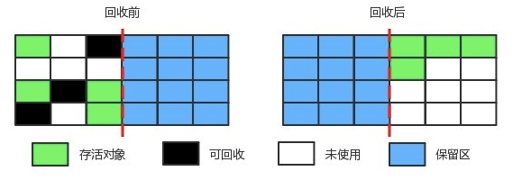

## **05-Java虚拟机**

- [前言](https://github.com/frank-lam/fullstack-tutorial/blob/master/notes/JavaArchitecture/05-Java虚拟机.md#前言)
- 核心知识
  - JVM体系结构
    - [JVM各个模块简介](https://github.com/frank-lam/fullstack-tutorial/blob/master/notes/JavaArchitecture/05-Java虚拟机.md#jvm各个模块简介)
    - [JVM是如何工作的？](https://github.com/frank-lam/fullstack-tutorial/blob/master/notes/JavaArchitecture/05-Java虚拟机.md#jvm是如何工作的)
  - \1. 运行时数据区域
    - [1. 程序计数器（线程私有）](https://github.com/frank-lam/fullstack-tutorial/blob/master/notes/JavaArchitecture/05-Java虚拟机.md#1-程序计数器线程私有)
    - [2. 虚拟机栈（线程私有）](https://github.com/frank-lam/fullstack-tutorial/blob/master/notes/JavaArchitecture/05-Java虚拟机.md#2-虚拟机栈线程私有)
    - [3. 本地方法栈（线程私有）](https://github.com/frank-lam/fullstack-tutorial/blob/master/notes/JavaArchitecture/05-Java虚拟机.md#3-本地方法栈线程私有)
    - \4. 堆
      - [新生代 （Young Generation）](https://github.com/frank-lam/fullstack-tutorial/blob/master/notes/JavaArchitecture/05-Java虚拟机.md#新生代-young-generation)
      - [老年代 （Old Generation）](https://github.com/frank-lam/fullstack-tutorial/blob/master/notes/JavaArchitecture/05-Java虚拟机.md#老年代-old-generation)
      - [永久代 （Permanent Generation）](https://github.com/frank-lam/fullstack-tutorial/blob/master/notes/JavaArchitecture/05-Java虚拟机.md#永久代-permanent-generation)
    - [5. 方法区](https://github.com/frank-lam/fullstack-tutorial/blob/master/notes/JavaArchitecture/05-Java虚拟机.md#5-方法区)
    - [6. 运行时常量池](https://github.com/frank-lam/fullstack-tutorial/blob/master/notes/JavaArchitecture/05-Java虚拟机.md#6-运行时常量池)
    - [7. 直接内存](https://github.com/frank-lam/fullstack-tutorial/blob/master/notes/JavaArchitecture/05-Java虚拟机.md#7-直接内存)
  - \2. 判断一个对象是否可被回收
    - [1. 引用计数算法](https://github.com/frank-lam/fullstack-tutorial/blob/master/notes/JavaArchitecture/05-Java虚拟机.md#1-引用计数算法)
    - \2. 可达性分析算法
      - [★ GC用的引用可达性分析算法中，哪些对象可作为GC Roots对象？](https://github.com/frank-lam/fullstack-tutorial/blob/master/notes/JavaArchitecture/05-Java虚拟机.md#★-gc用的引用可达性分析算法中哪些对象可作为gc-roots对象)
    - \3. 引用类型
      - [1. 强引用（Strong Reference）](https://github.com/frank-lam/fullstack-tutorial/blob/master/notes/JavaArchitecture/05-Java虚拟机.md#1-强引用strong-reference)
      - [2. 软引用（Soft Reference）](https://github.com/frank-lam/fullstack-tutorial/blob/master/notes/JavaArchitecture/05-Java虚拟机.md#2-软引用soft-reference)
      - [3. 弱引用（Weak Reference）](https://github.com/frank-lam/fullstack-tutorial/blob/master/notes/JavaArchitecture/05-Java虚拟机.md#3-弱引用weak-reference)
      - [4. 虚引用（Phantom Reference）](https://github.com/frank-lam/fullstack-tutorial/blob/master/notes/JavaArchitecture/05-Java虚拟机.md#4-虚引用phantom-reference)
    - [4. 方法区的回收](https://github.com/frank-lam/fullstack-tutorial/blob/master/notes/JavaArchitecture/05-Java虚拟机.md#4-方法区的回收)
    - [5. finalize()](https://github.com/frank-lam/fullstack-tutorial/blob/master/notes/JavaArchitecture/05-Java虚拟机.md#5-finalize)
  - \3. 垃圾收集算法（垃圾处理方法）
    - [1. 标记 - 清除](https://github.com/frank-lam/fullstack-tutorial/blob/master/notes/JavaArchitecture/05-Java虚拟机.md#1-标记---清除)
    - [2. 标记 - 整理](https://github.com/frank-lam/fullstack-tutorial/blob/master/notes/JavaArchitecture/05-Java虚拟机.md#2-标记---整理)
    - [3. 复制回收](https://github.com/frank-lam/fullstack-tutorial/blob/master/notes/JavaArchitecture/05-Java虚拟机.md#3-复制回收)
    - [★ 分代收集](https://github.com/frank-lam/fullstack-tutorial/blob/master/notes/JavaArchitecture/05-Java虚拟机.md#★-分代收集)
  - \4. 垃圾收集器
    - [1. Serial](https://github.com/frank-lam/fullstack-tutorial/blob/master/notes/JavaArchitecture/05-Java虚拟机.md#1-serial)
    - [2. ParNew](https://github.com/frank-lam/fullstack-tutorial/blob/master/notes/JavaArchitecture/05-Java虚拟机.md#2-parnew)
    - [3. Parallel Scavenge](https://github.com/frank-lam/fullstack-tutorial/blob/master/notes/JavaArchitecture/05-Java虚拟机.md#3-parallel-scavenge)
    - [4. Serial Old](https://github.com/frank-lam/fullstack-tutorial/blob/master/notes/JavaArchitecture/05-Java虚拟机.md#4-serial-old)
    - [5. Parallel Old](https://github.com/frank-lam/fullstack-tutorial/blob/master/notes/JavaArchitecture/05-Java虚拟机.md#5-parallel-old)
    - [6. CMS](https://github.com/frank-lam/fullstack-tutorial/blob/master/notes/JavaArchitecture/05-Java虚拟机.md#6-cms)
    - [7. G1](https://github.com/frank-lam/fullstack-tutorial/blob/master/notes/JavaArchitecture/05-Java虚拟机.md#7-g1)
    - [8. 比较](https://github.com/frank-lam/fullstack-tutorial/blob/master/notes/JavaArchitecture/05-Java虚拟机.md#8-比较)
  - \5. 内存分配与回收策略
    - [1. 什么时候进行Minor GC，Full GC](https://github.com/frank-lam/fullstack-tutorial/blob/master/notes/JavaArchitecture/05-Java虚拟机.md#1-什么时候进行minor-gcfull-gc)
    - \2. 内存分配策略
      - [1. 对象优先在 Eden 分配](https://github.com/frank-lam/fullstack-tutorial/blob/master/notes/JavaArchitecture/05-Java虚拟机.md#1-对象优先在-eden-分配)
      - [2. 大对象直接进入老年代](https://github.com/frank-lam/fullstack-tutorial/blob/master/notes/JavaArchitecture/05-Java虚拟机.md#2-大对象直接进入老年代)
      - [3. 长期存活的对象进入老年代](https://github.com/frank-lam/fullstack-tutorial/blob/master/notes/JavaArchitecture/05-Java虚拟机.md#3-长期存活的对象进入老年代)
      - [4. 动态对象年龄判定](https://github.com/frank-lam/fullstack-tutorial/blob/master/notes/JavaArchitecture/05-Java虚拟机.md#4-动态对象年龄判定)
      - [5. 空间分配担保](https://github.com/frank-lam/fullstack-tutorial/blob/master/notes/JavaArchitecture/05-Java虚拟机.md#5-空间分配担保)
    - \3. Full GC 的触发条件
      - [1. 调用 System.gc()](https://github.com/frank-lam/fullstack-tutorial/blob/master/notes/JavaArchitecture/05-Java虚拟机.md#1-调用-systemgc)
      - [2. 老年代空间不足](https://github.com/frank-lam/fullstack-tutorial/blob/master/notes/JavaArchitecture/05-Java虚拟机.md#2-老年代空间不足)
      - [3. 空间分配担保失败](https://github.com/frank-lam/fullstack-tutorial/blob/master/notes/JavaArchitecture/05-Java虚拟机.md#3-空间分配担保失败)
      - [4. JDK 1.7 及以前的永久代空间不足](https://github.com/frank-lam/fullstack-tutorial/blob/master/notes/JavaArchitecture/05-Java虚拟机.md#4-jdk-17-及以前的永久代空间不足)
      - [5. Concurrent Mode Failure](https://github.com/frank-lam/fullstack-tutorial/blob/master/notes/JavaArchitecture/05-Java虚拟机.md#5-concurrent-mode-failure)
  - \6. 类加载机制
    - [类的生命周期](https://github.com/frank-lam/fullstack-tutorial/blob/master/notes/JavaArchitecture/05-Java虚拟机.md#类的生命周期)
    - 类初始化时机
      - [1. 主动引用](https://github.com/frank-lam/fullstack-tutorial/blob/master/notes/JavaArchitecture/05-Java虚拟机.md#1-主动引用)
      - [2. 被动引用](https://github.com/frank-lam/fullstack-tutorial/blob/master/notes/JavaArchitecture/05-Java虚拟机.md#2-被动引用)
    - 类加载过程
      - [1. 加载](https://github.com/frank-lam/fullstack-tutorial/blob/master/notes/JavaArchitecture/05-Java虚拟机.md#1-加载)
      - [2. 验证](https://github.com/frank-lam/fullstack-tutorial/blob/master/notes/JavaArchitecture/05-Java虚拟机.md#2-验证)
      - [3. 准备](https://github.com/frank-lam/fullstack-tutorial/blob/master/notes/JavaArchitecture/05-Java虚拟机.md#3-准备)
      - [4. 解析](https://github.com/frank-lam/fullstack-tutorial/blob/master/notes/JavaArchitecture/05-Java虚拟机.md#4-解析)
      - [5. 初始化](https://github.com/frank-lam/fullstack-tutorial/blob/master/notes/JavaArchitecture/05-Java虚拟机.md#5-初始化)
    - 类加载器
      - [1. 类与类加载器](https://github.com/frank-lam/fullstack-tutorial/blob/master/notes/JavaArchitecture/05-Java虚拟机.md#1-类与类加载器)
      - [2. 类加载器分类](https://github.com/frank-lam/fullstack-tutorial/blob/master/notes/JavaArchitecture/05-Java虚拟机.md#2-类加载器分类)
      - [3. 双亲委派模型](https://github.com/frank-lam/fullstack-tutorial/blob/master/notes/JavaArchitecture/05-Java虚拟机.md#3-双亲委派模型)
  - [7. Student s = new Student(); 在内存中做了哪些事情](https://github.com/frank-lam/fullstack-tutorial/blob/master/notes/JavaArchitecture/05-Java虚拟机.md#7-student-s--new-student-在内存中做了哪些事情)
  - \8. Java虚拟机工具
    - [（1）jps](https://github.com/frank-lam/fullstack-tutorial/blob/master/notes/JavaArchitecture/05-Java虚拟机.md#1jps)
    - [（2）jstat](https://github.com/frank-lam/fullstack-tutorial/blob/master/notes/JavaArchitecture/05-Java虚拟机.md#2jstat)
    - [（3）jinfo](https://github.com/frank-lam/fullstack-tutorial/blob/master/notes/JavaArchitecture/05-Java虚拟机.md#3jinfo)
    - [（4）jmap](https://github.com/frank-lam/fullstack-tutorial/blob/master/notes/JavaArchitecture/05-Java虚拟机.md#4jmap)
    - [（5）jhat](https://github.com/frank-lam/fullstack-tutorial/blob/master/notes/JavaArchitecture/05-Java虚拟机.md#5jhat)
    - [（6）jstack](https://github.com/frank-lam/fullstack-tutorial/blob/master/notes/JavaArchitecture/05-Java虚拟机.md#6jstack)
    - [（7）jconsole](https://github.com/frank-lam/fullstack-tutorial/blob/master/notes/JavaArchitecture/05-Java虚拟机.md#7jconsole)
    - [（8）jvisualvm](https://github.com/frank-lam/fullstack-tutorial/blob/master/notes/JavaArchitecture/05-Java虚拟机.md#8jvisualvm)
  - [9. 了解过JVM调优没，基本思路是什么](https://github.com/frank-lam/fullstack-tutorial/blob/master/notes/JavaArchitecture/05-Java虚拟机.md#9-了解过jvm调优没基本思路是什么)
  - [10. JVM线程死锁，你该如何判断是因为什么？如果用VisualVM，dump线程信息出来，会有哪些信息](https://github.com/frank-lam/fullstack-tutorial/blob/master/notes/JavaArchitecture/05-Java虚拟机.md#10-jvm线程死锁你该如何判断是因为什么如果用visualvmdump线程信息出来会有哪些信息)
  - [11. 什么是内存泄露？用什么工具可以查出内存泄漏](https://github.com/frank-lam/fullstack-tutorial/blob/master/notes/JavaArchitecture/05-Java虚拟机.md#11-什么是内存泄露用什么工具可以查出内存泄漏)
  - [* 虚拟机参数](https://github.com/frank-lam/fullstack-tutorial/blob/master/notes/JavaArchitecture/05-Java虚拟机.md#-虚拟机参数)

### 前言

在本文将深入讨论 Java 虚拟机相关核心知识

参考书籍：

- 《深入理解 Java 虚拟机》周志明，机械工业出版社

学习课程：

- 【炼数成金】深入 JVM 内核—原理、诊断与优化
- 【龙果学院】深入理解 Java 虚拟机（ JVM 性能调优+内存模型+虚拟机原理）
- 【尚学堂】白鹤翔 JVM 虚拟机优化

### 核心知识

- JVM 基本结构
  - 类加载器
  - 执行引擎
  - 运行时数据区
  - 本地接口

Class Files -> ClassLoader -> 运行时数据区 -> 执行引擎，本地库接口 -> 本地方法库

### JVM体系结构

 虚拟机是物理机器的软件实现。Java 的开发遵循 write once run anywhere（“一次编写到处乱跑”）理念，它运行在 VM（虚拟机）上。编译器将 Java 文件编译成 Java.class 文件，之后，将 .class 文件输入到 JVM 中，加载并执行该类文件。下图是 JVM 的体系结构 



#### JVM各个模块简介

1. 运行时数据区：经过编译生成的字节码文件（class文件），由 class loader（类加载子系统）加载后交给执行引擎执行。在执行引擎执行的过程中产生的数据会存储在一块内存区域。这块内存区域就是运行时区域
2. 程序计数器：用于记录当前线程的正在执行的字节码指令位置。由于虚拟机的多线程是切换线程并分配 cpu 执行时间的方式实现的，不同线程的执行位置都需要记录下来，因此程序计数器是线程私有的
3. 虚拟机栈：虚拟机栈是 Java 方法执行的内存结构，虚拟机会在每个 Java 方法执行时创建一个“栈桢”，用于存储局部变量表，操作数栈，动态链接，方法出口等信息。当方法执行完毕时，该栈桢会从虚拟机栈中出栈。其中局部变量表包含基本数据类型和对象引用
   - 在 Java 虚拟机规范中，对这个区域规定了两种异常状态：如果线程请求的栈的深度大于虚拟机允许的深度，将抛出 StackOverFlowError 异常（栈溢出），如果虚拟机栈可以动态扩展（现在大部分 Java 虚拟机都可以动态扩展，只不过 Java 虚拟机规范中也允许固定长度的 Java 虚拟机栈），如果扩展时无法申请到足够的内存空间，就会抛出 OutOfmMemoryError 异常（没有足够的内存）
4. 本地方法栈：类似 Java 方法的执行有虚拟机栈，本地方法的执行则对应有本地方法栈
5. 方法区：用于存储已被虚拟机加载的类信息，常量，静态变量，即时编译器编译后的代码等数据。线程共享（看存储的数据就知道了）
6. Java 堆（Heap）：堆的主要作用是存放程序运行过程中创建的对象实例，因为要存放的对象实例有可能会极多，因此也是虚拟机内存管理中最大的一块。并且由于硬件条件有限，所以需要不断回收已“无用”的实例对象来腾出空间给新生成的实例对象；因此 Java 的垃圾回收主要是针对堆进行回收的（还有方法区的常量池），Java 堆很多时候也被称为GC堆（Garbage Collected Heap）。
7. 类加载机制（Class Loader）：类加载子系统是根据一个类的全限定名来加载该类的二进制流到内存中，在JVM 中将形成一份描述 Class 结构的元信息对象（方法区），通过该元信息对象可以获知 Class 的结构信息：如构造函数，属性和方法等，Java 允许用户借由这个 Class 相关的元信息对象间接调用 Class 对象的功能。

### JVM是如何工作的？

如上面的体系结构图所示，JVM 分为三个主要的子系统：

1. 类加载器子系统
2. 运行时数据区
3. 执行引擎

####  **1、类加载器子系统** 

 Java的动态类加载功能是由类加载器子系统处理的。它负责加载、链接，并且在**运行时**首次引用类的时候初始化类，而不是在编译期间。 

##### **1.1、加载**

这个组件负责加载类。BootStrap类加载器、Extension类加载器和Application类加载器是实现这个功能的三大类加载器。

1. **BootStrap类加载器** —— 负责从classpath加载类，如果没有类存在，将只加载**rt.jar**。这个加载器的优先级最高。
2. **Extension类加载器** —— 负责加载**扩展文件夹（jre\lib）**中的类。
3. **Application类加载器** —— 负责加载**应用级classpath**和环境变量指向的路径下的类。

上述**类加载器**在加载类文件时遵循**委托层次结构算法**。

#### **1.2、链接**

1. **校验** —— 字节码验证器将校验生成的字节码是否正确，如果校验失败，我们将获得**校验错误信息**。
2. **准备** —— 对于所有的静态变量，内存将被申请并分配默认值。
3. **解析** —— 所有**标记的内存引用**从**方法区域**被替换成的**原始引用**

**1.3、初始化**

这是类加载的最后阶段，所有的静态变量都将被分配原值，静态代码块将被执行。

运行时数据区

运行时数据区被划分为五个主要部分：

- **方法区** —— 所有**类级数据**都将存储在这里，包括**静态变量**。每一个JVM只有一个方法区，并且它是一个共享资源。
- **堆区** —— 所有**对象**及其对应的**实例变量**和**数组**等存储在此，每个JVM同样只有一个堆区。由于**方法区**和**堆区**是多线程内存共享，因此存储的数据是非线程安全的。
- **栈区** —— 每个线程都会创建一个单独的**运行时栈**。在每一次**方法调用**，都会在栈内存中创建一个**栈帧（Stack Frame）**。所有**局部变量**将在栈内存中创建。栈区是线程安全的，因为它不是一个共享资源。栈帧可以被划分为三个实体：

> **局部变量数组** —— 与方法中有多少局部变量有关，相应的值将存储在此处。 **操作数栈** —— 如果任何的中间操作需要被执行，**操作数栈**将作为运行时工作区来执行操作。 **帧数据** —— 与方法相对应的所有符号存储在此。在任何异常情况下，catch块的信息被保留在帧数据中。

- **PC寄存器** —— 每一个线程都有单独的**PC寄存器**，一旦执行指令，PC寄存器将被下一条指令**更新**，保存当前**执行指令**的地址。
- **本地方法栈** —— 本地方法栈保存本地方法信息，每一个线程都会创建一个单独的本地方栈。

 **3、执行引擎** 

分配到运行时数据区的字节码将被执行引擎执行。执行引擎读取字节码并逐一执行。

- **解释器** —— 解释器能更加快速地解释字节码，但是执行缓慢。解释器的缺点是当多次调用一个方法时，每次都要重新解释。
- **JIT编译器** —— JIT编译器弥补了解释器的不足。执行引擎使用解释器来转换字节码，当它发现重复的代码时，它将使用JIT编译器来编译整个字节码并转换为本地代码。本地代码将直接被重复的方法所调用，从而提高系统性能。
- **中间代码生成器** —— 生成中间代码。
- **代码优化器** —— 负责优化上述生成的中间代码。
- **目标代码生成器** —— 负责生成机器码或者本地代码。
- **分析器** —— 一个特殊的组件，负责查找热点代码，比如一个方法是否被调用多次。
- **垃圾回收器** —— 回收并删除未引用的对象。可以通过调用**System.gc()**来触发垃圾回收，但不能保证它执行。JVM的垃圾回收是回收被创建的对象。

**Java本地接口（JNI）**：**JNI**与**本地方法库**交互，并为执行引擎提供**本地方法库**。

**本地方法库（Native Method Libraries）**：它是执行引擎所需的本地库集合。

## 1. 运行时数据区域



### 1. 程序计数器（线程私有）

记录正在执行的虚拟机字节码指令的地址（如果正在执行的是本地方法则为空）。

- 多个线程竞争时被挂起，程序计数器记录执行到哪里
- 唯一一个在 Java 虚拟机规范中没有规定任何 OutOfMemoryError 情况的区域

### 2. 虚拟机栈（线程私有）

每个 Java 方法在执行的同时会创建一个栈帧用于存储局部变量表、操作数栈、常量池引用等信息，从调用直至执行完成的过程，就对应着一个栈帧在 Java 虚拟机栈中入栈和出栈的过程。



- 补充：栈帧中还存在动态链接、出口（返回地址）等。

可以通过 -Xss 这个虚拟机参数来指定一个程序的 Java 虚拟机栈内存大小：

```
java -Xss=512M HackTheJava
```

该区域可能抛出以下异常：

- 当线程请求的栈深度超过最大值，会抛出 StackOverflowError 异常；
- 栈进行动态扩展时如果无法申请到足够内存，会抛出 OutOfMemoryError 异常。

栈帧详解：[虚拟机中的运行时栈帧 - kosamino - 博客园](https://www.cnblogs.com/jing99/p/6076102.html)

### 3. 本地方法栈（线程私有）

本地方法一般是用其它语言（C、C++ 或汇编语言等）编写的，并且被编译为基于本机硬件和操作系统的程序，对待这些方法需要特别处理。

本地方法栈与 Java 虚拟机栈类似，它们之间的区别只不过是本地方法栈为本地方法服务。



### 4. 堆

所有对象实例都在这里分配内存。

是垃圾收集的主要区域（"GC 堆"）。现代的垃圾收集器基本都是采用分代收集算法（因为对象的生命周期不一样），主要思想是针对不同的对象采取不同的垃圾回收算法。虚拟机把 Java 堆分成以下三块：

#### 新生代 （Young Generation）

 在方法中去 new 一个对象，那这方法调用完毕后，对象就会被回收，这就是一个典型的新生代对象。 

#### 老年代 （Old Generation）

- 在新生代中经历了 N 次垃圾回收后仍然存活的对象就会被放到老年代中。而且大对象直接进入老年代
- 当 Survivor 空间不够用时，需要依赖于老年代进行分配担保，所以大对象直接进入老年代

#### 永久代 （Permanent Generation）

- 即方法区。

当一个对象被创建时，它首先进入新生代，之后有可能被转移到老年代中。

新生代存放着大量的生命很短的对象，因此新生代在三个区域中垃圾回收的频率最高。为了更高效地进行垃圾回收，把新生代继续划分成以下三个空间：

- Eden（伊甸园）
- From Survivor（幸存者）
- To Survivor



Java 堆不需要连续内存，并且可以动态增加其内存，增加失败会抛出 OutOfMemoryError 异常。

可以通过 -Xms 和 -Xmx 两个虚拟机参数来指定一个程序的 Java 堆内存大小，第一个参数设置初始值，第二个参数设置最大值。

```java
java -Xms=1M -Xmx=2M HackTheJava
```

-  思考：为什么是 8:1:1 

### 5. 方法区

用于存放已被加载的类信息（包含：类版本、字段、方法、接口）、常量 (final)、静态变量 (static)、即时编译器 (JIT) 编译后的代码等数据。因为都是共享的数据，所有要放在方法区。

和 Java 堆一样不需要连续的内存，并且可以动态扩展，动态扩展失败一样会抛出 OutOfMemoryError 异常。

对这块区域进行垃圾回收的主要目标是对常量池的回收和对类的卸载，但是一般比较难实现。

JDK 1.7 之前，HotSpot 虚拟机把它当成永久代来进行垃圾回收，JDK 1.8 之后，取消了永久代，用 metaspace（元数据）区替代。

### 6. 运行时常量池

运行时常量池是方法区的一部分。

Class 文件中的常量池（编译器生成的各种字面量和符号引用）会在类加载后被放入这个区域。

除了在编译期生成的常量，还允许动态生成，例如 String 类的 intern()。

```java
在TLAB空间中存在

// 字节码常量
String s1 = "123";
String s2 = "123";
System.out.println(s1 == s1);  //  true
```

### 7. 直接内存

在 JDK 1.4 中新加入了 NIO 类，它可以使用 Native 函数库直接分配堆外内存，然后通过一个存储在 Java 堆里的 DirectByteBuffer 对象作为这块内存的引用进行操作。这样能在一些场景中显著提高性能，因为避免了在 Java 堆和 Native 堆中来回复制数据。



## 2. 判断一个对象是否可被回收

 **程序计数器、虚拟机栈和本地方法栈**这三个区域属于线程私有的，只存在于线程的生命周期内，线程结束之后也会消失，因此不需要对这三个区域进行垃圾回收。垃圾回收主要是针对 **Java 堆和方法区**进行。 

### 1. 引用计数算法

**描述**：给对象中添加一个引用计数器每当有一个地方引用它时，计数器就加1；当引用失效时，计数器值就减1；任何时刻计数器为0的对象就是不可能在被使用的。

**缺陷**：很难解决对象间相互循环引用的问题

### 2. 可达性分析算法

通过 GC Roots 作为起始点进行搜索，能够到达到的对象都是存活的，不可达的对象可被回收。



#### ★ GC用的引用可达性分析算法中，哪些对象可作为GC Roots对象？

- 虚拟机栈（栈帧中的本地变量表）中引用的对象。
- 方法区中静态属性引用的对象。
- 方法区中常量引用的对象。
- 本地方法栈中 JNI （即一般说的 Native 方法）引用的对象。

### 3. 引用类型

无论是通过引用计算算法判断对象的引用数量，还是通过可达性分析算法判断对象是否可达，判定对象是否可被回收都与引用有关。

在 JDK 1.2 之后，Java 对引用的概念进行了扩充，将引用分为 强引用（Strong Reference）、软引用（Soft Reference）、弱引用（Weak Reference）、虚引用（Phantom Reference）4种，这4种引用强度依次逐渐减弱。

#### 1. 强引用（Strong Reference）

被强引用关联的对象不会被回收。

使用 new 一个新对象的方式来创建强引用。

```java
Object obj = new Object();
```

#### 2. 软引用（Soft Reference）

被软引用关联的对象只有在内存不够的情况下才会被回收。

使用 SoftReference 类来创建软引用。

```java
Object obj = new Object();
SoftReference<Object> sf = new SoftReference<Object>(obj);
obj = null;  // 使对象只被软引用关联
```

#### 3. 弱引用（Weak Reference）

被弱引用关联的对象一定会被回收，也就是说它只能存活到下一次垃圾回收发生之前。

使用 WeakReference 类来实现弱引用。

```java
Object obj = new Object();
WeakReference<Object> wf = new WeakReference<Object>(obj);
obj = null;
```

#### 4. 虚引用（Phantom Reference）

又称为幽灵引用或者幻影引用。一个对象是否有虚引用的存在，完全不会对其生存时间构成影响，也无法通过虚引用取得一个对象。

为一个对象设置虚引用关联的唯一目的就是能在这个对象被回收时收到一个系统通知。

使用 PhantomReference 来实现虚引用。

```java
Object obj = new Object();
PhantomReference<Object> pf = new PhantomReference<Object>(obj);
obj = null;
```

### 4. 方法区的回收

Java虚拟机规范中确实说过可以**不要求虚拟机在方法区实现垃圾收集**，而且在方法区中进行垃圾收集的 “性价比” 一般比较低：在堆中，尤其在新生代中，常规的应用一次垃圾收集一般可以回收 70% ~ 95%的空间，而永久代的垃圾收集效率远低于此。

永久代的垃圾收集主要回收两部分：**废弃常量** 和 **无用的类**。

- 回收废弃常量与回收 Java 堆中的对象非常类似。
- 要判定一个类是否是 “无用的类” 的条件相对苛刻许多。类需要同时满足下面3个条件才能算 “无用的类”
  - 该类的所有实例都已经被回收。
  - 加载该类的 `ClassLoader` 已经被回收。
  - 该类对应的 `java.lang.Class` 对象没有在任何地方被引用，无法在任何地方通过反射访问该类的方法。

在大量使用反射、动态代理、GGLib 等 ByteCode 框架、动态生成 Jsp 以及 OSGI 这类频繁自定义 ClassLoader 的场景都需要虚拟机具备类卸载的功能，以保证永久代不会溢出。

### 5. finalize()

finalize() 类似 C++ 的析构函数，用来做关闭外部资源等工作。但是 try-finally 等方式可以做的更好，并且该方法运行代价高昂，不确定性大，无法保证各个对象的调用顺序，因此最好不要使用。

当一个对象可被回收时，如果需要执行该对象的 finalize() 方法，那么就有可能通过在该方法中让对象重新被引用，从而实现自救。自救只能进行一次，如果回收的对象之前调用了 finalize() 方法自救，后面回收时不会调用 finalize() 方法。

## 3. 垃圾收集算法（垃圾处理方法）

### 1. 标记 - 清除



首先标记出所有需要回收的对象，在标记完成后统一回收所有标记的对象。

**不足：**

- **效率问题**：标记和清除的效率都不高
- **空间问题**：标记清除之后会产生大量不连续的内存碎片，导致以后需要分配较大对象时，无法找到足够的连续内存而不得不提前触发另外一次垃圾收集。

### 2. 标记 - 整理



 标记过程仍然与"标记-清除"算法一样，但后续步骤不是直接对可回收对象进行清理，而是让所有存活的对象都向一端移动，然后直接清除掉端边界以外的内存。 

### 3. 复制回收



将内存划分为大小相等的两块，每次只使用其中一块，当这一块内存用完了就将还存活的对象复制到另一块上面，然后再把使用过的内存空间进行一次清理。

主要不足是只使用了内存的一半。

现在的商业虚拟机都**采用这种收集算法来回收新生代**，但是并不是将新生代划分为大小相等的两块，而是分为一块较大的 Eden 空间和两块较小的 Survivor 空间，每次使用 Eden 空间和其中一块 Survivor。在回收时，将 Eden 和 Survivor 中还存活着的对象一次性复制到另一块 Survivor 空间上，最后清理 Eden 和使用过的那一块 Survivor。

HotSpot 虚拟机的 Eden 和 Survivor 的大小比例默认为 8:1，保证了内存的利用率达到 90%。如果每次回收有多于 10% 的对象存活，那么一块 Survivor 空间就不够用了，此时需要依赖于老年代进行分配担保，也就是借用老年代的空间存储放不下的对象。

### ★ 分代收集

现在的商业虚拟机采用分代收集算法，它根据对象存活周期将内存划分为几块，不同块采用适当的收集算法。

一般将堆分为新生代和老年代。

- 新生代使用：**复制回收** 算法
- 老年代使用：**标记 - 清除** 或者 **标记 - 整理** 算法