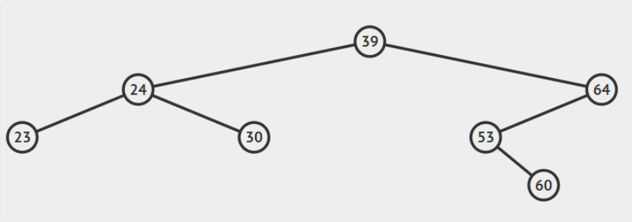
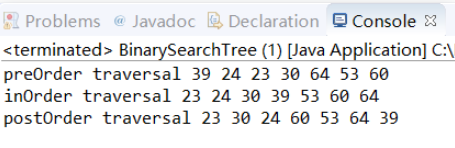
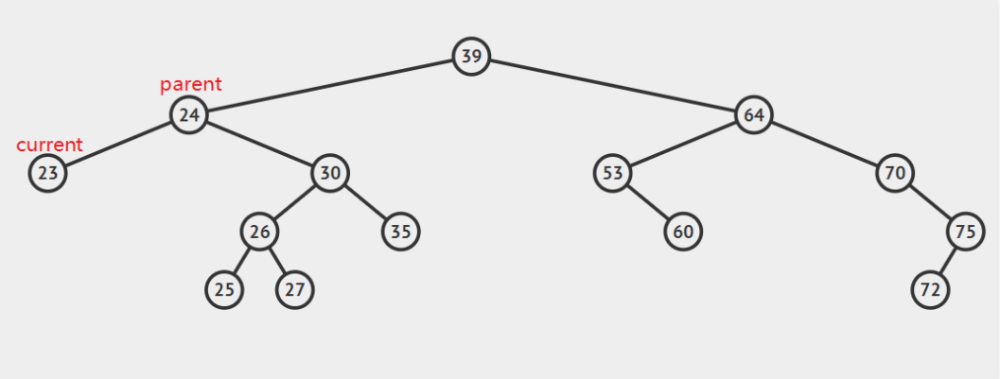
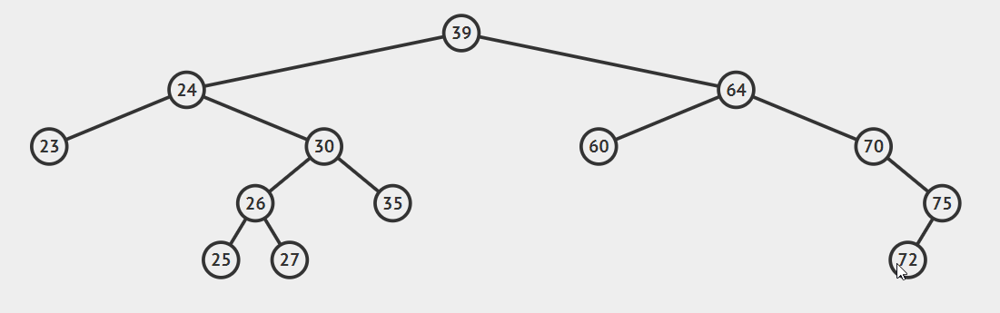
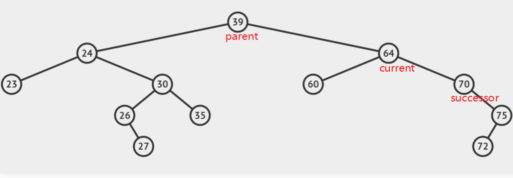
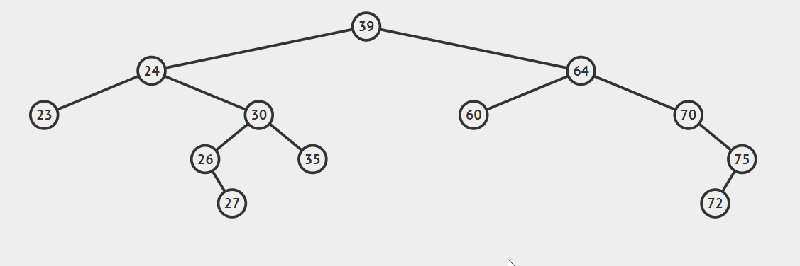
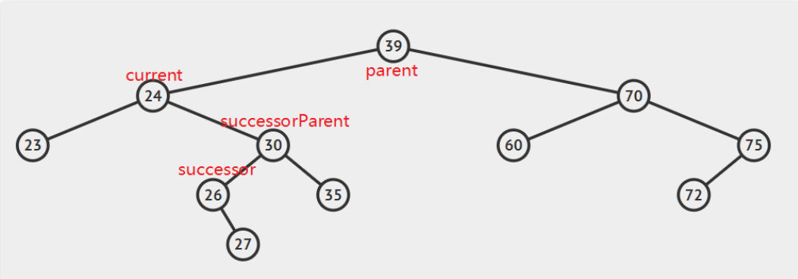
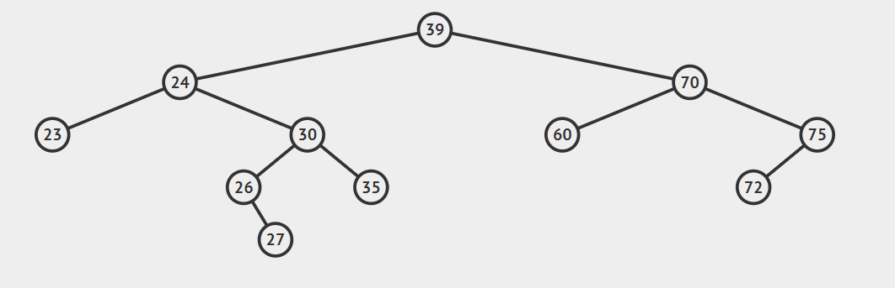

## 二叉搜索树

### 二叉搜索树定义

二叉搜索树，是指一棵空树或者具有下列性质的二叉树：

1. 若任意节点的左子树不空，则**左子树**上所有节点的值均**小于**它的**根节点**的值；
2. 若任意节点的右子树不空，则**右子树**上所有节点的值均**大于**它的**根节点**的值；
3. 任意节点的左，右子树也分别为二叉搜索树；
4. **没有键值相等的节点。**

### 用Java来表示二叉树

```java
public class BinarySearchTree
{ // 二叉搜索树类
    private class Node
    { // 节点类
        int data; // 数据域
        Node right; // 右子树
        Node left; // 左子树
    }

    private Node root; // 树根节点
}
```

### 创建树（insert）

```java
public void insert(int key)
    {    
        Node p=new Node(); //待插入的节点
        p.data=key;
        
        if(root==null)
        {
            root=p;
        }
        else
        {
            Node parent=new Node();
            Node current=root;
            while(true)
            {
                parent=current;
                if(key>current.data)    
                {
                    current=current.right; // 右子树
                    if(current==null)
                    {
                        parent.right=p;
                        return;
                    }
                }
                else //本程序没有做key出现相等情况的处理，暂且假设用户插入的节点值都不同
                {
                    current=current.left; // 左子树
                    if(current==null)
                    {
                        parent.left=p;
                        return;
                    }
                }
            }
        }
    }
```

 创建树的时候，主要用到了parent，current来记录要插入节点的位置。哪么怎么检验自己是否正确地创建了一颗二叉搜索树呢，我们通过**遍历**来输出各个节点的值 

### 遍历树（travel）

遍历指的是按照某种特定的次序来访问二叉搜索树中的每个节点，主要有三种遍历的方法：

1. 前序遍历，“中左右”
2. 中序遍历，“左中右”
3. 后续遍历，“左右中”

上面的口诀“中左右”表示的含义是，先访问根节点，再访问左子，最后访问右子。举个例子：



- 前序遍历：39 24 23 30 64 53 60
- 中序遍历：23 24 30 39 53 60 64
- 后序遍历：23 30 24 60 53 64 39

 你会发现，按照中序遍历的规则将一个二叉搜索树输入，结果为按照正序排列。 

```java
public void preOrder(Node root)
    { // 前序遍历,"中左右"
        if (root != null)
        {
            System.out.print(root.data + " ");
            preOrder(root.left);
            preOrder(root.right);
        }
    }

    public void inOrder(Node root)
    { // 中序遍历,"左中右"
        if (root != null)
        {
            inOrder(root.left);
            System.out.print(root.data + " ");
            inOrder(root.right);
        }
    }

    public void postOrder(Node root)
    { // 后序遍历,"左右中"
        if (root != null)
        {
            postOrder(root.left);
            postOrder(root.right);
            System.out.print(root.data + " ");
        }
    }

    public void traverse(int traverseType)
    {    // 选择以何种方式遍历
        switch (traverseType)
        {
        case 1:
            System.out.print("preOrder traversal ");
            preOrder(root);
            System.out.println();
            break;
        case 2:
            System.out.print("inOrder traversal ");
            inOrder(root);
            System.out.println();
            break;
        case 3:
            System.out.print("postOrder traversal ");
            postOrder(root);
            System.out.println();
            break;
        }
    }
```

以上的代码采用递归的方式实现三种遍历，为了方便我们使用，又写了一个traverse函数来实现选择哪种方式进行树的遍历。

这会儿就可以写单元测试了，我们首先创建一个二叉搜索树，然后分别使用“前序”，“中序”，“后序”来遍历输出树的所有节点。

```java
 public static void main(String[] args)    //unit test
    {    
        BinarySearchTree tree=new BinarySearchTree();
        
        tree.insert(39);
        tree.insert(24);
        tree.insert(64);
        tree.insert(23);
        tree.insert(30);
        tree.insert(53);
        tree.insert(60);
        
        tree.traverse(1);
        tree.traverse(2);
        tree.traverse(3);
    }
```

 运行该单元测试，可以看到如下的结果： 



### 查找节点（find）

```java
public Node find(int key)
    { // 从树中按照关键值查找元素
        Node current = root;
        while (current.data != key)
        {
            if (key > current.data)
                current = current.right;
            else
                current = current.left;
            if (current == null) return null;
        }
        return current;
    }
    
    public void show(Node node)
    {    //输出节点的数据域
        if(node!=null)
            System.out.println(node.data);
        else
            System.out.println("null");
    }
```

 查找节点比较简单，如果找到节点则返回该节点，否则返回null。为了方便在控制台输出，我们有添加了一个show函数，用来输出节点的数据域。 

### 删除节点（delete）

删除节点是二叉搜索树中，最复杂的一种操作，但是也不是特别难，我们分类讨论：

- 要删除节点有**零个孩子**，即叶子节点



如图所示，只需要将parent.left(或者是parent.right)设置为curren.right(或者是current.left)即可。



-  要删除节点有**两个孩子** 

 这种情况比较复杂，首先我们引入**后继节点**的概念，如果将一棵二叉树按照中序周游的方式输出，则任一节点的下一个节点就是该节点的后继节点。例如：上图中24的后继节点为25，64的后继节点为70.找到后继节点以后，问题就变得简单了，分为两种情况： 

1. **后继节点为待删除节点的右子**，只需要将curren用successor替换即可，注意处理好current.left和successor.right.

   注意：这种情况下，successor一定没有左孩子，一但它有左孩子，哪它必然不是current的后继节点。

    

   

2.  **后继节点为待删除结点的右孩子的左子树**，这种情况稍微复杂点，请看动态图片演示。






算法的步骤是：

1. successorParent.left=successor.right
2. successor.left=current.left
3. parent.left=seccessor

弄懂原理后，我们来看具体的代码实现：

```
private Node getSuccessor(Node delNode)    //寻找要删除节点的中序后继结点
    {
        Node successorParent=delNode;
        Node successor=delNode;
        Node current=delNode.right;
        
        //用来寻找后继结点
        while(current!=null)
        {
            successorParent=successor;
            successor=current;
            current=current.left;
        }
        
        //如果后继结点为要删除结点的右子树的左子，需要预先调整一下要删除结点的右子树
        if(successor!=delNode.right)
        {
            successorParent.left=successor.right;
            successor.right=delNode.right;
        }
        return successor;
    }
    
    public boolean delete(int key) // 删除结点
    {
        Node current = root;
        Node parent = new Node();
        boolean isRightChild = true;
        while (current.data != key)
        {
            parent = current;
            if (key > current.data)
            {
                current = current.right;
                isRightChild = true;
            }
            else
            {
                current = current.left;
                isRightChild = false;
            }
            if (current == null) return false; // 没有找到要删除的结点
        }
        // 此时current就是要删除的结点,parent为其父结点
        // 要删除结点为叶子结点
        if (current.right == null && current.left == null) 
        {
            if (current == root)
            {
                root = null; // 整棵树清空
            }
            else
            {
                if (isRightChild)
                    parent.right = null;
                else
                    parent.left = null;
            }
            return true;
        }
        //要删除结点有一个子结点
        else if(current.left==null)
        {
            if(current==root)
                root=current.right;
            else if(isRightChild)
                parent.right=current.right;
            else
                parent.left=current.right;
            return true;
        }
        else if(current.right==null)
        {
            if(current==root)
                root=current.left;
            else if(isRightChild)
                parent.right=current.left;
            else
                parent.left=current.left;
            return true;
        }
        //要删除结点有两个子结点
        else 
        {
            Node successor=getSuccessor(current);    //找到要删除结点的后继结点
            
            if(current==root)
                root=successor;
            else if(isRightChild)
                parent.right=successor;
            else
                parent.left=successor;
            
            successor.left=current.left;
            return true;
        }
    }
```

 大家注意哪个私有函数getSuccessor的功能，它不仅仅是用来找后继结点的。 

### 总结

 二叉搜索树其实不是特别难，理解以后，多练习几次，应该可以掌握。以下是全部的代码： 

```java
public class BinarySearchTree
{ // 二叉搜索树类
    private class Node
    { // 节点类
        int data; // 数据域
        Node right; // 右子树
        Node left; // 左子树
    }

    private Node root; // 树根节点

    public void insert(int key)
    {
        Node p = new Node(); // 待插入的节点
        p.data = key;

        if (root == null)
        {
            root = p;
        }
        else
        {
            Node parent = new Node();
            Node current = root;
            while (true)
            {
                parent = current;
                if (key > current.data)
                {
                    current = current.right; // 右子树
                    if (current == null)
                    {
                        parent.right = p;
                        return;
                    }
                }
                else // 本程序没有做key出现相等情况的处理，暂且假设用户插入的节点值都不同
                {
                    current = current.left; // 左子树
                    if (current == null)
                    {
                        parent.left = p;
                        return;
                    }
                }
            }
        }
    }

    public void preOrder(Node root)
    { // 前序遍历,"中左右"
        if (root != null)
        {
            System.out.print(root.data + " ");
            preOrder(root.left);
            preOrder(root.right);
        }
    }

    public void inOrder(Node root)
    { // 中序遍历,"左中右"
        if (root != null)
        {
            inOrder(root.left);
            System.out.print(root.data + " ");
            inOrder(root.right);
        }
    }

    public void postOrder(Node root)
    { // 后序遍历,"左右中"
        if (root != null)
        {
            postOrder(root.left);
            postOrder(root.right);
            System.out.print(root.data + " ");
        }
    }

    public void traverse(int traverseType)
    { // 选择以何种方式遍历
        switch (traverseType)
        {
        case 1:
            System.out.print("preOrder traversal ");
            preOrder(root);
            System.out.println();
            break;
        case 2:
            System.out.print("inOrder traversal ");
            inOrder(root);
            System.out.println();
            break;
        case 3:
            System.out.print("postOrder traversal ");
            postOrder(root);
            System.out.println();
            break;
        }
    }

    public Node find(int key)
    { // 从树中按照关键值查找元素
        Node current = root;
        while (current.data != key)
        {
            if (key > current.data)
                current = current.right;
            else
                current = current.left;
            if (current == null) return null;
        }
        return current;
    }
    
    public void show(Node node)
    {    //输出节点的数据域
        if(node!=null)
            System.out.println(node.data);
        else
            System.out.println("null");
    }
    
    private Node getSuccessor(Node delNode)    //寻找要删除节点的中序后继结点
    {
        Node successorParent=delNode;
        Node successor=delNode;
        Node current=delNode.right;
        
        //用来寻找后继结点
        while(current!=null)
        {
            successorParent=successor;
            successor=current;
            current=current.left;
        }
        
        //如果后继结点为要删除结点的右子树的左子，需要预先调整一下要删除结点的右子树
        if(successor!=delNode.right)
        {
            successorParent.left=successor.right;
            successor.right=delNode.right;
        }
        return successor;
    }
    
    public boolean delete(int key) // 删除结点
    {
        Node current = root;
        Node parent = new Node();
        boolean isRightChild = true;
        while (current.data != key)
        {
            parent = current;
            if (key > current.data)
            {
                current = current.right;
                isRightChild = true;
            }
            else
            {
                current = current.left;
                isRightChild = false;
            }
            if (current == null) return false; // 没有找到要删除的结点
        }
        // 此时current就是要删除的结点,parent为其父结点
        // 要删除结点为叶子结点
        if (current.right == null && current.left == null) 
        {
            if (current == root)
            {
                root = null; // 整棵树清空
            }
            else
            {
                if (isRightChild)
                    parent.right = null;
                else
                    parent.left = null;
            }
            return true;
        }
        //要删除结点有一个子结点
        else if(current.left==null)
        {
            if(current==root)
                root=current.right;
            else if(isRightChild)
                parent.right=current.right;
            else
                parent.left=current.right;
            return true;
        }
        else if(current.right==null)
        {
            if(current==root)
                root=current.left;
            else if(isRightChild)
                parent.right=current.left;
            else
                parent.left=current.left;
            return true;
        }
        //要删除结点有两个子结点
        else 
        {
            Node successor=getSuccessor(current);    //找到要删除结点的后继结点
            
            if(current==root)
                root=successor;
            else if(isRightChild)
                parent.right=successor;
            else
                parent.left=successor;
            
            successor.left=current.left;
            return true;
        }
    }
    
    public static void main(String[] args) // unit test
    {
        BinarySearchTree tree = new BinarySearchTree();

        tree.insert(39);
        tree.insert(24);
        tree.insert(64);
        tree.insert(23);
        tree.insert(30);
        tree.insert(53);
        tree.insert(60);

        tree.traverse(1);
        tree.traverse(2);
        tree.traverse(3);
        
        tree.show(tree.find(23));
        tree.show(tree.find(60));
        tree.show(tree.find(64));
        
        tree.delete(23);
        tree.delete(60);
        tree.delete(64);
        
        tree.show(tree.find(23));
        tree.show(tree.find(60));
        tree.show(tree.find(64));
    }
}
```