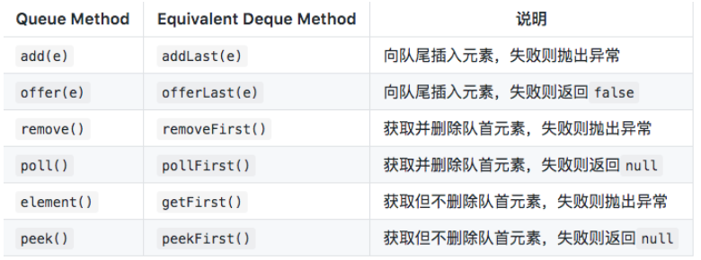
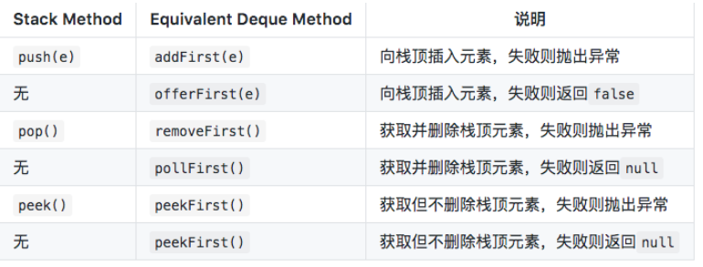

# 二叉树

## 知识点

### 二叉树遍历

**前序遍历**：**先访问根节点**，再前序遍历左子树，再前序遍历右子树 **中序遍历**：先中序遍历左子树，**再访问根节点**，再中序遍历右子树 **后序遍历**：先后序遍历左子树，再后序遍历右子树，**再访问根节点**

注意点

- 以根访问顺序决定是什么遍历
- 左子树都是优先右子树

#### 树结构

```java
public class TreeNode {
  int val;
  TreeNode left;
  TreeNode right;
  TreeNode(int x) { val = x; }
}
```

#### 前序递归

```java
public class PreOrderRecursive {
    public void preOrder(TreeNode root) {
        if (root == null) {
            return;
        }
        System.out.println(root.val);
        preOrder(root.left);
        preOrder(root.right);
    }
}
```

#### 中序递归

```java
public class InOrderRecursive {
    public void inOrder(TreeNode root) {
        if (root == null) {
            return;
        }
        inOrder(root.left);
        // 在递归中间写操作
        System.out.println(root.val);
        inOrder(root.right);
    }
}
```

#### 后序递归

```java
public class InOrderRecursive {
    public void inOrder(TreeNode root) {
        if (root == null) {
            return;
        }
        inOrder(root.left);
        inOrder(root.right);
        // 在递归后面写操作
        System.out.println(root.val);
    }
}
```

#### 前序非递归

-  用Deque模拟栈，因为Stack类是遗留类，不推荐使用。所有需要使用栈的地方都用Deque来模拟。 

```java
class Solution {
  public List<Integer> preOrderTraversal(TreeNode root) {
      if (root == null) {
          return new LinkedList<>();
      }
      List<Integer> res = new LinkedList<>();
      Deque<TreeNode> stack = new LinkedList<>();
      stack.addFirst(root);
      while(!stack.isEmpty()) {
          TreeNode node = stack.removeFirst();
          res.add(node.val);
          if (node.right != null) {
              stack.addFirst(node.right);
          }
          if (node.left != null) {
              stack.addFirst(node.left);
          }
      }
      return res;
  }
}
```

#### 中序非递归

 中序非递归遍历是先遍历最左节点，然后层层向上回溯。 

```java
class Solution {
    public List<Integer> inOrderTraversal(TreeNode root) {
        if (root == null) {
            return new LinkedList<>();
        }
        List<Integer> res = new LinkedList<>();
        Deque<TreeNode> stack = new LinkedList<>();
        TreeNode node = root;
        while(node != null || !stack.isEmpty()) {
            while (node != null) {
                stack.addLast(node);
                node = node.left;
            }
            node = stack.removeLast();
            res.add(node.val);
            node = node.right;
        }
        return res;
    }
}
```

#### 后序非递归

 后序非递归遍历，跟前序非递归有些类似，不过后序是先访问跟节点，然后左子节点，再访问右子节点，依次压入栈； 从栈里取出时，是后序遍历的反序，需要翻转。这里利用Deque的性质，可每次插入到链头，相当于翻转。 

```java
class Solution {
    public List<Integer> postrderTraversal(TreeNode root) {
        if (root == null) {
            return new LinkedList<>();
        }
        LinkedList<Integer> res = new LinkedList<>();
        Deque<TreeNode> stack = new LinkedList<>();
        stack.addFirst(root);
        while(!stack.isEmpty()) {
            TreeNode node = stack.removeFirst();
            res.addFirst(node.val);
            if (node.left != null) {
                stack.addFirst(node.left);
            }
            if (node.right != null) {
                stack.addFirst(node.right);
            }
        }
        return res;
    }
}
```

#### 补充Deque

 要讲栈和队列，首先要讲Deque接口。Deque的含义是“double ended queue”，即双端队列，它既可以当作栈使用，也可以当作队列使用。 

##### 双向队列操作

###### 插入元素

- **addFirst():** 向队头插入元素，如果元素为空，则发生NPE
- **addLast():** 向队尾插入元素，如果为空，则发生NPE
- **offerFirst():** 向队头插入元素，如果插入成功返回true，否则返回false
- **offerLast():** 向队尾插入元素，如果插入成功返回true，否则返回false

###### 移除元素

- **removeFirst():** 返回并移除队头元素，如果该元素是*null*，则发生*NoSuchElementException*
- **removeLast():** 返回并移除队尾元素，如果该元素是*null*，则发生*NoSuchElementException*
- **pollFirst():** 返回并移除队头元素，如果队列无元素，则返回*null*
- **pollLast():** 返回并移除队尾元素，如果队列无元素，则返回*null*

###### 获取元素

- **getFirst():** 获取队头元素但不移除，如果队列无元素，则发生*NoSuchElementException*
- **getLast():** 获取队尾元素但不移除，如果队列无元素，则发生*NoSuchElementException*
- **peekFirst():** 获取队头元素但不移除，如果队列无元素，则返回*null*
- **peekLast():** 获取队尾元素但不移除，如果队列无元素，则返回*null*

##### 栈操作

**pop():** 弹出栈中元素，也就是返回并移除队头元素，等价于`removeFirst()`，如果队列无元素，则发生*NoSuchElementException*

**push():** 向栈中压入元素，也就是向队头增加元素，等价于`addFirst()`，如果元素为*null*，则发生NPE，如果栈空间受到限制，则发生*IllegalStateException*

 下表列出了Deque与Queue相对应的接口： 



 下表列出了Deque与Stack对应的接口： 

