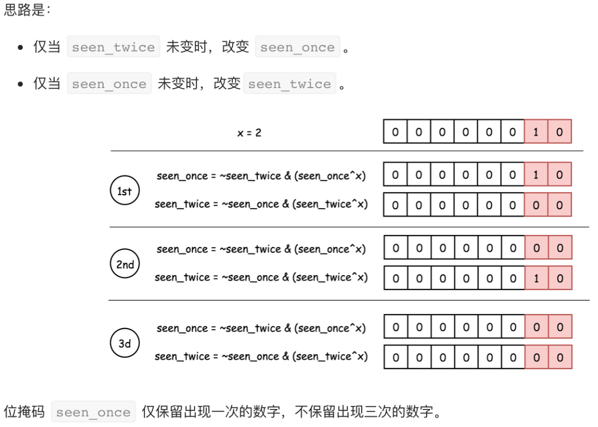

# 二进制

### 常见二进制操作

#### 基本操作

a=0^a=a^0

0=a^a

由上面两个推导出：a=a^b^b

#### 交换两个数

a=a^b

b=a^b

a=a^b

#### 移除最后一个 1

 a=n&(n-1) 

#### 获取最后一个 1

 diff=(n&(n-1))^n 

#### 位运算概览

| 符号 | 描述 | 运算规则                                                     |
| ---- | ---- | ------------------------------------------------------------ |
| &    | 与   | 两个位都为1时，结果才为1                                     |
| \|   | 或   | 两个位都为0时，结果才为0                                     |
| ^    | 异或 | 两个位相同为0，相异为1                                       |
| ~    | 取反 | 0变1，1变0                                                   |
| <<   | 左移 | 各二进位全部左移若干位，高位丢弃，低位补0                    |
| >>   | 右移 | 各二进位全部右移若干位，对无符号数，高位补0，有符号数，各编译器处理方法不一样，有的补符号位（算术右移），有的补0（逻辑右移） |

 [single-number](https://leetcode-cn.com/problems/single-number/) 

>  给定一个**非空**整数数组，除了某个元素只出现一次以外，其余每个元素均出现两次。找出那个只出现了一次的元素。 

```java
class Solution {
    public int singleNumber(int[] nums) {
        int result = 0;
        for (int num : nums) {
            // 两个相同的数做异或操作等于0，0与任何数异或，数值不变。
            result = result ^ num;
        }
        return result;
    }
}
```

 [single-number-ii](https://leetcode-cn.com/problems/single-number-ii/) 

>  给定一个**非空**整数数组，除了某个元素只出现一次以外，其余每个元素均出现了三次。找出那个只出现了一次的元素。 



```java
class Solution {
    public int singleNumber(int[] nums) {
        int seenOnce = 0, seenTwice = 0;
        for (int num : nums) {
            // 只出现一次的数按照下面的规则运算后，seenOnce就等于该数。出现三次的数运算后，seenOnce 和 seenTwice都为0
            seenOnce = ~seenTwice & (seenOnce ^ num);
            seenTwice = ~seenOnce & (seenTwice ^ num);
        }
        return seenOnce;
    }
}
```

补：

【笔记】网上大佬曾经说，如果能设计一个状态转换电路，使得一个数出现3次时能自动抵消为0，最后剩下的就是只出现1次的数。

开始设计：一个二进制位只能表示0或者1。也就是天生可以记录一个数出现了一次还是两次。

- x ^ 0 = x;
- x ^ x = 0;
- x & ~x = 0;
- x & ~0 = x;

要记录出现3次，需要两个二进制位。那么上面单独的`x`就不行了。我们需要两个变量，每个变量取一位：

- ab ^ 00 = ab;
- ab ^ ab = 00;

这里，`a`、`b`都是32位的变量。我们使用`a`的第`k`位与`b`的第`k`位组合起来的两位二进制，表示当前位出现了几次。也就是，一个`8`位的二进制`x`就变成了`16`位来表示。

- x = x[7] x[6] x[5] x[4] x[3] x[2] x[1] x[0]
- x = (a[7]b[7]) (a[6]b[6]) ... (a[1]b[1]) (a[0]b[0])

于是，就有了这一幕....

它是一个逻辑电路，`a`、`b`变量中，相同位置上，分别取出一位，负责完成`00->01->10->00`，也就是开头的那句话，当数字出现3次时置零。

```cpp
int singleNumber(vector<int>& nums) {
    int a = 0, b = 0;
    for (auto x : nums) {
        b = (b ^ x) & ~a;
        a = (a ^ x) & ~b;
    }
    return b;
}
```

 [single-number-iii](https://leetcode-cn.com/problems/single-number-iii/) 

>  给定一个整数数组 `nums`，其中恰好有两个元素只出现一次，其余所有元素均出现两次。 找出只出现一次的那两个元素。

详解见https://leetcode-cn.com/problems/single-number-iii/solution/zhi-chu-xian-yi-ci-de-shu-zi-iii-by-leetcode/  

```java
class Solution {
    public int[] singleNumber(int[] nums) {
        int bitmask = 0;
        // 这个循环只会保留出现一次的数，假设两个出现一次的数为x、y, x和y都被保存在bitmask里面，下面把他们分离出来
        for (int num : nums) {
            bitmask ^= num;
        }
        // 保留二进制数，最右边为1的值，其他为都为0，这个1要么是x的要么是y的
        int diff = bitmask & (-bitmask);
        int x = 0;
        // 这个循环确定diff是x的还是y的，并保存起来
        for (int num : nums) {
            if ((diff & num) != 0) {
                x ^= num;
            }
        }
        // y = bitmask ^ x;
        return new int[]{x, bitmask ^ x};
    }
}
```