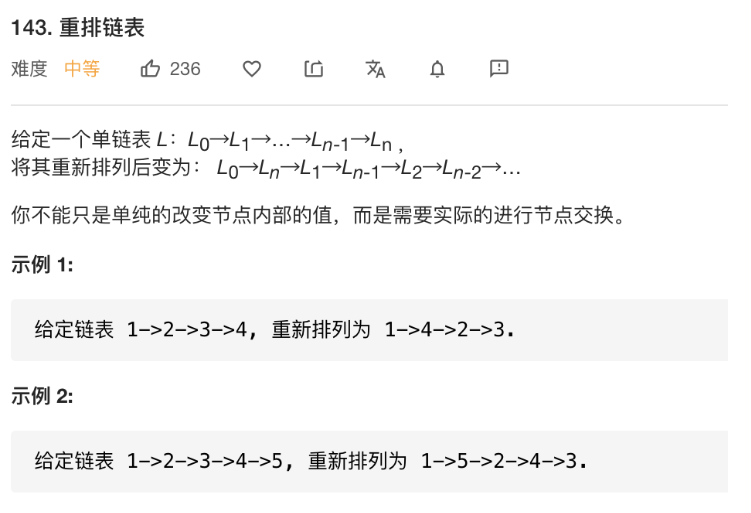
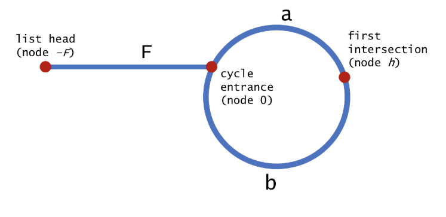

# 链表

### 基本技能

链表相关的核心点

- null/nil 异常处理
- dummy node 哑巴节点
- 快慢指针
- 插入一个节点到排序链表
- 从一个链表中移除一个节点
- 翻转链表
- 合并两个链表
- 找到链表的中间节点

### 常见题型

### [remove-duplicates-from-sorted-list](https://leetcode-cn.com/problems/remove-duplicates-from-sorted-list/)

> 给定一个排序链表，删除所有重复的元素，使得每个元素只出现一次。

非递归解法

```java
class Solution {
    public ListNode deleteDuplicates(ListNode head) {
        ListNode current = head;
        while (current != null && current.next != null) {
            if (current.val == current.next.val) {
                current.next = current.next.next;
            } else {
                current = current.next;
            }
        }
        return head;
    }
}
```

 递归解法 

```java
class Solution {
    public ListNode deleteDuplicates(ListNode head) {
        if (head == null || head.next == null) {
            return head;
        }
        head.next = deleteDuplicates(head.next);
        return head.val == head.next.val ? head.next : head;
    }
}
```

### [remove-duplicates-from-sorted-list-ii](https://leetcode-cn.com/problems/remove-duplicates-from-sorted-list-ii/)

> 给定一个排序链表，删除所有含有重复数字的节点，只保留原始链表中 没有重复出现的数字。

思路：链表头结点可能被删除，所以用 dummy node 辅助删除

```java
class Solution {
    public ListNode deleteDuplicates(ListNode head) {
        if (head == null || head.next == null) {
            return head;
        }
        ListNode dummy = new ListNode(-1);
        dummy.next = head;
        ListNode a = dummy;
        ListNode b = head.next;
        while (b != null) {
            if (a.next.val != b.val) {
                a = a.next;
                b = b.next;
            } else {
                while (b != null && a.next.val == b.val) {
                    b = b.next;
                }
                a.next = b;
                b = b == null ? null : b.next;
            }
        }
        return dummy.next;
    }
}
```

 注意点 • A->B->C 删除 B，A.next = C • 删除用一个 Dummy Node 节点辅助（允许头节点可变） • 访问 b.next一定要保证 X != null 

### [reverse-linked-list](https://leetcode-cn.com/problems/reverse-linked-list/)

> 反转一个单链表。 

 思路：用一个 newHead 做头结点，将链表依次插到头结点后面。头插法 

```java
class Solution {
    public ListNode reverseList(ListNode head) {
        if (head == null || head.next == null) {
            return head;
        }
        ListNode newHead = new ListNode(-1);
        while (head != null) {
            ListNode next = head.next;
            head.next = newHead.next;
            newHead.next = head;
            head = next;
        }
        return newHead.next;
    }
}
```

### [reverse-linked-list-ii](https://leetcode-cn.com/problems/reverse-linked-list-ii/)

> 反转从位置 *m* 到 *n* 的链表。请使用一趟扫描完成反转。

思路：先遍历到 m 处，翻转，再拼接后续，注意指针处理

```java
class Solution {
    public ListNode reverseBetween(ListNode head, int m, int n) {
        ListNode dummy = new ListNode(-1);  // 哑巴节点，指向链表的头部
        dummy.next = head;
        ListNode pre = dummy;  // pre 指向要翻转子链表的第一个节点
        for (int i = 1; i < m; ++i) {
            pre = pre.next;
        }
        head = pre.next;  // head指向翻转子链表的首部
        ListNode next;
        for (int i = m; i < n; ++i) {
            next = head.next;
            // head节点连接next节点之后链表部分，也就是向后移动一位
            head.next = next.next;
            // next节点移动到需要反转链表部分的首部
            next.next = pre.next;
            // pre继续为需要反转头节点的前驱节点
            pre.next = next;
        }
        return dummy.next;
    }
}
```

### [merge-two-sorted-lists](https://leetcode-cn.com/problems/merge-two-sorted-lists/)

> 将两个升序链表合并为一个新的升序链表并返回。新链表是通过拼接给定的两个链表的所有节点组成的。

思路：递归

```java
class Solution {
    public ListNode mergeTwoLists(ListNode l1, ListNode l2) {
        if (l1 == null) {
            return l2;
        } else if (l2 == null) {
            return l1;
        } else if (l1.val <= l2.val) {
            l1.next = mergeTwoLists(l1.next, l2);
            return l1;
        } else {
            l2.next = mergeTwoLists(l1, l2.next);
            return l2;
        }

    }
}
```

### [partition-list](https://leetcode-cn.com/problems/partition-list/)

 给定一个链表和一个特定值 x，对链表进行分隔，使得所有小于 *x* 的节点都在大于或等于 *x* 的节点之前。 

 思路：构造两个链表，beforeHead小于x的节点，afterHead大于x的节点，最后将他们连在一起 

```java
class Solution {
    public ListNode partition(ListNode head, int x) {
        // 构造两个链表，beforeHead小于x的节点，afterHead大于x的节点，最后将他们连在一起
        // 这里的技巧就是给两个链表都搞一个哑巴节点，也就是指向头结点的节点
        ListNode beforeHead = new ListNode(-1);
        ListNode before = beforeHead;
        ListNode afterHead = new ListNode(-1);
        ListNode after = afterHead;
        while (head != null) {
            if (head.val < x) {
                before.next = head;
                before = before.next;
            } else {
                after.next = head;
                after = after.next;
            }
            head = head.next;
        }
        after.next = null;
        before.next = afterHead.next;
        return beforeHead.next;
    }
}
```

哑巴节点使用场景

> 当头节点不确定的时候，使用哑巴节点

### [sort-list](https://leetcode-cn.com/problems/sort-list/)

> 在 *O*(*n* log *n*) 时间复杂度和常数级空间复杂度下，对链表进行排序。

思路：归并排序，找中点和合并操作

```java
class Solution {
    public ListNode sortList(ListNode head) {
        // 递归结束条件
        if (head == null || head.next == null) {
            return head;
        }
        ListNode slow = head, fast = head.next;
        // 找到链表中点
        while (fast != null && fast.next != null) {
            slow = slow.next;
            fast = fast.next.next;
        }
        ListNode rightHead = slow.next;
        slow.next = null;
        ListNode left = sortList(head);
        ListNode right = sortList(rightHead);
        return mergeLists(left, right);
    }
    private ListNode mergeLists(ListNode left, ListNode right) {
        ListNode dummy = new ListNode(-1);
        ListNode curNode = dummy;
        while (left != null && right != null) {
            if (left.val < right.val) {
                curNode.next = left;
                left = left.next;
            } else {
                curNode.next = right;
                right = right.next;
            }
            curNode = curNode.next;
        }
        curNode.next = (right != null) ? right : left;
        return dummy.next;
    }
}
```

### [reorder-list](https://leetcode-cn.com/problems/reorder-list/)



 思路：找到中点断开，翻转后面部分，然后合并前后两个链表 

```java
class Solution {
    public void reorderList(ListNode head) {
        if (head == null || head.next == null) {
            return;
        }
        ListNode slow = head, fast = head.next;
        // 找到链表中点
        while (fast != null && fast.next != null) {
            slow = slow.next;
            fast = fast.next.next;
        }
        // 将后一半链表翻转, 用fast记录后一段的头结点
        fast = reverse(slow.next);
        // 将链表切断
        slow.next = null;
        // 合并链表
        mergeLists(head, fast);
    }
    private void mergeLists(ListNode l1, ListNode l2) {
        ListNode head = l1, temp;
        while (l1 != null && l2 != null) {
            temp = l2.next;
            l2.next = l1.next;
            l1.next = l2;
            l2 = temp;
            l1 = l1.next.next;
        }
        // 将未合并完的l2接到l1后面
        if (l2 != null) {
            l1.next = l2;
        }
        l1 = head;
    }
    private ListNode reverse(ListNode head) {
        ListNode newHead = null;
        while (head != null) {
            ListNode nextNode = head.next;
            head.next = newHead;
            newHead = head;
            head = nextNode;
        }
        return newHead;
    } 
}
```

### [linked-list-cycle](https://leetcode-cn.com/problems/linked-list-cycle/)

>  给定一个链表，判断链表中是否有环。 

 思路：快慢指针，快慢指针相同则有环，如果有环每走一步快慢指针距离会减 1，最终重合。 

```java
public class Solution {
    public boolean hasCycle(ListNode head) {
        if (head == null) {
            return false;
        }
        ListNode p = head, q = head;
        boolean flag = false;
        while (p.next != null && q.next != null) {
            p = p.next;
            if (q.next.next != null) {
                q = q.next.next;
            } else {
                break;
            }
            if (p == q) {
                flag = true;
                break;
            }
        }
        return flag;
    }
}
```

### [linked-list-cycle-ii](https://leetcode-cn.com/problems/https://leetcode-cn.com/problems/linked-list-cycle-ii/)

> 给定一个链表，返回链表开始入环的第一个节点。 如果链表无环，则返回 `null`。

思路：快慢指针，快慢相遇之后，慢指针回到头，快慢指针步调一致一起移动，相遇点即为入环点



```
2(F + a) = F + N(a + b) + a
 2F + 2a = F + 2a + b + (N - 1)(a + b)
       F = b + (N - 1)(a + b)
F是到达入口点长度
N为fast跑第几圈会与slow相遇
```

 详解见https://leetcode-cn.com/problems/linked-list-cycle-ii/solution/huan-xing-lian-biao-ii-by-leetcode/ 

```java
public class Solution {
    public ListNode detectCycle(ListNode head) {
        if (head == null || head.next == null) {
            return null;
        }
        ListNode fast = head.next, slow = head;
        while (fast != null && fast.next != null) {
            if (fast == slow) { // 第一次相遇，slow回到head, fast从相遇点下一个节点开始走，
                slow = head;
                fast = fast.next;
                while (fast != slow) { // 第二次相遇的地方就是环的入口
                    fast = fast.next;
                    slow = slow.next;
                }
                return slow;
            }
            fast = fast.next.next;
            slow = slow.next;
        }
        return null;
    }
}
```

坑点

- 指针比较时直接比较对象，不要用值比较，链表中有可能存在重复值情况
- 第一次相交后，快指针需要从下一个节点开始和头指针一起匀速移动

另外一种方式是 fast=head,slow=head

```java
public class Solution {
    public ListNode detectCycle(ListNode head) {
        if (head == null || head.next == null) {
            return null;
        }
        ListNode fast = head, slow = head;
        while (fast != null && fast.next != null) {
            fast = fast.next.next;
            slow = slow.next;
            if (fast == slow) { // 第一次相遇，slow回到head, fast从相遇点下一个节点开始走，
                slow = head;
                while (fast != slow) { // 第二次相遇的地方就是环的入口
                    fast = fast.next;
                    slow = slow.next;
                }
                return slow;
            }
        }
        return null;
    }
}
```

这两种方式不同点在于，**一般用 fast=head.Next 较多**，因为这样可以知道中点的上一个节点，可以用来删除等操作。

- fast 如果初始化为 head.Next 则中点在 slow.Next
- fast 初始化为 head,则中点在 slow

### [palindrome-linked-list](https://leetcode-cn.com/problems/palindrome-linked-list/)

> 请判断一个链表是否为回文链表。

切成两半，把后半段反转，然后比较两半是否相等。

```java
class Solution {
    public boolean isPalindrome(ListNode head) {
        if (head == null || head.next == null) {
            return true;
        }
        ListNode slow = head, fast = head.next;
        // 找到链表中点
        while (fast != null && fast.next != null) {
            slow = slow.next;
            fast = fast.next.next;
        }
        if (fast != null) {
            slow = slow.next;
        }
        // 将链表切成两半
        cut(head, slow);
        // 将后一半链表翻转，然后判断两半链表是否相等
        return isEqual(head, reverse(slow));
    }
    private boolean isEqual(ListNode l1, ListNode l2) {
        while (l1 != null && l2 != null) {
            if (l1.val != l2.val) {
                return false;
            }
            l1 = l1.next;
            l2 = l2.next;
        }
        return true;
    }
    private void cut(ListNode head, ListNode cutNode) {
        while (head.next != cutNode) {
            head = head.next;
        }
        head.next = null;
    }
    private ListNode reverse(ListNode head) {
        ListNode newHead = null;
        while (head != null) {
            ListNode nextNode = head.next;
            head.next = newHead;
            newHead = head;
            head = nextNode;
        }
        return newHead;
    } 
}
```

### [copy-list-with-random-pointer](https://leetcode-cn.com/problems/copy-list-with-random-pointer/)

> 给定一个链表，每个节点包含一个额外增加的随机指针，该指针可以指向链表中的任何节点或空节点。 要求返回这个链表的 深拷贝。

详解见https://leetcode-cn.com/problems/copy-list-with-random-pointer/solution/fu-zhi-dai-sui-ji-zhi-zhen-de-lian-biao-by-leetcod/

```java
class Solution {
    public Node copyRandomList(Node head) {
        if (head == null) {
            return null;
        }
        Node ptr = head;
        // 将原链表每个节点旁边增加一个节点
        while (ptr != null) {
            Node newNode = new Node(ptr.val);
            newNode.next = ptr.next;
            ptr.next = newNode;
            ptr = newNode.next;
        }
        ptr = head;
        // 将复制链表的random指向对应的位置
        while (ptr != null) {
            ptr.next.random = (ptr.random != null) ? ptr.random.next : null;
            ptr = ptr.next.next;
        }
        // 将复制链表的next指向对应的位置
        Node ptrOld = head, ptrNew = head.next, newHead = head.next;
        while (ptrOld != null) {
            ptrOld.next = ptrOld.next.next;
            ptrNew.next = (ptrNew.next != null) ? ptrNew.next.next : null;
            ptrOld = ptrOld.next;
            ptrNew = ptrNew.next;
        }
        return newHead;
    }
}
```

## [总结](https://wardseptember.gitee.io/mynotes/#/docs/LeetCode/data_structure/linked_list?id=总结)

链表必须要掌握的一些点，通过下面练习题，基本大部分的链表类的题目都是手到擒来~

- null/nil 异常处理
- dummy node 哑巴节点
- 快慢指针
- 插入一个节点到排序链表
- 从一个链表中移除一个节点
- 翻转链表
- 合并两个链表
- 找到链表的中间节点

## [练习](https://wardseptember.gitee.io/mynotes/#/docs/LeetCode/data_structure/linked_list?id=练习)

-  [remove-duplicates-from-sorted-list](https://leetcode-cn.com/problems/remove-duplicates-from-sorted-list/)
-  [remove-duplicates-from-sorted-list-ii](https://leetcode-cn.com/problems/remove-duplicates-from-sorted-list-ii/)
-  [reverse-linked-list](https://leetcode-cn.com/problems/reverse-linked-list/)
-  [reverse-linked-list-ii](https://leetcode-cn.com/problems/reverse-linked-list-ii/)
-  [merge-two-sorted-lists](https://leetcode-cn.com/problems/merge-two-sorted-lists/)
-  [partition-list](https://leetcode-cn.com/problems/partition-list/)
-  [sort-list](https://leetcode-cn.com/problems/sort-list/)
-  [reorder-list](https://leetcode-cn.com/problems/reorder-list/)
-  [linked-list-cycle](https://leetcode-cn.com/problems/linked-list-cycle/)
-  [linked-list-cycle-ii](https://leetcode-cn.com/problems/https://leetcode-cn.com/problems/linked-list-cycle-ii/)
-  [palindrome-linked-list](https://leetcode-cn.com/problems/palindrome-linked-list/)
-  [copy-list-with-random-pointer](https://leetcode-cn.com/problems/copy-list-with-random-pointer/)