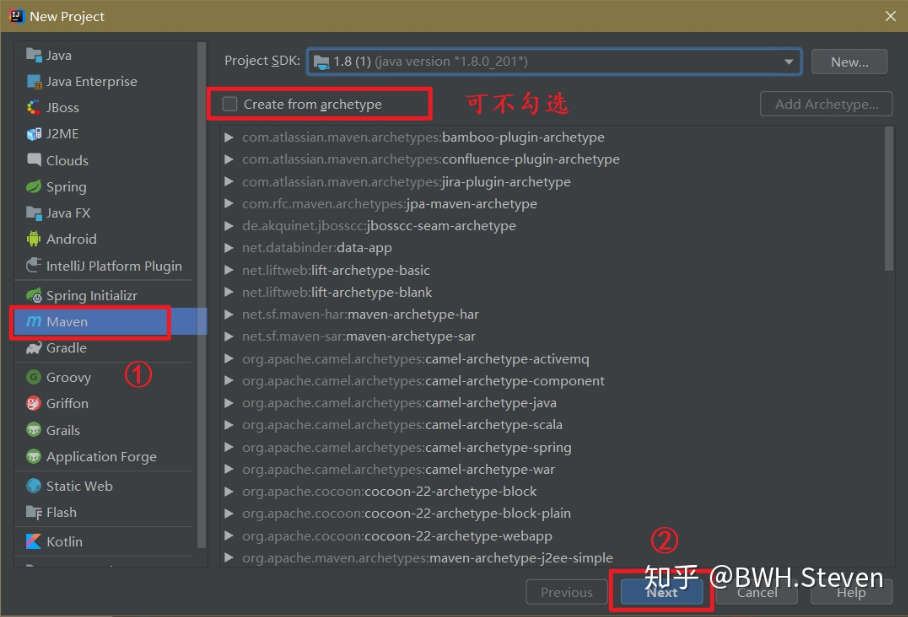
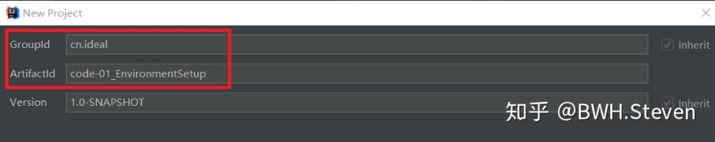
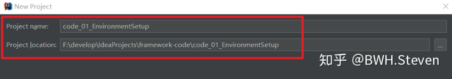

### MyBatis 从认识到环境搭建

**原始 jdbc 是什么样的 ？**

简单的梳理一下我们使用 JDBC 的流程：① 引入相关数据库驱动 Jar 包 ② 创建一个数据库连接。

在这个类中包括：数据库驱动的加载、数据库连接的配置、连接对象的获取、以及释放关闭，以及具体的SQL以及其执行语句，下面是一个

下面代码是 JDBC最原始的方式，没有经过任何优化和封装，功能是查询student表中的所有记录

```java
package cn.ideal.jdbc;
 ​
 import cn.ideal.domain.Student;
 ​
 import java.sql.*;
 ​
 public class JdbcDemo {
     public static void main(String[] args) {
 ​
         Connection connection = null;
         Statement statement = null;
         ResultSet resultSet = null;
 ​
         try {
             //注册驱动
             Class.forName("com.mysql.jdbc.Driver");
             //获取与数据库的连接对象
             connection = DriverManager.getConnection("jdbc:mysql://localhost:3306/db1", "root", "root99");
             //定义sql语句
             String sql = "SELECT * FROM student";
             //获取执行sql语句的对象statement
             statement = connection.createStatement();
             //执行sql语句，获取结果集
             resultSet = statement.executeQuery(sql);
 ​
             //遍历获取到的结果集
             while (resultSet.next()) {
                 int id = resultSet.getInt(1);
                 String name = resultSet.getString(2);
                 Double score = resultSet.getDouble(3);
 ​
                 Student student = new Student();
                 student.setId(id);
                 student.setName(name);
                 student.setScore(score);
 ​
                 System.out.println(student.toString());
             }
 ​
         } catch (ClassNotFoundException e) {
             e.printStackTrace();
         } catch (SQLException e) {
             e.printStackTrace();
         } finally {
             //释放资源，后调用的先释放
             if (resultSet != null) {
                 try {
                     resultSet.close();
                 } catch (SQLException e) {
                     e.printStackTrace();
                 }
             }
 ​
             if (statement != null) {
                 try {
                     statement.close();
                 } catch (SQLException e) {
                     e.printStackTrace();
                 }
             }
 ​
             if (connection != null) {
                 try {
                     connection.close();
                 } catch (SQLException e) {
                     e.printStackTrace();
                 }
             }
         }
     }
 }
 ​
```

通过这段代码我们可以分析到：

- ① 代码中，数据库驱动名称、链接地址、账号密码等，全部被写死到程序中，也就是说当你需要修改某些值时，你必须要修改源代码，这也就是我们所谓的 “硬编码”

- - 举个例子：如果我们更换了数据库 Eg：MySQL -> Oracle ，或者更换了服务器，因此地址发生了变化，又或者数据库密码被修改，我们就都需要回到源代码中进行修改，重新编译、打包上线

- ② 数据库连接需要频繁的创建和释放，系统资源浪费，且影响性性能（数据库连接池技术解决）


这段代码是使用了 preparedStatement 预处理对象进行替代其父类 Statement 对象，这也是我们只考虑原始 JDBC 情况下 一般会选用的，那么它又有什么问题呢?

```
 //定义sql
 String sql = "SELECT * FROM user WHERE username = ? AND password = ?";
 //获取执行sql的对象
 preparedStatement = connection.prepareStatement(sql);
 //给?赋值
 preparedStatement.setString(1, username);
 preparedStatement.setString(2, password);
 ​
 //执行查询
 resultSet = preparedStatement.executeQuery();
```

- ③ 当使用 preparedStatement 设置占位符语句，并且对其进行参数传递时都是 “硬编码“ 因为 sql 语句的 where 条件可能会变化，如果修改 sql 还需要，修改源代码

还有一种情况是这样的：

```
 //遍历获取到的结果集
 while (resultSet.next()) {
     int id = resultSet.getInt("id");
     String name = resultSet.getString("name");
     Double score = resultSet.getDouble("score");
 ​
     Student student = new Student();
     student.setId(id);
     student.setName(name);
     student.setScore(score);
 ​
 }
```

- ④ 如果我们在 ResultSet 中遍历结果集时如果我们使用 `getInt` 等这种方法，参数为字段名，当数据库对应表字段出现改变时，源代码再一次需要被修改

之前我们一定程度上的便捷我们的开发，可能有使用过 Spring 的 JdbcTemplate 或者 Apache 的 DBUtils ，它们都是对 JDBC 的简单封装，只能算作工具类，不能算作一个完整的框架， 而我们下面要讲的 Mybatis 则是一个可能解决这些问题的框架

### MyBatis 概述

> MyBatis 是一款优秀的持久层框架，它支持定制化 SQL、存储过程以及高级映射。MyBatis 避免了几乎所有的 JDBC 代码和手动设置参数以及获取结果集。MyBatis 可以使用简单的 XML 或注解来配置和映射原生信息，将接口和 Java 的 POJOs(Plain Ordinary Java Object,普通的 Java对象)映射成数据库中的记录 ——百度百科

1、MyBatis 可以将 sql 语句配置在 XML 中，这样解决了 sql 语句写在 Java类中的 "硬编码" 问题

2、通过输入参数映射机制，将参数灵活的配置起来，解决了在 Java 类中手工配置的问题

3、通过输出映射机制， 结果集的检索自动映射成相应的 Java对象，避免了 JDBC 中对结果集的手工检索

4、这种映射机制实际上使用了 ORM 的思想

- ORM (Object Relational Mapping) 对象关系映射
- 简单理解：数据库表和实体类中的属性进行对应，我们可以操作实体类就实现操作数据库表

### MyBatis 的环境配置（IDEA）

#### (一) 创建 Maven项目

打开 IDEA ，创建一个 Maven 项目，如下图所示



修改 GroupId 和 ArtifactId 的值

- GroupID是项目组织唯一的标识符，实际对应JAVA的包的结构，是main目录里java的目录结构

- - 一般以域名倒序填写

- ArtifactID就是项目的唯一的标识符，实际对应项目的名称，就是项目根目录的名称



设置其地址



#### (二) 修改 pom 导入MyBatis坐标

选择打包方式为 jar包： `<packaging>jar</packaging>`

下面我们导入了 mybatis、mysql、log4j (日志)、junit (单元测试) 的依赖

```
 <?xml version="1.0" encoding="UTF-8"?>
 <project xmlns="http://maven.apache.org/POM/4.0.0"
          xmlns:xsi="http://www.w3.org/2001/XMLSchema-instance"
          xsi:schemaLocation="http://maven.apache.org/POM/4.0.0 http://maven.apache.org/xsd/maven-4.0.0.xsd">
     <modelVersion>4.0.0</modelVersion>
 ​
     <groupId>cn.ideal</groupId>
     <artifactId>code_01_EnvironmentSetup</artifactId>
     <version>1.0-SNAPSHOT</version>
     <!-- 打包方式 -->
     <packaging>jar</packaging>
 ​
     <!-- 对应依赖 -->
     <dependencies>
         <dependency>
             <groupId>org.mybatis</groupId>
             <artifactId>mybatis</artifactId>
             <version>3.4.5</version>
         </dependency>
         <dependency>
             <groupId>mysql</groupId>
             <artifactId>mysql-connector-java</artifactId>
             <version>5.1.6</version>
         </dependency>
         <dependency>
             <groupId>log4j</groupId>
             <artifactId>log4j</artifactId>
             <version>1.2.12</version>
         </dependency>
         <dependency>
             <groupId>junit</groupId>
             <artifactId>junit</artifactId>
             <version>4.10</version>
         </dependency>
     </dependencies>
 ​
 </project>
```

#### (三) 创建实体类

```
package cn.ideal.domain;
 ​
 import java.io.Serializable;
 import java.util.Date;
 ​
 public class User implements Serializable {
     private Integer id;
     private String username;
     private Integer telephone;
     private Date birthday;
     private String gender;
     private String address;
 ​
     ...为节省长度，省略其对应 get set方法，请大家自行补充
 ​
     @Override
     public String toString() {
         return "User{" +
                 "id=" + id +
                 ", username='" + username + '\'' +
                 ", telephone=" + telephone +
                 ", birthday=" + birthday +
                 ", gender='" + gender + '\'' +
                 ", address='" + address + '\'' +
                 '}';
     }
 }
```

#### (四) 创建mapper接口

mapper 与我们之前学习的 dao 的意义是一致的，只是名称上的不同，对应的 mapper 写为 dao 也是可以的

```
 package cn.ideal.mapper;
 ​
 import cn.ideal.domain.User;
 import java.util.List;
 ​
 public interface UserMapper {
     /**
      * 查询所有用户信息
      * @return
      */
     List<User> findAllUserInfo();
 }
```

#### (五) 编写数据库连接池配置文件（主配置文件）

在resources下创建一个名为 SqlMapConfig.xml 的文件，这也就是我们的主配置文件

而数据库连接池的配置，是配置环境中重要的一点

① 由于其配置文件为 xml 格式，我们需要在头部指定 xml 的版本和编码信息

```
<?xml version="1.0" encoding="UTF-8"?>
```

② 为了保证 MyBatis 在读取该 xml 文件时，配置文件中的每一个标签对，以及标签对中的参数值配置符合标准，引入 DTD 规范约束

```
 <!DOCTYPE configuration
         PUBLIC "-//mybatis.org//DTD Config 3.0//EN"
         "http://mybatis.org/dtd/mybatis-3-config.dtd">
```

接下来就是配置正文，

- `<environments></environments>`标签中的 default 值与 `<environment></<environment>` 中的 id 值务必保持一致

- `<transactionManager></transactionManager>`配置 Mybatis 的事务控制类型

- `<dataSource></<dataSource>` 配置数据库连接信息

- - `<property></property>` 配置具体的值


- 在底部的 `<mappers></mappers>`标签中指定了映射配置文件的位置，也就是说我们 SQL相关的语句都在这个指定的配置文件中，而这里我们指定了它的路径

详细代码：

```
<?xml version="1.0" encoding="UTF-8"?>
<!DOCTYPE configuration
        PUBLIC "-//mybatis.org//DTD Config 3.0//EN"
        "http://mybatis.org/dtd/mybatis-3-config.dtd">
<!-- mybatis 主配置文件 -->
<configuration>
    <!-- 配置环境，和spring整合后 environments配置将会被废除 -->
    <environments default="development">
        <environment id="development">
            <!-- 使用JDBC事务管理 -->
            <transactionManager type="JDBC"></transactionManager>
            <!-- 数据库连接池 -->
            <dataSource type="POOLED">
                <property name="driver" value="com.mysql.jdbc.Driver"/>
                <property name="url" value="jdbc:mysql://localhost:3306/ideal_mybatis"/>
                <property name="username" value="root"/>
                <property name="password" value="=root99r"/>
            </dataSource>
        </environment>
    </environments>

    <!-- 指定映射配置文件的位置 -->
    <mappers>
        <mapper resource="cn.ideal.dao/UserMapper.xml"/>
    </mappers>
</configuration>
```

#### (六) SQL映射配置文件

为了解决 原生 JDBC 的一些不足，在 MyBatis 中，SQL语句不会直接出现在 Java类中，它将几乎所有的 SQL 语句放在 配置文件中，他会在适当的情况下，加载这个配置文件，完成一定的操作

首先仍然是，xml的版本和编码格式，然后引入DTD约束

然后在 `<mapper></mapper>` 标签中编写我们具体的配置

- 其中的 namespace属性，就是对SQL进行分类化管理，将实现不同业务的SQL分开，这里我们对其取值就是我们之前mapper接口的全限定类

- 特别注意：创建包时，我们创建的是一个三级目录，而创建配置文件的目录的时候，直接创建 cn.ideal.mapper 是一级目录，我们需要一层一层的创建，保证其也为三级目录

- 在`<mapper></mapper>`标签中创建一个 `<select></select>` 标签 其中 属性 id 的值为mapper接口的方法名

- - `parameterType、parameterMap、resultType、resultClass、resultMap`分别代表
  - 输入参数类型、输入参数集合、结果类型、结果类、结果集合

```
<?xml version="1.0" encoding="UTF-8"?>
<!DOCTYPE mapper
        PUBLIC "-//mybatis.org//DTD Mapper 3.0//EN"
        "http://mybatis.org/dtd/mybatis-3-mapper.dtd">
<mapper namespace="cn.ideal.mapper.UserMapper">
    <select id="findAllUserInfo" resultType="cn.ideal.domain.User">
        select * from  user
    </select>
</mapper>
```

