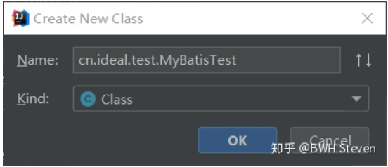

# MyBatis入门到自定义MyBatis框架

### 第一个 MyBatis 程序（XML配置）

首先，我们想让我们的第一个程序运行起来

1. 搭建好环境，在主配置文件 (SqlMapConfig.xml) 中指定映射配置文件的位置

   ```
    <!-- 指定映射配置文件的位置 -->
    <mappers>
        <mapper resource="cn/ideal/mapper/UserMapper.xml"/>
    </mappers>
   ```

2. 在test文件夹下，创建一个如图结构测试类



由于我们的 mapper 接口中写的方法是一个 查询所有信息的方法，所以我们直接如下图所写就行了，这就是第一个例程，后面我们会详细的讲到其中的点，先让自己的程序跑起来看看

```java
 public class MyBatisTest {
     public static void main(String[] args) throws Exception {
         //读取配置文件
         InputStream in = Resources.getResourceAsStream("SqlMapConfig.xml");
         //创建SqlSessionFactory工厂
         SqlSessionFactoryBuilder factoryBuilder = new SqlSessionFactoryBuilder();
         SqlSessionFactory factory = factoryBuilder.build(in);
         //使用工厂生产SqlSession对象
         SqlSession session = factory.openSession();
         //使用SqlSession创建Mapper接口的代理对象
         UserMapper userMapper = session.getMapper(UserMapper.class);
         //使用代理对象执行方法
         List<User> users = userMapper.findAllUserInfo();
         for (User user : users) {
             System.out.println(user);
         }
         //释放资源
         session.close();
         in.close();
     }
 }
```

### 第一个 MyBatis 程序（注解配置）

注解配置，自然我们刚才的 UserMapper.xml 就可以删除了掉了，同时我们需要在mapper接口方法中添加注解如图所示

```java
public interface UserMapper {
     /**
      * 查询所有用户信息
      *
      * @return
      */
     @Select("select * from user")
     List<User> findAllUserInfo();
 }
```