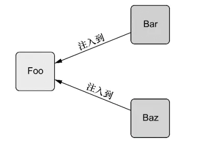
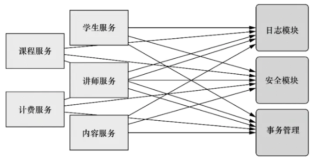
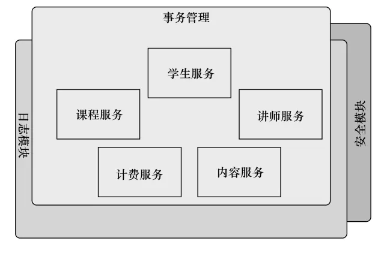
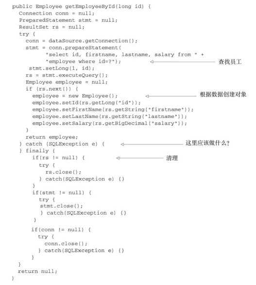
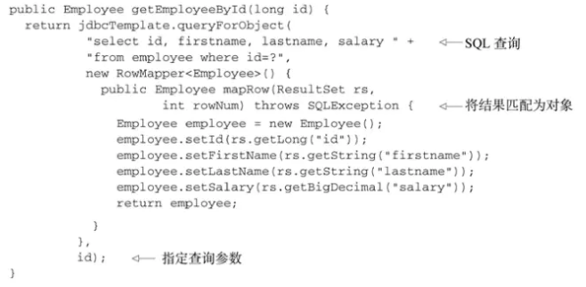
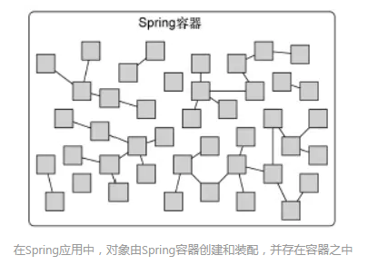
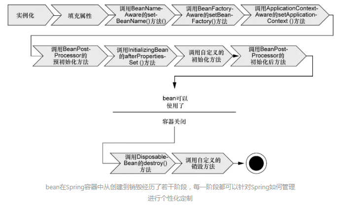
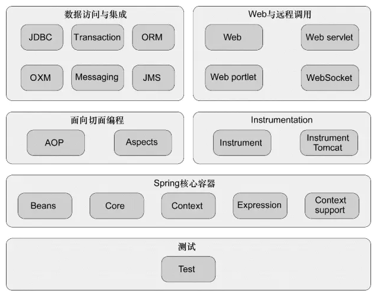

# 深入理解Spring框架的作用

  支撑Spring的仅仅是少许的基本理念， 所有的理念都可以追溯到Spring最根本的使命上： 简化Java开发。 

为了降低Java开发的复杂性， Spring采取了以下4种关键策略：

- 基于POJO的轻量级和最小侵入性编程；
- 通过依赖注入和面向接口实现松耦合；
- 基于切面和惯例进行声明式编程；
- 通过切面和模板减少样板式代码。

### 激发POJO的潜能

 如果你从事Java编程有一段时间了， 那么你或许会发现（可能你也实际使用过） 很多框架通过强迫应用继承它们的类或实现它们的接口从而导致应用与框架绑死。
这种侵入式的编程方式在早期版本的Struts以及无数其他的Java规范和框架中都能看到。 

 Spring竭力避免因自身的API而弄乱你的应用代码。 Spring不会强迫你实现Spring规范的接口或继承Spring规范的类， 相反， 在基于Spring构建的应用中， 它的类通常没有任何痕迹表明你使用了Spring。 最坏的场景是， 一个类或许会使用Spring注解， 但它依旧是POJO。 

  Spring的非侵入编程模型意味着这个类在Spring应用和非Spring应用中都可以发挥同样的作用。 

> Spring的非入侵式就是不强制类要实现Spring的任何接口或类，没有任何地方表明它是一个Spring组件。 意味着这个类在Spring应用和非Spring应用中都可以发挥同样的作用。 

 尽管形式看起来很简单， 但POJO一样可以具有魔力。 Spring赋予POJO魔力的方式之一就是通过DI来装配它们。 

### 依赖注入

 任何一个有实际意义的应用（肯定比Hello World示例更复杂） 都会由两个或者更多的类组成， 这些类相互之间进行协作来完成特定的业务逻辑。 按照传统的做法， 每个对象负责管理与自己相互协作的对象（即它所依赖的对象） 的引用， 这将会导致高度耦合和难以测试的代码。 

```java
public class DamselRescuingKnight implements Knight {
  private RescueDamselQuest quest;
  public DamselRescuingKnight() {
    this.quest = new RescueDamselQuest();
  }

  public void embarkOnQuest() {
    quest.embark();
  }
}
```

DamselRescuingKnight只能执行RescueDamselQuest探险任务。

可以看到， DamselRescuingKnight在它的构造函数中自行创建了Rescue DamselQuest。 这使得DamselRescuingKnight紧密地和RescueDamselQuest耦合到了一起， 因此极大地限制了这个骑士执行探险的能力。 如果一个少女需要救援， 这个骑士能够召之即来。 但是如果一条恶龙需要杀掉， 那么这个骑士就爱莫能助了。

更糟糕的是， 为这个DamselRescuingKnight编写单元测试将出奇地困难。 在这样的一个测试中， 你必须保证当骑士的embarkOnQuest()方法被调用的时候， 探险的embark()方法也要被调用。 但是没有一个简单明了的方式能够实现这一点。 很遗
憾， DamselRescuingKnight将无法进行测试。

>  耦合具有两面性（two-headed beast） 。 一方面， 紧密耦合的代码难以测试、 难以复用、 难以理解， 并且典型地表现出“打地鼠”式的bug特性（修复一个bug， 将会出现一个或者更多新的bug） 。 另一方面， 一定程度的耦合又是必须的——完全没有耦合的代码什么也做不了。 为了完成有实际意义的功能， 不同的类必须以适当的方式进行交互。 总而言之， 耦合是必须的， 但应当被小心谨慎地管理。 

 通过DI， 对象的依赖关系将由系统中负责协调各对象的第三方组件在创建对象的时候进行设定。 对象无需自行创建或管理它们的依赖关系，依赖关系将被自动注入到需要它们的对象当中去。 



 为了展示这一点， 让我们看一看程序清单1.3中的BraveKnight， 这个骑士不仅勇敢， 而且能挑战任何形式的探险。 

```java
public class BraveKnight implements Knight {
  private Quest quest;
  public BraveKnight(Quest quest) {
    this.quest = quest;
  }

  public void embarkOnQuest() {
    quest.embark();
  }
}
```

我们可以看到， 不同于之前的DamselRescuingKnight， BraveKnight没有自行创建探险任务， 而是在构造的时候把探险任务作为构造器参数传入。 这是依赖注入的方式之一， 即构造器注入（constructor injection） 。

更重要的是， 传入的探险类型是Quest， 也就是所有探险任务都必须实现的一个接口。 所以， BraveKnight能够响应RescueDamselQuest、 SlayDragonQuest、 MakeRound TableRounderQuest等任意的Quest实现。

这里的要点是BraveKnight没有与任何特定的Quest实现发生耦合。 对它来说， 被要求挑战的探险任务只要实现了Quest接口， 那么具体是哪种类型的探险就无关紧要了。 这就是DI所带来的最大收益——松耦合。

>  如果一个对象只通过接口（而不是具体实现或初始化过程） 来表明依赖关系， 那么这种依赖就能够在对象本身毫不知情的情况下， 用不同的具体实现进行替换 

 现在BraveKnight类可以接受你传递给它的任意一种Quest的实现， 但该怎样把特定的Query实现传给它呢？ 假设， 希望BraveKnight所要进行探险任务是杀死一只怪龙， 那么程序清单中的SlayDragonQuest也许是挺合适的。 

```java
import java.io.PrintStream;

public class SlayDragonQuest implements Quest {
    this.stream = stream;
  }

  public void embark() {
    stream.println("Embarking on quest to slay the dragon!");
  }
}
```

 SlayDragonQuest是要注入到BraveKnight中的Quest实现 

我们可以看到， SlayDragonQuest实现了Quest接口， 这样它就适合注入到BraveKnight中去了。 与其他的Java入门样例有所不同， SlayDragonQuest没有使用System.out.println()， 而是在构造方法中请求一个更为通用的PrintStream。 这里最大的问题在于:

- 我们该如何将SlayDragonQuest交给BraveKnight呢？
- 又如何将PrintStream交给SlayDragonQuest呢？

 创建应用组件之间协作的行为通常称为装配（wiring） 。 Spring有多种装配bean的方式， 采用XML是很常见的一种装配方式。 程序清单1.6展现了一个简单的Spring配置文件： knights.xml， 该配置文件将BraveKnight、 SlayDragonQuesth和PrintStream装配到了一起。 

```xml
<?xml version="1.0" encoding="UTF-8"?>
<beans xmlns="http://www.springframework.org/schema/beans"
  xmlns:xsi="http://www.w3.org/2001/XMLSchema-instance"
  xsi:schemaLocation="http://www.springframework.org/schema/beans 
      http://www.springframework.org/schema/beans/spring-beans.xsd">

  <bean id="knight" class="sia.knights.BraveKnight">
    <constructor-arg ref="quest" />
  </bean>

  <bean id="quest" class="sia.knights.SlayDragonQuest">
    <constructor-arg value="#{T(System).out}" />
  </bean>
</beans>
```

装配的作用就是创建类的实例，同时将类的构造函数或者setter函数参数设置好，这是为了配置对象和对象之间的关系。

在这里， BraveKnight和SlayDragonQuest被声明为Spring中的bean。 就BraveKnight bean来讲， 它在构造时传入了对SlayDragonQuest bean的引用， 将其作为构造器参数。 同时， SlayDragonQuest bean的声明使用了Spring表达式语言（Spring Expression Language） ， 将System.out（这是一个PrintStream） 传入到了SlayDragonQuest的构造器中。

 Spring还支持使用Java来描述配置。 比如， 程序清单1.7展现了基于Java的配置， 它的功能与程序清单1.6相同。 

```java
package sia.knights.config;

import org.springframework.context.annotation.Bean;
import org.springframework.context.annotation.Configuration;

import sia.knights.BraveKnight;
import sia.knights.Knight;
import sia.knights.Quest;
import sia.knights.SlayDragonQuest;

@Configuration
public class KnightConfig {

  @Bean
  public Knight knight() {
    return new BraveKnight(quest());
  }
  
  @Bean
  public Quest quest() {
    return new SlayDragonQuest(System.out);
  }
}
```

 尽管BraveKnight依赖于Quest， 但是它并不知道传递给它的是什么类型的Quest， 也不知道这个Quest来自哪里。 与之类似， SlayDragonQuest依赖于PrintStream， 但是在编码时它并不需要知道这个PrintStream是什么样子的。 只有Spring通过它的配置， 能够了解这些组成部分是如何装配起来的。 这样的话， 就可以在不改变所依赖的类的情况下， 修改依赖关系。 

### 观察它如何工作

 Spring通过应用上下文（Application Context） 装载bean的定义并把它们组装起来。 Spring应用上下文全权负责对象的创建和组装。 Spring自带了多种应用上下文的实现， 它们之间主要的区别仅仅在于如何加载配置。 

 因为knights.xml中的bean是使用XML文件进行配置的， 所以选择ClassPathXmlApplicationContext[1]作为应用上下文相对是比较合适的。 该类加载位于应用程序类路径下的一个或多个XML配置文件。 程序清单1.8中的main()方法调用ClassPathXmlApplicationContext加载knights.xml， 并获得Knight对象的引用。 

```java
package sia.knights;

import org.springframework.context.support.
                   ClassPathXmlApplicationContext;

public class KnightMain {

  public static void main(String[] args) throws Exception {
    ClassPathXmlApplicationContext context = 
        new ClassPathXmlApplicationContext(
            "META-INF/spring/knight.xml");
    Knight knight = context.getBean(Knight.class);
    knight.embarkOnQuest();
    context.close();
  }
}
```

 这里的main()方法基于knights.xml文件创建了Spring应用上下文。 随后它调用该应用上下文获取一个ID为knight的bean。 得到Knight对象的引用后， 只需简单调用embarkOnQuest()方法就可以执行所赋予的探险任务了。 注意这个类完全不知道我们的英雄骑士接受哪种探险任务， 而且完全没有意识到这是由BraveKnight来执行的。 只有knights.xml文件知道哪个骑士执行哪种探险任务。 

### 应用切面

 DI能够让相互协作的软件组件保持松散耦合， 而面向切面编程（aspect-oriented programming， AOP） 允许你把遍布应用各处的功能分离出来形成可重用的组件。 

 面向切面编程往往被定义为促使软件系统实现关注点的分离一项技术。 系统由许多不同的组件组成， 每一个组件各负责一块特定功能。 除了实现自身核心的功能之外， 这些组件还经常承担着额外的职责。 诸如日志、 事务管理和安全这样的系统服务经常融入到自身具有核心业务逻辑的组件中去， 这些系统服务通常被称为横切关注点， 因为它们会跨越系统的多个组件。 

 如果将这些关注点分散到多个组件中去， 你的代码将会带来双重的复杂性。 

- 实现系统关注点功能的代码将会重复出现在多个组件中。 这意味着如果你要改变这些关注点的逻辑， 必须修改各个模块中的相关实现。
- 即使你把这些关注点抽象为一个独立的模块， 其他模块只是调用它的方法， 但方法的调用还是会重复出现在各个模块中。
- 组件会因为那些与自身核心业务无关的代码而变得混乱。 一个向地址簿增加地址条目的方法应该只关注如何添加地址， 而不应该关注它是不是安全的或者是否需要支持事务

 图1.2展示了这种复杂性。 左边的业务对象与系统级服务结合得过于紧密。 每个对象不但要知道它需要记日志、 进行安全控制和参与事务， 还要亲自执行这些服务。 



 在整个系统内， 关注点（例如日志和安全）的调用经常散布到各个模块中， 而这些关注点并不是模块的核心业务 

AOP能够使这些服务模块化， 并以声明的方式将它们应用到它们需要影响的组件中去。 所造成的结果就是这些组件会具有更高的内聚性并且会更加关注自身的业务， 完全不需要了解涉及系统服务所带来复杂性。 总之， AOP能够确保POJO的简单性。

如图1.3所示， 我们可以把切面想象为覆盖在很多组件之上的一个外壳。 应用是由那些实现各自业务功能的模块组成的。 借助AOP， 可以使用各种功能层去包裹核心业务层。 这些层以声明的方式灵活地应用到系统中， 你的核心应用甚至根本不知道它们的存在。 这是一个非常强大的理念， 可以将安全、 事务和日志关注点与核心业务逻辑相分离。



利用AOP， 系统范围内的关注点覆盖在它们所影响组件之上

为了示范在Spring中如何应用切面， 让我们重新回到骑士的例子， 并为它添加一个切面。

每一个人都熟知骑士所做的任何事情， 这是因为吟游诗人用诗歌记载了骑士的事迹并将其进行传唱。 假设我们需要使用吟游诗人这个服务类来记载骑士的所有事迹。 程序清单1.9展示了我们会使用的Minstrel类。

```java
package sia.knights;
import java.io.PrintStream;
public class Minstrel {
  private PrintStream stream;
  
  public Minstrel(PrintStream stream) {
    this.stream = stream;
  }

  public void singBeforeQuest() {
    stream.println("Fa la la, the knight is so brave!");
  }

  public void singAfterQuest() {
    stream.println("Tee hee hee, the brave knight " +
            "did embark on a quest!");
  }
}
```

正如你所看到的那样， Minstrel是只有两个方法的简单类。 在骑士执行每一个探险任务之前， singBeforeQuest()方法会被调用； 在骑士完成探险任务之后， singAfterQuest()方法会被调用。 在这两种情况下， Minstrel都会通过一个PrintStream类来歌颂骑士的事迹， 这个类是通过构造器注入进来的。

把Minstrel加入你的代码中并使其运行起来， 这对你来说是小事一桩。 我们适当做一下调整从而让BraveKnight可以使用Minstrel。 程序清单1.10展示了将BraveKnight和Minstrel组合起来的第一次尝试。

```java
package sia.knights;
  
public class BraveKnight implements Knight {
  private Quest quest;
  private Minstrel minstrel;

  public BraveKnight(Quest quest, Minstrel minstrel) {
    this.quest = quest;
    this.minstrel = minstrel;
  }

  public void embarkOnQuest() {
    minstrel.singBeforeQuest();
    quest.embark();
    minstrel.singAfterQuest();
  }
}
```

这应该可以达到预期效果。 现在， 你所需要做的就是回到Spring配置中， 声明Minstrel bean并将其注入到BraveKnight的构造器之中。

但是， 请稍等……

我们似乎感觉有些东西不太对。 管理他的吟游诗人真的是骑士职责范围内的工作吗？ 在我看来， 吟游诗人应该做他份内的事， 根本不需要骑士命令他这么做。 毕竟， 用诗歌记载骑士的探险事迹， 这是吟游诗人的职责。 为什么骑士还需要提醒吟游诗人去做他份内的事情呢？此外， 因为骑士需要知道吟游诗人， 所以就必须把吟游诗人注入到BarveKnight类中。 这不仅使BraveKnight的代码复杂化了， 而且还让
 我疑惑是否还需要一个不需要吟游诗人的骑士呢？ 如果Minstrel为null会发生什么呢？ 我是否应该引入一个空值校验逻辑来覆盖该场景？

简单的BraveKnight类开始变得复杂， 如果你还需要应对没有吟游诗人时的场景， 那代码会变得更复杂。 但利用AOP， 你可以声明吟游诗人必须歌颂骑士的探险事迹， 而骑士本身并不用直接访问Minstrel的方法。

 要将Minstrel抽象为一个切面， 你所需要做的事情就是在一个Spring配置文件中声明它。 程序清单1.11是更新后的knights.xml文件， Minstrel被声明为一个切面。 

```xml
<?xml version="1.0" encoding="UTF-8"?>
<beans xmlns="http://www.springframework.org/schema/beans"
  xmlns:xsi="http://www.w3.org/2001/XMLSchema-instance"
  xmlns:aop="http://www.springframework.org/schema/aop"
  xsi:schemaLocation="http://www.springframework.org/schema/aop http://www.springframework.org/schema/aop/spring-aop.xsd
        http://www.springframework.org/schema/beans http://www.springframework.org/schema/beans/spring-beans.xsd">

  <bean id="knight" class="sia.knights.BraveKnight">
    <constructor-arg ref="quest" />
  </bean>

  <bean id="quest" class="sia.knights.SlayDragonQuest">
    <constructor-arg ref="fakePrintStream" />
  </bean>

  <bean id="minstrel" class="sia.knights.Minstrel">
    <constructor-arg ref="fakePrintStream" />
  </bean>

  <bean id="fakePrintStream" class="sia.knights.FakePrintStream" />

  <aop:config>
    <aop:aspect ref="minstrel">
      <aop:pointcut id="embark"
          expression="execution(* *.embarkOnQuest(..))"/>
        
      <aop:before pointcut-ref="embark" 
          method="singBeforeQuest"/>

      <aop:after pointcut-ref="embark" 
          method="singAfterQuest"/>
    </aop:aspect>
  </aop:config>
</beans>
```

这里使用了Spring的aop配置命名空间把Minstrel bean声明为一个切面。 首先， 需要把Minstrel声明为一个bean， 然后在<aop:aspect>元素中引用该bean。 为了进一步定义切面， 声明（使用<aop:before>） 在embarkOnQuest()方法执行前调用Minstrel的singBeforeQuest()方法。 这种方式被称为前置通知（before advice） 。 同时声明（使用<aop:after>）在embarkOnQuest()方法执行后调用singAfter Quest()方法。 这种方式被称为后置通知（after advice） 。

首先， Minstrel仍然是一个POJO， 没有任何代码表明它要被作为一个切面使用。 当我们按照上面那样进行配置后， 在Spring的上下文中， Minstrel实际上已经变成一个切面了。

必须还要指出的是， 尽管我们使用Spring魔法把Minstrel转变为一个切面， 但首先要把它声明为一个Spring bean。 能够为其他Spring bean做到的事情都可以同样应用到Spring切面中， 例如为它们注入依赖。

### 使用模板消除样板式代码

你是否写过这样的代码， 当编写的时候总会感觉以前曾经这么写过？ 我的朋友， 这不是似曾相识。 这是样板式的代码（boilerplate code） 。 通常为了实现通用的和简单的任务， 你不得不一遍遍地重复编写这样的代码。

遗憾的是， 它们中的很多是因为使用Java API而导致的样板式代码。 样板式代码的一个常见范例是使用JDBC访问数据库查询数据。 举个例子， 如果你曾经用过JDBC， 那么你或许会写出类似下面的代码。



正如你所看到的， 这段JDBC代码查询数据库获得员工姓名和薪水。 我打赌你很难把上面的代码逐行看完， 这是因为少量查询员工的代码淹没在一堆JDBC的样板式代码中。 首先你需要创建一个数据库连接， 然后再创建一个语句对象， 最后你才能进行查询。

为了平息JDBC可能会出现的怒火， 你必须捕捉SQLException， 这是一个检查型异常， 即使它抛出后你也做不了太多事情。

最后， 毕竟该说的也说了， 该做的也做了， 你不得不清理战场， 关闭数据库连接、 语句和结果集。 同样为了平息JDBC可能会出现的怒火， 你依然要捕SQLException。

程序清单1.12中的代码和你实现其他JDBC操作时所写的代码几乎是相同的。 只有少量的代码与查询员工逻辑有关系， 其他的代码都是JDBC的样板代码。

JDBC不是产生样板式代码的唯一场景。 在许多编程场景中往往都会导致类似的样板式代码， JMS、 JNDI和使用REST服务通常也涉及大量的重复代码。

 Spring旨在通过模板封装来消除样板式代码。 Spring的JdbcTemplate使得执行数据库操作时， 避免传统的JDBC样板代码成为了可能。 

举个例子， 使用Spring的JdbcTemplate（利用了 Java 5特性的JdbcTemplate实现） 重写的getEmployeeById()方法仅仅关注于获取员工数据的核心逻辑， 而不需要迎合JDBC API的需求。 程序清单1.13展示了修订后的getEmployeeById()方法。



正如你所看到的， 新版本的getEmployeeById()简单多了， 而且仅仅关注于从数据库中查询员工。 模板的queryForObject()方法需要一个SQL查询语句， 一个RowMapper对象（把数据映射为一个域对象） ， 零个或多个查询参数。 GetEmp loyeeById()方法再也看不到以前的JDBC样板式代码了， 它们全部被封装到了模板中。

我已经向你展示了Spring通过面向POJO编程、 DI、 切面和模板技术来简化Java开发中的复杂性。 在这个过程中， 我展示了在基于XML的配置文件中如何配置bean和切面， 但这些文件是如何加载的呢？ 它们被加载到哪里去了？ 让我们再了解下Spring容器， 这是应用中的所有bean所驻留的地方。

### 容纳你的Bean

 在基于Spring的引用中，应用对象生存于Spring容器(container)中。如下图所示： 



Spring容器负责创建对象，装配它们，配置它们并管理它们的整个生命周期。

容器是Spring框架的核心，Spring容器使用DI管理构成应用的组件，它会创建相互协作的组件之间的关联。

Spring自带了多个容器实现，可以归为两种不同的类型：

1. bean工厂
2. 应用上下文

bean工厂是最简单的容器，提供基本的DI支持。应用上下文基于BeanFactory构建，并提供应用框架级别的服务。

### 使用应用上下文

Spring自带了多种类型的应用上下文，下面是最常见的几种：

- AnnotationConfigApplicationContext：从一个或多个基于Java的配置类中加载Spring应用上下文。
- AnnotationConfigWebApplicationContext：从一个或多个基于Java的配置类中加载Spring Web应用上下文。
- ClassPathXmlApplicationContext：从类路径下的 一个或多个XML配置文件中加载上下文定义，把应用上下文的定义文件作为类资源。
- FileSystemXmlApplicationContext：从文件系统下的一个或多个XML配置文件中加载上下文定义。
- XmlWebApplicationContext：从Web应用下的一个或多个XML配置文件中加载上下文定义。

先简单地使用FileSystemXmlApplicationContext从文件系统中加载应用上下文或者使用ClassPathXmlApplicationContext从类路径下加载应用上下文。无论是从文件系统还是从类路径下装载应用上下文，将bean加载到bean工厂的过程都是类似的。

如下代码展示了如何加载一个FileSystemXmlApplicationContext：

```java
ApplicationContext context = new
    FileSystemXmlApplicationContext("c:/knight.xml");
```

 类似地，可以使用ClassPathXmlApplicationContext从类路径下加载应用上下文： 

```java
ApplicationContext context = new
    ClassPathXmlApplicationContext("knight.xml");
```

如果想从Java配置中加载应用上下文，可以使用AnnotationConfigApplicationContext：

```java
ApplicationContext context = new AnnotationConfigApplicationContext(com.springinaciton.knights.config.KnightConfig.class);
```

  应用上下文准备就绪之后，就可以调用上下文的getBean()方法从Spring容器中获取bean。 

### bean的生命周期

在传统的Java应用中，bean的生命周期很简单。使用Java关键字new进行实例化，然后该bean就可以使用了。一旦该bean不再被使用，则由Java自动进行垃圾回收。

Spring容器中的bean的生命周期要相对复杂的多。下图展示了bean装载到Spring应用上下文中的一个典型的生命周期过程。



在bean准备就绪之前，bean工厂执行了若干启动步骤：

1. Spring对Bean进行实例化；
2. Spring将值和bean引用注入到bean对应的属性中；
3. 如果bean实现了BeanNameAware接口，Spring将bean的ID传递给setBeanName()方法；
4. 如果bean实现了BeanFactoryAware接口，Spring将调用setBeanFactory()方法，将BeanFactory容器实例传入；
5. 如果bean实现了ApplicationContextAware接口，Spring将调用setApplicationContext()方法，将bean所在的应用上下文引用传入进来；
6. 如果bean实现了BeanPostProcessor接口，Spring将调用它们的postProcessAfterInitialization()方法；
7. 如果bean实现了InitializingBean接口，Spring将调用它们的afterPropertiesSet()方法。类似地，如果bean使用initmethod声明了初始化方法，该方法也会被调用。
8. 如果bean实现了BeanPostProcessor接口，Spring将调用它们的postProcessAfterInitialization()方法；
9. 此时，bean已经准备就绪，可以被应用程序使用，它们将一直驻留在应用上下文中，知道该应用上下文被销毁；
10. 如果bean实现了DisposableBean接口，Spring将调用它的destroy()接口方法。同样，如果bean使用destroymethod声明了销毁方法，该方法也会被调用。

### 俯瞰Spring

#### Spring模块

 Spring模块为开发企业级应用提供了所需的一切。这些模块根据所属的功能可以划分为6类不同的功能。 



也可以不将应用建立在整个Spring框架之上，可以自由地选择适合自身应用需求的Spring模块；Spring甚至提供了与其他第三方框架和类库的集成点。

现在我们逐一浏览Spring的模块，看看它们是如何构建起整个Spring蓝图的。

#####  Spring核心容器 

Spring框架最核心的部分，它管理者Spring应用中bean的创建、应用和管理。该模块中包括了Spring bean工厂，它为Spring提供了DI的功能。还有多种基于bean工厂的Spring应用上下文的实现，每一种提供了配置Spring的不同方式。

Spring核心容器除了bean工厂和应用上下文，也提供了许多企业服务，例如Email、JNDI访问、EJB集成和调度。

所有的Spring模块都构建于核心容器之上。

#####  Spring的AOP模块 

在AOP模块中，Spring对面向切面编程提供了丰富的支持。这个模块是Spring应用系统中开发切面的基础。与DI一样，AOP可以帮助应用对象解耦。将遍布系统的关注点（例如事务和安全）从它们所应用的对象中解耦出来。

#####  数据访问与集成 

使用JDBC编写代码通常会导致大量的样板式代码，Spring的JDBC和DAO模块抽象了这些样板式代码，使数据库代码变得简单明了，还可以避免因为关闭数据库资源失败而引发的问题。该模块在多种数据库服务的错误信息之上构建了一个语义丰富的异常层。

对于更喜欢ORM工具而不愿意直接使用JDBC的开发者，Spring提供了ORM模块。Spring的ORM模块建立在对DAO的支持之上，并为多个ORM框架提供了一种构建DAO的简便方式。Spring对许多流行的ORM框架进行了继承。。Spring的事务管理支持所有的ORM框架以及JDBC。

本模块同样包含了在JMS之上构建的Spring抽象层，使消息以异步的方式与其他应用集成。

除此之外，本模块会使用Spring AOP模块为Spring应用中的对象提供事务管理服务。

#####  Web与远程调用 

Spring虽然能够与多种流行的MVC框架集成，但它的Web和远程调用模块自带了一个强大的MVC框架，有助于在Web层提升应用的松耦合水平。

除了面向用户的Web应用，该模块还提供了多种构建与其他应用交互的远程调用方案。

#####  Instrumentation 

Spring的Instrumentation模块提供了为JVM添加代理的功能。
 为Tomcat提供了一个织入代理，能够为Tomcat传递类文件，就像是这些文件被类加载器加载一样。

Instrumentation的使用场景非常有限，不会具体介绍。

#####  测试 

Spring提供了测试模块以致力于Spring应用的测试。

Spring为使用JNDI、Sevlet和Portlet编写单元测试提供了一系列的mock对象实现。对于集成测试，测试模块为加载Spring应用上下文的bean集合以及与Spring上下文中的bean进行交互提供了支持。

***

 依赖注入和AOP是Spring框架最核心的部分，只有理解了如何应用Spring最关键的功能，才有能力使用Spring框架的其他功能。 