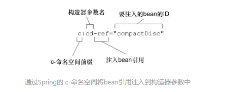
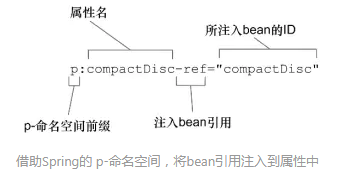

# 装配Bean

本章内容：

- 声明Bean
- 构造器注入和Setter方法注入
- 装配Bean
- 控制bean的创建和销毁

***

任何一个成功的应用都是由多个为了实现某一业务目标而相互协作的组件构成的。这些组件必须彼此了解，并且相互协作来完成工作。

但是，正如在第一章中所看到的，创建应用对象之间关联关系的传统方法通常会导致结构严重复杂的代码，这些代码很难被复用也很难进行单元测试。

在Spring中，对象无需查找或创建与其关联的其他对象。相反的，容器负责把需要相互协作的对象引用赋予各个对象。

*创建应用对象之间协作关系的行为*通常称为**装配**，这也是依赖注入的本质。

### Spring配置的可选方案

Spring容器负责创建应用程序中的bean并**通过DI来协调这些对象之间的关系**。但是开发人员需要告诉Spring要创建哪些bean并且如何将其装配在一起。Spring中装配bean最常见的有三种机制：

- 在XML中进行显示配置
- 在Java中进行显示配置
- 隐式的bean发现机制和自动装配

最好尽可能地使用自动配置的机制。显示配置越少越好。当必须要显示配置bean的时候，推荐使用类型安全并且比XML更加强大的JavaConfig。最后，只有当想要使用便利的XML命名空间，并且在JavaConfig中没有同样的实现时，才应该使用XML。

（自动配置 > 显示Java配置 > 显示XML配置）

### 自动化装配bean

虽然显示装配技术非常有用，但是在便利性方面最强大的还是Spring的自动化配置。

Spring从两个角度来实现自动化装配：

- 组件扫描： Spring会自动发现应用上下文中所创建的bean。
- 自动装配：Spring自动满足bean之间的依赖。

组件扫描和自动装配组合在一起能够将显示配置降低到最少。

现在创建几个bean，它们代表音响系统中的组件。

接下来为了阐述组件扫描和装配，创建CompactDisc类，Spring会发现它并将其创建为一个bean。然后会创建一个CDPlayer类，让Spring发现它，并将CompactDisc bean注入进来。

#### 创建可被发现的bean

 首先在Java中建立CD的概念，定义CD的一个接口： 

```java
package soundsystem;

public interface CompactDisc {
    void play();
}
```

作为接口，它定义了CD播放器对一盘CD所能进行的操作。

现在还需要一个CompactDisc的实现：

```java
//带有@component注解的CompactDisc实现类

package soundsystem;
import org.springframework.stereotype.Component;

@Component
public class SgtPeppers implements CompactDisc {

  private String title = "Sgt. Pepper's Lonely Hearts Club Band";  
  private String artist = "The Beatles";
  
  public void play() {
    System.out.println("Playing " + title + " by " + artist);
  }
}
```

SgtPeppers类上使用了@Component注解。这个简单的注解表明该类会作为组件类，并告知Spring要为这个类创建bean。没有必要显示配置SgtPeppers bean，因为这个类使用了@component注解。

 **组件扫描默认是不启用的**，因此还需要显示配置一下Spring，从而命令它去寻找带有@Component注解的类，并为其创建bean： 

```css
package soundsystem;
import org.springframework.context.annotation.ComponentScan;
import org.springframework.context.annotation.Configuration;

@Configuration
@ComponentScan
public class CDPlayerConfig { 
}
```

类CDPlayerConfig通过Java代码定义了Spring的装配规则。CDPlayerConfig类并没有显示地声明任何bean，但它使用了@ComponentScan注解，这个注解启用了Spring的组件扫描。

如果没有其他配置，@ComponentScan默认会扫描与配置类相同的包。由于CDPlayerConfig类位于soundsystem包中，因此Spring会扫描这个包以及这个包下的所有子包，查找带有@Component注解的类。这样的话，就能发现CompactDisc并且会在Spring中自动创建一个bean。

也可以使用XML来启用组件扫描，通过使用Spring Context命名空间的\<context:component-scan\>元素：

```xml
<?xml version="1.0" encoding="UTF-8"?>
<beans xmlns="http://www.springframework.org/schema/beans"
  xmlns:xsi="http://www.w3.org/2001/XMLSchema-instance"
  xmlns:context="http://www.springframework.org/schema/context"
  xmlns:c="http://www.springframework.org/schema/c"
  xmlns:p="http://www.springframework.org/schema/p"
  xsi:schemaLocation="http://www.springframework.org/schema/beans http://www.springframework.org/schema/beans/spring-beans.xsd
        http://www.springframework.org/schema/context http://www.springframework.org/schema/context/spring-context.xsd">

  <context:component-scan base-package="soundsystem" />

</beans>
```

 为了测试组件扫描的功能，创建一个简单的JUnit测试，它会创建Spring上下文，并判断CompactDisc是不是真的创建出来了。 

```java
package soundsystem;

import static org.junit.Assert.*;

import org.junit.Test;
import org.junit.runner.RunWith;
import org.springframework.beans.factory.annotation.Autowired;
import org.springframework.test.context.ContextConfiguration;
import org.springframework.test.context.junit4.SpringJUnit4ClassRunner;

@RunWith(SpringJUnit4ClassRunner.class)
@ContextConfiguration(classes=CDPlayerConfig.class)
public class CDPlayerTest {

@Autowired
  private CompactDisc cd;
  
  @Test
  public void cdShouldNotBeNull() {
    assertNotNull(cd);
  }
}
```

CDPlayerTest使用了Spring创建的SpringJUnit4ClassRunner，在测试开始的时候自动创建Spring的应用上下文。注解@ContextConfiguration会告诉它需要在CDPlayerConfig中加载配置。因为CDPlayerConfig类中包含了@ComponentScan，因此最终的应用上下文中应该包含CompactDisc bean。

测试代码中有一个CompactDisc类型的属性。并且这个属性带有@Autowired注解，以便于将CompactDisc bean注入到测试代码之中。最后用一个简单的测试方法断言cd属性不为null。如果它不为null，意味着Spring能够发现CompactDisc类，自动在Spring上下文中将其创建为bean并将其注入到测试代码之中。

#### 为组件扫描的bean命名

Spring应用上下文中所有的bean都会给定一个ID。前面的例子没有明确地为SgtPeppers bean设置ID，但Spring会根据类名为其指定一个ID。前面的bean被默认给定的ID为sgtPeppers（类名的第一个字母变为小写）。

如果想为这个bean设置不同的ID，则需要把期望的ID作为值传递给@Component注解：

```java
package soundsystem;
import org.springframework.stereotype.Component;

@Component("lonelyHeartsClub")
public class SgtPeppers implements CompactDisc {
    ...
}
```

 还有另外一种为bean命名的方式，这种方式不使用@Component注解，使用Java依赖注入规范中提供的@Name注解来为bean设置ID： 

```java
package soundsystem;
import javax.inject.Named;

@Named("lonelyHeartsClub")
public class SgtPeppers implements CompactDisc {
    ...
}
```

 Spring支持将@Named作为@Component注解的替代方案。在大多数场景中它们可以互相替换。 

#### 设置组件扫描的基础包

目前为止，没有给@ComponentScan设置任何属性。意味着它会按照默认规则，以配置类所在的包作为基础包来扫描组件。如果配置类被放在单独的包里与应用代码区分开来，想扫描不同的包，或者扫描多个包。为了指定不同的基础包，需要在@ComponentScan的value属性中指定包的名称：

```java
@Configuration
@ComponentScan("soundsystem")
public class CDPlayerConfig {}
```

 或 

```java
@Configuration
@ComponentScan(basePackages = "soundsystem")
public class CDPlayerConfig {}
```

 注意basePackages属性是复数形式。意味着可以设置多个基础包，只需要将basePackages属性设置为要扫描包的一个数组即可： 

```java
@Configuration
@ComponentScan(basePackages = {"soundsystem","video"})
public class CDPlayerConfig {}
```

上面的例子里，基础包是以String类型表示的。但这种方法是类型不安全的。如果要重构代码，所指定的基础包就可能会出现错误。

除了将包设置为简单的String类型之外，@ComponentScan还提供了另外一种办法 ，将其指定为包中所包含的类或接口：

```java
@Configuration
@ComponentScan(basePackageClasses = {CDPlayer.class,DVDPlayer.class})
public class CDPlayerConfig {}
```

`basePacakges`属性被替换成了`basePackageClasses`。同时不再使用String类型的名称来指定包，为basePackageClasses指定的数组中包含了类。这些**类所在的包**将会作为组件扫描的基础包。

在样例中，为basePackageClasses设置的是*组件类*，但也可以在包中创建一个用来扫描的*空标记接口*。通过标记接口的方式，能够保持对重构友好的接口引用，避免引用任何实际的应用程序代码。

如果应用程序中所有对象都是独立的，彼此之之间没有任何依赖，那么只需要组件扫描即可。但很多对象会依赖其他的对象才能完成任务。这样就需要一种方法将组件扫描得到的bean和它们的依赖装配到一起。这就需要Spring自动化配置的另一方面内容，自动装配。

#### 通过为bean添加注解实现自动装配

自动装配是让Spring自动满足bean依赖的一种方法。在满足依赖的过程中，会在Spring应用上下文中寻找匹配某个bean需求的其他bean。借助@Autowired注解声明进行自动装配。

比如下面的CDPlayer类。它的构造器添加了Autowired注解，表明当Spring创建CDPlayer bean的时候，会通过这个构造器来进行实例化并且会传入一个可设置给CompactDisc类型的bean：

```java
package soundsystem;
import org.springframework.beans.factory.annotation.Autowired;
import org.springframework.stereotype.Component;

@Component
public class CDPlayer implements MediaPlayer {
  private CompactDisc cd;

  @Autowired
  public CDPlayer(CompactDisc cd) {
    this.cd = cd;
  }

  public void play() {
    cd.play();
  }
}
```

 `@Autowired`注解不仅能用在构造器上，还能用在属性的Setter方法上。比如CDPlayer有一个SetCompactDisc()方法，可以采用如下的注解形式进行自动装配： 

```java
@Autowired
public void setCompaticDisc(CompaticDisc cd){
    this.cd = cd;
}
```

在Spring初始化bean之后，它会尽可能满足bean的依赖，**本例的依赖是通过@Autowired注解的方法进行声明的**，也就是setCompacticDisc()。

**实际上，@Autowired注解可以用在类的任何方法上**，不管是构造器、Setter方法还是其他方法，Spring都会尝试满足方法参数上所声明的依赖。假如只有一个bean匹配依赖需求，则这个bean将会被装配进来；如果没有匹配的bean，则在应用上下文创建的时候，Spring会抛出一个异常。如果要避免异常的出现，可以将@Autowired的required属性设置为false。

```java
@Autowired(required = false)
public void setCompaticDisc(CompaticDisc cd){
    this.cd = cd;
}
```

将required属性设置为false时，Spring会尝试执行自动装配，但是如果没有匹配的bean的话，Spring会让这个bean处于未装配的状态。但这样如果在代码中没有进行null检查的话。未装配状态的属性可能会引发NullPointerException。

 如果有**多个bean都满足依赖关系**的话，Spring会抛出一个异常，表明没有明确指定要选择哪个bean进行自动装配。自动装配的歧义性会在**下一章**讨论。 

 @Autowired是Spring特有的注解。如果不愿意在代码中使用Spring的特定注解来完成自动装配任务，可以考虑将其替换为`@Inject`： 

```java
package soundsystem;
import javax.inject.Inject;
import javax.inject.Named;

@Named
public class CDPlayer {
    ...

    Inject
    public CDPlayer(CompactDisc cd){
        this.cd = cd;
    }

    ...
}
```

 `@Inject`注解来源于Java依赖注入规范，该规范同时还为我们定义了`@Named`注解。在大多数场景下，`@Inject`和`@Autowired`是可以互相替换的。 

#### 验证自动装配

现在已经在CDPlayer的构造器中添加了`@Autowired`注解，Spring将把一个可分配给CompactDisc类型的bean自动注入进来。修改CDPlayerTest，使其能借助CDPlayer bean播放CD：

```java
package soundsystem;

import static org.junit.Assert.*;

import org.junit.Rule;
import org.junit.Test;
import org.junit.contrib.java.lang.system.StandardOutputStreamLog;
import org.junit.runner.RunWith;
import org.springframework.beans.factory.annotation.Autowired;
import org.springframework.test.context.ContextConfiguration;
import org.springframework.test.context.junit4.SpringJUnit4ClassRunner;

@RunWith(SpringJUnit4ClassRunner.class)
@ContextConfiguration(classes=CDPlayerConfig.class)
public class CDPlayerTest {

  @Rule
  public final StandardOutputStreamLog log = new StandardOutputStreamLog();

  @Autowired
  private MediaPlayer player;
  
  @Autowired
  private CompactDisc cd;
  
  @Test
  public void cdShouldNotBeNull() {
    assertNotNull(cd);
  }

  @Test
  public void play() {
    player.play();
    assertEquals(
        "Playing Sgt. Pepper's Lonely Hearts Club Band by The Beatles\n", 
        log.getLog());
  }

}
```

现在除了注入CompactDisc外，还将CDPlayer bean注入到测试代码的player成员变量中。在play()测试方法中，调用CDPlayer的play()方法，并断言它的行为与预期一致。

在测试代码中使用System.out.println()是有点棘手的事情。因此，在样例中使用了StandardOutputStreamLog，这来源于System Rules库的一个JUnit规则，该规则能够基于控制台的输出编写断言。在这里断言SgtPeppers.play()方法的输出被发送到了控制台上。

### 通过Java代码装配bean

尽管很多场景下通过组件扫描和自动装配实现Spring的自动化配置是更为推荐的方式，但有时候自动化配置的方案行不通，因此需要明确配合Spring。比如，要将第三方库中的组件装配到你的应用中，在这种情况下无法在它的类上添加@Component和@Autowired注解。因此无法使用自动化装配方案。

在这种情况下必须要采用显式装配的方式。像之前说的，显示配置时，JavaConfig是更好的方案，因为它更为强大、类型安全并且对重构友好。

JavaConfig与其他的Java代码有区别，在概念上，它与应用程序中的业务逻辑和领域代码是不同的。尽管它与其他的组件一样都使用相同的语言进行表述，但JavaConfig是配置代码。这意味着它**不应包含任何业务逻辑**。JavaConfig也不应该侵入到业务逻辑代码之中。通常会将JavaConfig放到单独的包里与其他应用程序逻辑分离开来。

#### 创建配置类

创建JavaConfig类的关键在于为其添加@Configuration注解，@Configuration注解表明这个类是一个配置类，该类应该包含在Spring应用上下文如何创建bean的细节。为了更加关注于显示配置，将CDPlayer的@ComponentScan注解移除掉。

```kotlin
package soundsystem;
import org.springframework.context.annotation.Configuration;

@Configuration
public class CDPlayerConfig { 
}
```

#### 声明简单的bean

 要在JavaConfig中声明bean， 需要编写一个方法，这个方法会创建所需类型的实例，然后给这个方法添加`@Bean`注解。比如下面的代码声明了CompaticDisc bean： 

```java
@Bean
public CompaticDisc sgtPeppers() {
  return new SgtPeppers();
}
```

@Bean注解会告诉Sring这个方法将返回一个对象，该对象要注册为Spring应用上下文中的bean。方法体中包含了最终产生bean实例的逻辑。

默认情况下，bean的ID与带有@Bean注解的方法名是一样的。

如果想要为其设置成一个不同的名字，则可以重命名该方法，也可以通过name属性指定一个不同的名字：

```java
@Bean(name="lonelyHeartsClubBand")
public CompaticDisc sgtPeppers() {
  return new SgtPeppers();
}
```

#### 借助JavaConfig实现注入

CDPlayer bean依赖于CompaticDisc，在JavaConfig中，要如何将它们装配到一起？

JavaConfig中装配bean最简单的方式就是引用创建bean的方法（引用调用方法）。例如：

```java
@Bean
public CDPlayer cdPlayer() {
    return new CDPlayer(sgtPeppers);
}
```

cdPlayer()方法像sgtPeppers()方法一样，同样使用了`@Bean`注解，这表明这个方法会创建一个bean实例并将其注册到Spring应用上下文中。创建的bean的ID为cdPlayer,与方法的名字相同。

cdPlayer()的方法体与sgtPeppers()有些区别，它并没有使用默认的构造器创建实例，而是调用了需要传入CompactDisc对象的构造器来创建CDPlayer实例。

CompactDisc并非是调用sgtPeppers()得到的，由于sgtPeppers()方法上添加了@Bean注解，Spring将拦截所有对它的调用，并确保返回该方法所创建的bean，而不是每次都对其进行实际的调用。

在默认情况下，Spring的bean都是**单例**的，不需要为第二个CDPlayer bean创建完全相同的SgtPeppers实例。因此，**Spring会拦截对sgtPeppers()的调用并确保返回的是Spring所创建的bean。因此两个CDPlayer bean会得到相同的SgtPeppers实例。

可以看到通过调用方法来引用bean的方式有点令人困惑。还有一种理解起来更为简单的方式：

```java
@Bean
Public CDPlayer cdPlayer(CompaticDisc comPaticDisc){
    return new CDPlayer(compactDisc);
} 
```

cdPlayer()方法请求一个CompaticDisc作为参数。当Spring调用cdPlayer()创建CDPlayer bean的时候，会自动装配一个Compact到配置方法中。然后，方法体按照合适的方式来使用它。借助这种技术，cdPlayer()方法同样也能将ComPaticDisc注入到CDPlayer的构造器中，不用明确引用CompactDisc的@Bean方法。

使用这种方法引用其他的bean通常是最佳的选择，因为它不要求将CompactDisc声明到同一个配置类中。甚至不要求CompactDisc必须在JavaConfig中声明。

前面使用CDPlayer的构造器实现DI功能，同样也可以采用其他风格的DI配置。例如通过Setter方法注入CompactDisc：

```java
@Bean
Public CDPlayer cdPlayer(CompaticDisc comPaticDisc){
    CDPlayer cdPlayer = new CDPlayer(compactDisc);
    cdPlayer.setCompactDisc(compactDisc)
    return cdPlayer;
} 
```

>  带有@Bean注解的方法可以采用任何必要的Java功能来产生bean实例。构造器和Setter方法只是@Bean方法的两个简单样例。 

### 通过XML装配bean

 XML是最初Spring刚出现的时候描述配置的主要方式，这种方式已经不是最优的或是唯一可选方案，本节的内容主要是用来帮助维护已有的XML配置。 

#### 创建XML配置规范

在使用XML配置Spring装配bean之前，需要创建一个新的配置规范（就像在JavaConfig的时候，要创建一个带有@Configuration注解的类）。在XML配置中，要创建一个XML文件，并且要**以元素为根**。

最简单的XML配置如下：

```xml
<?xml version="1.0" encoding="UTF-8"?>
<beans xmlns="http://www.springframework.org/schema/beans"
  xmlns:xsi="http://www.w3.org/2001/XMLSchema-instance"
  xsi:schemaLocation="http://www.springframework.org/schema/beans http://www.springframework.org/schema/beans/spring-beans.xsd http://www.springframework.org/schema/context>

  ......

</beans>
```

需要在配置文件的顶部声明多个XML模式（XSD）文件，这些文件定义了配置Spring的XML元素。

可借助[Spring Tool Suite](https://link.jianshu.com?t="https://spring.io/tools/sts")创建XML配置文件来简化创建和管理Spring XML配置文件的步骤。

装配bean的最基本的XML元素包含在spring-beans模式之中，在上面这个XML文件中，它被定义为根命名空间。\<beans\>是该模式中的一个元素，是所有Spring配置文件的根元素。

#### 声明一个简单的\<beans\>

 在基于XML的Spring配置中声明一个bean，要使用spring-beans模式中的另外一个元素<bean>。可以按照如下的方式生命CompactDisc bean： 

```xml
<bean class="soundsystem.SgtPeppers" />
```

声明了一个很简单的bean，创建这个bean的类通过class属性来指定。

由于没有明确给定ID，所以将会根据全限定类名来进行命名。上面的bean的ID将会是"soundsystem.Sgtpeppers#0"。“#0”是一个计数的形式，用来区分相同类型的其他bean。这样的ID命名方式对稍后的引用会很不友好。因此通常要借助id属性为每个bean设置一个自己选择的名字：

```xml
<bean id="cdPlayer" class="soundsystem.CDPlayer" />
```

>  **减少繁琐**
> 为了减少XML中配置的繁琐，只对需要按名字引用的bean进行明确地命名。 

#### 简单bean声明的特征

1.不再需要直接负责创建SgtPeppers的实例

在基于JavaConfig的配置中，需要直接负责创建SgtPeppers的实例。当Spring发现这个<bean>元素时，会调用SgtPeppers的默认构造器来创建bean。这样bean的创建显得更加的被动。

2.bean的类型以字符串的形式设置在了class属性中，如果重命名那个类，XML配置文件也要修改。

#### 借助构造器注入初始化bean

Spring XML配置中只有一种声明bean的方式。但是在XML中声明DI时，有多重可选的配置方案和风格。具体到构造器注入，有两种基本的配置方案可供选择：

- \<constructor-arg\>元素
- 使用Spring 3.0引入的 c-命名空间

二者的区别在于是否冗长繁琐。\<constructor-arg>元素比使用 c-命名空间会更加冗长，从而导致XML难以读懂。有些事情\<constructor-arg>可以做到，但 c-命名空间却无法实现。

####  构造器注入bean引用 

现在已经声明了SgtPeppers bean，且SgtPepepr类实现了CompactDisc接口，所以已经有了一个可以注入到CDPlayer bean中的bean。在XML中声明CDPlayer并通过ID引用SgtPeppers即可：

```java
<bean id="cdPlayer" class="soundsystem.CDPlayer">
    <constructor-arg ref="compactDisc" />
</bean>
```

当Spring遇到这个<bean>元素时，会创建一个CDPlayer实例。<constructor-arg>元素会告知Spring要将ID为compactDisc的bean引用传递到CDPlayer的构造器中。

 作为替代方案，也可以使用Spring的 c-命名空间。它是在XML中更为简洁地描述构造器参数的方式。要使用它必须要在XML的顶部声明其模式： 

```xml
<?xml version="1.0" encoding="UTF-8"?>
<beans xmlns="http://www.springframework.org/schema/beans"
  xmlns:xsi="http://www.w3.org/2001/XMLSchema-instance"
  xmlns:p="http://www.springframework.org/schema/p"
  xsi:schemaLocation="http://www.springframework.org/schema/beans http://www.springframework.org/schema/beans/spring-beans.xsd">

  ...

</beans>
```

 声明完 c-命名空间和模式之后，就可以使用它来声明构造器参数了： 

```csharp
  <bean id="cdPlayer" class="soundsystem.CDPlayer"
        c:cd-ref="compactDisc" />
```

c-命名空间作为\<bean>元素的一个属性。下图描述了这个属性名是如何组成的。


 

属性名以“c:”开头，也就是命名空间的前缀。接下来是要装配的构造器参数名，在此之后是“-ref”，这是一个命名约定，它会告诉Spring，正在装配的是一个bean的引用，这个bean的名字是compactDisc，而不是字面量“compactDisc”。

c-命名空间直接使用了构造器参数的名称。引用参数的名字这需要在编译代码的时候，将调试标志保存在类代码中。如果优化构建过程将调试标志移除掉，这种方式就可能无法正常执行。

替代的方案是使用参数在整个参数列表中的位置信息：

```xml
<bean id="cdPlayer" class="soundsystem.CDPlayer"
        c:_0-ref="compactDisc" />
```

将参数名称替换成了“0”，即参数的索引。由于在XML中不允许数字作为属性的第一个字符，要**添加下画线作为前缀**。

使用索引识别构造器参数会比使用名字好一些，这样即便在构建的时候移除掉了调试标志，参数依然会保持相同的顺序。当只有一个构造器参数的时候，可以不标示参数：

```xml
<bean id="cdPlayer" class="soundsystem.CDPlayer"
    c:_-ref="compactDisc" />
```

 现在已经将引用装配到了其他的bean中，接下来讨论将字面量值装配到构造器之中。 

####  将字面量注入到构造器 

 到目前所做的DI通常指的是类型的装配——将对象的引用装配到依赖于它们的其他对象之中。而有时候，需要做的只是一个字面量值来配置对象。假设要创建一个CompactDisc的新实现： 

```java
package soundsystem;

public class BlankDisc implements CompactDisc {

  private String title;
  private String artist;

  public BlankDisc(String title, String artist) {
    this.title = title;
    this.artist = artist;
  }

  public void play() {
    System.out.println("Playing " + title + " by " + artist);
  }

}
```

 将已有的SgtPeppers替换为这个类： 

```jsx
<bean id="compactDisc" class="soundsystem.BlankDisc">
  <constructor-arg value="Sgt. Pepper's Lonely Hearts Club Band" />
  <constructor-arg value="The Beatles" />
</bean>
```

再次使用<constructor-arg>元素进行构造器参数的注入。没有使用ref属性引用其他的bean，这次使用value属性，通过该属性表明给定的值要以字面量的形式注入到构造器之中。

如果使用c-命名空间，引用构造器参数的名字：

```csharp
<bean id="compactDisc" class="soundsystem.BlankDisc"
      c:_title="Sgt. Pepper's Lonely Hearts Club Band" 
      c:_artist="The Beatles" />
```

 装配自变量与装配引用的区别在于**属性名去掉了-ref后缀**。类似的，可以通过参数索引装配字面量值： 

```csharp
<bean id="compactDisc" class="soundsystem.BlankDisc"
      c:_0="Sgt. Pepper's Lonely Hearts Club Band" 
      c:_1="The Beatles" />
```

 如果构造器参数只有一个，同样可以简单的使用下画线进行标示，如： 

```csharp
<bean id="compactDisc" class="soundsystem.BlankDisc"
      c:_="Sgt. Pepper's Lonely Hearts Club Band" 
```

####  装配集合 

有一种情况是\<constructor-arg>能够实现，c命名空间却无法做到的。

真正的CD上面所承载的信息很多，大多数CD会包含十多个磁道，每个磁道包含了一首歌。

如果使用CompactDisc为真正的CD建模，它也应该有磁道列表的概念：

```tsx
package soundsystem.collections;

import java.util.List;

import soundsystem.CompactDisc;

public class BlankDisc implements CompactDisc {

  private String title;
  private String artist;
  private List<String> tracks;

  public BlankDisc(String title, String artist, List<String> tracks) {
    this.title = title;
    this.artist = artist;
    this.tracks = tracks;
  }

  public void play() {
    System.out.println("Playing " + title + " by " + artist);
    for (String track : tracks) {
      System.out.println("-Track: " + track);
    }
  }

}
```

这个变更使得在声明bean的时候，必须要提供一个磁道列表。

不理想的方案是将列表设置为null：

```jsx
<bean id="compactDisc" class="soundsystem.BlankDisc">
  <constructor-arg value="Sgt. Pepper's Lonely Hearts Club Band" />
  <constructor-arg value="The Beatles" />
  <constructor-arg><null/></constructor-arg>
</bean>
```

注入期能够正常执行，当调用play()方法时，会遇到NullPointerException异常。

更好的解决办法是提供一个磁道名称的列表。有多个可选的解决方案，其中之一，可以使用\<list>元素将其声明为一个列表：

```jsx
<bean id="compactDisc"
      class="soundsystem.properties.BlankDisc">
  <constructor-arg value="Sgt. Pepper's Lonely Hearts Club Band" />
  <constructor-arg name="artist" value="The Beatles" />
  <constructor-arg name="tracks">
    <list>
      <value>Sgt. Pepper's Lonely Hearts Club Band</value>
      <value>With a Little Help from My Friends</value>
      <value>Lucy in the Sky with Diamonds</value>
      <value>Getting Better</value>
      <value>Fixing a Hole</value>
      <value>She's Leaving Home</value>
      <value>Being for the Benefit of Mr. Kite!</value>
      <!-- ...others... -->

    </list>
  </property>
</bean>
```

其中\<list>元素时\<constructor-arg>的子元素，这表明一个包含值得列表会被传递到构造器中。<value>元素用来指定列表中的每个元素。

类似的，也可以使用ref元素替代\<value>，实现bean引用列表的装配。

例如有一个Discography类，它的构造器如下所示：

```cpp
public Discography(String artist, List<CompactDisc> cds){ ... }
```

 则可以采用如下的方式配置Discography bean： 

```xml
<bean id="beatlesDiscography" class="soundsystem.Discography">
  <constructor-arg value="The Beatles" />
  <constructor-arg>
    <List>
      <ref bean="sgtPeppers" />
      <ref bean="whiteAlbum" />
      <ref bean="hardDaysNight" />
      <ref bean="revolver" />
      <!-- ...others... -->
    <List>
  </constructor-arg>
</bean>
```

 当构造器参数的类型是 java.util.List时，使用\<List>元素合情合理。但也可以按照同样的方式使用<set>元素： 

```xml
<bean id="compactDisc" class="soundsystem.BlankDisc">
  <constructor-arg value="Sgt.Pepper's Lonely Hearts Club Band" />
  <constructor-arg value="The Beatles" />
  <constructor-arg>
    <Set>
      <value>Sgt. Pepper's Lonely Hearts Club Band</value>
      <value>With a Little Help from My Friends</value>
      <value>Lucy in the Sky with Diamonds</value>
      <value>Getting Better</value>
      <!-- ...others... -->
    <List>
  </constructor-arg>
</bean>
```

\<set>和\<list>元素的区别不大，最重要的不同在于当Spring创建要装配的集合时，所创建的是java.util.Set还是java.util.List。如果是Set的话，重复值会被忽略，存放的顺序也不会得以保证。无论哪种情况下，\<Set>或\<List>都可以用来装配List、Set甚至数组。

装配集合方面，\<constructor-arg>比 c-命名空间的属性更有优势。目前，使用 c-命名空间的属性无法实现装配集合的功能。

#### 设置属性

 到目前为止，CDPlayer和BlankDisc类完全是通过构造器注入的，没有使用属性的Setter方法。接下来将讨论如何使用Spring XML实现属性注入。假设属性注入的CDPlayer如下所示： 

```java
package soundsystem.properties;
import org.springframework.beans.factory.annotation.Autowired;

import soundsystem.CompactDisc;
import soundsystem.MediaPlayer;

public class CDPlayer implements MediaPlayer {
  private CompactDisc compactDisc;

  @Autowired
  public void setCompactDisc(CompactDisc compactDisc) {
    this.compactDisc = compactDisc;
  }

  public void play() {
    compactDisc.play();
  }

}
```

对于该选择构造器注入还是属性注入。作为通用的规则，建议对强依赖使用构造器注入，对可选性的依赖使用属性注入。

现在CDPlayer没有任何的构造器。也没有任何的强依赖。因此可以采用如下的方式将其声明为Spring bean：

```csharp
<bean id="cdPlayer" class="soundsystem.CDPlayer" />
```

 Spring在创建bean时不会有问题，但在测试时会因为NullPointerException导致测试失败，因为没有注入CDPlayer的compactDisc属性。按照如下方式修改XML： 

```jsx
<bean id="cdPlayer" class="soundsystem.CDPlayer">
  <property name="compactDisc" ref="compactDisc">
</bean>
```

\<property>元素为属性的Setter方法所提供的功能等同于\<constructor-arg>元素为构造器所提供的功能。本例中，它引用了ID为compactDisc的bean，并将其注入到compactDisc属性中（通过setCompactDisc()方法）。

Spring提供了更加简洁的p命名空间作为\<property>元素的替代方案。为了启用 p-命名空间，必须要在XML文件中与其他的命名空间一起对其进行生命：

```xml
<?xml version="1.0" encoding="UTF-8"?>
<beans xmlns="http://www.springframework.org/schema/beans"
    xmlns:xsi="http://www.w3.org/2001/XMLSchema-instance"
    xmlns:p="http://www.springframework.org/schema/p"
    xsi:schemaLocation="http://www.springframework.org/schema/beans http://www.springframework.org/schema/beans/spring-beans.xsd">
  ...
</bean>
```

 使用p-命名空间： 

```csharp
<bean id="cdPlayer"
      class="soundsystem.properties.CDPlayer"
      p:compactDisc-ref="compactDisc" />
```

 p-命名空间中属性所遵循的命名约定与c-命名空间类似。属性名组成如下图所示： 



####  将字面量注入到属性中 

 构建一个新的完全通过属性注入进行配置的BlankDisc类： 

```java
package soundsystem.properties;

import java.util.List;

import soundsystem.CompactDisc;

public class BlankDisc implements CompactDisc {

  private String title;
  private String artist;
  private List<String> tracks;

  public void setTitle(String title) {
    this.title = title;
  }

  public void setArtist(String artist) {
    this.artist = artist;
  }

  public void setTracks(List<String> tracks) {
    this.tracks = tracks;
  }

  public void play() {
    System.out.println("Playing " + title + " by " + artist);
    for (String track : tracks) {
      System.out.println("-Track: " + track);
    }
  }

}
```

 可以借助\<property>元素的value属性装配属性： 

```jsx
  <bean id="compactDisc"
        class="soundsystem.properties.BlankDisc">
    <property name="title" value="Sgt. Pepper's Lonely Hearts Club Band" />
    <property name="artist" value="The Beatles" />
    <property name="tracks">
      <list>
        <value>Sgt. Pepper's Lonely Hearts Club Band</value>
        <value>With a Little Help from My Friends</value>
        <value>Lucy in the Sky with Diamonds</value>
        <value>Getting Better</value>
        <!-- ...others... -->
      </list>
    </property>
  </bean>
```

这里除了使用<property>元素的value属性来设置title和artist，还使用了内嵌的<lists>元素来设置tracks属性。

另一种可选方案是使用p命名空间的属性来完成该功能：

```xml
  <bean id="compactDisc"
        class="soundsystem.properties.BlankDisc"
        p:title="Sgt. Pepper's Lonely Hearts Club Band"
        p:artist="The Beatles">
    <property name="tracks">
      <list>
        <value>Sgt. Pepper's Lonely Hearts Club Band</value>
        <value>With a Little Help from My Friends</value>
        <value>Lucy in the Sky with Diamonds</value>
        <value>Getting Better</value>
        <!-- ...other tracks... -->
      </list>
    </property>
  </bean>
```

没有便利的方式使用 p-命名空间来指定一个值的列表。但是，可以使用Spring util-命名空间中的一些功能来简化BlankDisc bean。

首先，在XML中声明util-命名空间及其模式：

```xml
<?xml version="1.0" encoding="UTF-8"?>
<beans xmlns="http://www.springframework.org/schema/beans"
  xmlns:xsi="http://www.w3.org/2001/XMLSchema-instance"
  xmlns:p="http://www.springframework.org/schema/p"
  xmlns:util="http://www.springframework.org/schema/util"
  xsi:schemaLocation="http://www.springframework.org/schema/beans 
    http://www.springframework.org/schema/beans/spring-beans.xsd
    http://www.springframework.org/schema/util 
    http://www.springframework.org/schema/util/spring-util.xsd">
  ...
</beans>
```

util-命名空间提供的功能之一就是<util:list>元素，它会创建一个列表的bean。借助<util:list>，可以将磁道列表转移到BlankDisc bean之外。并将其声明到单独的bean中：

```xml
<util:list id="trackList">  
  <value>Sgt. Pepper's Lonely Hearts Club Band</value>
  <value>With a Little Help from My Friends</value>
  <value>Lucy in the Sky with Diamonds</value>
  <value>Getting Better</value>
  <!-- ...other tracks... -->
</util:list>
```

 现在能够像使用其他的bean那样，将磁道列表bean注入到BlankDisc bean的tracks属性中： 

```csharp
  <bean id="compactDisc"
        class="soundsystem.properties.BlankDisc"
        p:title="Sgt. Pepper's Lonely Hearts Club Band"
        p:artist="The Beatles"
        p:tracks-ref="trackList" />
```

 \<util:list>只是util-命名空间中的多个元素之一。下表列出了 util-命名空间提供的所有元素： 

| 元素               | 描述                                               |
| :----------------- | :------------------------------------------------- |
| \<util:constant>   | 引用某个类型的public static域，并将其暴露为bean    |
| util:list          | 创建一个java.util.List类型的bean,其中包含值或引用  |
| util:map           | 创建一个java.util.Map类型的bean，其中包含值或引用  |
| util:properties    | 创建一个java.util.Properties类型的bean             |
| util:property-path | 引用一个bean的属性（或内嵌属性），并将其暴露为bean |
| util:set           | 创建一个java.util.Set，其中包含值或引用            |

### 导入和混合配置

Spring中，这些配置方案都不是互斥的。尽可以将JavaConfig的组建扫描和自动装配和XML配置混合在一起。

混合配置第一件需要了解的事情就是在自动装配时，自动装配会将Spring容器中所有的bean都考虑到，不管是在JavaConfig或XML声明的还是通过组建扫描获取到的。

#### 在JavaConfig中引用XMl配置

 假设CDPlayerConfig已经变得复杂，想要将其进行拆分。实现的第一种方案就是将SgtPeppers从CDPlayerConfig拆分出来，定义到它自己的CDConfig中： 

```java
package soundsystem;
import org.springframework.context.annotation.Bean;
import org.springframework.context.annotation.Configuration;

@Configuration
public class CDConfig {
  
  @Bean
  public CompactDisc compactDisc() {
    return new SgtPeppers();
  }
}
```

 compactDisc()方法已经从CDPlayerConfig中移除掉了，需要有一种方式将这两个类组合在一起。一种方法是在CDPlayerConfig中使用@Import注解导入CDConfig： 

```kotlin
package soundsystem;
import org.springframework.context.annotation.Bean;
import org.springframework.context.annotation.Configuration;
import org.springframework.context.annotation.Import;

@Configuration
@Import(CDPlayerConfig.class)
public class CDPlayerConfig{
  
  @Bean
  public CDPlayer cdPlayer(CompactDisc compactDisc) {
    return new CDPlayer(compactDisc);
  }
}
```

 或者采用一个更好的办法，也就是不在CDPlayerConfig中使用@Import，创建一个更高级别的SoundSystemConfig，在这个类中使用@Import将两个配置组合在一起： 

```css
package soundsystem;
import org.springframework.context.annotation.Configuration;
import org.springframework.context.annotation.Import;
@Configuration
@Import({CDPlayerConfig.class,CDConfig.class})
public class SoundSystemConfig {
}
```

 不管使用哪种方法，都将CDPlayer的配置与SgtPeppers的配置分开了。现在假设希望通过XML来配置BlankDisc，如下所示： 

```xml
  <bean id="compactDisc" class="soundsystem.BlankDisc"
        c:_0="Sgt. Pepper's Lonely Hearts Club Band" 
        c:_1="The Beatles" />
    <constructor-arg>
      <list>
        <value>Sgt. Pepper's Lonely Hearts Club Band</value>
        <value>With a Little Help from My Friends</value>
        <value>Lucy in the Sky with Diamonds</value>
        <value>Getting Better</value>
        <!-- ...other tracks... -->
      </list>
    </constructor-arg>
  </bean>
```

现在BlankDisc配置在了XML中，如何让Spring同时加载它和其他基于Java的配置？

答案是@ImportResource注解，假设BlankDisc定义在名为cd-config.xml的文件中，该文件位于根类路径下，那么可以修改SoundSystemConfig，让它使用@ImportResource注解，如下所示：

```kotlin
package soundsystem;

import org.springframework.context.annotation.Configuration;
import org.springframework.context.annotation.Import;
import org.springframework.context.annotation.ImportResource;

@Configuration
@Import(CDPlayerConfig.class)
@ImportResource("classpath:cd-config.xml")
public class SoundSystemConfig{
}
```

两个bean——配置在JavaConfig中的CDPlayer以及配置在XML中的BlankDisc都会被加载到Spring容器之中。因为CDPlayer中带有@Bean注解的方法接受一个CompactDisc作为参数，因此BlankDisc将会被装配进来。

#### 在XMl配置中引用JavaConfig

假设正在使用Spring基于XMl的配置并且XML注解变得复杂。

在XML中，可以使用<import>元素来拆分XML配置。

假设将BlankDisc bean拆分到自己的配置文件中，该文件名为cd-config.xml。可以在XML配置文件中使用\<import>元素来引用该文件：

```xml
<?xml version="1.0" encoding="UTF-8"?>
<beans xmlns="http://www.springframework.org/schema/beans"
  xmlns:xsi="http://www.w3.org/2001/XMLSchema-instance"
  xmlns:c="http://www.springframework.org/schema/c"
  xsi:schemaLocation="http://www.springframework.org/schema/beans http://www.springframework.org/schema/beans/spring-beans.xsd">
  <import resource="cd-config.xml">
  <bean id="cdPlayer" class="soundsystem.CDPlayer" c:cd-ref="compactDisc" />
</beans>
```

现在假设BlankDisc配置不在XML中，而是配置在JavaConfig中。

**元素只能导入其他的XML配置文件**，并没有XML元素可以导入JavaConfig类。

但有一个元素能够用来将Java配置导入到XML配置中——\<bean>元素：

```xml
<?xml version="1.0" encoding="UTF-8"?>
<beans xmlns="http://www.springframework.org/schema/beans"
  xmlns:xsi="http://www.w3.org/2001/XMLSchema-instance"
  xmlns:c="http://www.springframework.org/schema/c"
  xsi:schemaLocation="http://www.springframework.org/schema/beans http://www.springframework.org/schema/beans/spring-beans.xsd">

  <bean class="soundsystem.CDConfig">
  <bean id="cdPlayer" class="soundsystem.CDPlayer" c:cd-ref="compactDisc" />
</beans>
```

采用这样的方式，两种配置被组合在了一起。类似地，还可以创建一个更高层次的配置文件，这个文件不声明任何bean，只负责将两个或更多的配置组合起来。

例如，可以将CDConfig bean从之前的XML文件中移除掉，使用第三个配置文件将这两个组合在一起：

```xml
<?xml version="1.0" encoding="UTF-8"?>
<beans xmlns="http://www.springframework.org/schema/beans"
  xmlns:xsi="http://www.w3.org/2001/XMLSchema-instance"
  xmlns:c="http://www.springframework.org/schema/c"
  xsi:schemaLocation="http://www.springframework.org/schema/beans http://www.springframework.org/schema/beans/spring-beans.xsd">

  <bean class="soundsystem.CDConfig">
  <import resource="cdplayer-config.xml" />
</beans>
```

不管使用JavaXML还是XML进行配置，通常都会创建一个根配置，这个配置会将两个或更多的文件组合起来。也会在根配置中启用组件扫描（通过<context:component-scan>或@componentScan）。

#### 小结

Spring框架的核心是Spring容器。容器负责管理应用中组件的生命周期与依赖关系。

建议尽可能使用自动化配置，避免显示配置带来的维护成本。如果需要显示配置Spring，应该优先选择基于Java的配置。