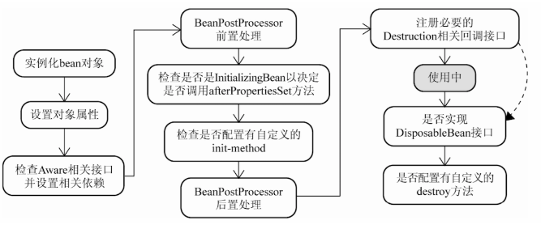

# 自己动手实现的 Spring IOC 和 AOP - 下篇

## 1. 背景

1. 根据 xml 配置文件加载相关 bean
2. 对 BeanPostProcessor 类型的 bean 提供支持
3. 对 BeanFactoryAware 类型的 bean 提供支持
4. 实现了基于 JDK 动态代理的 AOP
5. 整合了 IOC 和 AOP，使得二者可很好的协同工作

上面罗列了5个功能点，虽然看起来不多，但是对于新手来说，实现起来还是不很容易的。所以接下来，我将围绕上面的功能点展开详细的描述。如果大家有兴趣，我还是很建议大家跟着写一遍，因为很多时候能看懂，但是写的却不一定能写出来。仿写一遍能够加深对 Spring IOC 和 AOP 原理的理解，多动手是有好处的。

## 2. IOC 的实现

###  2.1 BeanFactory 的生命流程

上面简述了 toy-spring 项目的编码背景，接下来，在本节中，我将向大家介绍 toy-spring 项目中 IOC 部分的实现原理。在详细介绍 IOC 的实现原理前，这里先简单说一下 BeanFactory 的生命流程：

1. BeanFactory 加载 Bean 配置文件，将读到的 Bean 配置封装成 BeanDefinition 对象
2. 将封装好的 BeanDefinition 对象注册到 BeanDefinition 容器中
3. 注册 BeanPostProcessor 相关实现类到 BeanPostProcessor 容器中
4. BeanFactory 进入就绪状态
5. 外部调用 BeanFactory 的 getBean(String name) 方法，BeanFactory 着手实例化相应的 bean
6. 重复步骤 3 和 4，直至程序退出，BeanFactory 被销毁

上面简单罗列了 BeanFactory 的生命流程，也就是 IOC 容器的生命流程。接下来就来围绕上面的流程展开讨论。

###  2.2 BeanDefinition 及其他一些类的介绍

在详细介绍 IOC 容器的工作原理前，这里先介绍一下实现 IOC 所用到的一些辅助类，包括BeanDefinition、BeanReference、PropertyValues、PropertyValue。这些类与接下来的 2.3 节 xml 的解析紧密相关。按照顺序，先从 BeanDefinition 开始介绍。

BeanDefinition，从字面意思上翻译成中文就是 “Bean 的定义”。从翻译结果中就可以猜出这个类的用途，即根据 Bean 配置信息生成相应的 Bean 详情对象。举个例子，如果把 Bean 比作是电脑 💻，那么 BeanDefinition 就是这台电脑的配置清单。我们从外观上无法看出这台电脑里面都有哪些配置，也看不出电脑的性能咋样。但是通过配置清单，我们就可了解这台电脑的详细配置。我们可以知道这台电脑是不是用了牙膏厂的 CPU，BOOM 厂的固态硬盘等。透过配置清单，我们也就可大致评估出这台电脑的性能。


图1 电脑和配置清单

上面那个例子还是比较贴切的，但是只是个例子，和实际还是有差距的。那么在具体实现中，BeanDefinition 和 xml 是怎么对应的呢？答案在下面：


图2 根据 bean 配置生成 BeanDefinition

看完上图，我想大家对 BeanDefinition 的用途有了更进一步的认识。接下来我们来说说上图中的 ref 对应的 BeanReference 对象。BeanReference 对象保存的是 bean 配置中 ref 属性对应的值，在后续 BeanFactory 实例化 bean 时，会根据 BeanReference 保存的值去实例化 bean 所依赖的其他 bean。

 接下来说说 PropertyValues 和 PropertyValue 这两个长的比较像的类，首先是PropertyValue。PropertyValue 中有两个字段 name 和 value，用于记录 bean 配置中的标签的属性值。然后是PropertyValues，PropertyValues 从字面意思上来看，是 PropertyValue 复数形式，在功能上等同于 List。那么为什么 Spring 不直接使用 List，而自己定义一个新类呢？答案是要获得一定的控制权，看下面的代码： 

```java
public class PropertyValues {

    private final List<PropertyValue> propertyValueList = new ArrayList<PropertyValue>();

    public void addPropertyValue(PropertyValue pv) {
        // 在这里可以对参数值 pv 做一些处理，如果直接使用 List，则就不行了
        this.propertyValueList.add(pv);
    }

    public List<PropertyValue> getPropertyValues() {
        return this.propertyValueList;
    }

}
```

 好了，辅助类介绍完了，接下来我们继续 BeanFactory 的生命流程探索。 

### 2.3 xml 的解析

BeanFactory 初始化时，会根据传入的 xml 配置文件路径加载并解析配置文件。但是加载和解析 xml 配置文件这种脏活累活，BeanFactory 可不太愿意干，它只想高冷的管理容器中的 bean。于是 BeanFactory 将加载和解析配置文件的任务委托给专职人员 BeanDefinitionReader 的实现类 XmlBeanDefinitionReader 去做。那么 XmlBeanDefinitionReader 具体是怎么做的呢？XmlBeanDefinitionReader 做了如下几件事情：

1. 将 xml 配置文件加载到内存中
2. 获取根标签下所有的标签
3. 遍历获取到的标签列表，并从标签中读取 id，class 属性
4. 创建 BeanDefinition 对象，并将刚刚读取到的 id，class 属性值保存到对象中
5. 遍历标签下的标签，从中读取属性值，并保持在 BeanDefinition 对象中
6. 将 <id, BeanDefinition> 键值对缓存在 Map 中，留作后用
7. 重复3、4、5、6步，直至解析结束

上面的解析步骤并不复杂，实现起来也不难，就是解析 xml 而已，这里就不过多叙述了。

### 2.4 注册 BeanPostProcessor

BeanPostProcessor 接口是 Spring 对外拓展的接口之一，其主要用途提供一个机会，让开发人员能够插手 bean 的实例化过程。通过实现这个接口，我们就可在 bean 实例化时，对bean 进行一些处理。比如，我们所熟悉的 AOP 就是在这里将切面逻辑织入相关 bean 中的。正是因为有了 BeanPostProcessor 接口作为桥梁，才使得 AOP 可以和 IOC 容器产生联系。关于这一点，我将会在后续章节详细说明。

接下来说说 BeanFactory 是怎么注册 BeanPostProcessor 相关实现类的。

XmlBeanDefinitionReader 在完成解析工作后，BeanFactory 会将它解析得到的 <id, BeanDefinition> 键值对注册到自己的 beanDefinitionMap 中。BeanFactory 注册好 BeanDefinition 后，就立即开始注册 BeanPostProcessor 相关实现类。这个过程比较简单：

1. 根据 BeanDefinition 记录的信息，寻找所有实现了 BeanPostProcessor 接口的类。
2. 实例化 BeanPostProcessor 接口的实现类
3. 将实例化好的对象放入 List中
4. 重复2、3步，直至所有的实现类完成注册

上面简述了 BeanPostProcessor 接口的用途以及注册的过程。BeanPostProcessor 是一个比较常用接口，相信大家都很熟悉了，这里就不过多叙述了。

###  2.5 getBean 过程解析

在完成了 xml 的解析、BeanDefinition 的注册以及 BeanPostProcessor 的注册过程后。BeanFactory 初始化的工作算是结束了，此时 BeanFactory 处于就绪状态，等待外部程序的调用。

外部程序一般都是通过调用 BeanFactory 的 getBean(String name) 方法来获取容器中的 bean。BeanFactory 具有延迟实例化 bean 的特性，也就是等外部程序需要的时候，才实例化相关的 bean。这样做的好处是比较显而易见的，第一是提高了 BeanFactory 的初始化速度，第二是节省了内存资源。下面我们就来详细说说 bean 的实例化过程：



​												图3 Spring bean实例化过程


上图是一个完整的 Spring bean 实例化过程图。在我的仿写项目中，没有做的这么复杂，简化了 bean 实例化的过程，如下：


​															图4 toy-spring bean实例化过程

接下来我将按照简化后的 bean 实例化过程介绍，如果想了解完整的 bean 实例化过程，可以参考我的另一篇文章：[Spring bean的生命流程](https://segmentfault.com/a/1190000010734016)。简化后的实例化流程如下：

1. 实例化 bean 对象，类似于 new XXObject()
2. 将配置文件中配置的属性填充到刚刚创建的 bean 对象中
3. 检查 bean 对象是否实现了 Aware 一类的接口，如果实现了则把相应的依赖设置到 bean 对象中。toy-spring 目前仅对 BeanFactoryAware 接口实现类提供了支持
4. 调用 BeanPostProcessor 前置处理方法，即 postProcessBeforeInitialization(Object bean, String beanName)
5. 调用 BeanPostProcessor 后置处理方法，即 postProcessAfterInitialization(Object bean, String beanName)
6. bean 对象处于就绪状态，可以使用了

上面 6 步流程并不复杂，源码实现的也较为简单，这里就不在贴代码说明了。大家如果想了解细节，可以去 github 上下载 [toy-spring](https://github.com/code4wt/toy-spring) 源码阅读。

## 3. 实现 AOP

###  3.1 AOP 原理

AOP 是基于动态代理模式实现的，具体实现上可以基于 JDK 动态代理或者 Cglib 动态代理。其中 JDK 动态代理只能代理实现了接口的对象，而 Cglib 动态代理则无此限制。所以在为没有实现接口的对象生成代理时，只能使用 Cglib。在 toy-spring 项目中，暂时只实现了基于 JDK 动态代理的代理对象生成器。

关于 AOP 原理这里就不多说了，下面说说 toy-spring 中 AOP 的实现步骤。还是像上面一样，先列流程：

1. AOP 逻辑介入 BeanFactory 实例化 bean 的过程
2. 根据 Pointcut 定义的匹配规则，判断当前正在实例化的 bean 是否符合规则
3. 如果符合，代理生成器将切面逻辑 Advice 织入 bean 相关方法中，并为目标 bean 生成代理对象
4. 将生成的 bean 的代理对象返回给 BeanFactory 容器，到此，AOP 逻辑执行结束

对于上面的4步流程，熟悉 Spring AOP 的朋友应该能很容易理解。如果有朋友不理解也没关系，在后续章节，我会详细介绍相关流程的具体实现。

### 3.2 基于 JDK 动态代理的 AOP 实现

本节说说基于 JDK 动态代理的代理对象生成器具体实现。在 toy-spring 项目中，代理对象生成器的逻辑主要写在了 JdkDynamicAopProxy 类中，这个类的有两个方法，其中 getProxy 方法用于生成代理对象。invoke 方法是 InvocationHandler 接口的具体实现，包含了将通知（Advice）织入相关方法中，是3.1节所列流程中第3步流程的具体实现。好了，接下来，对着源码讲解 JdkDynamicAopProxy：

JdkDynamicAopProxy 实现代码：

```java
public abstract class AbstractAopProxy implements AopProxy {

    protected AdvisedSupport advised;

    public AbstractAopProxy(AdvisedSupport advised) {
        this.advised = advised;
    }
}

/**
 * 基于 JDK 动态代理的代理对象生成器
 * Created by code4wt on 17/8/16.
 */
final public class JdkDynamicAopProxy extends AbstractAopProxy implements InvocationHandler {

    public JdkDynamicAopProxy(AdvisedSupport advised) {
        super(advised);
    }

    /**
     * 为目标 bean 生成代理对象
     * @return bean 的代理对象
     */
    @Override
    public Object getProxy() {
        return Proxy.newProxyInstance(getClass().getClassLoader(), advised.getTargetSource().getInterfaces(), this);
    }

    /**
     * InvocationHandler 接口中的 invoke 方法具体实现，封装了具体的代理逻辑
     * @param proxy
     * @param method
     * @param args
     * @return 代理方法或原方法的返回值
     * @throws Throwable
     */
    @Override
    public Object invoke(Object proxy, Method method, Object[] args) throws Throwable {
        MethodMatcher methodMatcher = advised.getMethodMatcher();
        
        // 1. 使用方法匹配器 methodMatcher 测试 bean 中原始方法 method 是否符合匹配规则
        if (methodMatcher != null && methodMatcher.matchers(method, advised.getTargetSource().getTargetClass())) {
            
            // 获取 Advice。MethodInterceptor 的父接口继承了 Advice
            MethodInterceptor methodInterceptor = advised.getMethodInterceptor();
            
           /* 
            * 2. 将 bean 的原始方法 method 封装在 MethodInvocation 接口实现类对象中，
            * 并把生成的对象作为参数传给 Adivce 实现类对象，执行通知逻辑
            */ 
            return methodInterceptor.invoke(
                    new ReflectiveMethodInvocation(advised.getTargetSource().getTarget(), method, args));
        } else {
            // 2. 当前 method 不符合匹配规则，直接调用 bean 的原始方法 method
            return method.invoke(advised.getTargetSource().getTarget(), args);
        }
    }
}
```

上面贴的代码，已经对 JdkDynamicAopProxy 实现代码进行了逐行介解释，这里不再多说。下面用个流程图对通知织入逻辑进行总结：


​														图5 toy-spring AOP 通知织入流程图

最后对 JdkDynamicAopProxy 进行简单的测试，测试代码及结果如下

测试类：

```java
public class LogInterceptor implements MethodInterceptor {

    @Override
    public Object invoke(MethodInvocation invocation) throws Throwable {
        System.out.println(invocation.getMethod().getName() + " method start");
        Object obj= invocation.proceed();
        System.out.println(invocation.getMethod().getName() + " method end");
        return obj;
    }
}

public class JdkDynamicAopProxyTest {

    @Test
    public void getProxy() throws Exception {
        System.out.println("---------- no proxy ----------");
        HelloService helloService = new HelloServiceImpl();
        helloService.sayHelloWorld();

        System.out.println("\n----------- proxy -----------");
        AdvisedSupport advisedSupport = new AdvisedSupport();
        advisedSupport.setMethodInterceptor(new LogInterceptor());

        TargetSource targetSource = new TargetSource(
                helloService, HelloServiceImpl.class, HelloServiceImpl.class.getInterfaces());
        advisedSupport.setTargetSource(targetSource);
        advisedSupport.setMethodMatcher((Method method, Class beanClass) -> true);

        helloService = (HelloService) new JdkDynamicAopProxy(advisedSupport).getProxy();
        helloService.sayHelloWorld();
    }
}
```

 测试结果： 


 为了控制文章篇幅，上面代码中用到的其他辅助类，这里就不贴出来了，想看的朋友可以到 github 上下载源码。 

### 3.3 AOP 与 IOC 协作

上一节介绍了3.1节所列流程中第3步流程的具体实现，这一节则会介绍1、2、4步流程的具体实现。在介绍之前，还要再次提一下 BeanPostProcessor接口。在之前2.4节 注册 BeanPostProcessor 中我已经介绍过 BeanPostProcessor 的作用，也说到了 AOP 是通过 BeanPostProcessor 接口与 IOC 产生联系的。不过2.4节，只是蜻蜓点水提了一下，没有详细展开说明。在本节中，我将详细讲解 toy-spring 项目中 AOP 和 IOC 是怎样被整合到一起的。

Spring 从2.0版本开始集成 AspectJ，通过集成 AspectJ，也使得 Spring AOP 的功能得到了很大的增强。我们在平时开发中，很多时候是使用基于 AspectJ 表达式及其他配置来实现切面功能。所以我在编写 toy-spring 项目时，也在项目中简单集成了 AspectJ。通过集成 AspectJ，使得 toy-spring AOP 可以基于 AspectJ 表达式完成复杂的匹配逻辑。接下来就让我们看看袖珍版 Spring AOP 是怎样实现的吧。

在 toy-spring 中，AOP 和 IOC 产生联系的具体实现类是 AspectJAwareAdvisorAutoProxyCreator（下面简称 AutoProxyCreator），这个类实现了 BeanPostProcessor 和 BeanFactoryAware 接口。BeanFactory 在注册 BeanPostProcessor 接口相关实现类的阶段，会将其本身注入到 AutoProxyCreator 中，为后面 AOP 给 bean 生成代理对象做准备。BeanFactory 初始化结束后，AOP 与 IOC 桥梁类 AutoProxyCreator 也完成了实例化，并被缓存在 BeanFactory 中，静待 BeanFactory 实例化 bean。当外部产生调用，BeanFactory 开始实例化 bean 时。AutoProxyCreator 就开始悄悄的工作了，工作细节如下：

1. 从 BeanFactory 查找实现了 PointcutAdvisor 接口的切面对象，切面对象中包含了实现 Pointcut 和 Advice 接口的对象。
2. 使用 Pointcut 中的表达式对象匹配当前 bean 对象。如果匹配成功，进行下一步。否则终止逻辑，返回 bean。
3. JdkDynamicAopProxy 对象为匹配到的 bean 生成代理对象，并将代理对象返回给 BeanFactory。

经过上面3步，AutoProxyCreator 就悄无声息的把原来的 bean 替换为代理对象了，是不是有种偷天换日的感觉。最后把 toy-spring AOP 剩余的实现代码贴出来：

```java
public class AspectJAwareAdvisorAutoProxyCreator implements BeanPostProcessor, BeanFactoryAware {

    private XmlBeanFactory xmlBeanFactory;

    @Override
    public Object postProcessBeforeInitialization(Object bean, String beanName) throws Exception {
        return bean;
    }

    @Override
    public Object postProcessAfterInitialization(Object bean, String beanName) throws Exception {
        /* 这里两个 if 判断很有必要，如果删除将会使程序进入死循环状态，
         * 最终导致 StackOverflowError 错误发生
         */
        if (bean instanceof AspectJExpressionPointcutAdvisor) {
            return bean;
        }
        if (bean instanceof MethodInterceptor) {
            return bean;
        }

        // 1.  从 BeanFactory 查找 AspectJExpressionPointcutAdvisor 类型的对象
        List<AspectJExpressionPointcutAdvisor> advisors =
                xmlBeanFactory.getBeansForType(AspectJExpressionPointcutAdvisor.class);
        for (AspectJExpressionPointcutAdvisor advisor : advisors) {

            // 2. 使用 Pointcut 对象匹配当前 bean 对象
            if (advisor.getPointcut().getClassFilter().matchers(bean.getClass())) {
                ProxyFactory advisedSupport = new ProxyFactory();
                advisedSupport.setMethodInterceptor((MethodInterceptor) advisor.getAdvice());
                advisedSupport.setMethodMatcher(advisor.getPointcut().getMethodMatcher());

                TargetSource targetSource = new TargetSource(bean, bean.getClass(), bean.getClass().getInterfaces());
                advisedSupport.setTargetSource(targetSource);
                
                // 3. 生成代理对象，并返回
                return advisedSupport.getProxy();
            }
        }

        // 2. 匹配失败，返回 bean
        return bean;
    }

    @Override
    public void setBeanFactory(BeanFactory beanFactory) throws Exception {
        xmlBeanFactory = (XmlBeanFactory) beanFactory;
    }
}
```

 ProxyFactory 实现代码： 

```java
/**
 * AopProxy 实现类的工厂类
 */
public class ProxyFactory extends AdvisedSupport implements AopProxy {
    @Override
    public Object getProxy() {
        return createAopProxy().getProxy();
    }

    private AopProxy createAopProxy() {
        return new JdkDynamicAopProxy(this);
    }
}
```

 测试类： 

```java
public class XmlBeanFactoryTest {
    @Test
    public void getBean() throws Exception {
        System.out.println("--------- AOP test ----------");
        String location = getClass().getClassLoader().getResource("spring.xml").getFile();
        XmlBeanFactory bf = new XmlBeanFactory(location);
        HelloService helloService = (HelloService) bf.getBean("helloService");
        helloService.sayHelloWorld();
    }
}
```

测试结果：

