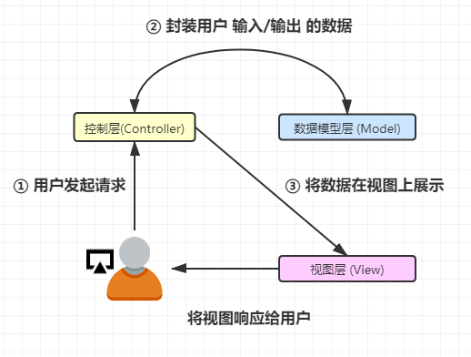
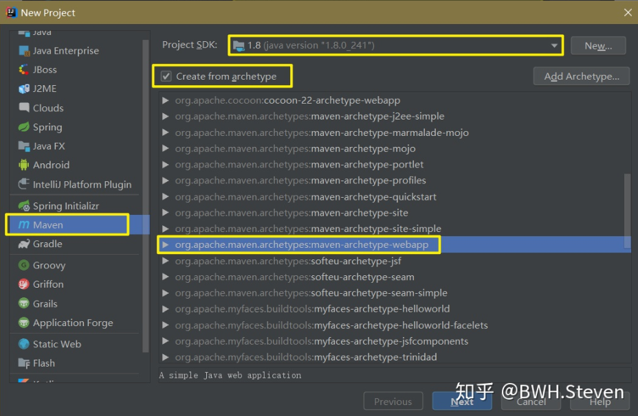
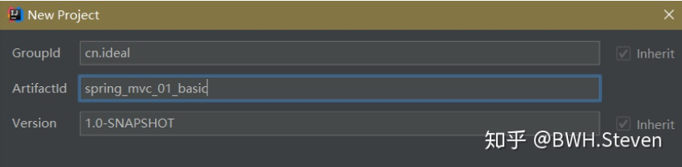
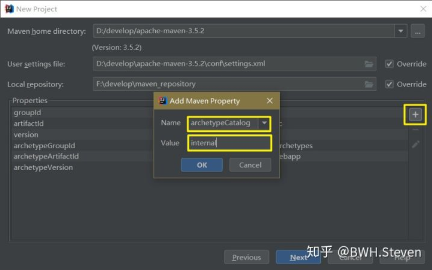
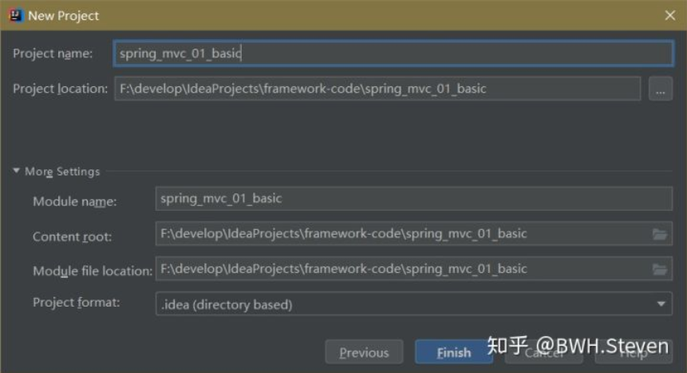
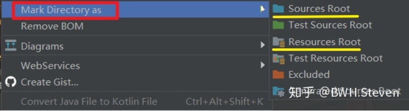
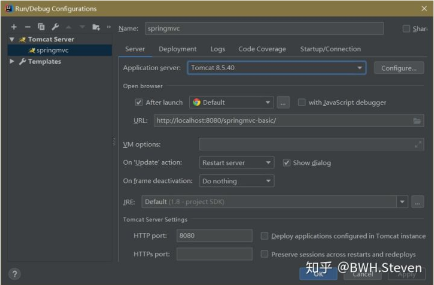

# Spring MVC 层层递进轻松入门 ！

### SpringMVC 开篇絮叨

#### (一) 谈一谈 Web 项目开发

Html是“名词”，CSS是“形容词”，JavaScript是“动词”，这三个兄弟凑在一起，就构成了 “静态” 页面，那么如何让他 “动态” 起来呢？这就需要后端相关技术的支持，这也是我们今天想要说的。

那么又怎么去理解 **“静态”** 和 **“动态”** 这两个词呢？

这两个词最大的不同就是在于其**交互性**，静态页面不是指页面不能进行变化，而是指不能与后端进行交互，实现数据的传输与处理，也就是说，静态页面一旦做好后，基本就是这个样子了，更像一个单纯的展示，而动态页面却可以实现根据用户的要求和选择而动态的去改变和响应，浏览器客户端，成为了前后端动态交互的一个桥梁。

而随着现在用户需求的增加，以及数据量的增加，在Web开发中，能够及时、正确地响应用户的请求几乎已经可以说是必须的了

- ① 用户在前端的页面上，进行一个提交或者说点击 URL，就会向后端服务器发送一个请求
- ② 后端经过一系列处理后（例如，从数据库中查到需要的数据）把数据响应给前端页面
- ③ 前端页面获取到响应内容后，对其进行解析以及进行一些处理（例如：回显内容到页面）

今天重点要学习的就是也就是——如何在获取请求后对其解析，然后执行相关的逻辑处理，最终跳转到页面，将数据回馈

#### (二) 三层架构

上面我提到了，在前后端动态交互中，浏览器客户端，成为了前后端沟通的桥梁，这也就是常见的 B/S 架构方式，也就是 浏览器/服务器，在其中最为常用的就是三层架构的开发模式

大家在 JavaWeb 的学习过程中，基本上已经在用三层架构的模式来进行编程，哪三层呢？

注：以JavaWeb中为例

**① 表现层（Web层）**

- 作用：接收客户端请求（一般是HTTP请求），同时向其响应结果
- 分类：表现层分为，展示层和控制层，控制层 (Servlet) 负责接收请求，展示层 (HTML JSP) 负责结果的展示
- 在表现层会依赖于业务层，进行业务处理，也就是好比在 Servlet 中调用某个Service
- 一般使用 MVC 模型开发（仅限此层，详情下面会说）

**② 业务层（Service层）**

- 作用：根据项目需求，进行业务逻辑处理
- 在业务层可能会依赖于持久层，也就是好比在 Service 中调用某个 Dao

**③ 持久层 (Dao)**

- 作用：数据持久化
- 说白了，就是实现和数据库之间的交互，本质都是增删改查，只不过不同的项目复杂程度会有所不同

**什么是，某某层依赖于某某层？**

例如表现层依赖业务层，在 JavaWeb 阶段实际上就是在 Servlet 中 new 了一个 Service ，当然，在Spring的 IOC 下我们只需要在控制层中添加Service的引用就可以了，并不需要再new了，耦合大大降低，我们上面说的依赖主要指两个层之间存在一定的关系

**什么是业务逻辑？**

针对，一些简单的操作，例如单表数据的增删，实际上几乎没有任何业务，最多例如参数不合法一类的，能加个返回的错误码，但如果面对一些比较复杂的项目，就存在一些业务逻辑需要编写

例如：查询时需要的结果，并不是简单的一张表中，而查询条件也比较复杂，我们就可以通过对查询条件进行拆分，再组合，就可以查询到不同需求的数据。

再例如：以前文章中我常说的转账案例，为了避免在转账的整个过程中发生异常，导致资金发生问题，就需要保证事务的一致性，而这些事务我们就可以放在业务层来做，当然 Spring 的AOP 可以帮助我们更好的处理事务问题

#### (三) MVC 模型

MVC 也就是 model-view-controller，我们来看看它的每一部分

**Model（模型）**

- Model 可以叫做数据模型层，也就是用来封装数据的
- 例如请求的过程中，用户信息被封装在 User 实体类中，这个实体类就属于 Model 层中

**View（视图）**

- 视图层中会选择一个恰当的视图来显示最终的执行结果
- 例如常见的 HTML JSP 就是用来展示数据的

**Controller（控制）**

- 这就是比较直观的用来处理交互的部分，接收用户请求，然后执行业务等流程，以及一些数据的校验，最终反馈结果

做了一张 MVC 模式下的工程结构图，方便大家理解



### 初识 Spring MVC

 实际上，如果是初次接触 Spring MVC 实际上，看个基本概念也就行了，比如下面我提到的，Spring MVC 的优点，Spring MVC 与 Struts 的区别，如果在没有进行过一些基本的使用，以及简单一些流程的简单分析，实际上没啥卵用，这些东西简单看看就行了，经过一定的学习以后，回过头来再看，会有感觉的多 

#### (一) Spring MVC 基础

> Spring Web MVC is the original web framework built on the Servlet API and has been included in the Spring Framework from the very beginning. The formal name, “Spring Web MVC,” comes from the name of its source module (spring-webmvc), but it is more commonly known as “Spring MVC”.
>
> —— Spring官网
>
> Spring MVC属于SpringFrameWork的后续产品，已经融合在Spring Web Flow里面。Spring 框架提供了构建 Web 应用程序的全功能 MVC 模块。使用 Spring 可插入的 MVC 架构，从而在使用Spring进行WEB开发时，可以选择使用Spring的Spring MVC框架或集成其他MVC开发框架，如Struts1(现在一般不用)，Struts 2(一般老项目使用)等。
>
> —— 百度百科

 MVC 在上面我们已经进行了基本的介绍，而Spring MVC 就是一款基于 MVC架构模式的轻量级Web框架，我们所说的  Spring MVC 与 Spring Web MVC 是等价的，只不过人们更习惯前者的叫法，这一款框架，本质上也是基于 Servlet 的，如果你有 Servlet 以及 Spring 的基础，简单的上手这个Web框架是非常快的 

#### (二) Spring MVC 的优点

- ① Spring MVC 具有 Spring 的优点，例如依赖注入 (IOC) 和切面编程 (AOP)
- ② 清晰的模块化职能划分，各模块各司其职，清晰明了
- 控制器 (controller)
- 验证器 (validator)
- 命令对象 (command obect)
- 表单对象 (form object)
- 模型对象 (model object)
- Servlet分发器 (DispatcherServlet)
- 处理器映射 (handler mapping)
- 试图解析器 (view resoler)
- ③ 可以非常方便的与其他视图技术 (FreeMarker) 整合，由于Spring MVC 的模型数据往往放在 Map 数据结构中，因此可以很方便的被其他框架引用
- ④ 可以灵活的实现绑定 (binding) 、验证 (validation)
- ⑤ 简介的异常处理机制
- ⑥ 比较强大的 JSP 标签库，简化了JSP的开发
- ⑦ 支持 RESTful 风格
- ⑧ 提供了强大的约定大于配置的契约式编程支持，也就是提供一种软件设计范式，减少软件开发人员做决定的次数，开发人员仅需要规定应用中不符合约定的部分

#### (三) Spring MVC 与 Struts 的区别

Struts 也是一款基于 MVC 这种在开发模式的 JavaEE框架，近些年来，实际上开发者更多的选择使用 SpringMVC 这个框架，那么两者的区别是什么呢？Spring MVC 的过人之处又在哪里呢？

① Spring MVC 基于方法开发，Struts 基于类开发

- 使用 Spring MVC 开发的时候，会将 URL 请求的路径与 Controller 的某个方法进行绑定，请求参数作为该参数方法的形参
- 使用 Struts 开始的时候，Action 类中所有方法使用的请求参数都是 Action 类中的成员变量，一旦方法变多，很容易混淆成员变量对应使用的方法

② Spring MVC 支持单例开发模式，而 Struts 不支持

③ Spring MVC 的速度比 Struts 的速度稍微快一些

- 一是由于 Struts 每次都会创建一个动作类
- 二是由于 Struts 的标签设计问题

④ Spring MVC 使用更加简洁，同时还支持 JSR303，能够比较方便的处理 ajax

- JSR 303 – Bean Validation (后台通用参数校验)

⑤ Struts2 的 OGNL 表达式使页面的开发效率相比 Spring MVC 更高一点，但是执行效率对于 JSTL 也没有很明显的提升

### **浅尝 Spring MVC**

#### **(一) 搭建开发环境**

##### **(1) 创建项目**

① 创建Maven项目 --> ② 选择JDK版本 --> ③ 勾选 create from archetype 即使用骨架创建项目 --> ④ 选择 maven-archetype-webapp 创建出一个web项目



然后指定基本信息，点击下一步



但是，由于创建 maven archetype 的原因，在创建时，会执行 mvn archetype:generate这个命令，这样就需要指定一个 archetype-catalog.xml 文件，命令中参数 -DarchetypeCatalog 的值有三种

- remote：从Maven远程中央仓库获取 archetypeCatalog（默认的）
- internal：从 maven-archetype-plugin 内置的 archetypeCatalog 文件获取
- local：本地的 archetypeCatalog 文件

我们需要做的就是添加这样一组键值对，就可以加快创建项目的速度

- DarchetypeCatalog
- internal



这里没什么好说的，基本不需要更改，继续下一步



#### **(2) 修改pom文件**

将版本从1.7改为1.8，接着又在 dependencies 中引入我们需要的一些 jar 包

定义 `<spring.version>5.0.2.RELEASE</spring.version>` 这样一个标签对，在下面就可以引用，这样相比于直接将版本信息写到每一个 dependencie 中，更利于后期的维护，方便更换版本，这种方式叫做锁定版本

```xml
 <?xml version="1.0" encoding="UTF-8"?>
 
 <project xmlns="http://maven.apache.org/POM/4.0.0" xmlns:xsi="http://www.w3.org/2001/XMLSchema-instance"
   xsi:schemaLocation="http://maven.apache.org/POM/4.0.0 http://maven.apache.org/xsd/maven-4.0.0.xsd">
   <modelVersion>4.0.0</modelVersion>
 
   <groupId>cn.ideal</groupId>
   <artifactId>spring_mvc_01_basic</artifactId>
   <version>1.0-SNAPSHOT</version>
   <packaging>war</packaging>
 
   <name>spring_mvc_01_basic Maven Webapp</name>
   <!-- FIXME change it to the project's website -->
   <url>http://www.example.com</url>
 
   <properties>
     <project.build.sourceEncoding>UTF-8</project.build.sourceEncoding>
     <maven.compiler.source>1.8</maven.compiler.source>
     <maven.compiler.target>1.8</maven.compiler.target>
     <spring.version>5.0.2.RELEASE</spring.version>
   </properties>
 
   <dependencies>
     <dependency>
       <groupId>org.springframework</groupId>
       <artifactId>spring-context</artifactId>
       <version>${spring.version}</version>
     </dependency>
 
     <dependency>
       <groupId>org.springframework</groupId>
       <artifactId>spring-web</artifactId>
       <version>${spring.version}</version>
     </dependency>
 
     <dependency>
       <groupId>org.springframework</groupId>
       <artifactId>spring-webmvc</artifactId>
       <version>${spring.version}</version>
     </dependency>
 
     <dependency>
       <groupId>javax.servlet</groupId>
       <artifactId>servlet-api</artifactId>
       <version>2.5</version>
       <scope>provided</scope>
     </dependency>
 
     <dependency>
       <groupId>javax.servlet.jsp</groupId>
       <artifactId>jsp-api</artifactId>
       <version>2.0</version>
       <scope>provided</scope>
     </dependency>
 
     <dependency>
       <groupId>junit</groupId>
       <artifactId>junit</artifactId>
       <version>4.11</version>
       <scope>test</scope>
     </dependency>
 
   </dependencies>
 
 
   <build>
     <finalName>spring_mvc_01_basic</finalName>
     <pluginManagement><!-- lock down plugins versions to avoid using Maven defaults (may be moved to parent pom) -->
       <plugins>
         <plugin>
           <artifactId>maven-clean-plugin</artifactId>
           <version>3.1.0</version>
         </plugin>
         <!-- see http://maven.apache.org/ref/current/maven-core/default-bindings.html#Plugin_bindings_for_war_packaging -->
         <plugin>
           <artifactId>maven-resources-plugin</artifactId>
           <version>3.0.2</version>
         </plugin>
         <plugin>
           <artifactId>maven-compiler-plugin</artifactId>
           <version>3.8.0</version>
         </plugin>
         <plugin>
           <artifactId>maven-surefire-plugin</artifactId>
           <version>2.22.1</version>
         </plugin>
         <plugin>
           <artifactId>maven-war-plugin</artifactId>
           <version>3.2.2</version>
         </plugin>
         <plugin>
           <artifactId>maven-install-plugin</artifactId>
           <version>2.5.2</version>
         </plugin>
         <plugin>
           <artifactId>maven-deploy-plugin</artifactId>
           <version>2.8.2</version>
         </plugin>
       </plugins>
     </pluginManagement>
   </build>
 </project>
```

#### **(3) 目录结构**

刚创建好的项目中，main文件夹下是空的，我们需要创建出 java 以及 resources 两个文件夹，并且分别设置为，源代码根目录 以及 资源根目录，设置方式如下图



#### **(二) 编写入门程序**

##### **(1) 配置核心控制器**

在以前 JavaWeb 阶段中，我们都很清楚，前端发出的请求，都会被映射到 Web.xml 中，然后匹配到对应的 Servlet 中，然后调用对应的 Servlet 类 来处理这个请求

由于现在我们使用了 Spring MVC，所以这些请求，我们就交给 Spring MVC 进行管理，所以需要在工程 webapp-WEB-INF 中找到 web.xml 进，在其中配置核心控制器，也就是 DispatcherServelt

`<servlet ></servlet >`标签中指定了一个实现类为 DispatcherServelt ，名称为 dispatcherServlet 的 servlet 配置

`<servlet-mapping></servlet-mapping>`标签中则指定了 dispatcherServlet 拦截请求的范围，使用 `/` 即代表所有请求都需要经过这里

`<init-param></init-param>`标签对中放置 DispatcherServelt 所需要的初始化参数，配置的是 contextConfigLocation 上下文参数变量，其加载的配置文件为编译目录下的 springmvc.xml (下面创建)

##### **(2) 创建核心配置文件**

在这里，一个是开启扫描，以及开启注解，还有就是配置视图解析器，它的作用就是执行方法后，根据返回的信息，来加载相应的界面，并且绑定反馈数据

```xml
 <?xml version="1.0" encoding="UTF-8"?>
 <beans xmlns="http://www.springframework.org/schema/beans"
        xmlns:mvc="http://www.springframework.org/schema/mvc"
        xmlns:context="http://www.springframework.org/schema/context"
        xmlns:xsi="http://www.w3.org/2001/XMLSchema-instance"
        xsi:schemaLocation="
         http://www.springframework.org/schema/beans
         http://www.springframework.org/schema/beans/spring-beans.xsd
         http://www.springframework.org/schema/mvc
         http://www.springframework.org/schema/mvc/spring-mvc.xsd
         http://www.springframework.org/schema/context
         http://www.springframework.org/schema/context/spring-context.xsd">
 
     <!-- 配置spring创建容器时要扫描的包-->
     <context:component-scan base-package="cn.ideal"></context:component-scan>
 
     <!-- 配置视图解析器-->
     <bean id="viewResolver"
           class="org.springframework.web.servlet.view.InternalResourceViewResolver">
         <property name="prefix" value="/WEB-INF/pages/"></property>
         <property name="suffix" value=".jsp"></property>
     </bean>
 
     <!-- 配置spring开启注解mvc的支持 -->
     <mvc:annotation-driven></mvc:annotation-driven>
 </beans>
 
```

特别说明：一般开发我们都需要写上这个标签，即使或许现在还没怎么体现出来

##### **(3) 编写控制类**

```java
 package cn.ideal.controller;
 
 import org.springframework.stereotype.Controller;
 import org.springframework.web.bind.annotation.RequestMapping;
 
 @Controller
 public class ControllerDemo {
     @RequestMapping(path = "/test")
     public String methodTest(){
         System.out.println("这是Controller测试方法");
         return "testSuccess";
     }
 }
```

##### **(4) 编写页面**

**index.jsp**

写一个超链接，去请求test这个路径，也就是指向到了 Controller 下的 methodTest() 方法

```jsp
 <%@ page contentType="text/html;charset=UTF-8" language="java" %>
 <html>
 <head>
     <title>Title</title>
 </head>
 <body>
     <h3>这是主页面</h3>
     <a href="test">访问test试试</a>
 </body>
 </html>
```

**WEB-INF -> pages**

**testSuccess.jsp**

```jsp
 <%@ page contentType="text/html;charset=UTF-8" language="java" %>
 <html>
 <head>
     <title>Title</title>
 </head>
 <body>
     <h3>跳转成功哈</h3>
 </body>
 </html>
```

##### **(5) 配置 Tomcat**

我这里，配置了本地的tomcat，以及项目名称

