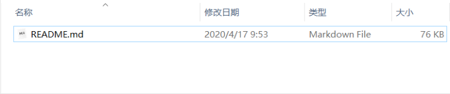
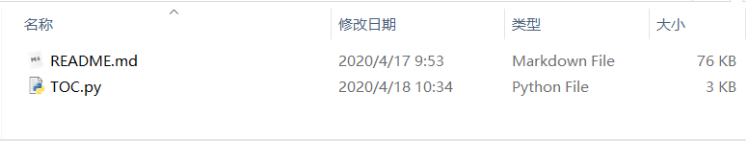
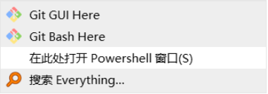
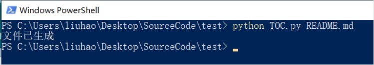
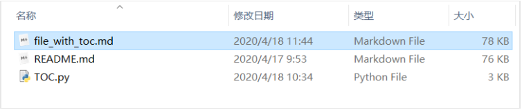
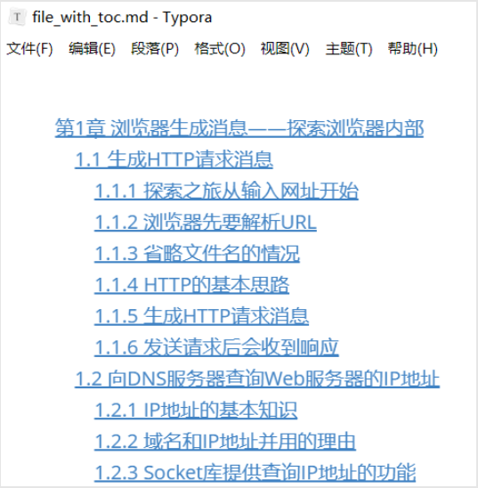

# Markdown自动生成目录

### 说明：

这是一个为本地Markdown文件生成目录的python脚本

### 使用实例：

比如你有一个Markdown文件想要生成目录。
1.先复制该文件到一个目录下（注意该目录要有写入权限，如果程序报错显示没有写入权限，将文件复制到具有写入权限的目录即可，一般情况下桌面上的文件夹内即有写入权限）并将文件命名为README.md（文件名不是强制的，如果不想将文件命名为README.md，只需在下面所述powershell窗口中将README.md替换为文件本身的名字）：

 2.接下来，将该python脚本复制到该目录下（也可以新建一个python脚本直接复制粘贴源代码，并将python脚本命名为TOC.py）： 

 3.然后，在该目录下按住shift键后右击鼠标打开命令行（powershell窗口）： 

 4.然后在powershell窗口中输入`python TOC.py README.md`并回车： 

 窗口中显示“文件已生成”则说明成功，检查该目录会发现生成的新文件： 

 该文件即生成了目录的Markdown文件： 

