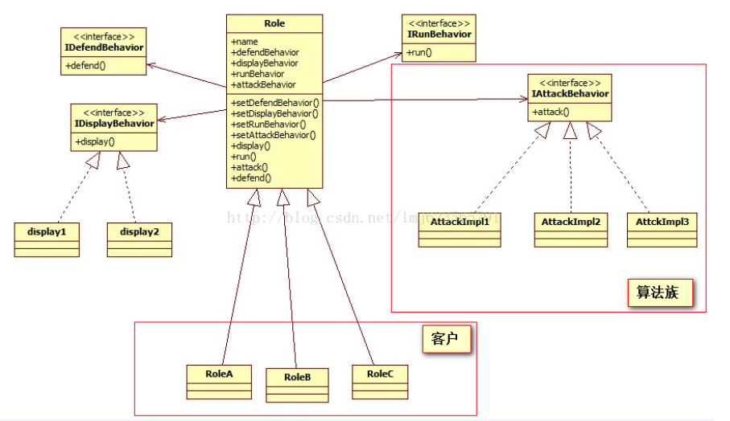

# 策略模式 以角色游戏为背景

先来看看策略模式的定义：

策略模式（Strategy Pattern）：定义了算法族，分别封装起来，让它们之间可相互替换，此模式让算法的变化独立于使用算法的客户。

好了，对于定义，肯定不是一眼就能看明白的，不然这篇文章就收尾了，对于定于大家简单扫一眼，知道个大概，然后继续读下面的文章，读完以后再来回味，效果嘎嘣脆。大家应该都玩过武侠角色游戏，下面我就以角色游戏为背景，为大家介绍：假设公司需要做一款武侠游戏，我们就是负责游戏的角色模块，需求是这样的：每个角色对应一个名字，每类角色对应一种样子，每个角色拥有一个逃跑、攻击、防御的技能。

初步的代码：

```java
package com.zhy.bean;
 
/**
 * 游戏的角色超类
 * 
 * @author zhy
 * 
 */
public abstract class Role
{
	protected String name;
 
	protected abstract void display();
 
	protected abstract void run();
 
	protected abstract void attack();
 
	protected abstract void defend();
 
}
```

```java
package com.zhy.bean;
 
public class RoleA extends Role
{
	public RoleA(String name)
	{
		this.name = name;
	}
 
	@Override
	protected void display()
	{
		System.out.println("样子1");
	}
 
	@Override
	protected void run()
	{
		System.out.println("金蝉脱壳");
	}
 
	@Override
	protected void attack()
	{
		System.out.println("降龙十八掌");
	}
 
	@Override
	protected void defend()
	{
		System.out.println("铁头功");
	}
 
}
```

没几分钟，你写好了上面的代码，觉得已经充分发挥了OO的思想，正在窃喜，这时候项目经理说，再添加两个角色

RoleB(样子2 ，降龙十八掌，铁布衫，金蝉脱壳)。

RoleC(样子1，拥有九阳神功，铁布衫，烟雾弹)。

于是你觉得没问题，开始写代码，继续集成Role，写成下面的代码：

```java
package com.zhy.bean;
 
public class RoleB extends Role
{
	public RoleB(String name)
	{
		this.name = name;
	}
 
	@Override
	protected void display()
	{
		System.out.println("样子2");
	}
 
	@Override
	protected void run()
	{
		System.out.println("金蝉脱壳");//从RoleA中拷贝
	}
 
	@Override
	protected void attack()
	{
		System.out.println("降龙十八掌");//从RoleA中拷贝
	}
 
	@Override
	protected void defend()
	{
		System.out.println("铁布衫");
	}
 
}
```

```java
package com.zhy.bean;
 
public class RoleC extends Role
{
	public RoleC(String name)
	{
		this.name = name;
	}
 
	@Override
	protected void display()
	{
		System.out.println("样子1");//从RoleA中拷贝
	}
 
	@Override
	protected void run()
	{
		System.out.println("烟雾弹");
	}
 
	@Override
	protected void attack()
	{
		System.out.println("九阳神功");
	}
 
	@Override
	protected void defend()
	{
		System.out.println("铁布衫");//从B中拷贝
	}
 
}
```

写完之后，你自己似乎没有当初那么自信了，你发现代码中已经存在相当多重复的代码，需要考虑重新设计架构了。于是你想，要不把每个技能都写成接口，有什么技能的角色实现什么接口，简单一想，觉得这想法高大尚啊，但是实现起来会发现，接口并不能实现代码的复用，每个实现接口的类，还是必须写自己写实现。于是，we need change ! 遵循设计的原则，找出应用中可能需要变化的部分，把它们独立出来，不要和那些不需要变化的代码混在一起。我们发现，对于每个角色的display，attack，defend，run都是有可能变化的，于是我们必须把这写独立出来。再根据另一个设计原则：针对接口（超类型）编程，而不是针对实现编程，于是我们把代码改造成这样：

```java
package com.zhy.bean;
 
public interface IAttackBehavior
{
	void attack();
}
```

```java
package com.zhy.bean;
 
public interface IDefendBehavior
{
	void defend();
}
```

```java
package com.zhy.bean;
 
public interface IDisplayBehavior
{
	void display();
}
```

```java
package com.zhy.bean;
 
public class AttackJY implements IAttackBehavior
{
 
	@Override
	public void attack()
	{
		System.out.println("九阳神功！");
	}
 
}
```

```java
package com.zhy.bean;
 
public class DefendTBS implements IDefendBehavior
{
 
	@Override
	public void defend()
	{
		System.out.println("铁布衫");
	}
 
}
```

```java
package com.zhy.bean;
 
public class RunJCTQ implements IRunBehavior
{
 
	@Override
	public void run()
	{
		System.out.println("金蝉脱壳");
	}
 
}
```

这时候需要对Role的代码做出改变：

```java
package com.zhy.bean;
 
/**
 * 游戏的角色超类
 * 
 * @author zhy
 * 
 */
public abstract class Role
{
	protected String name;
 
	protected IDefendBehavior defendBehavior;
	protected IDisplayBehavior displayBehavior;
	protected IRunBehavior runBehavior;
	protected IAttackBehavior attackBehavior;
 
	public Role setDefendBehavior(IDefendBehavior defendBehavior)
	{
		this.defendBehavior = defendBehavior;
		return this;
	}
 
	public Role setDisplayBehavior(IDisplayBehavior displayBehavior)
	{
		this.displayBehavior = displayBehavior;
		return this;
	}
 
	public Role setRunBehavior(IRunBehavior runBehavior)
	{
		this.runBehavior = runBehavior;
		return this;
	}
 
	public Role setAttackBehavior(IAttackBehavior attackBehavior)
	{
		this.attackBehavior = attackBehavior;
		return this;
	}
 
	protected void display()
	{
		displayBehavior.display();
	}
 
	protected void run()
	{
		runBehavior.run();
	}
 
	protected void attack()
	{
		attackBehavior.attack();
	}
 
	protected void defend()
	{
		defendBehavior.defend();
	}
 
}
```

每个角色现在只需要一个name了：

```java
package com.zhy.bean;
 
public class RoleA extends Role
{
	public RoleA(String name)
	{
		this.name = name;
	}
 
}
```

现在我们需要一个金蝉脱壳，降龙十八掌！，铁布衫，样子1的角色A只需要这样：

```java
package com.zhy.bean;
 
public class Test
{
	public static void main(String[] args)
	{
 
		Role roleA = new RoleA("A");
 
		roleA.setAttackBehavior(new AttackXL())//
				.setDefendBehavior(new DefendTBS())//
				.setDisplayBehavior(new DisplayA())//
				.setRunBehavior(new RunJCTQ());
		System.out.println(roleA.name + ":");
		roleA.run();
		roleA.attack();
		roleA.defend();
		roleA.display();
	}
}
```

经过我们的修改，现在所有的技能的实现做到了100%的复用，并且随便项目经理需要什么样的角色，对于我们来说只需要动态设置一下技能和展示方式，是不是很完美。恭喜你，现在你已经学会了策略模式，现在我们回到定义，定义上的算法族：其实就是上述例子的技能；定义上的客户：其实就是RoleA，RoleB...；我们已经定义了一个算法族（各种技能），且根据需求可以进行相互替换，算法（各种技能）的实现独立于客户（角色）。现在是不是很好理解策略模式的定义了。

附上一张UML图，方便大家理解：



最后总结一下OO的原则：

1、封装变化（把可能变化的代码封装起来）

2、多用组合，少用继承（我们使用组合的方式，为客户设置了算法）

3、针对接口编程，不针对实现（对于Role类的设计完全的针对角色，和技能的实现没有关系）