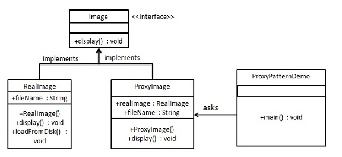

# 代理模式

在代理模式（Proxy Pattern）中，一个类代表另一个类的功能。这种类型的设计模式属于结构型模式。

在代理模式中，我们创建具有现有对象的对象，以便向外界提供功能接口。

## 介绍

**意图：**为其他对象提供一种代理以控制对这个对象的访问。

**主要解决：**在直接访问对象时带来的问题，比如说：要访问的对象在远程的机器上。在面向对象系统中，有些对象由于某些原因（比如对象创建开销很大，或者某些操作需要安全控制，或者需要进程外的访问），直接访问会给使用者或者系统结构带来很多麻烦，我们可以在访问此对象时加上一个对此对象的访问层。

**何时使用：**想在访问一个类时做一些控制。

**如何解决：**增加中间层。

**关键代码：**实现与被代理类组合。

**应用实例：** 1、Windows 里面的快捷方式。 2、猪八戒去找高翠兰结果是孙悟空变的，可以这样理解：把高翠兰的外貌抽象出来，高翠兰本人和孙悟空都实现了这个接口，猪八戒访问高翠兰的时候看不出来这个是孙悟空，所以说孙悟空是高翠兰代理类。 3、买火车票不一定在火车站买，也可以去代售点。 4、一张支票或银行存单是账户中资金的代理。支票在市场交易中用来代替现金，并提供对签发人账号上资金的控制。 5、spring aop。

**优点：** 1、职责清晰。 2、高扩展性。 3、智能化。

**缺点：** 1、由于在客户端和真实主题之间增加了代理对象，因此有些类型的代理模式可能会造成请求的处理速度变慢。 2、实现代理模式需要额外的工作，有些代理模式的实现非常复杂。

**使用场景：**按职责来划分，通常有以下使用场景： 1、远程代理。 2、虚拟代理。 3、Copy-on-Write 代理。 4、保护（Protect or Access）代理。 5、Cache代理。 6、防火墙（Firewall）代理。 7、同步化（Synchronization）代理。 8、智能引用（Smart Reference）代理。

**注意事项：** 1、和适配器模式的区别：适配器模式主要改变所考虑对象的接口，而代理模式不能改变所代理类的接口。 2、和装饰器模式的区别：装饰器模式为了增强功能，而代理模式是为了加以控制。

## 实现

我们将创建一个 *Image* 接口和实现了 *Image* 接口的实体类。*ProxyImage* 是一个代理类，减少 *RealImage* 对象加载的内存占用。

*ProxyPatternDemo*，我们的演示类使用 *ProxyImage* 来获取要加载的 *Image* 对象，并按照需求进行显示。



### 步骤 1

创建一个接口。Image.java

```java
public interface Image {
   void display();
}
```

### 步骤 2

创建实现接口的实体类。RealImage.java

```java
public class RealImage implements Image {
 
   private String fileName;
 
   public RealImage(String fileName){
      this.fileName = fileName;
      loadFromDisk(fileName);
   }
 
   @Override
   public void display() {
      System.out.println("Displaying " + fileName);
   }
 
   private void loadFromDisk(String fileName){
      System.out.println("Loading " + fileName);
   }
```

ProxyImage.java

```java
public class ProxyImage implements Image{
 
   private RealImage realImage;
   private String fileName;
 
   public ProxyImage(String fileName){
      this.fileName = fileName;
   }
 
   @Override
   public void display() {
      if(realImage == null){
         realImage = new RealImage(fileName);
      }
      realImage.display();
   }
}
```

### 步骤 3

当被请求时，使用 *ProxyImage* 来获取 *RealImage* 类的对象。ProxyPatternDemo.java

```java
public class ProxyPatternDemo {
   
   public static void main(String[] args) {
      Image image = new ProxyImage("test_10mb.jpg");
 
      // 图像将从磁盘加载
      image.display(); 
      System.out.println("");
      // 图像不需要从磁盘加载
      image.display();  
   }
}
```

### 步骤 4

执行程序，输出结果：

```
Loading test_10mb.jpg
Displaying test_10mb.jpg

Displaying test_10mb.jpg
```

---

##  **JDK 自带的动态代理** 

-  java.lang.reflect.Proxy:生成动态代理类和对象；
-  java.lang.reflect.InvocationHandler（处理器接口）：可以通过invoke方法实现

对真实角色的代理访问。

每次通过 Proxy 生成的代理类对象都要指定对应的处理器对象。

代码：

a) 接口：Subject.java

```java
**
 * @author gnehcgnaw
 * @date 2018/11/5 19:29
 */
public interface Subject {
    public int sellBooks();

    public String speak();
}
```

 b)真实对象：RealSubject.java 

```java
/**
 * @author gnehcgnaw
 * @date 2018/11/5 18:54
 */
public class RealSubject implements Subject{
    @Override
    public int sellBooks() {
        System.out.println("卖书");
        return 1 ;
    }

    @Override
    public String speak() {
        System.out.println("说话");
        return "张三";
    }
}
```

 c)处理器对象：MyInvocationHandler.java 

```java
import java.lang.reflect.InvocationHandler;
import java.lang.reflect.Method;

/**
 * 定义一个处理器
 * @author gnehcgnaw
 * @date 2018/11/5 19:26
 */
public class MyInvocationHandler implements InvocationHandler {
    /**
     * 因为需要处理真实角色，所以要把真实角色传进来
     */
    Subject realSubject ;

    public MyInvocationHandler(Subject realSubject) {
        this.realSubject = realSubject;
    }

    /**
     *
     * @param proxy    代理类
     * @param method    正在调用的方法
     * @param args      方法的参数
     * @return
     * @throws Throwable
     */
    @Override
    public Object invoke(Object proxy, Method method, Object[] args) throws Throwable {
        System.out.println("调用代理类");
        if(method.getName().equals("sellBooks")){
            int invoke = (int)method.invoke(realSubject, args);
            System.out.println("调用的是卖书的方法");
            return invoke ;
        }else {
            String string = (String) method.invoke(realSubject,args) ;
            System.out.println("调用的是说话的方法");
            return  string ;
        }
    }
}
```

 d)调用端：Main.java 

```java
import java.lang.reflect.Proxy;

/**
 * 调用类
 * @author gnehcgnaw
 * @date 2018/11/7 20:26
 */
public class Client {
    public static void main(String[] args) {
        //真实对象
        Subject realSubject =  new RealSubject();

        MyInvocationHandler myInvocationHandler = new MyInvocationHandler(realSubject);
        //代理对象
        Subject proxyClass = (Subject) Proxy.newProxyInstance(ClassLoader.getSystemClassLoader(), new Class[]{Subject.class}, myInvocationHandler);

        proxyClass.sellBooks();

        proxyClass.speak();
    }
}
```

