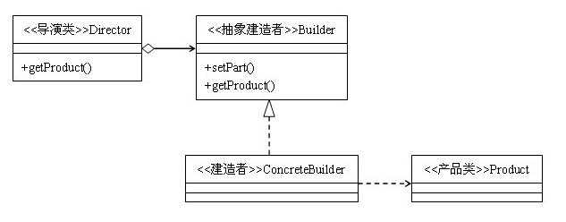

# 建造者模式

**定义：**将一个复杂对象的构建与它的表示分离，使得同样的构建过程可以创建不同的表示。

**类型：**创建类模式

**类图：**



**四个要素**

- **产品类：**一般是一个较为复杂的对象，也就是说创建对象的过程比较复杂，一般会有比较多的代码量。在本类图中，产品类是一个具体的类，而非抽象类。实际编程中，产品类可以是由一个抽象类与它的不同实现组成，也可以是由多个抽象类与他们的实现组成。
- **抽象建造者：**引入抽象建造者的目的，是为了将建造的具体过程交与它的子类来实现。这样更容易扩展。一般至少会有两个抽象方法，一个用来建造产品，一个是用来返回产品。
- **建造者：**实现抽象类的所有未实现的方法，具体来说一般是两项任务：组建产品；返回组建好的产品。
- **导演类：**负责调用适当的建造者来组建产品，导演类一般不与产品类发生依赖关系，与导演类直接交互的是建造者类。一般来说，导演类被用来封装程序中易变的部分。

 **代码实现** 

```java
    class Product {
        private String name;
        private String type;
        public void showProduct(){
            System.out.println("名称："+name);
            System.out.println("型号："+type);
        }
        public void setName(String name) {
            this.name = name;
        }
        public void setType(String type) {
            this.type = type;
        }
    }

    abstract class Builder {
        public abstract void setPart(String arg1, String arg2);
        public abstract Product getProduct();
    }
    class ConcreteBuilder extends Builder {
        private Product product = new Product();

        public Product getProduct() {
            return product;
        }

        public void setPart(String arg1, String arg2) {
            product.setName(arg1);
            product.setType(arg2);
        }
    }

    public class Director {
        private Builder builder = new ConcreteBuilder();
        public Product getAProduct(){
            builder.setPart("宝马汽车","X7");
            return builder.getProduct();
        }
        public Product getBProduct(){
            builder.setPart("奥迪汽车","Q5");
            return builder.getProduct();
        }
    }
    public class Client {
        public static void main(String[] args){
            Director director = new Director();
            Product product1 = director.getAProduct();
            product1.showProduct();

            Product product2 = director.getBProduct();
            product2.showProduct();
        }
    }
```

**建造者模式的优点**

首先，建造者模式的封装性很好。使用建造者模式可以有效的封装变化，在使用建造者模式的场景中，一般产品类和建造者类是比较稳定的，因此，将主要的业务逻辑封装在导演类中对整体而言可以取得比较好的稳定性。

其次，建造者模式很容易进行扩展。如果有新的需求，通过实现一个新的建造者类就可以完成，基本上不用修改之前已经测试通过的代码，因此也就不会对原有功能引入风险。

**建造者模式与工厂模式的区别**

我们可以看到，建造者模式与工厂模式是极为相似的，总体上，建造者模式仅仅只比工厂模式多了一个"导演类"的角色。在建造者模式的类图中，假如把这个导演类看做是最终调用的客户端，那么图中剩余的部分就可以看作是一个简单的工厂模式了。

与工厂模式相比，建造者模式一般用来创建**更为复杂的对象**，因为对象的创建过程更为复杂，因此将对象的创建过程独立出来组成一个新的类——导演类。也就是说，工厂模式是将对象的全部创建过程封装在工厂类中，由工厂类向客户端提供最终的产品；而建造者模式中，建造者类一般只提供产品类中各个组件的建造，而将具体建造过程交付给导演类。由导演类负责将各个组件按照特定的规则组建为产品，然后将组建好的产品交付给客户端。

**总结**

建造者模式与工厂模式类似，他们都是建造者模式，适用的场景也很相似。一般来说，如果产品的建造**很复杂**，那么请用工厂模式；如果产品的建造**更复杂**，那么请用建造者模式。