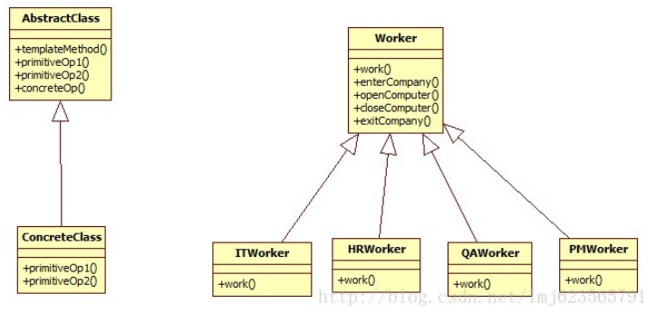

# 模版方法模式

 定义：定义了一个算法的骨架，而将一些步骤延迟到子类中，模版方法使得子类可以在不改变算法结构的情况下，重新定义算法的步骤。 

简单看下定义，模版方法定义了一个算法的步骤，并且允许子类为一个或多个步骤提供实现。定义还算清晰，下面来个例子展示下本公司的上班情况（纯属娱乐，如有雷同，请对号入座）。简单描述一下：本公司有程序猿、测试、HR、项目经理等人，下面使用模版方法模式，记录下所有人员的上班情况：

首先来个超类，超类中定义了一个workOneDay方法，设置为作为算法的骨架：

```java
package com.zhy.pattern.template;
 
public abstract class Worker
{
	protected String name;
 
	public Worker(String name)
	{
		this.name = name;
	}
 
	/**
	 * 记录一天的工作
	 */
	public final void workOneDay()
	{
 
		System.out.println("-----------------work start ---------------");
		enterCompany();
		computerOn();
		work();
		computerOff();
		exitCompany();
		System.out.println("-----------------work end ---------------");
 
	}
 
	/**
	 * 工作
	 */
	public abstract void work();
 
	/**
	 * 关闭电脑
	 */
	private void computerOff()
	{
		System.out.println(name + "关闭电脑");
	}
 
	/**
	 * 打开电脑
	 */
	private void computerOn()
	{
		System.out.println(name + "打开电脑");
	}
 
	/**
	 * 进入公司
	 */
	public void enterCompany()
	{
		System.out.println(name + "进入公司");
	}
 
	/**
	 * 离开公司
	 */
	public void exitCompany()
	{
		System.out.println(name + "离开公司");
	}
 
}
```

定义了一个上班（算法）的骨架，包含以下步骤：


a、进入公司

b、打开电脑

c、上班情况

d、关闭电脑

e、离开公司

可以看到，a、b、d、e我们在超类中已经实现，子类仅实现work这个抽象方法，记录每天的上班情况。下面各类屌丝入场：

 程序猿： 

```java
package com.zhy.pattern.template;
 
public class ITWorker extends Worker
{
 
	public ITWorker(String name)
	{
		super(name);
	}
 
	@Override
	public void work()
	{
		System.out.println(name + "写程序-测bug-fix bug");
	}
 
}
```

 HR： 

```java
package com.zhy.pattern.template;
 
public class HRWorker extends Worker
{
 
	public HRWorker(String name)
	{
		super(name);
	}
 
	@Override
	public void work()
	{
		System.out.println(name + "看简历-打电话-接电话");
	}
 
}
```

 测试人员： 

```java
package com.zhy.pattern.template;
 
public class QAWorker extends Worker
{
 
	public QAWorker(String name)
	{
		super(name);
	}
 
	@Override
	public void work()
	{
		System.out.println(name + "写测试用例-提交bug-写测试用例");
	}
 
}
```

 项目经理： 

```java
package com.zhy.pattern.template;
 
public class ManagerWorker extends Worker
{
 
	public ManagerWorker(String name)
	{
		super(name);
	}
 
	@Override
	public void work()
	{
		System.out.println(name + "打dota...");
	}
 
}
```

 下面我们测试下： 

```java
package com.zhy.pattern.template;
 
public class Test
{
	public static void main(String[] args)
	{
 
		Worker it1 = new ITWorker("鸿洋");
		it1.workOneDay();
		Worker it2 = new ITWorker("老张");
		it2.workOneDay();
		Worker hr = new HRWorker("迪迪");
		hr.workOneDay();
		Worker qa = new QAWorker("老李");
		qa.workOneDay();
		Worker pm = new ManagerWorker("坑货");
		pm.workOneDay();
 
	}
}
```

 输出结果： 

```
-----------------work start ---------------
鸿洋进入公司
鸿洋打开电脑
鸿洋写程序-测bug-fix bug
鸿洋关闭电脑
鸿洋离开公司
-----------------work end ---------------
-----------------work start ---------------
迪迪进入公司
迪迪打开电脑
迪迪看简历-打电话-接电话
迪迪关闭电脑
迪迪离开公司
-----------------work end ---------------
-----------------work start ---------------
老李进入公司
老李打开电脑
老李写测试用例-提交bug-写测试用例
老李关闭电脑
老李离开公司
-----------------work end ---------------
-----------------work start ---------------
坑货进入公司
坑货打开电脑
坑货打dota...
坑货关闭电脑
坑货离开公司
-----------------work end ---------------
```

 下面看下模版方法模式类图，和我们程序的类图： 



 模版方式里面也可以可选的设置钩子，比如现在希望记录程序员离开公司的时间，我们就可以在超类中添加一个钩子： 

```java
public boolean isNeedPrintDate()
	{
		return false;
	}
	/**
	 * 离开公司
	 */
	public void exitCompany()
	{
		if (isNeedPrintDate())
		{
			System.out.print(new Date().toLocaleString()+"-->");
		}
		System.out.println(name + "离开公司");
	}
```

 超类中添加了一个isNeedPrintDate方法，且默认返回false，不打印时间。如果某子类需要调用打印时间，可以复写改钩子方法，返回true，比如，程序猿复写了这个方法： 

```java
package com.zhy.pattern.template;
 
public class ITWorker extends Worker
{
 
	public ITWorker(String name)
	{
		super(name);
	}
 
	@Override
	public void work()
	{
		System.out.println(name + "写程序-测bug-fix bug");
	}
 
	@Override
	public boolean isNeedPrintDate()
	{
		return true;
	}
	
}
```

 最后再看下测试结果： 

```
-----------------work start ---------------
鸿洋进入公司
鸿洋打开电脑
鸿洋写程序-测bug-fix bug
鸿洋关闭电脑
2014-5-19 19:17:05-->鸿洋离开公司
-----------------work end ---------------
```

 好了，关于钩子，超类中可提供默认实现或者空实现，子类可覆盖或者不覆盖，具体根据需求来定。
