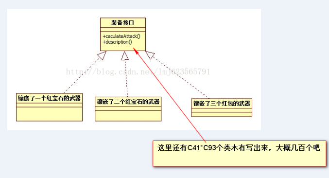
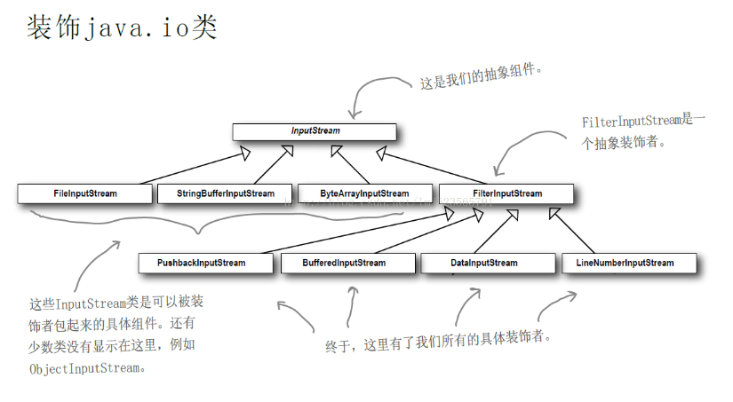

# 装饰者模式

今天继续设计模式之旅，给大家带来装饰者模式，国际惯例，先看定义。

装饰者模式：若要扩展功能，装饰者提供了比集成更有弹性的替代方案，动态地将责任附加到对象上。

先简单描述下装饰者模式发挥作用的地方，当我们设计好了一个类，我们需要给这个类添加一些辅助的功能，并且不希望改变这个类的代码，这时候就是装饰者模式大展雄威的时候了。这里还体现了一个原则：类应该对扩展开放，对修改关闭。

下面进入正题，今天在那看电影，忽然想起年轻时在游戏场上的血雨腥风啊，哈哈，下面以游戏为背景介绍装饰者模式。玩过游戏的兄弟应该都知道，游戏里面每个角色有武器、鞋子、护腕、戒指、还有各种红宝石、蓝宝石、黄宝石等等。

下面需求开始：设计游戏的装备系统，基本要求，要可以计算出每种装备在镶嵌了各种宝石后的攻击力和描述：

具体需求：

1、武器（攻击力20） 、戒指（攻击力5）、护腕（攻击力5）、鞋子（攻击力5）

2、蓝宝石（攻击力5/颗）、黄宝石（攻击力10/颗）、红宝石（攻击力15/颗）

3、每个装备可以随意镶嵌3颗


好了，需求介绍完毕，当然了，不要吐槽我的设计，尼玛鞋子哪来的攻击力，关键时刻也是可以砸人的嘛。下面开始初步的设想，出于多年面向对象的经验，我们可能会这么设计：



如果你这么设计了，我靠，就这么点需求你写了几百个类，随便添加两个宝石，哈哈，指数增长听过么，准备加班吧。

可能你还会这么设计：写一个超类，然后里面各种set宝石，然后在计算攻击力的地方，使劲的If有哪几种宝石，恭喜你，代码量不是很大，但是随便添加个武器，你得又多写多少个IF呢。

上面叙述了一些可能性的设计，都不是很好，下面看看如何将装饰者模式融入：

首先是装备的超类

```java
package com.zhy.pattern.decorator;
 
/**
 * 装备的接口
 * 
 * @author zhy
 * 
 */
public interface IEquip
{
 
	/**
	 * 计算攻击力
	 * 
	 * @return
	 */
	public int caculateAttack();
 
	/**
	 * 装备的描述
	 * 
	 * @return
	 */
	public String description();
}
```

然后分别是武器、戒指、护腕、鞋子

```java
package com.zhy.pattern.decorator;
 
/**
 * 武器
 * 攻击力20
 * @author zhy
 * 
 */
public class ArmEquip implements IEquip
{
 
	@Override
	public int caculateAttack()
	{
		return 20;
	}
 
	@Override
	public String description()
	{
		return "屠龙刀";
	}

}
```

```java
package com.zhy.pattern.decorator;
 
/**
 * 戒指
 * 攻击力 5
 * @author zhy
 *
 */
public class RingEquip implements IEquip
{
 
	@Override
	public int caculateAttack()
	{
		return 5;
	}
 
	@Override
	public String description()
	{
		return "圣战戒指";
	}
 
}
```

```java
package com.zhy.pattern.decorator;
 
/**
 * 护腕
 * 攻击力 5
 * @author zhy
 *
 */
public class WristEquip implements IEquip
{
 
	@Override
	public int caculateAttack()
	{
		return 5;
	}
 
	@Override
	public String description()
	{
		return "圣战护腕";
	}
 
}
```

```java
package com.zhy.pattern.decorator;
 
/**
 * 鞋子
 * 攻击力 5
 * @author zhy
 * 
 */
public class ShoeEquip implements IEquip
{
 
	@Override
	public int caculateAttack()
	{
		return 5;
	}
 
	@Override
	public String description()
	{
		return "圣战靴子";
	}
 
}
```

接下来当然是装饰品，宝石了，首先超类

```java

package com.zhy.pattern.decorator;
 
/**
 * 装饰品的接口
 * @author zhy
 *
 */
public interface IEquipDecorator extends IEquip
{
	
}
```

下来蓝宝石、黄宝石、红宝石

```java

package com.zhy.pattern.decorator;
 
/**
 * 蓝宝石装饰品
 * 每颗攻击力+5
 * @author zhy
 * 
 */
public class BlueGemDecorator implements IEquipDecorator
{
	/**
	 * 每个装饰品维护一个装备
	 */
	private IEquip equip;
 
	public BlueGemDecorator(IEquip equip)
	{
		this.equip = equip;
	}
 
	@Override
	public int caculateAttack()
	{
		return 5 + equip.caculateAttack();
	}
 
	@Override
	public String description()
	{
		return equip.description() + "+ 蓝宝石";
	}
 
}
```

```java

package com.zhy.pattern.decorator;
 
/**
 * 黄宝石装饰品
 * 每颗攻击力+10
 * @author zhy
 * 
 */
public class YellowGemDecorator implements IEquipDecorator
{
	/**
	 * 每个装饰品维护一个装备
	 */
	private IEquip equip;
 
	public YellowGemDecorator(IEquip equip)
	{
		this.equip = equip;
	}
 
	@Override
	public int caculateAttack()
	{
		return 10 + equip.caculateAttack();
	}
 
	@Override
	public String description()
	{
		return equip.description() + "+ 黄宝石";
	}
 
}
```

```java
package com.zhy.pattern.decorator;
 
/**
 * 红宝石装饰品 每颗攻击力+15
 * 
 * @author zhy
 * 
 */
public class RedGemDecorator implements IEquipDecorator
{
	/**
	 * 每个装饰品维护一个装备
	 */
	private IEquip equip;
 
	public RedGemDecorator(IEquip equip)
	{
		this.equip = equip;
	}
 
	@Override
	public int caculateAttack()
	{
		return 15 + equip.caculateAttack();
	}
 
	@Override
	public String description()
	{
		return equip.description() + "+ 红宝石";
	}
 
}
```

好了，到此结束，我们已经实现了需求的功能了，是不是每个类都很清晰加简单，下面看测试：

```java
package com.zhy.pattern.decorator;
 
public class Test
{
	public static void main(String[] args)
	{
		// 一个镶嵌2颗红宝石，1颗蓝宝石的靴子
		System.out.println(" 一个镶嵌2颗红宝石，1颗蓝宝石的靴子");
		IEquip equip = new RedGemDecorator(new RedGemDecorator(new BlueGemDecorator(new ShoeEquip())));
		System.out.println("攻击力  : " + equip.caculateAttack());
		System.out.println("描述 :" + equip.description());
		System.out.println("-------");
		// 一个镶嵌1颗红宝石，1颗蓝宝石的武器
		System.out.println(" 一个镶嵌1颗红宝石，1颗蓝宝石,1颗黄宝石的武器");
		equip = new RedGemDecorator(new BlueGemDecorator(new YellowGemDecorator(new ArmEquip())));
		System.out.println("攻击力  : " + equip.caculateAttack());
		System.out.println("描述 :" + equip.description());
		System.out.println("-------");
	}
}
```

输出：

```
 一个镶嵌2颗红宝石，1颗蓝宝石的靴子
攻击力  : 40
描述 :圣战靴子+ 蓝宝石+ 红宝石+ 红宝石
-------
 一个镶嵌1颗红宝石，1颗蓝宝石,1颗黄宝石的武器
攻击力  : 50
描述 :屠龙刀+ 黄宝石+ 蓝宝石+ 红宝石
-------
```

赞不赞，要是需求随便多几个装备，几种宝石，我们随随便便就可以加上，然后开开心心下班。

好了，恭喜你，你又学会了一个设计模式，装饰者模式。

现在根据例子对定义的理解，不用我多说吧。

Java的API中也有装饰者模式的身影，如果你初学Java，一定记得Java里面的各种流，很痛苦吧，但是当你明白你们的设计之后就会感觉清晰很多。



把InputStream看作我们的IEquip，把FilterInputStream看作我们的IEquipDecorator，是不是和我们的设计几乎一样~