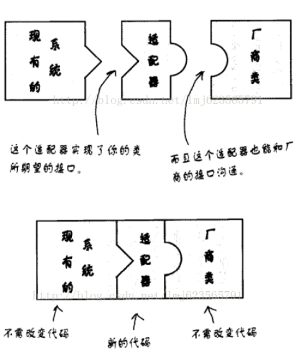

# 设计模式 适配器模式 以手机充电器为例

定义：将一个类的接口转换成客户期望的另一个接口，适配器让原本接口不兼容的类可以相互合作。这个定义还好，说适配器的功能就是把一个接口转成另一个接口。

发现两张图片可以很好的解释适配器模式：



这两张图很好的说明了适配器的作用哈，话说我当年买了个欧版的HTC G17 ，还配了个插头转化器，这个插头转化器就是起得适配器的作用。下来来点代码解释哈，如题目，手机充电器一般都是5V左右吧，咱天朝的家用交流电压220V，所以手机充电需要一个适配器（降压器），有什么物理名词使用错误的，见谅。

首先一部手机：Mobile.java

```java
package com.zhy.pattern.adapter;
 
public class Mobile
{
	/**
	 * 充电
	 * @param power 
	 */
	public void inputPower(V5Power power)
	{
		int provideV5Power = power.provideV5Power();
		System.out.println("手机（客户端）：我需要5V电压充电，现在是-->" + provideV5Power + "V");
	}
}
```

可以看出，手机依赖一个提供5V电压的接口：

```java
package com.zhy.pattern.adapter;
/**
 * 提供5V电压的一个接口
 * @author zhy
 *
 */
public interface V5Power
{
	public int provideV5Power();
}
```

然后我们拥有的是220V家用交流电：

```java
package com.zhy.pattern.adapter;
 
/**
 * 家用220V交流电
 * @author zhy
 *
 */
public class V220Power
{
	/**
	 * 提供220V电压
	 * @return
	 */
	public int provideV220Power()
	{
		System.out.println("我提供220V交流电压。");
		return 220 ; 
	}
}
```

下面我们需要一个适配器，完成220V转5V的作用：

```java
package com.zhy.pattern.adapter;
 
/**
 * 适配器，把220V电压变成5V
 * @author zhy
 *
 */
public class V5PowerAdapter implements V5Power
{
	/**
	 * 组合的方式
	 */
	private V220Power v220Power ;
	
	public V5PowerAdapter(V220Power v220Power)
	{
		this.v220Power = v220Power ;
	}
 
	@Override
	public int provideV5Power()
	{
		int power = v220Power.provideV220Power() ;
		//power经过各种操作-->5 
		System.out.println("适配器：我悄悄的适配了电压。");
		return 5 ; 
	} 
	
}
```

